# IMF: 1

## Goal 
6 flags in flag{base64hash} format 
root

## Download 
[https://www.vulnhub.com/entry/imf-1,162/](https://www.vulnhub.com/entry/imf-1,162/)

## Walkthrough
**nmap**
 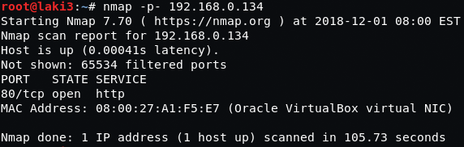
  
**default 80**
 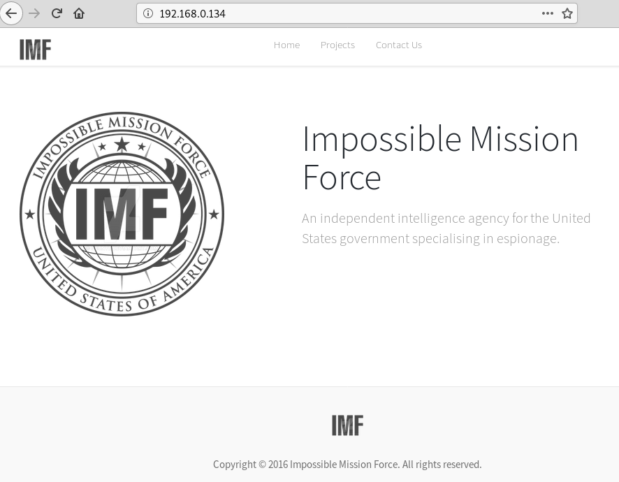
  
**flag 1 found in source**
 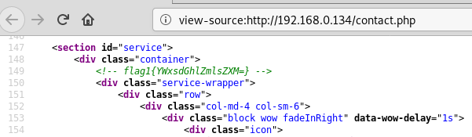
  
**flag 1 decoded gives hint to look at all the files**
 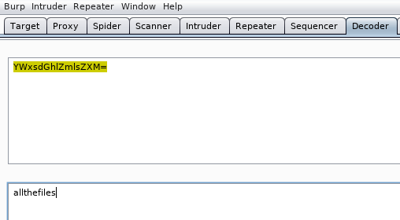
  
**looking further at source the js files look like base64**
 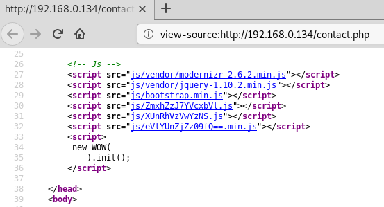
  
**putting together and decoding gives flag 2 and next hint looks like a directory**
 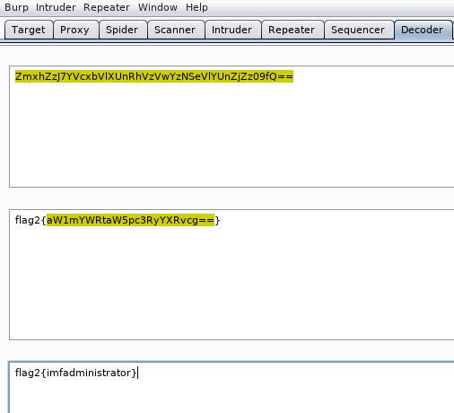
  
**hint from flag 2 gives login page**
 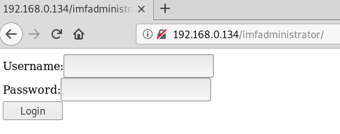
  
**source hints to sqli...yeah i wasn't able to get it**
 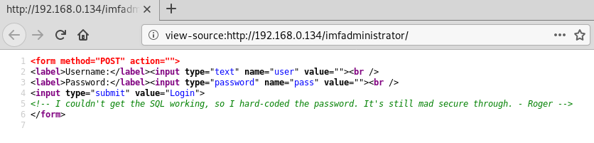
  
**went to gobuster and dirb after failing at sqli**
 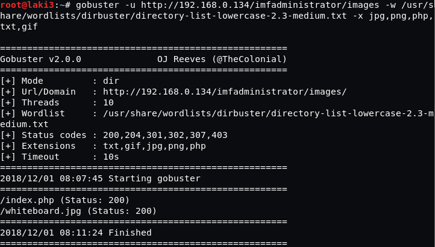
 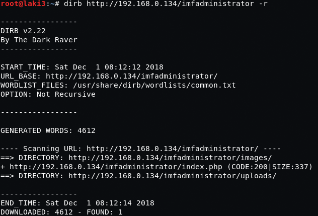
  
**image found contains qr code**
 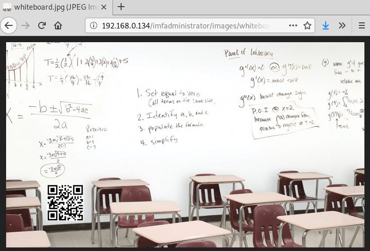
  
**flag 4 found and gives php upload file name**
 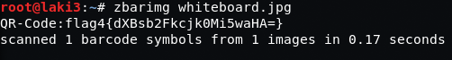
 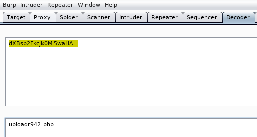
  
**using found uploader, a test upload of jpg is successful**
 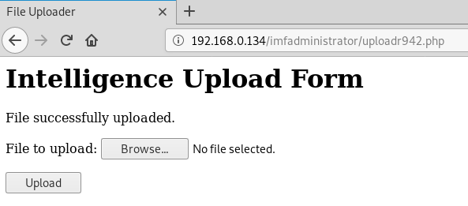
  
**we know from gobuster of uploads/image directories but file isn't there** 
**looking at source after upload there is a hash commented out**
 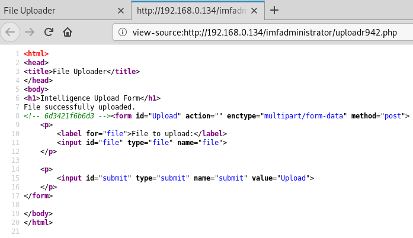
  
**hash plus file ext we find our uploaded image**
 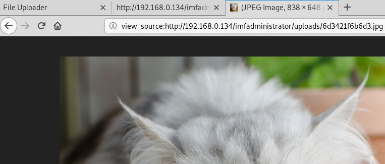
  
**trying to upload a php file fails**
 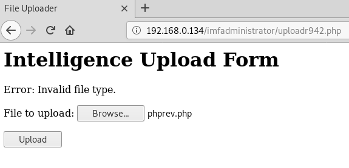
  
**adding .jpg to .php file fails due to signature checks**
 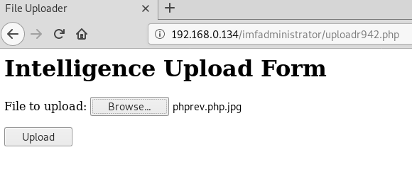
 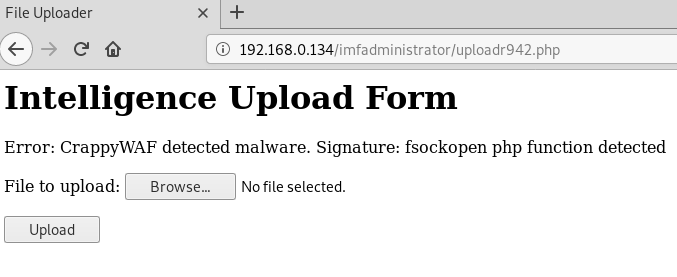
  
**also find there are file size restrictions, but gifs work**
 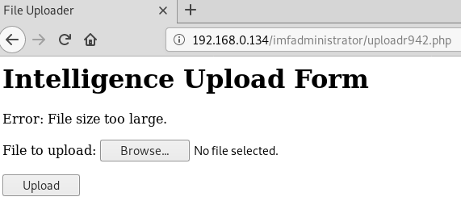
 
  
**after much searching it came to a combination of things to overcome the upload restrictions** 
**file restrictions using GIF89a; as found in this [post](https://xapax.gitbooks.io/security/content/bypass_image_upload.html) worked** 
**after so many php oneliner restrictions, using backticks as shown [here](http://php.net/manual/en/language.operators.execution.php) worked**
 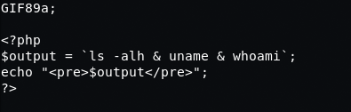
  
**uploading and calling the above gif/code gives code execution**
 
  
**modifying code, uploading and calling again gives flag 5**
 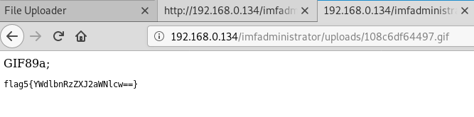
  
**next hint seems like something running on the system so we need a shell**
 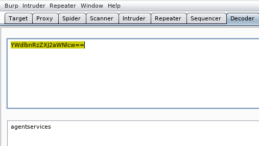
  
**since flag 3 was missed, we modify our code to look at file listings and cat out the index.php** 
**whatever lolz**
 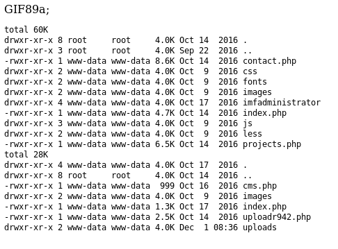 
 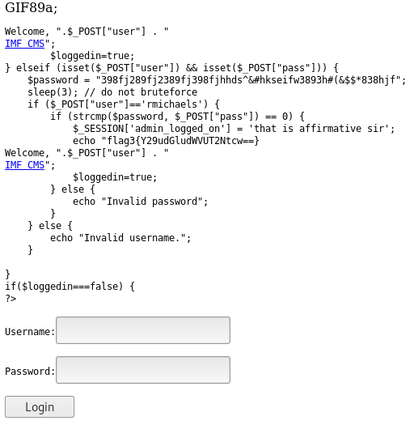 
 
  
**now for reverse shell, we know there are a bunch of restrictions around php oneliners** 
**so maybe [python](http://pentestmonkey.net/cheat-sheet/shells/reverse-shell-cheat-sheet)? initial call didn't work so we look at an all file list** 
**specifically under /usr/bin and we find python3**
 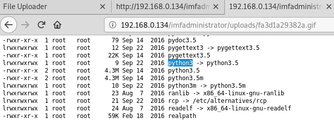
  
**this is our code to get a shell**
 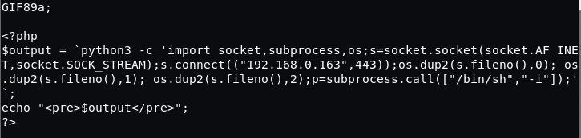
  
**finally, but we're just getting started**
 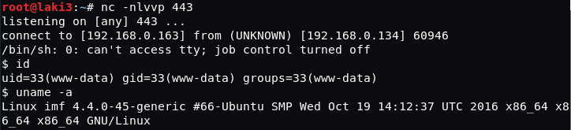
  
**from hint we look at /etc/services and find it's running on 7788/tcp**
 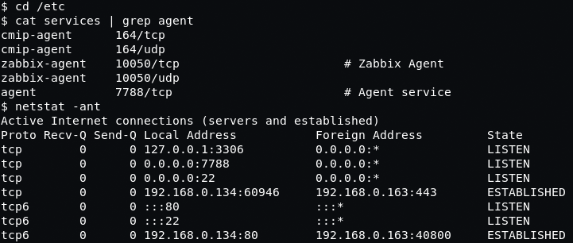
  
**also did find for agent**
 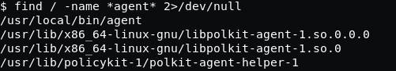
  
**running agent looks to be what were looking for**
 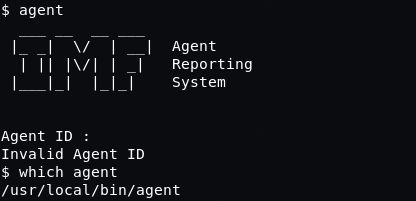
  
**directory contains two files**
 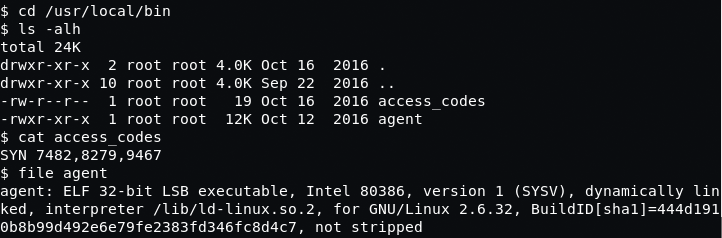
  
**we know the binary asks for an ID and using strings we see a string compare**
 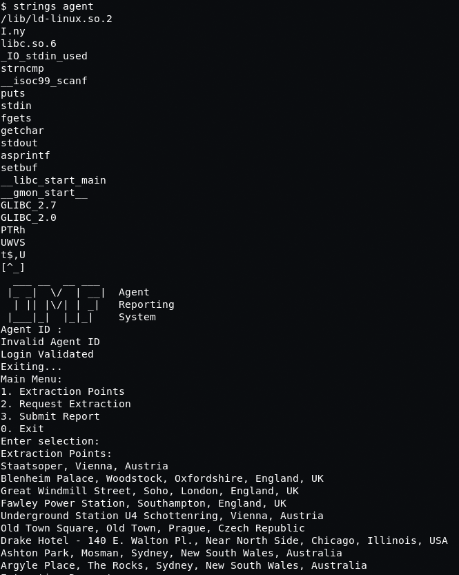
  
**forgot we were on a remote system and started examining file...ltrace was installed and code found :)**
 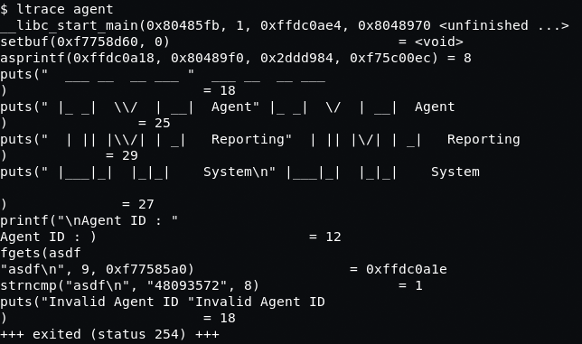
  
**code works and im assuming a buffer overflow**
 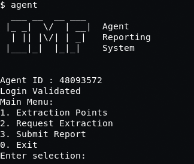
  
**after some time we find option 3, submit report is vulnerable**
 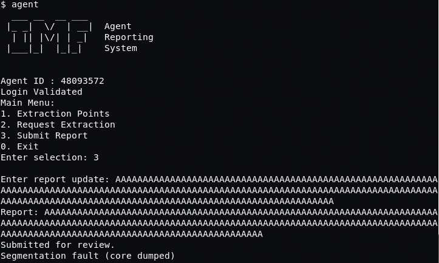
  
**so now what? remembered that this isn't only a binary, but it's running on port 7788** 
**only port 80 is open though**
 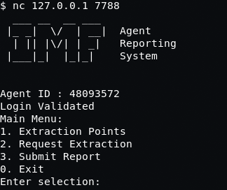
  
**insert lots of wasted time x1000**  
**finally noticed that knockd is running and remembered the access_codes file**
 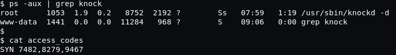
  
**i know of port knocking, but not very familiar...off to google**  
**found good digital ocean [post](https://www.digitalocean.com/community/tutorials/how-to-use-port-knocking-to-hide-your-ssh-daemon-from-attackers-on-ubuntu) of what i needed todo**
 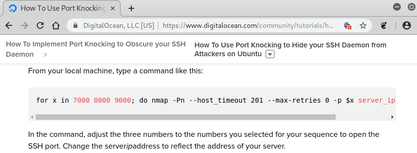
  
**followed instructions and modified a bit**
 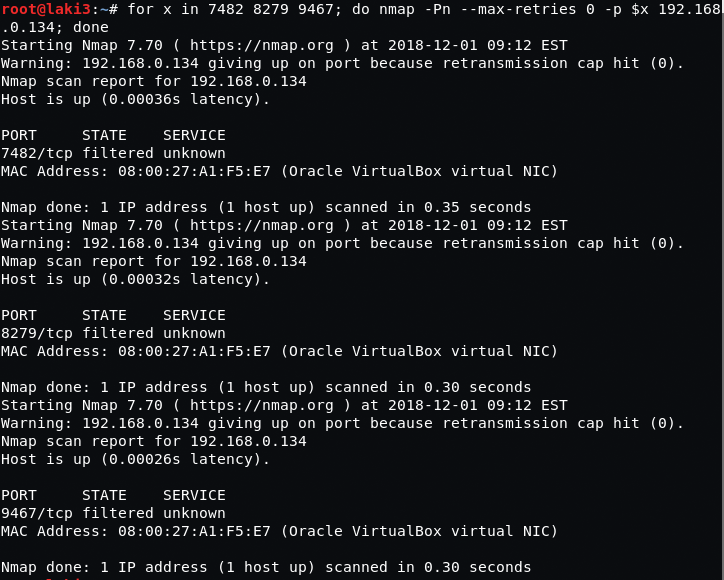
  
**and it worked**
 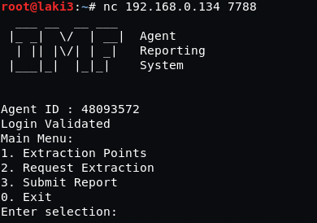
  
**so now we have to work on the exploit on our local machine** 
**simple copy over to the web directory and a wget**
 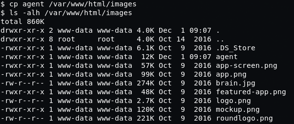
 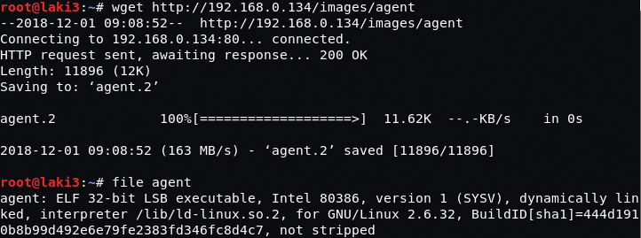
  
**now onto the binary**  
**start by creating pattern of 200**
 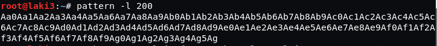
  
**examined in gdb**
 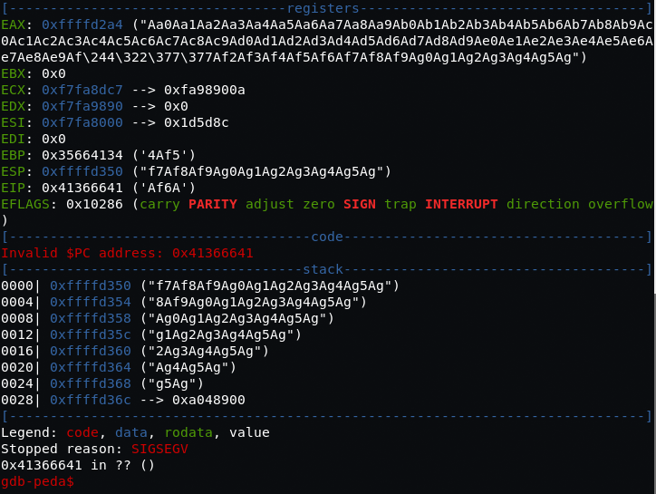
  
**find the offset of 168**
 
  
**then test offset in gdb and it's correct** 
**also find that the overflow is in eax so we find our jmp or call rather to this register**
 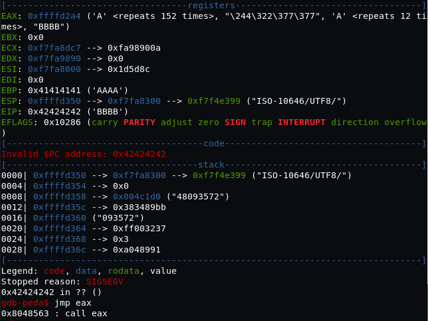
  
**started to play around with [pwntools](https://github.com/Gallopsled/pwntools) lately and created a skeleton exploit script** 
**referenced the [documentation](http://docs.pwntools.com/en/stable/) and this [post](https://0xdeadbeefjerky.github.io/2017/09/23/csaw-ctf-pilot-writeup.html) heavily**
 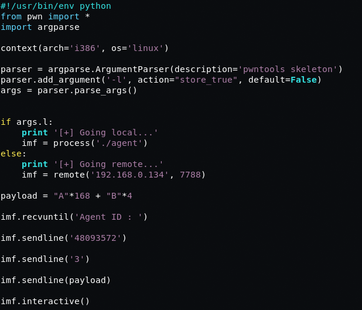
  
**test out the skeleton code, seems to work**
 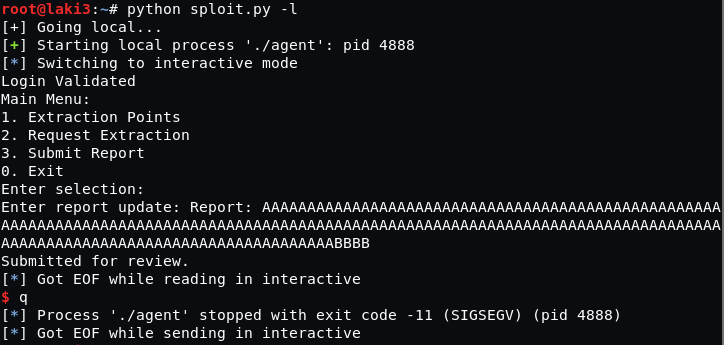
  
**we know we need a reverse shell so we create using msfvenom** 
**after some back and forth i find \x0a is also bad char**
 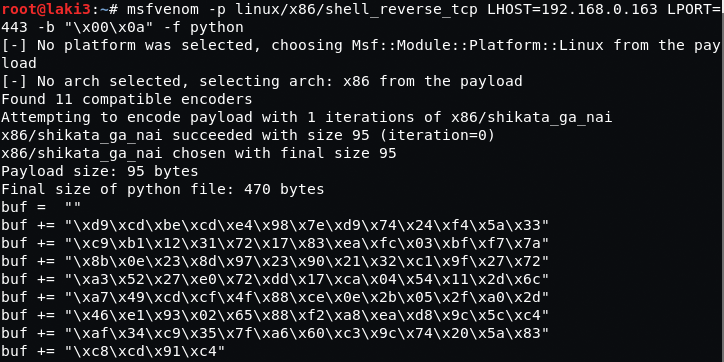
  
**update the payload of our script**
 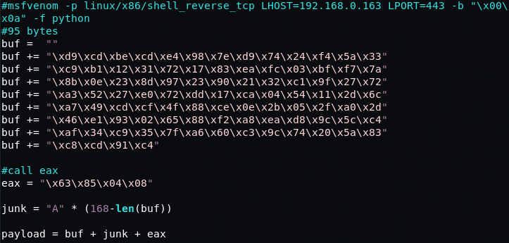
  
**do an initial test and it works; so we remove the interactive stance from our script**
 
  
**we then setup a local listener and test again...BOOM**
 
  
**with that working we run script against remote system and we have a reverse shell as root**
 
  
**flag 6 found and decoded**
 
 
  
**the end**
 
  

