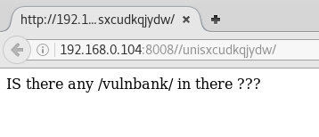

# Hackday: Albania

## Goal 
root access + flag.txt

## Download 
[https://www.vulnhub.com/entry/hackday-albania,167/](https://www.vulnhub.com/entry/hackday-albania,167/)

## Walkthrough 
Initial nmap reveals a web server running on 8008 and ssh on port 22
 
  

Website reveals Mr. Robot and a message that translates to "If I am, I know where to go ;)"
 
  

Checking the source code there's a message that translates to "but not here"
 
  

Running nikto shows various directories found from robots.txt file
 
  

Browsing to the first directory listed, it prompts with the translated message "Is this a proper directory or a jerk" < LOL I hope that Google translation is accurate
 
  

With a lot of directories to go through, I decided to save the directories listed in robots.txt to a file and run through dirb
 
  

Running the directories through dirb reveals that /unisxcudkqjydw is a different size. So let's try that...
 
  

Browsing this directory reveals another hint
 
  

Adding /vulnbank to the original URL reveals a directory listing
 
  

Clicking the client folder reveals a Very Secure Bank login page
 
  

With no known credentials, I setup burp suite to run a SQLi attack against
 
  

Quick turnaround and two possible payloads
 
  

Tested both on the username, and they both login as Charles D. Hobson
 
  

Scrolling over on the page reveals a place to upload files...
 
  

First thought was to upload a php reverse shell, but states that only specific image files are allowed
 
 
  

Simply adding .jpg to the end of the shell file and trying again results in...upload success!
 
 
  

Next I setup meterpreter, browse to the newly uploaded file and...BOOM limited shell!
 
  

Connected as www-data gives limited access so let the enumeration begin. First I see what is available in the /home directory...nothing. However it gives us a username taviso < i get it
 
  

Next checking /var/www/html it becomes obvious that all files are readable and belong to the user taviso. Browsing to the directory that provided access shows a config.php file
 
  

Viewing the config.php file gives us the mysql root password
 
  

Looking at mysql doesn't provide much more information other than two logins to the site. Moving on...
 
  

Checking permissions on /tmp shows the obvious of full access and I upload both the python and bash linux privilege checker scripts. Seems python isn't available, only python 3 and 3.5 which do not work with the python script.  However the bash script works and pays off as it reveals /etc/passwd is writable!
 
  

Since I'm able to update any user, including root, I quickly check /etc/sshd_config file and it states that remote access isn't available with password. Oh well...
 
  

So first I create a password hash using openssl
 
  

Using the meterpreter session, I download the /etc/passwd file and update root and taviso passwords
 
  

Back to meterpreter, I upload the updated file replacing the original and check to see it's the newer version
 
  

Now with my own password set on taviso, ssh access to the system works. From there issuing su with the new password gives root access.  In the root folder is a message that translates to "Congratulations, now launches report".  Also available is the file flag.txt with an MD5 hash of d5ed38fdbf28bc4e58be142cf5a17cf5 that decodes to rio
 