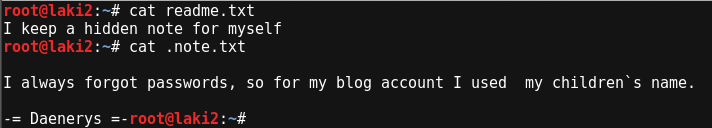

# USV: 2016 v1.0.1

## Goal 
Capture all 7 flags in Country_name Flag: [md5 hash] format

## Download 
[https://www.vulnhub.com/entry/usv-2016,175/](https://www.vulnhub.com/entry/usv-2016,175/)

## Walkthrough 
Initial nmap shows ssh on 22, web on 80, proxy on 3129, mysql on 3306, and ftp on 21211
 
  

Looking at ssh first and it revealed an ascii dragon and what looks like a hash or encrypted string.
 
  

Looking closer, the dragon has AES-ECB written near the top so a quick Google search finds a decoder aesencryption.net. Took a stab at the key being xxxxx0000000xxxxxx that is also shown in the dragon.
 
  

Result was flag1
 
  
Italy Flag: 0047449b33fbae830d833721edaef6f1

Knowing no credentials for ssh, I browse the website for clues but immediately got access forbidden
 
  

Running dirb against gave the same error
 
  

Stuck, I remembered that a squid proxy was revealed during the nmap. 
 
  

As always, I run everything through burp suite so I added the proxy setting as an upstream proxy
 
  

The proxy setting did the trick and the website reveals a single page with a changing banner of "WINTER IS COMING" and "ALL MEN MUST DIE". Great...Game of Thrones, a show I know nothing about :(
 
  

The site didn't show much of anything else so I run it through dirb again with the proxy settings. It reveals a WordPress site at /blog
 
  
*snippet of dirb

Game of Thrones notion confirmed as The Seven Kingdoms blog is revealed
 
  

Since it's WordPress I run the site through wpscan and it reveals a base64 encoded string for an X-XSS Protection header
 
  
*snippet of wpscan

Decoding the string reveals flag2
 
  
Croatia Flag: 0c326784214398aeb75044e9cd4c0ebb

Nothing else is revealed in wpscan so going back to the site reveals an interesting second post with a title of "I have a message for you!"
 
  

There is nothing else to the post so looking at the image location reveals a much different path than the normal WordPress directory of wp-content/uploads
 
  

Moving up one level reveals the message and a download link which turns out to be a zip file
 
 
  

Unzipping the file reveals an image file named hodor and the picture shows an base64 encoded string
 
  

Decoding the string reveals flag3
 
  
Portugal Flag: a2663b23045de56c7u96a406429f733f

Back to the site there are several long winded irrelevant posts in a row and then an interesting last one titled "Protected: The secret Chapter"
 
  

*This one took some time and to spare your time I won't go through my failures

Looking back at all the several long winded irrelevant posts, I decided to create a word list file out of them by using cewl
 
  

Running the new word list through burp intruder also failed
 
 
  

With that I decided to look into how the password was being passed after submitting. Turns out it does a post and then a get with the addition of a cookie that encodes the password
 
 
  

With that information I setup burp intruder to include redirection and cookies
 
  

Left the scan running overnight as it's a long process, but it finally revealed the keyword of Westerosi, a base64 encoded string and a new clue of "The mother_of_dragons has a password which is in front of your eyes"
 
  

Decoding the string reveals flag4
 
  
Paraguay Flag: 4761b65f20053674657c7e6186628a29

Tested the password on the actual post and it reveals a picture
 
  

Knowing nothing of Game of Thrones I resorted to Google to see if there were any clues about Daenerys Targaryen's eyes. Apparently the actress is known for her eyebrows so I tested every combination of eyebrow and brow that I could think of. No luck.

Stumped I looked at the clue again.  The clue states "has a password which is in front of your eyes"...wait...it can't be that easy. Could the password be "in front of your eyes"? Nope.

Then I remember there are other services ssh, mysql and ftp.  Testing ssh fails and mysql shows that no remote connections allowed. However ftp works and reveals two text files, readme.txt and .note.txt
 
  

The readme.txt file hints to look for a hidden file (already done) and the .note.txt file states that mother_of_dragons WordPress password are her children's name
 
  

Back to Google and I find that Daenerys Targaryen has no children, but three dragons with the names of Rhaegal, Drogon and Viserion. So I put those names into a file along with various combination of all names combined
 
  

Running the list through wpscan reveals RhaegalDrogonViserion as the password
 
 
  

*snippet of wpscan

Now to test those credentials on the site...
 
  

and we're in!
 
  

Looking around the site I found the profile section which reveals a base64 encoded string for mother_of_dragons
 
  

Decoding the string reveals flag5
 
  
Thailand Flag: 6ad7965d1e05ca98b3efc76dbf9fd733

With only two flags left I figured it was time for shell access. As an admin of the site I'm able to edit the theme, so I replace the footer.php page with a php reverse shell from pentestmonkey and setup my listener
 
  

Boom!...limited shell as user http
 
  

Lookin at the passwd file, it shows the home directory for http at /srv/http
 
  

Changing to /srv/http directory reveals the website files and directory, an interesting file named 'winterfell_messenger' that we'll come back to, and a text file named 'reward_flag.txt'. Reading the reward file reveals a base64 encoded string
 
  

Decoding the string reveals flag6
 
  
Mongolia Flag: 6b49c13cccd91940f09d79e142108394

*Again, this one took some time and to spare your time I won't go through my failures

Back to the interesting file winterfell_messenger, we see it's executable, SUID is set and the owner is root. Running the program shows that it's using cat to read a file in the /root directory
 
  

Using strings it's revealed that cat is being used, however it's not using the full path to the program. From this we know that it will search the set PATH to run.
 
  

Now we're able to update PATH by using export, but first we need to find a writable directory and per usual we'll use /tmp
 
  
*snippet of output

Using export I add /tmp to be checked first
 
  

Now we need to create a executable file in /tmp named cat so it can be called by the winterfell_messenger program. Seeing that this file will be run as root, why not call a shell using /bin/sh
 
  

And now running the winterfell_messenger program...root
 
  

Viewing the /root directory reveals .flag.txt file
 
  
Before showing the contents of the file, the PATH needs to be updated to remove the /tmp directory we added
 
  

Now running cat against the .flag.txt file we get a congratulations, a cute ascii wolf, and a base64 encoded string
 
  

Decoding the string reveals flag7
 
  
Somalia Flag: 4a64a575be80f8ffab26b06a958bcf34
