## Goal
uid=0(root) gid=0(root) groups=0(root)

## Download 
[https://www.vulnhub.com/entry/wallabys-nightmare-102,176/](https://www.vulnhub.com/entry/wallabys-nightmare-102,176/)

## Walkthrough 
Initial nmap shows ssh on 22, web on 80, and closed irc on 6667
 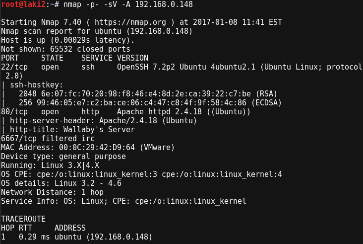
  

Looking at the website and we need to enter a username to get started
 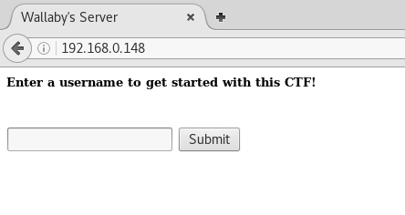
  

Username was just to personalize, now some tips and off we go
 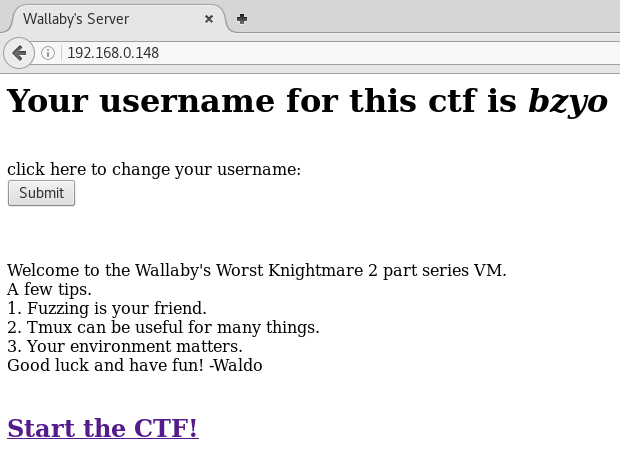
  

Told we're being observed, but we now have a path to use /?page=
 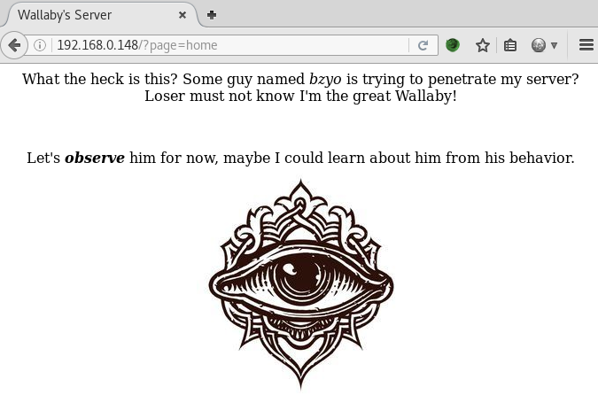
  

Throwing the site at dirb yields some interesting results. Almost too interesting...
 
  

Going back to the website to check these results and it seems port 80 doesn't work anymore
 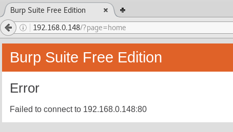
  

Another nmap shows that 80 moved to 60080
 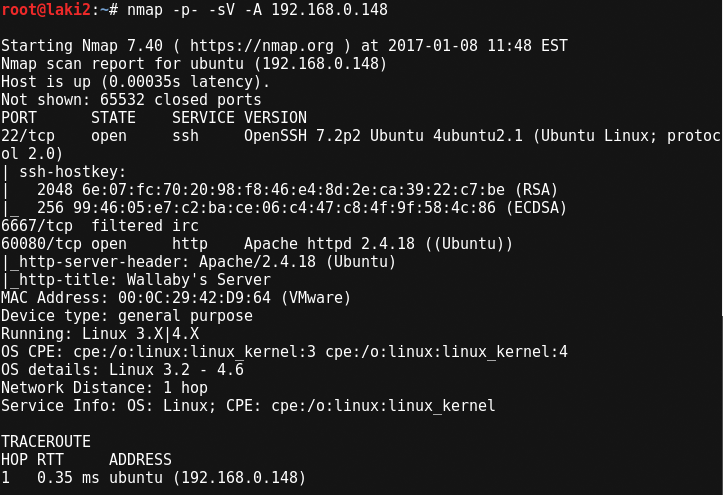
  

Back to the website on the new port 60080 and greeted with a new message
 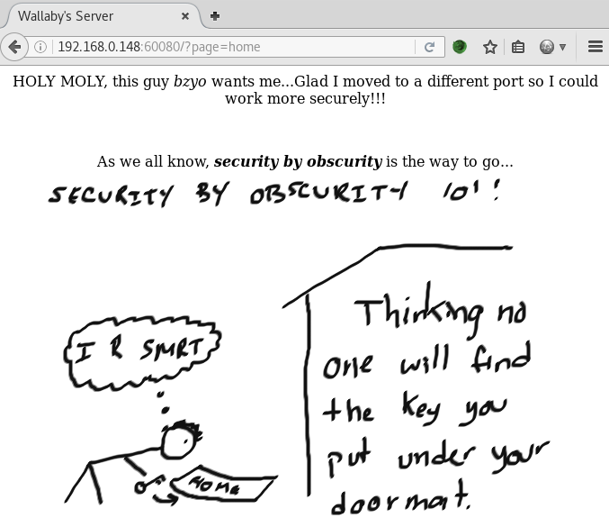
  

Running dirb against the site on the new port yields same results
 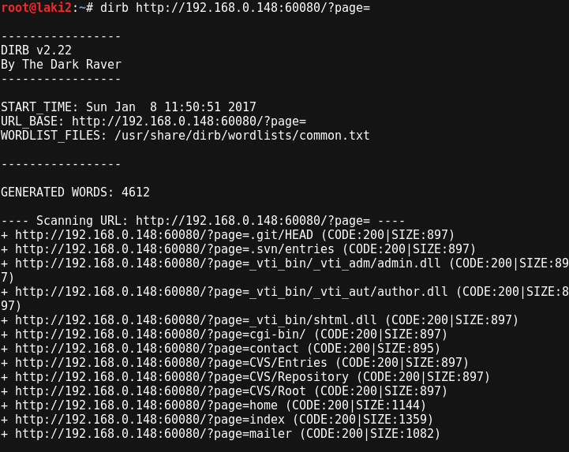
  

Throwing nikto at the website reveals a possible way to read /etc/passwd
 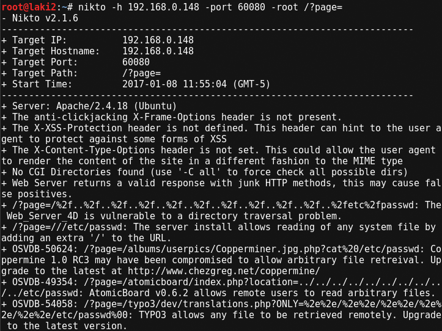
  
*snippet of nikto results

While all the results from nikto seem to reveal the passwd file...
 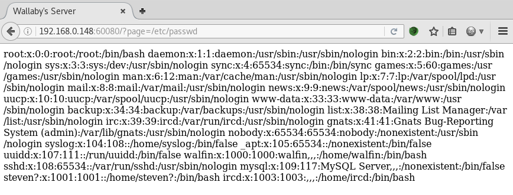
  

Looking at the source it's safe to assume it's fake
 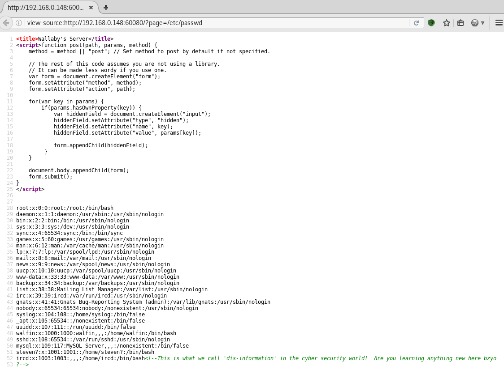
  

Back to the dirb results, it seems most of them are just fake as it throws an already patched message
 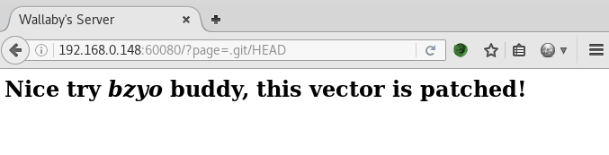
  

The contact page works, but shows nothing much and neither does the source
 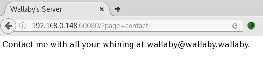
  

The mailer page works also and doesn't show much...
 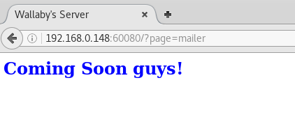
  

However the source of the mailer page reveals a new path to work with /?page=mailer&mail=mail wallaby "message goes here"
 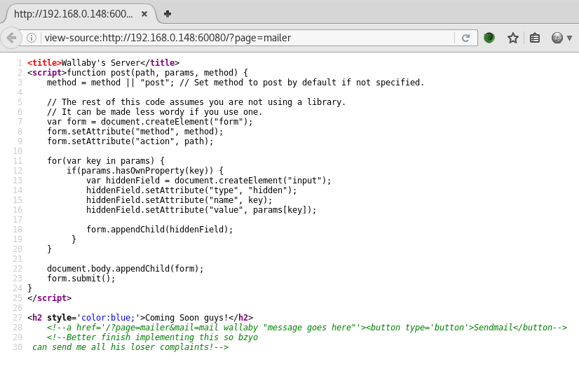
  

After some time of messing with the path, it turns out we have LFI
 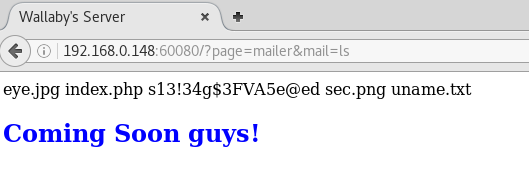
  

Seems wget is working, so a reverse php shell is setup and ready to download
 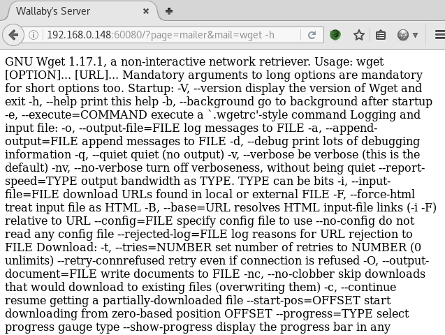
 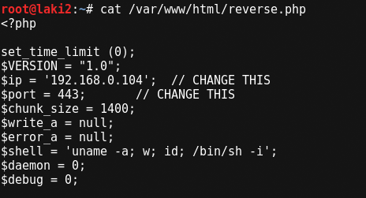
  

However after running it doesn't seem to download as there is no data in the file
 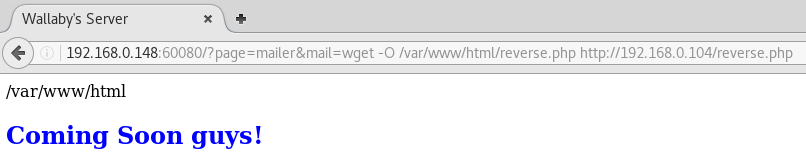
 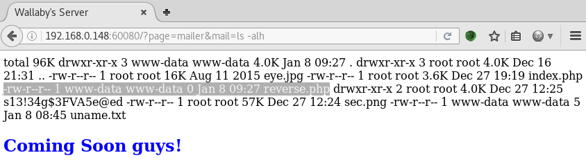
  

Looking at the access.log it seems to pull, but gets a 500 error
 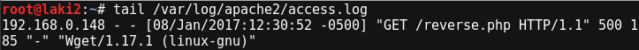
  

After some trial and error seems we need to chmod 777 the file and remove the .php extension in order for it to work
 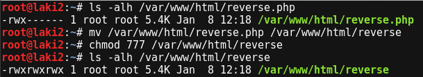
 
  

File is now showing data
 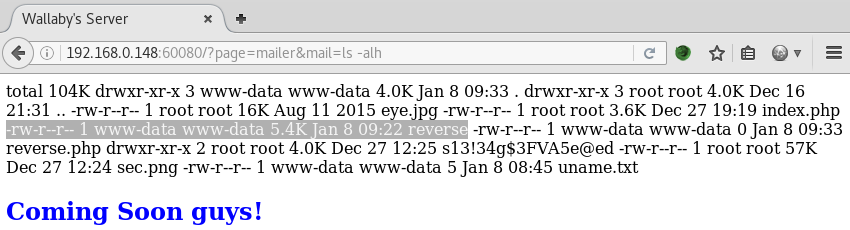
  

Before we can get a shell we need to remove the old no data reverse.php file and copy the reverse file to include .php extension
 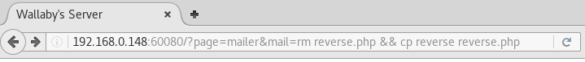
  

After calling the reverse.php page we have a limited shell as www-data
 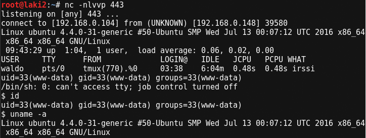
  

Showing the true passwd file we see there are 3 users; ircd, waldo, and wallaby
 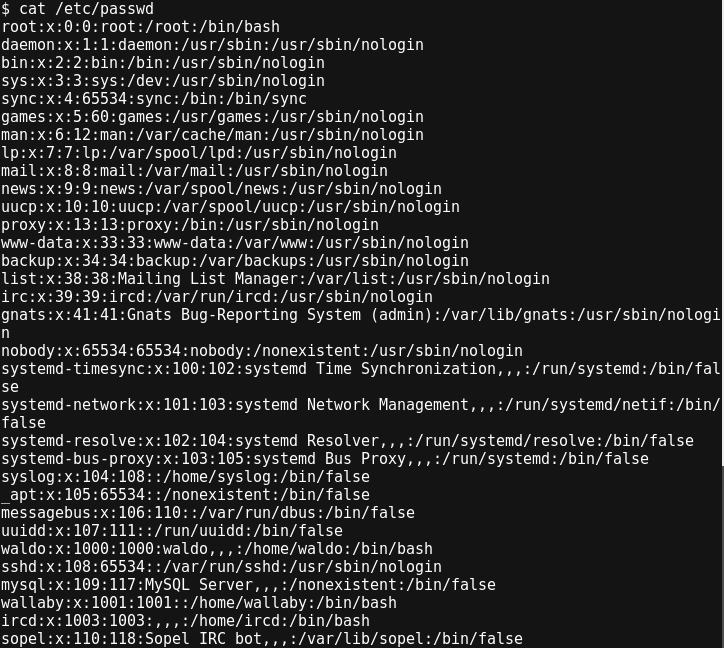
  

Now we know irc is running, but we're unable to interact with it. After some digging it's revealed through 'sudo -l' that all users have the ability to use iptables with no password. We also see waldo has the ability to run vim on a specific file, which we'll come back to later
 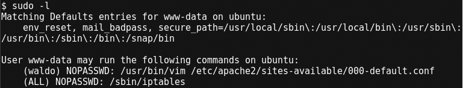
  

Looking at iptables it does show port 6667 (ircd service) blocked to external users
 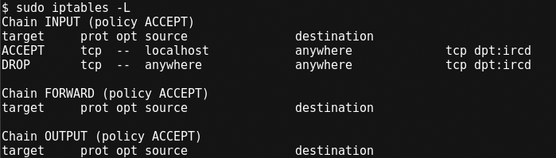
  

So let's delete that entry
 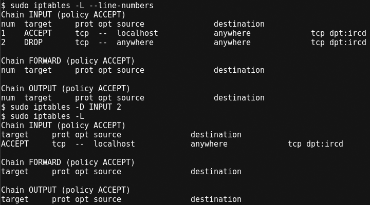
  

An nmap against port 6667 reveals the service is now open :)
 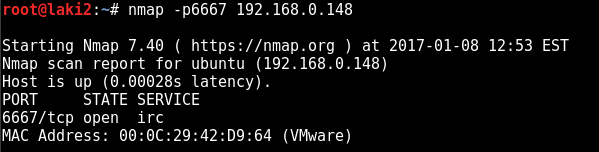
  

We're now able to connect using irssi
 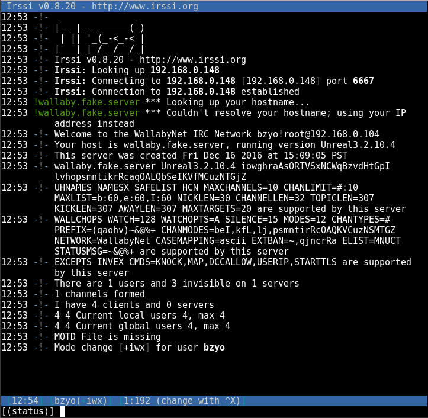
  

Through /list it's revealed that there is a channel #wallabyschat and joining shows two other users; waldo and wallabysbot
 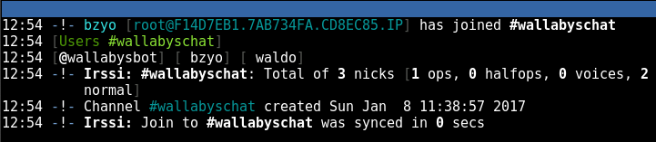
  

Hitting a wall, I went back to see if there were any clues in the file system. Seems the home directories for all three users (ircd, waldo, and wallaby) were available.  Digging shows wallabysbot is using sopel, a python irc bot, with an interesting file run.py
 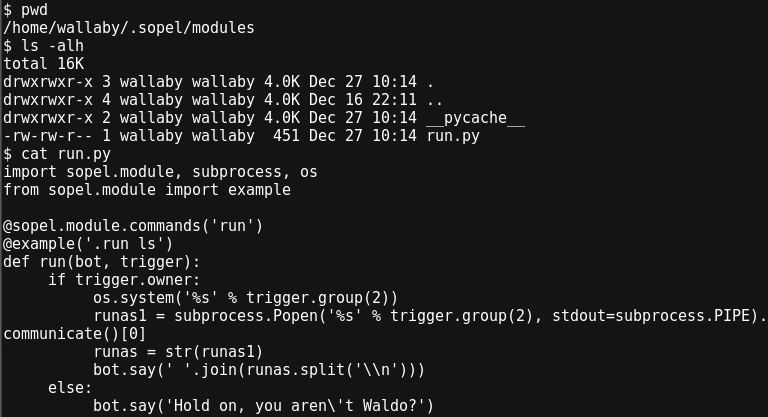
  

Unfamiliar with sopel, I did a little reading. Seems you can get the available commands by using .help
 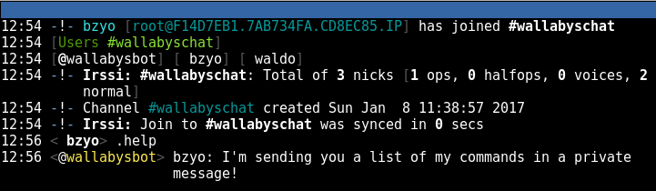
  

Commands are then listed in a private message and run is shown...interesting
 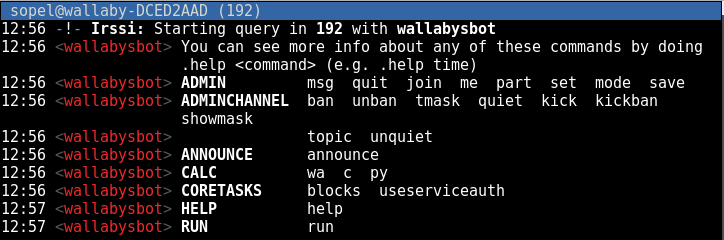
  

Running help on the command shows that I can do an 'ls' command, but doing so throws a message that I'm not waldo
 
  

Attempt to change nick to waldo fails as it's already in use
 
  

Back to the limited shell, we see waldo has a session open on pid 770
 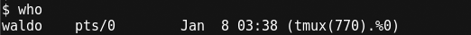
  

After some time I remember the additional 'sudo -l' entry for waldo
 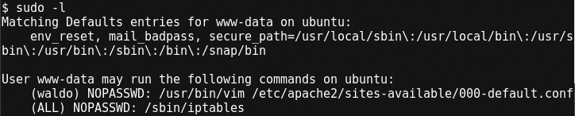
  

So we can vim into a file which doesn't seem like much, but we can execute commands within vim using :!command
 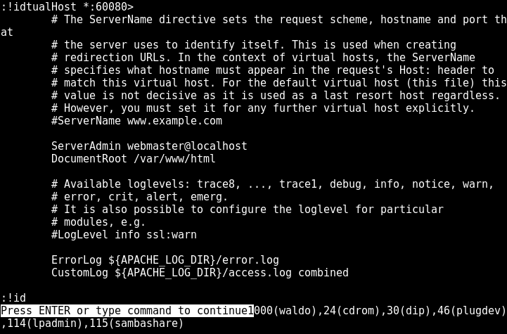
  

So we can run commands as waldo within vim, we need waldo off irc, and we know the specific pid for the irc process ...so let's start vim as waldo and issue :!kill 770
 
 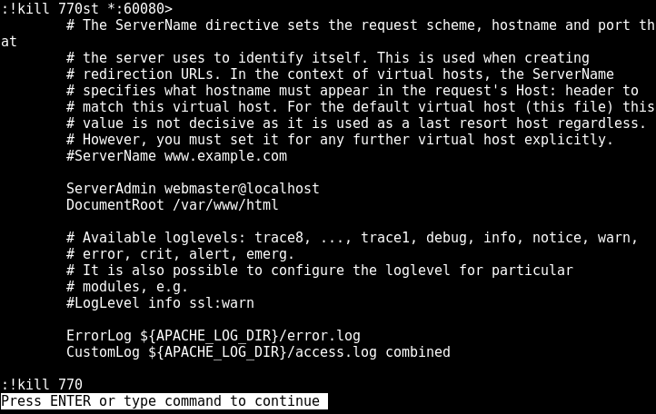
  

After killing pid 770 we check to make sure the irc process is gone
 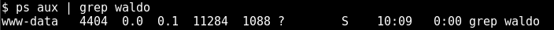
  

We now change our nick in irssi to waldo with /nick waldo and with the ability to use .run we see that we're wallaby
 
  

The .run command did not allow a lot, just one word commands with no options. However we're able to run scripts. Creaing a test script, I'm able to download using wget, make executable, and .run processes the file
 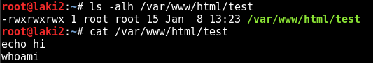
 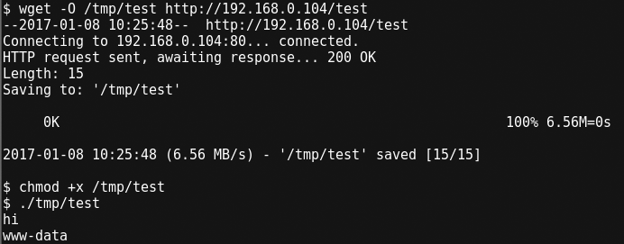
 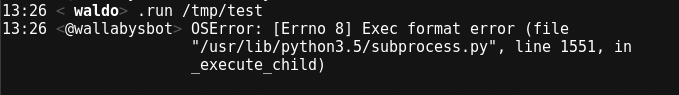
  

The script shows that it failed, however it did run.  Knowing sopel uses python, I setup a python reverse shell...
 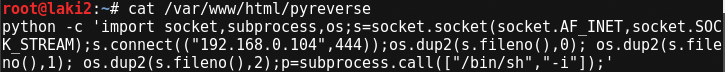
  

Download using wget and make executable
 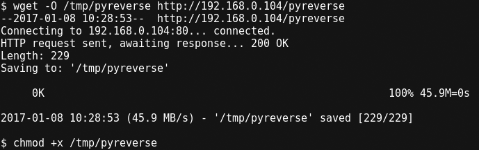
  

Before running I setup my listener on 444 and after the comand '.run /tmp/pyreverse'...we have reverse shell as wallaby
 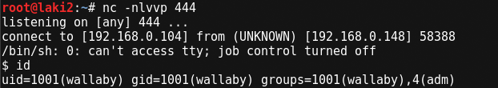
  

First thing I check is what I can run as sudo and it's everything with no password
 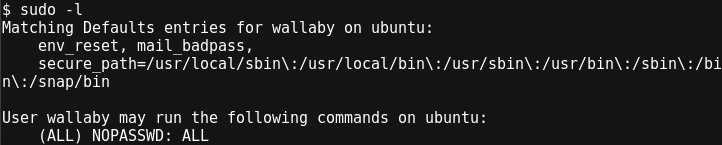
  

The command 'sudo -i' gives me root and the flag.txt file :)
 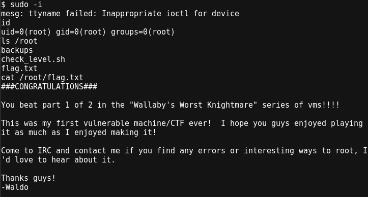
  
