# Moria: 1.1

## Goal 
uid=0(root) gid=0(root) groups=0(root)

## Download
[https://www.vulnhub.com/entry/moria-1,187/](https://www.vulnhub.com/entry/moria-1,187/)

## Walkthrough
Initial nmap shows ftp on 21, ssh on 22, and web on 80
 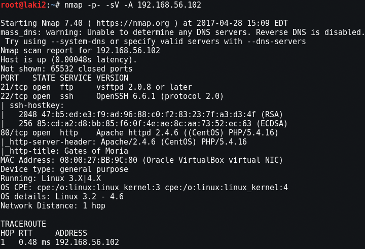
  

Looking at the website it shows the Gates of Moria 
 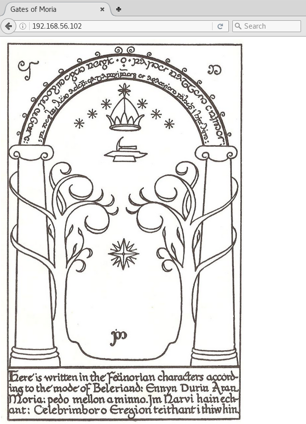
  

Next scan with dirb and we get a listable directory w
 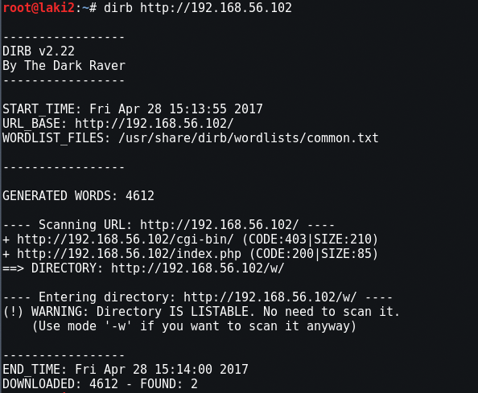
  

Browsing to the directory we see that there is an h directory as well
 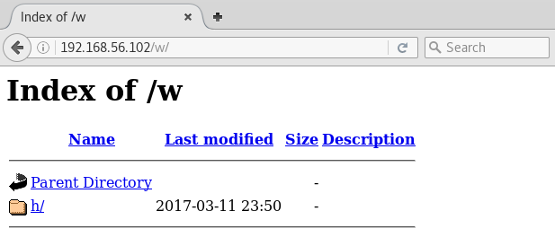
  
Going down the rabbit hole we end up spelling whisper and a final directory of the_abyss
 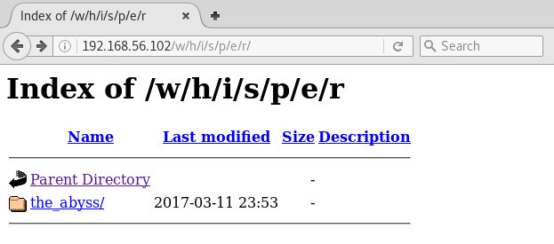
  
From here there are a series of random messages with each refresh.  There were 13 in total, but they just repeat at random 
 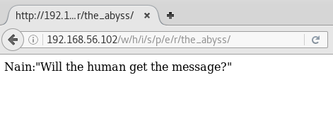
 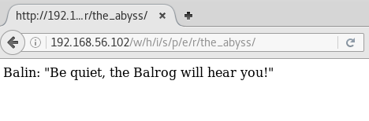
 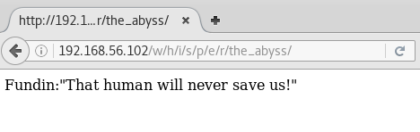
 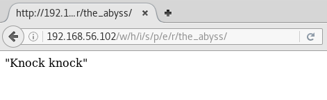
  

Unable to find anything else we go back to the FTP and try anonymous login, but nothing...it was checked during nmap, but whatever
 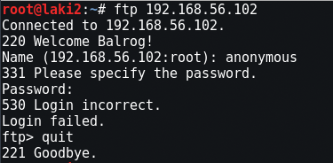
  

First we need a username so I gather all the names from the random messages from the_abyss
   Balin
   Oin
   Ori
   Fundin
   Nain
   Eru
   Maeglin
   Telchar
   Thrain
   Dain
 
Next we need a password, but I only have my limited movie only knowledge of LOTR...great.  So I remember when they're at the Gates of Moria and they speak the elvish word for friend.  No idea what they said though...to Google!

We search for "gates of moria friend' and the results yield Doors of Durin. Scrolling through we find the word...Mellon. Lots of trial and error took place and no luck.  Then looking at the FTP banner it says welcome Balrog...duh

We try the combinations of uppercase/lowercase for name/password and finally get a match Balrog/Mellon. We're in, but with limited abilities...
 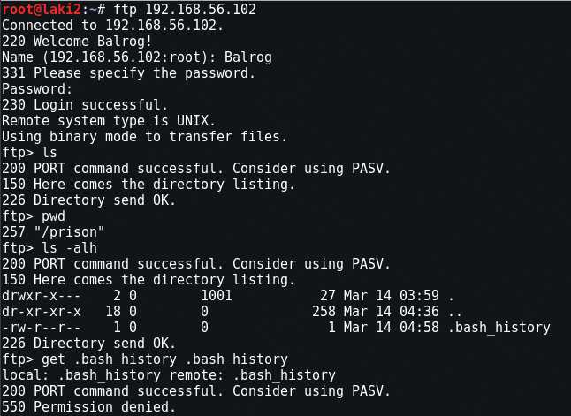
  

Even though we're limited we can still browse the file system...
 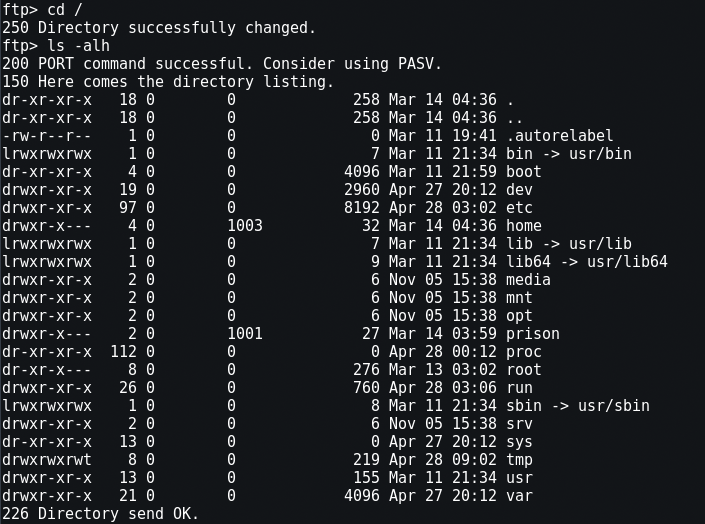
  

Then I remember SSH, but that's a dead end :(
 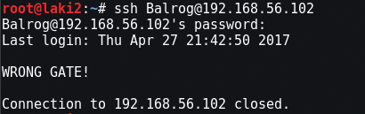
  

So I attempt to find a username, but no luck in /home or /etc/passwd
 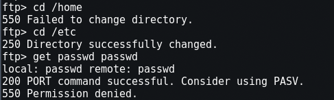
  

But /var/mail shows users :)
 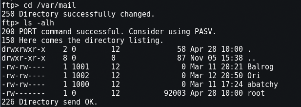
  

Now that we have a username Ori, we need a password...

Still with browse capabilities I take a look through the web directories and sure enough there is a random string directory 
 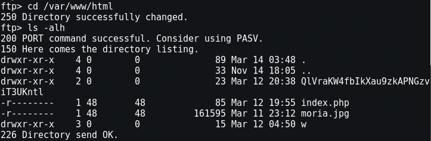
  

Back to the webs and browsing to the new directory yields usernames and passkeys
 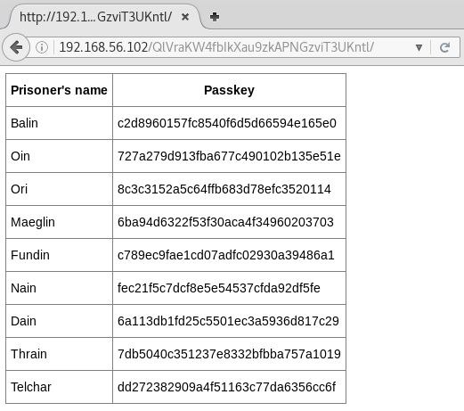
  

No known MD5 hashes found for user Ori or any others, so I took at the page source and sure enough Salt with format are commented out 
 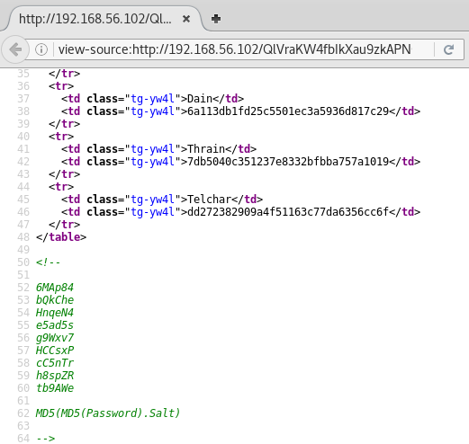
  

Now what...back to Google.  This one took me some time, but some success after random searches and playing around with the format led me to this search "john format dynamic" and this helpful page

First the username, pass, and salt were properly added to a file 
 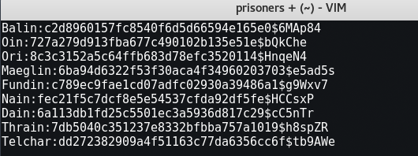
  

Next running the correct format with john against the file yielded all the passwords 
 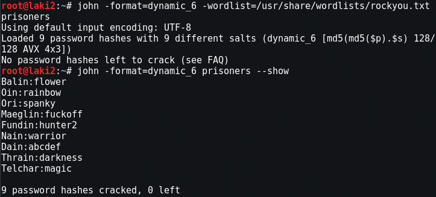
  

Using the new credentials for Ori, we're able to get a shell
 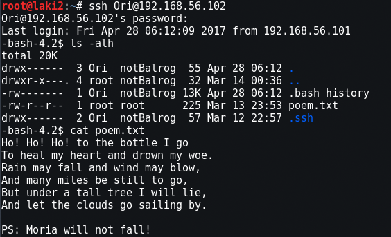
  

Scouring the entire system and finding nothing, I finally came back to the /home/Ori directory and took a look at the .ssh folder

Looking at the known_host file we see Ori connects to localhost?  With that I try ssh as root to localhost and BOOM...root and flag.txt :) 
 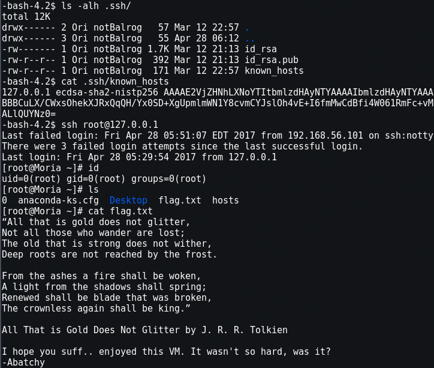
  
