## Goal 
130 Points 
uid=0(root) gid=0(root) groups=0(root)

## Download 
[https://www.vulnhub.com/entry/rickdiculouslyeasy-1,207/](https://www.vulnhub.com/entry/rickdiculouslyeasy-1,207/)

## Walkthrough 
**Initial nmap on all ports reveals the following open ports: 21, 22, 80, 9090, 13337, 22222, 60000.  The scan finds two flags immediately, but let's verify to make sure we're not missing anything.**
 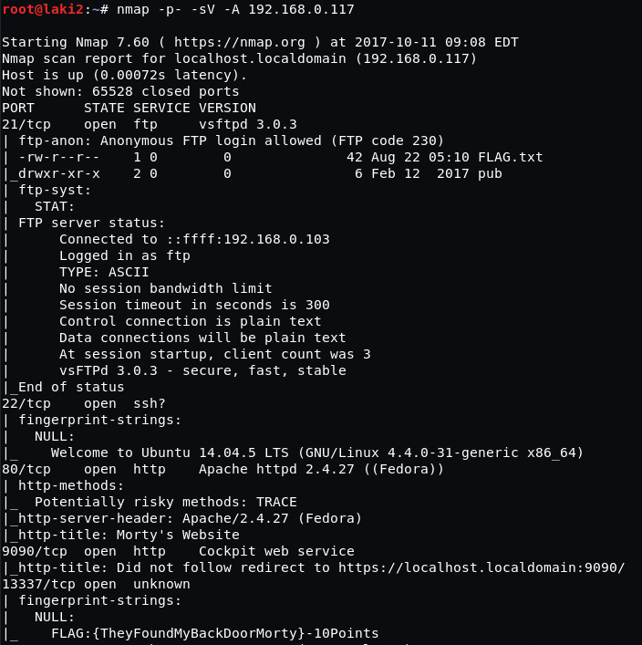
 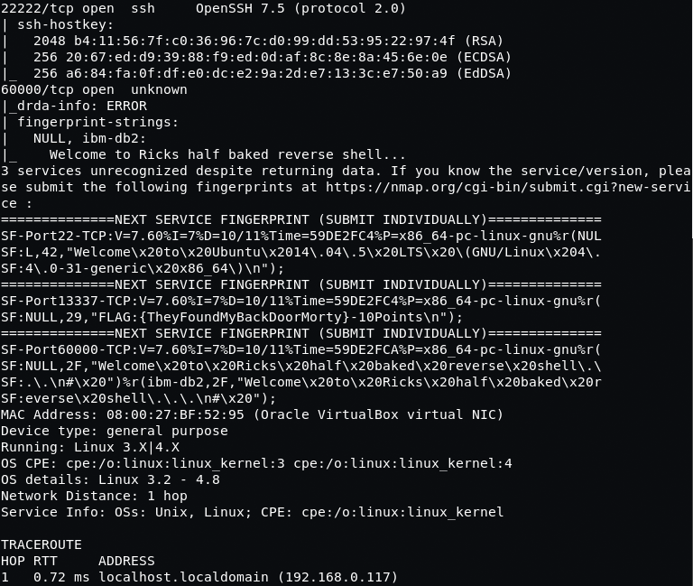
  
**Connecting to FTP using anonymous we're able to download FLAG.txt, but unable to upload any files**
 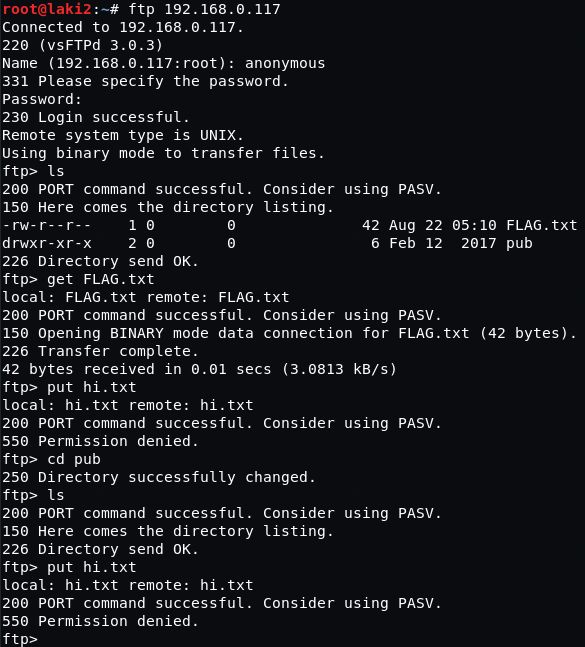
  
**First flag revealed**
 
  
**FLAG{Whoa this is unexpected}** 
**Points = 10** 
**Overall points = 10**  
**SSH seems fake as it is unable to connect, moving on**
 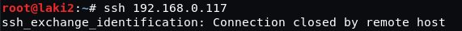
  
**Checking out Morty's Cool Website, nothing interesting and nothing in source**
 
  
**Running dirb against finds some interesting paths**
 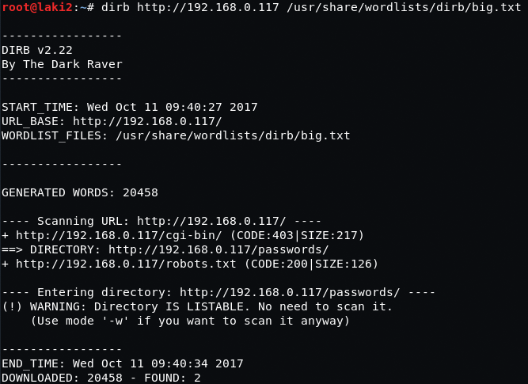
  
**The passwords directory reveals new flag and another page**
 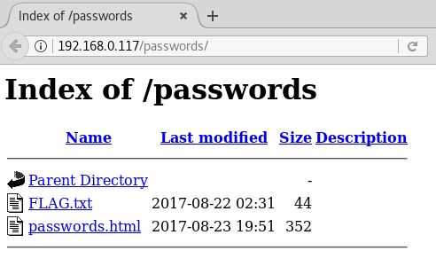
 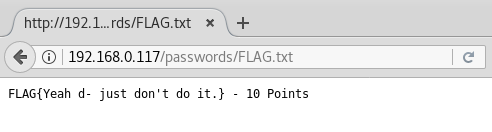
**FLAG{Yeah d- just don't do it.}** 
**Points = 10** 
**Overall points = 20**  
**The passwords.html page is nothing special**
 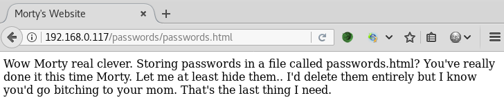
  
**But the source reveals a password winter**
 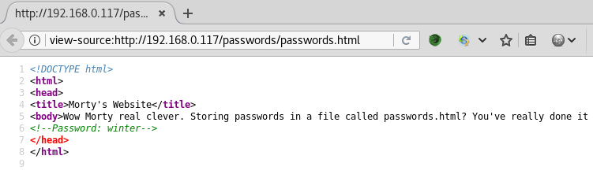
  
**Looking at robots.txt, it shows some interesting files are located in cgi-bin**
 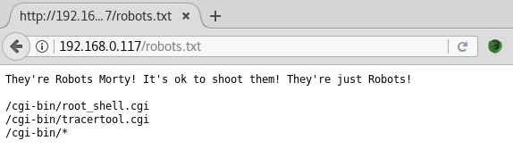
  
**File root_shell.cgi is too good to be true**
 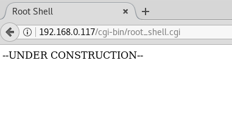
 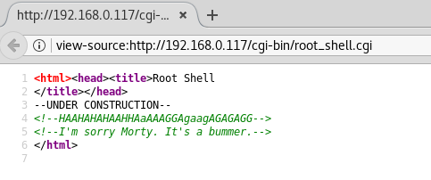
  
**File tracertool.cgi however looks promising** 
 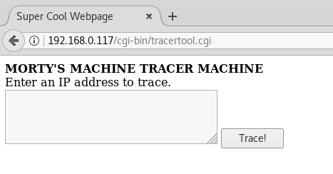
 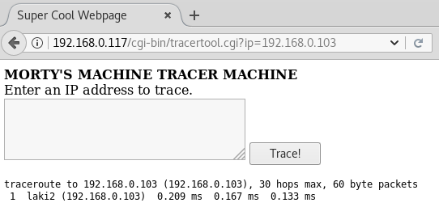
  
**Seems that command injection is possible and we get /etc/passwd**
 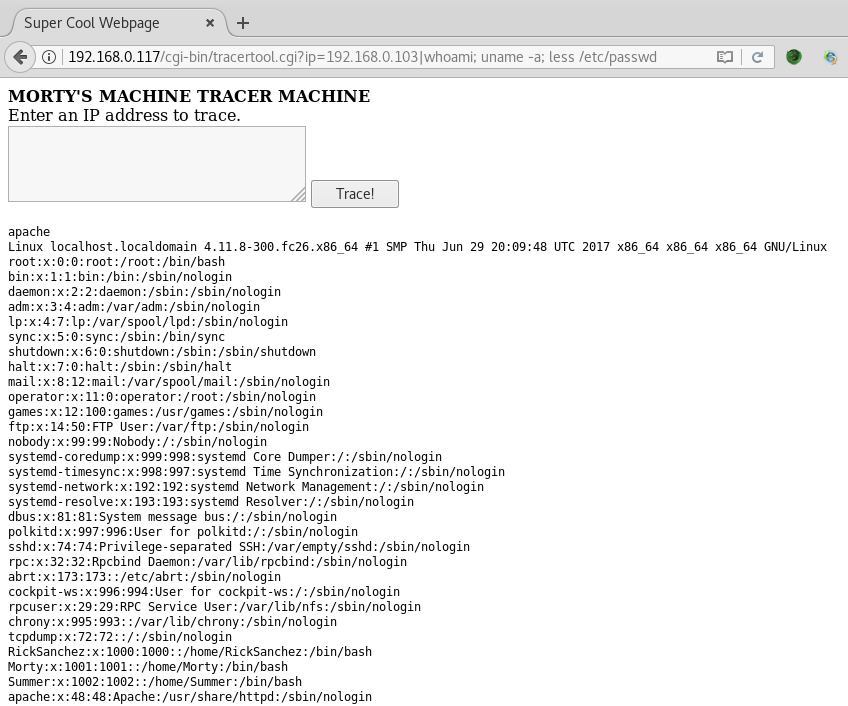
  
**After messing around with this for way too long, I found that it wasn't a way in. However I did find that that cat command just printed a cat and less needed to be used :)**
 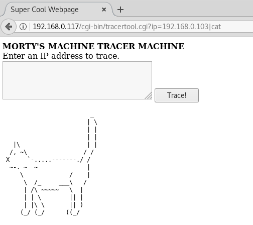
  
**Also found that the /etc/passwd file was false, as looking at /etc/group reveals the usernames we need; RickSanchez, Morty, Summer**
 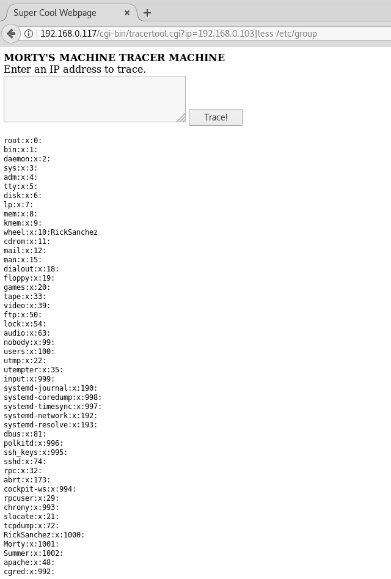
  
**We'll come back to user credentials after covering all these other open ports.**
  
**Let's start with port 9090 in a web browser, which gives us another flag.  Nothing else to do as password field and submit button are missing**
 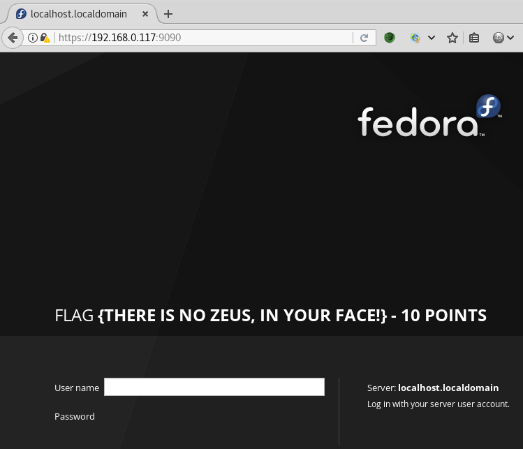
  
**FLAG {There is no Zeus, in your face!}** 
**Points = 10** 
**Overall points = 30**  
**Next port is 13337, which we netcat to revealing another flag and nothing else**
 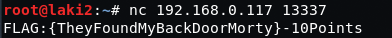
  
**FLAG:{TheyFoundMyBackDoorMorty}** 
**Points = 10** 
**Overall points = 40**  
**Next port is 60000, that holds a flag and no other commands work**
 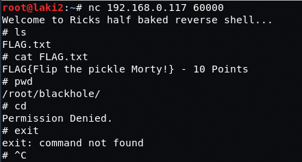
  
**FLAG{Flip the pickle Morty!}** 
**Points = 10** 
**Overall points = 50**  
**Now onto port 22222, the real SSH port.  So we found a password 'winter' and we have a username 'Summer'....uh let's try that. BOOM, we have access and another flag**
 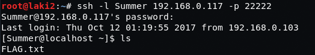
 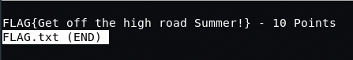
  
**FLAG{Get off the high road Summer!}** 
**Points = 10** 
**Overall points = 60**  
**Looking around we have two more home directories; Morty and RickSanchez. Since we know RickSanchez is part of the wheel group, let's start with Morty.**
 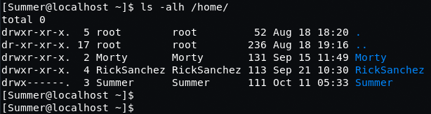
  
**We reveal two files so we sftp them off to kali**
 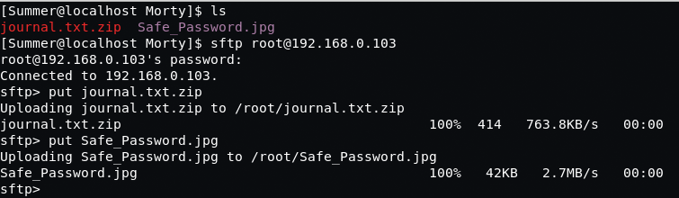
  
**Looking at the file Safe_Password.jpg, looking good Rick :)**
 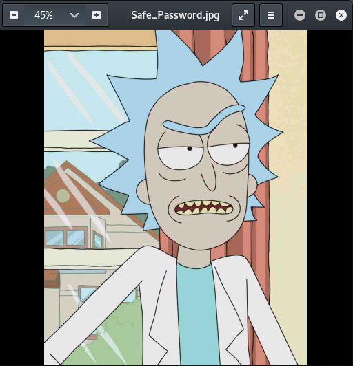
  
**Nothing special so we throw it at strings, which reveals the password for the zip**
 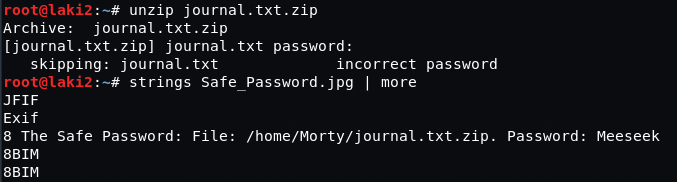
  
**Using the found password we're able to unzip the file and reveal another flag and an interesting message**
 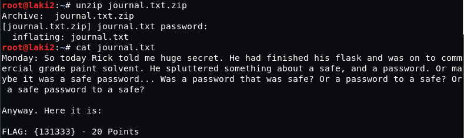
  
**FLAG: {131333}** 
**Points = 20** 
**Overall points = 80**  
**Looking at RickSanchez home folder we find two folders.  Trying RICKS_SAFE we find an executable named safe, but it's unable to run so we sftp to kali**
 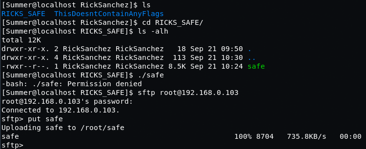
  
**The other folder, obviously fake, but I had to look...**
 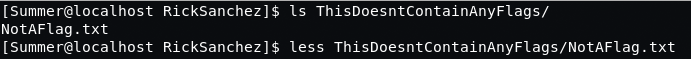
 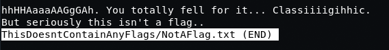
  
**Back to the safe executable file, seems that it needs an argument to run.  Putting it to strings it seems that it's going to need that argument to decrypt the message**
 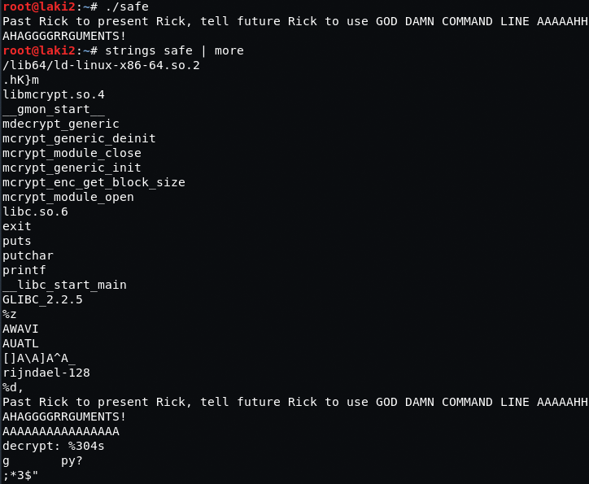
  

**Sending all A's reveals the encrypted message**
 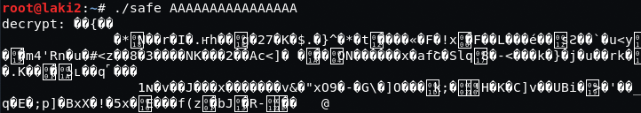
  
**Looking back at the last flag and message, I try the number as the arguments or key.  With that the message is decrypted revealing another hint and flag**
 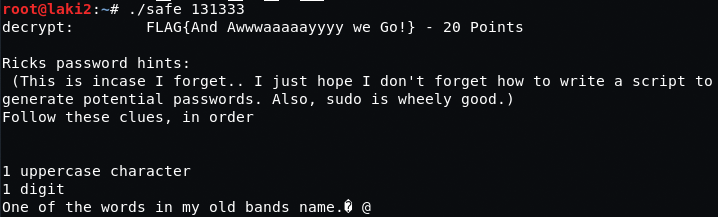
  
**FLAG{And Awwwaaaaayyyy we Go!}** 
**Points = 20** 
**Overall points = 100**   

**So we know the parameters needed for user RickSanchez.  First we Google what band Rick was in, seems to be 'The Flesh Curtains'.  Next we use crunch to generate the 1 Uppercase character and 1 Digit, outputting to a file.  Last we append the word Flesh and Curtains to that created listed by using sed and outputting to two new files**
 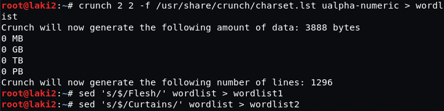
  
**Last we throw those files at hydra and we get the password on the second list**
 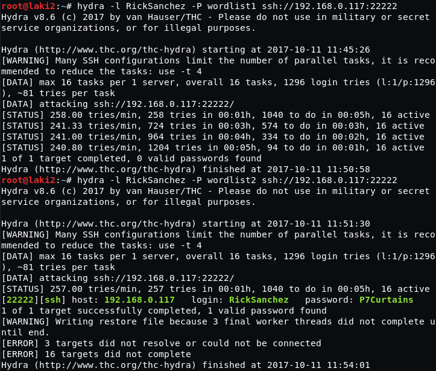
  
**With that we're able to SSH as RickSanchez and with a simple 'sudo -i' we're root :)**
 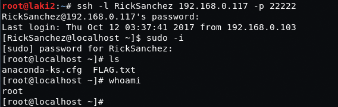
  
**Last flag is revealed giving us 130 points**
 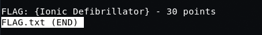
  
**FLAG: {Ionic Defibrillator}** 
**Points = 30** 
**Overall points = 130**
