# Bulldog: 1

## Goal
uid=0(root) gid=0(root) groups=0(root)

## Download
[https://www.vulnhub.com/entry/bulldog_1,211/](https://www.vulnhub.com/entry/bulldog_1,211/)

## Walkthrough 
Initial nmap shows ports open on 23, 80, and 8080
 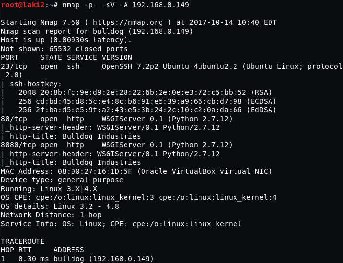
  

Nothing special on front facing site or notice page.  Also nothing in the source and 8080 is the same web app
 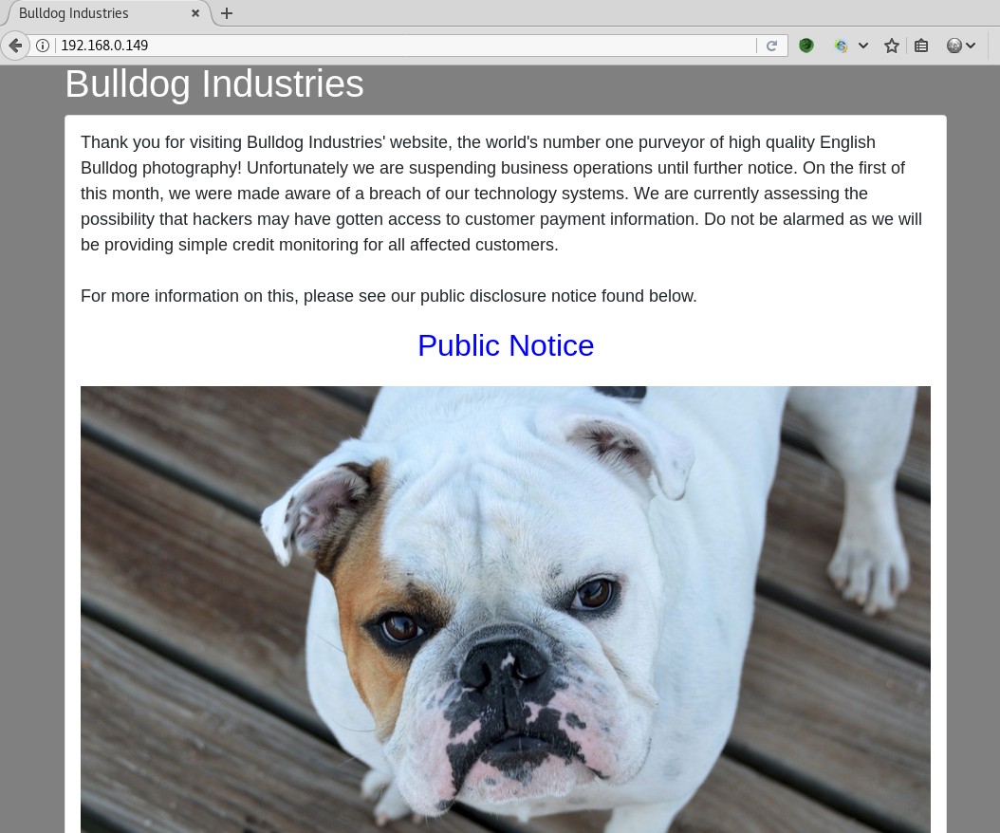
 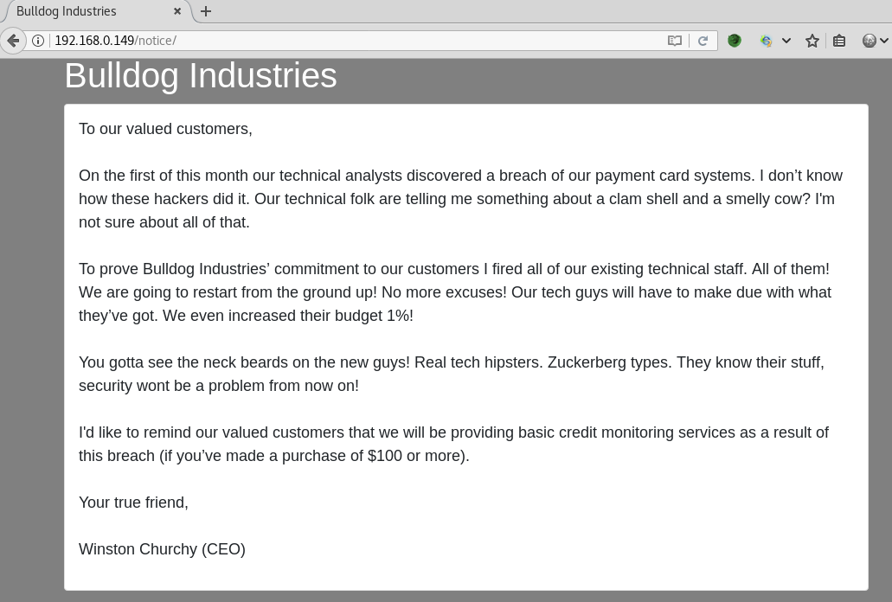
  

Running the site against dirb reveals admin, dev, and dev/shell directories
 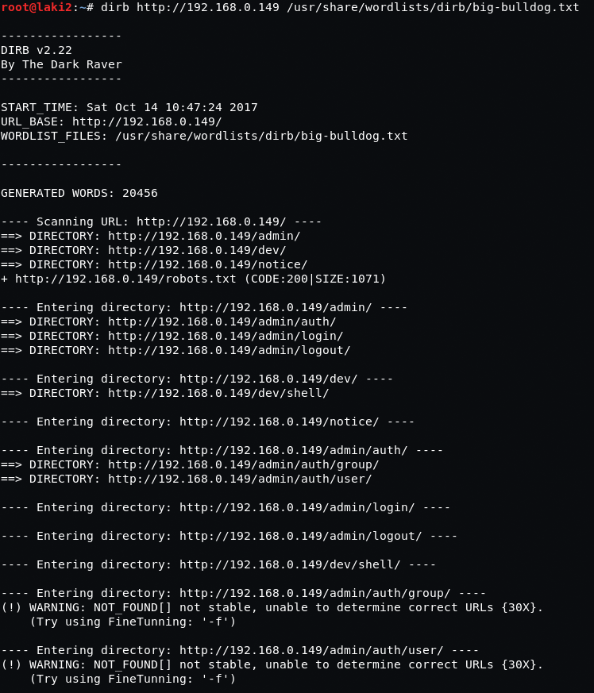
  

The admin page reveals django admin login, nothing to use yet though
 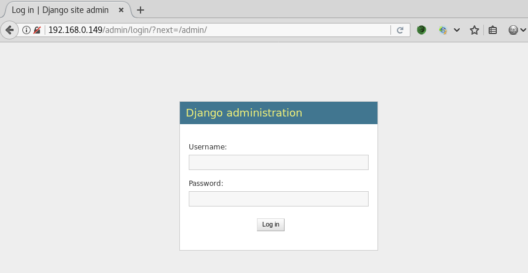
  

The dev directory reveals usernames we might use
 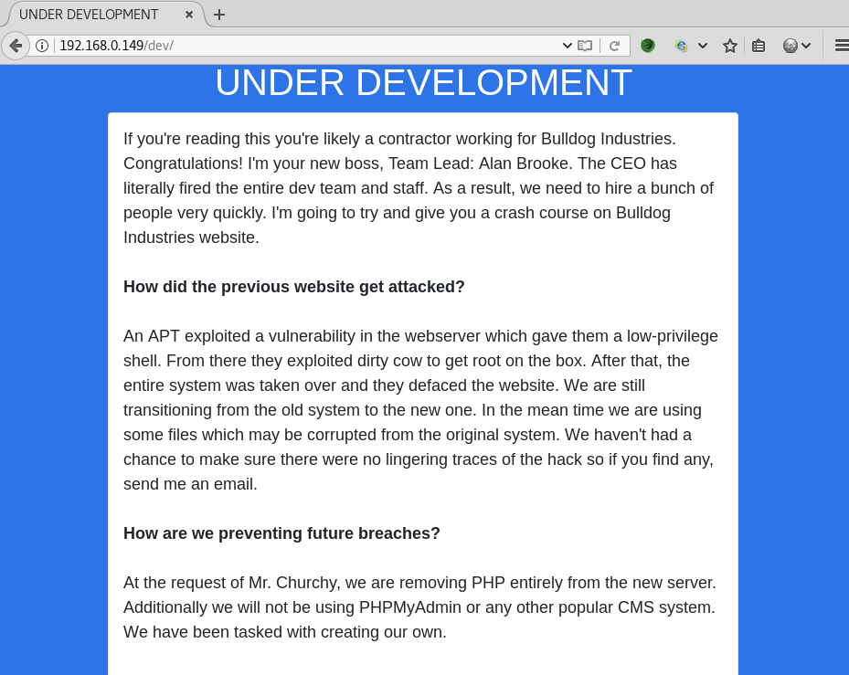
  

and the link to the shell directory
 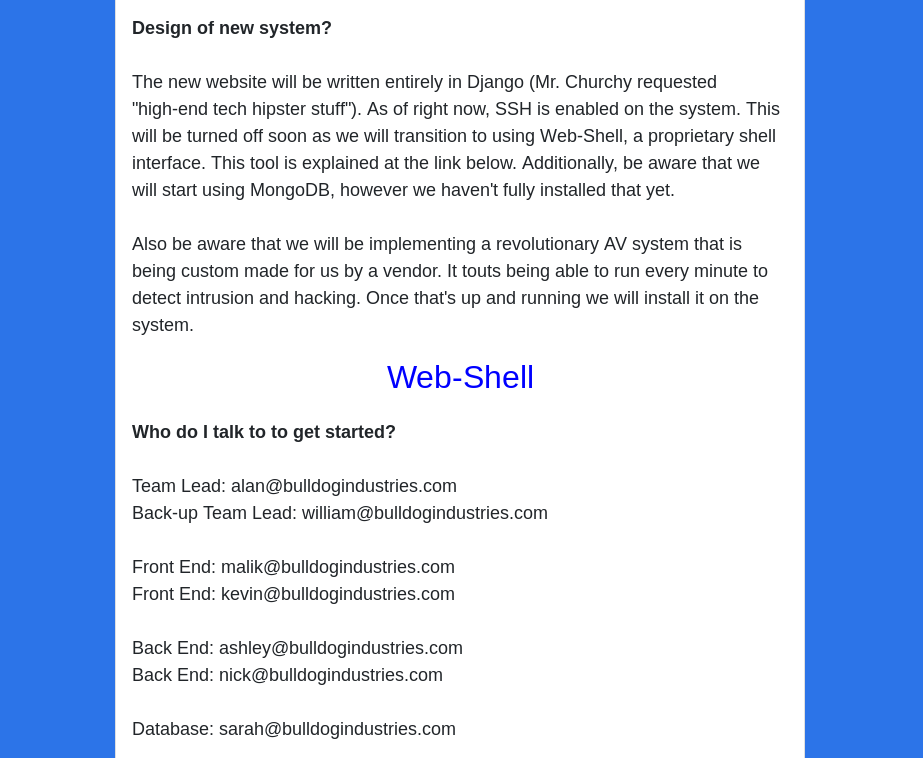
  

Seems we need to authenticate to django before we can use the web shell
 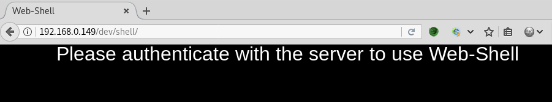
  

Looking at the source of dev directory reveals hashes for all the usernames
 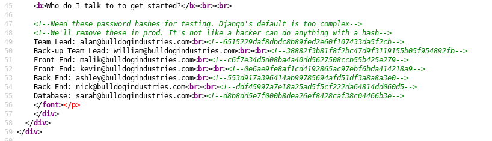
  

Running kali on a virt on my windows box, so switching to windows to run hashes against hashcat. This reveals two passwords that we can try against django
 
  

And we're in using nick:bulldog for credentials, but no privileges
 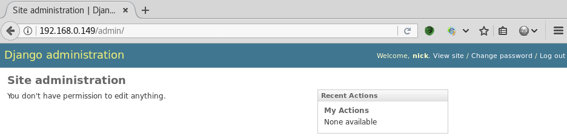
  

Checking the shell directory, looks like we now have a restricted shell to only a few commands
 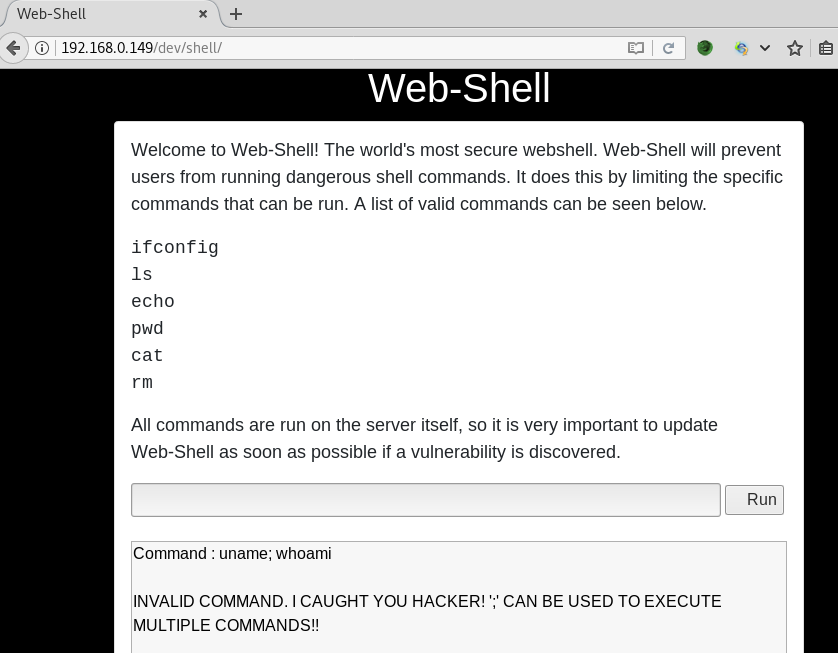
  

However it seems we're in as user django
 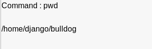
  

Searching around we find that we can access user bulldogadmin home directory and there is a hidden directory with two files
 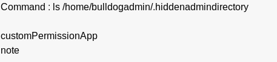
  

The note file reveals that the other file is a program that can give us root
 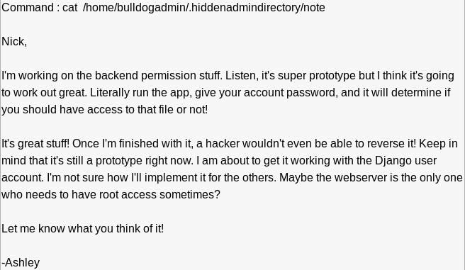
  

As always I overthink these things and wasted a bunch of time on other possibilities, turns out we can run commands using echo and passing them to /bin/bash through a pipe
 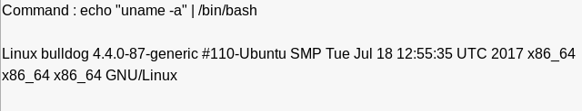
  

Needed a way to get the customPermissionApp off the system so I can take a look at it, so we copy it to the static web directory in order to download
 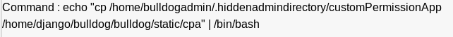
 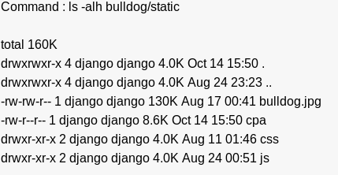
 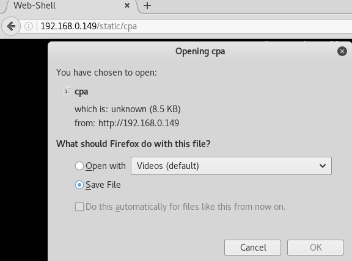
  

Executing the program gives instructions and actually spawns a new shell. Nothing too use to get on the box though
 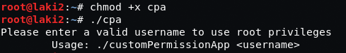
  

Throwing it at strings actually reveals what we need, a password SUPERultimatePASSWORDyouCANTget
 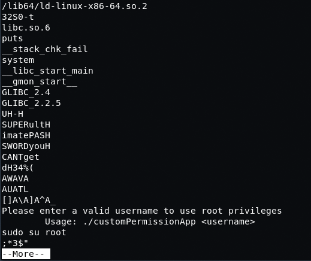
  

Using the found password we're able to SSH over port 23 as django
 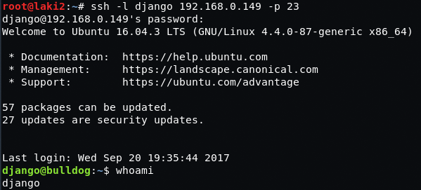
  

Simple sudo -i gives us root and the congrats.txt file
 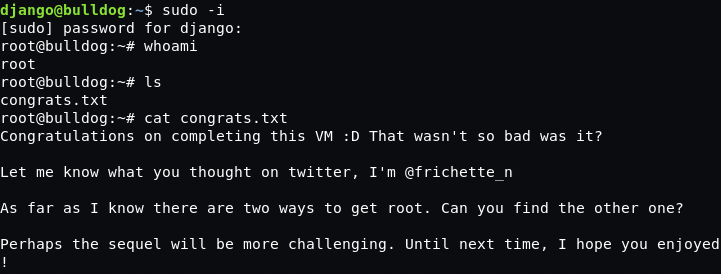
  

Another way to get root? The only other way I found was to copy customPermissionApp to tmp directory, make executable, and run to give root.  Not sure if that was it though.
 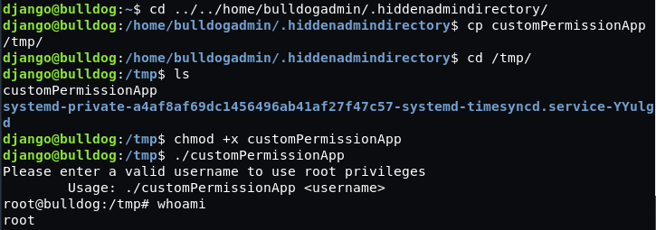
  