# JIS-CTF: VulnUpload

## Goal
Find 5 flags

## Download
[https://www.vulnhub.com/entry/jis-ctf-vulnupload,228/](https://www.vulnhub.com/entry/jis-ctf-vulnupload,228/)

## Walkthrough
**nmap**
 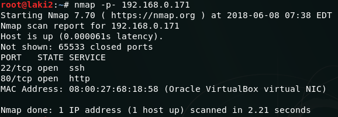
  **dirb**
 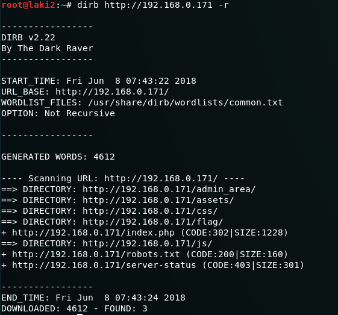
  **login form**
 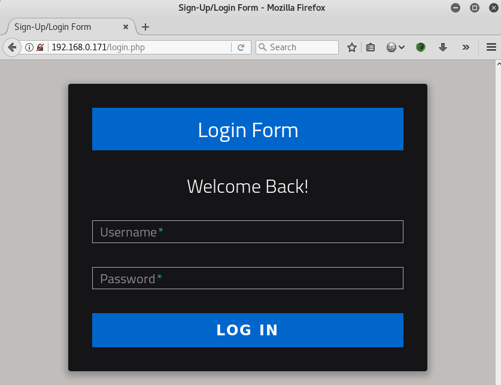
  **robots.txt reveals additional files/directories**
 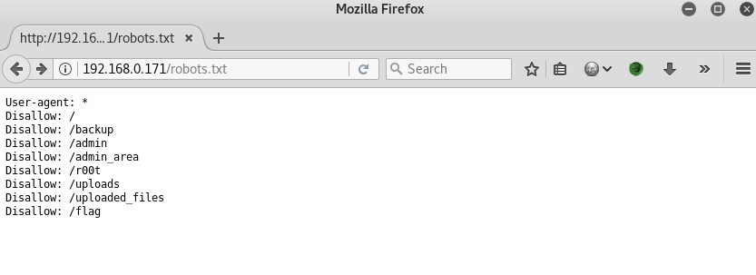
  **flag 1 found @ flag**
 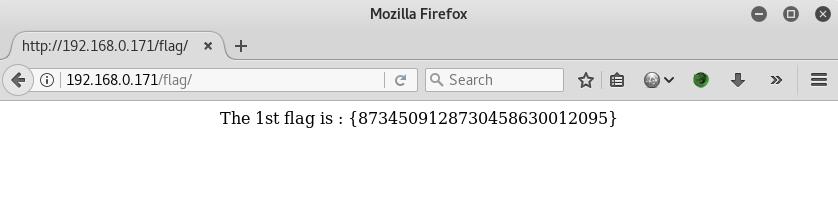
  **flag 2 found in fake admin area source**
 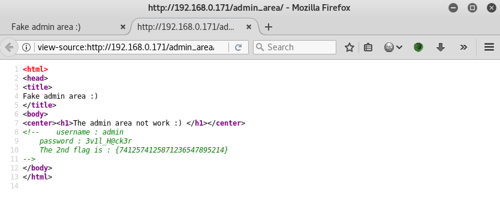
  **use credentials found from flag 2 to login, area to upload files revealed**
 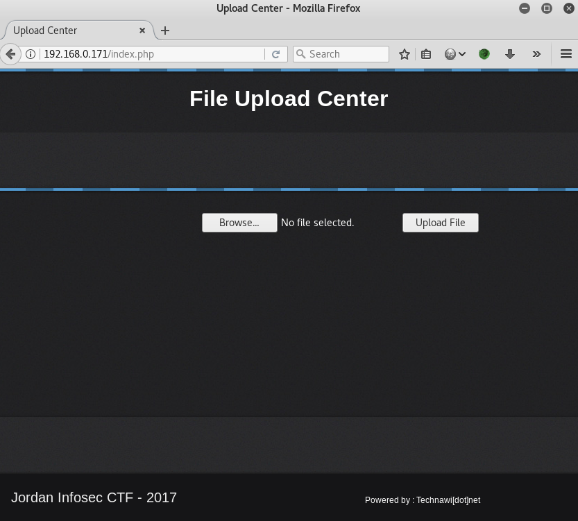
  **able to upload reverse shell php file**
 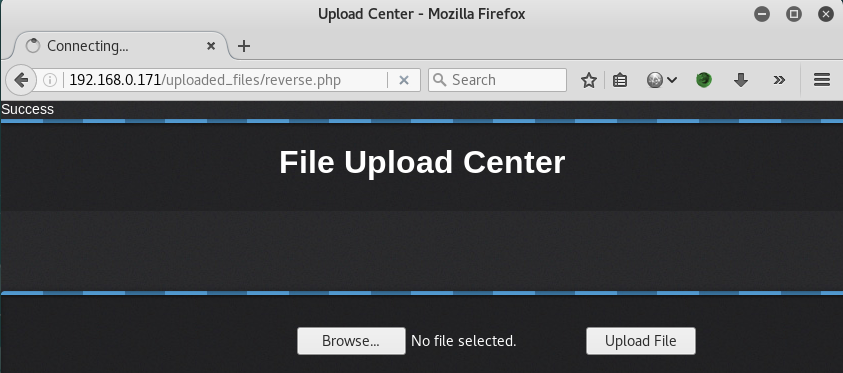
  **accessing uploaded php file under uploaded_files folder gives limited access shell**
 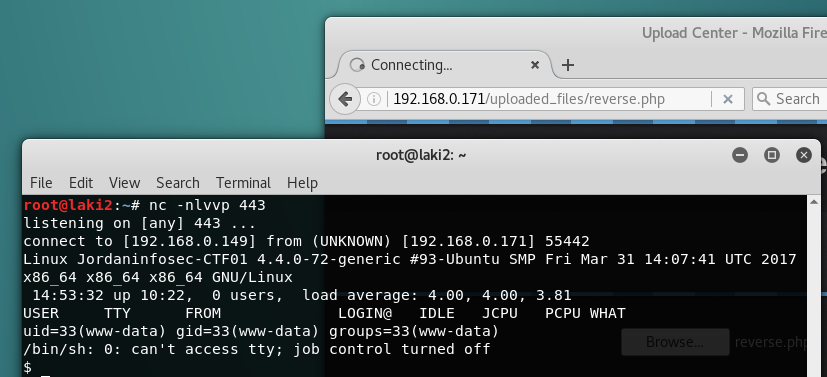
  **flag 3 found in hint.txt**
 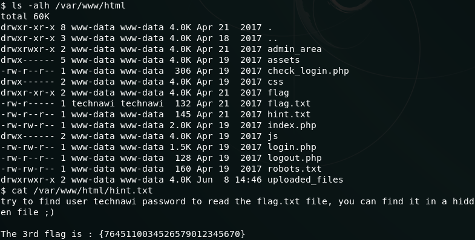
  **flag 4 found in txt file buried in mysql directory**
 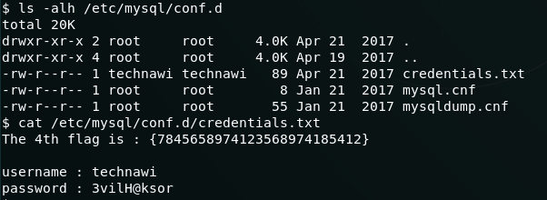
  **flag 5 found in flag.txt after using credentials to ssh as technawi**
 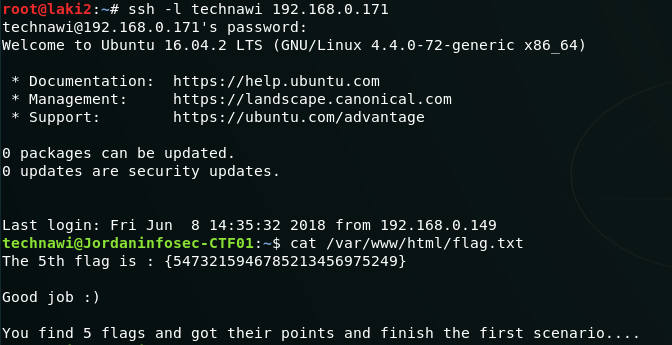
