# BSides Vancouver: 2018

## Goal
uid=0(root) gid=0(root) groups=0(root)

## Download
[https://www.vulnhub.com/entry/bsides-vancouver-2018-workshop,231/](https://www.vulnhub.com/entry/bsides-vancouver-2018-workshop,231/)

## Walkthrough
**nmap**
 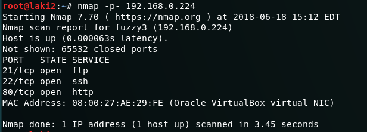
  **ftp allows anonymous access**
 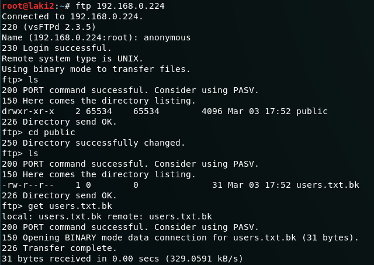
  **downloadable lists shows possible user accounts**
 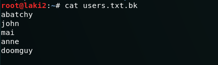
  **default webpage**
 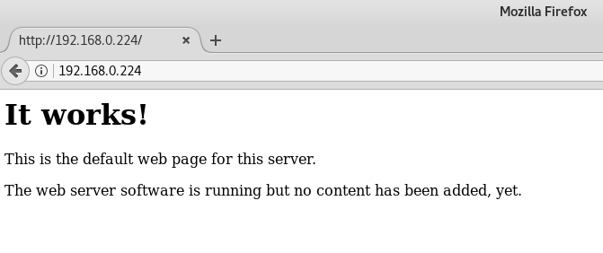
  **dirb**
 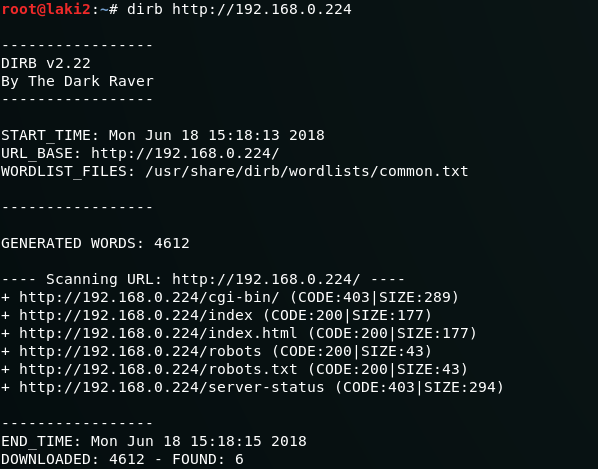
  **robots.txt**
 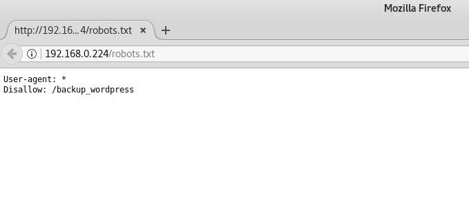
  **wordpress instance**
 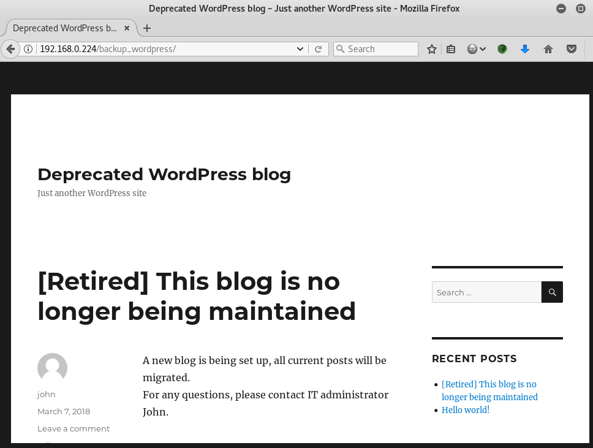
  **enumerate users using wpscan**
 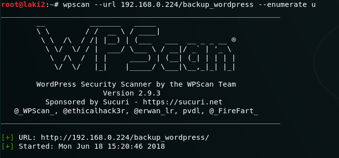
 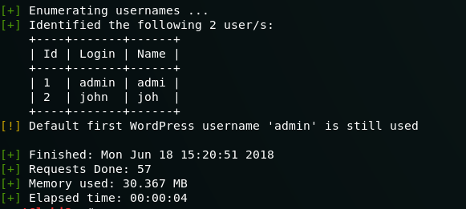
  **wfuzz password for john**
 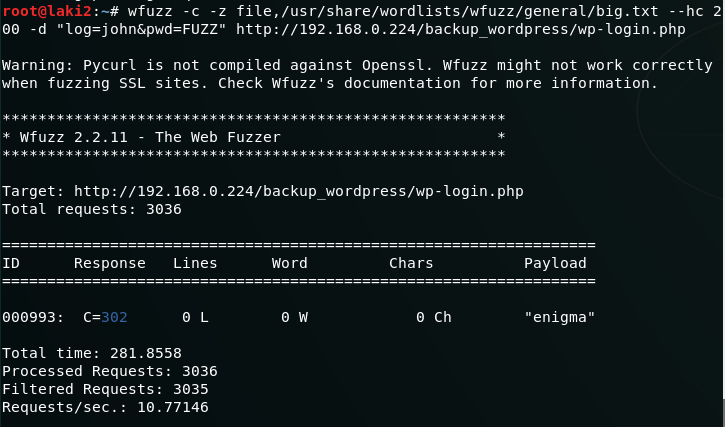
  **admin wordpress access granted using john**
 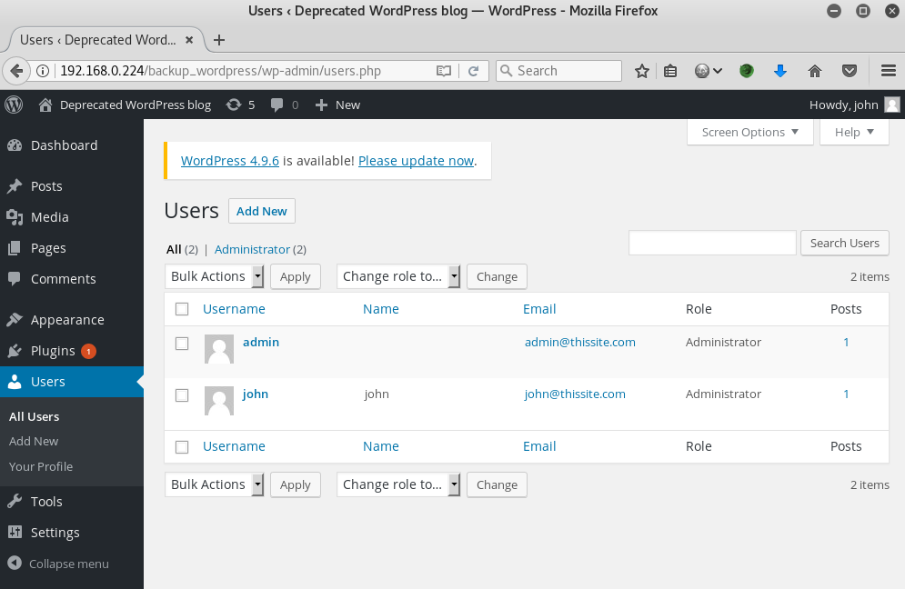
  **add reverse shell to footer.php**
 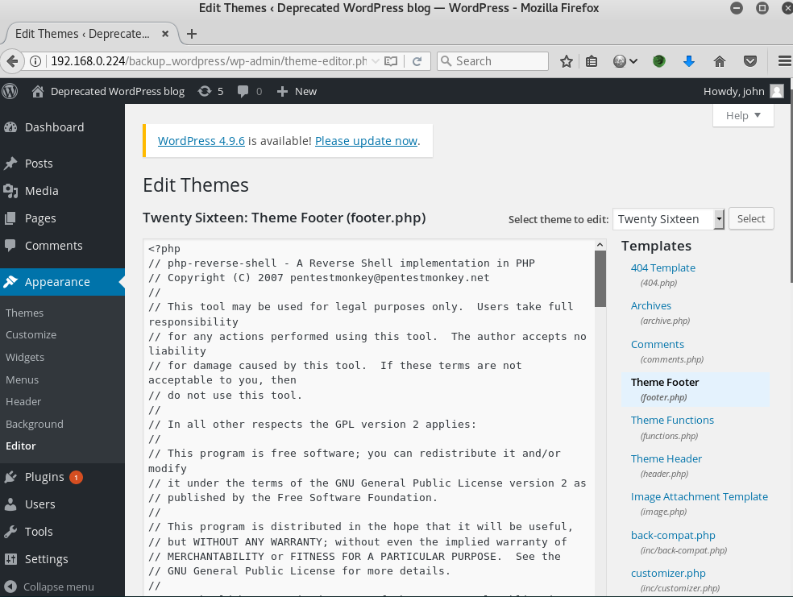
  **low privilege reverse shell**
 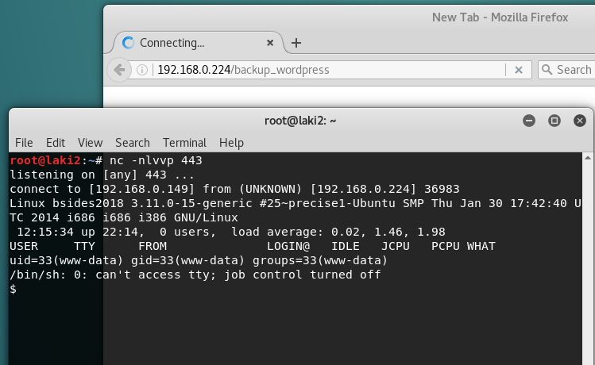
  **/etc/passwd confirms lists of users**
 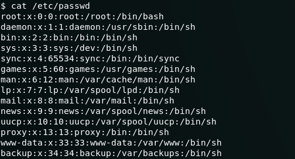
 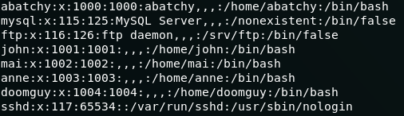
  **ssh config file shows all users except anne use a public key**
 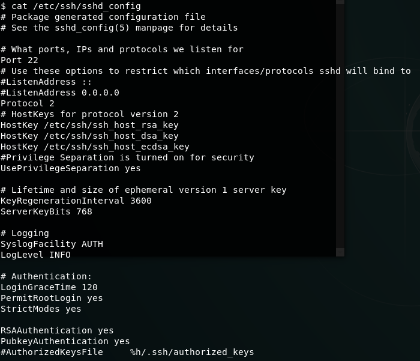
 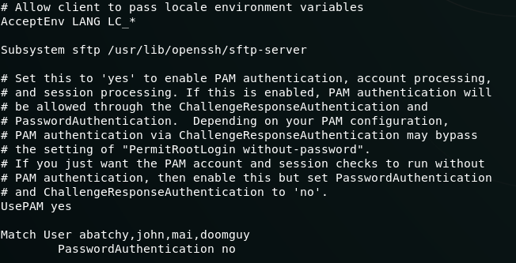
  **use hydra against ssh**
 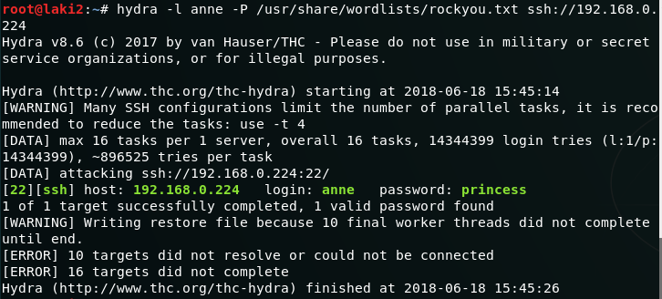
  **ssh as anne with found password**
 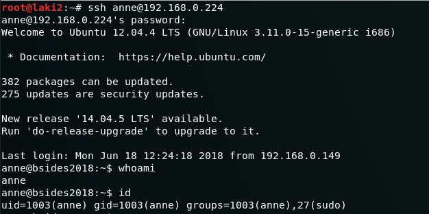
  **sudo gives root privileges & flag**
 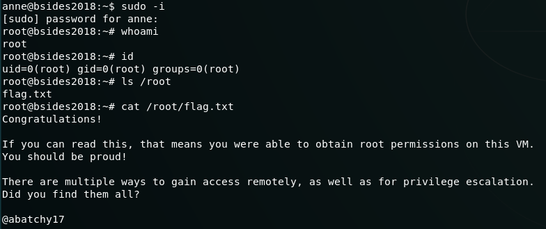
