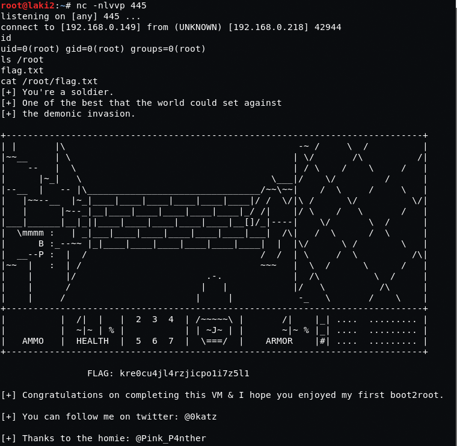

# Temple of Doom: 1

## Goal
root

## Download 
[https://www.vulnhub.com/entry/temple-of-doom-1,243/](https://www.vulnhub.com/entry/temple-of-doom-1,243/)

## Walkthrough
**nmap**
 
  **default 666 page**
 
  **refreshing the page we see express node.js with error**
 
  **burpe shows encoded cookie**
 
  **sending to decoder, it's passing username/token**
 
  **we find the error; a quote missing before Friday; adding and encoding again**
 
  **sending updated cookie, page works and we're greated with the username**
 
  **after much searching, this [post](https://opsecx.com/index.php/2017/02/08/exploiting-node-js-deserialization-bug-for-remote-code-execution/) seems like node.js deserialization is the right track** **as in the post, [nodejsshell](https://github.com/ajinabraham/Node.Js-Security-Course/blob/master/nodejsshell.py) is used to create reverse shell**
 
  **creating the payload as in the post, we then encode**
 
  **using repeater, we get our reverse shell as user nodeadmin**
 
  **another user does exist, fireman**
 
  **it's found that ss-manager is being run as fireman by root**
 
  **after some searching, this [post](https://github.com/shadowsocks/shadowsocks-libev/issues/1734) shows a bug and how to execute commands on ss-manager** 
**using this information, another reverse shell is created as user fireman**
 
  **we find that some commands using sudo can be run with no passwords**
 
  **after some searching, this [post](https://www.securusglobal.com/community/2014/03/17/how-i-got-root-with-sudo/) shows how to run commands with sudo and tcpdump**
 **using this information, a script is crafted for another reverse shell as root**
 
  **from here we get flag, game over**
 
  

