## Goal
2 flags ***or*** 2 flags & root

????

idk, got both flags & root...after a ***couple*** of reboots :)

## Download
[https://www.vulnhub.com/entry/blacklight-1,242/](https://www.vulnhub.com/entry/blacklight-1,242/)

## Walkthrough
**nmap**
 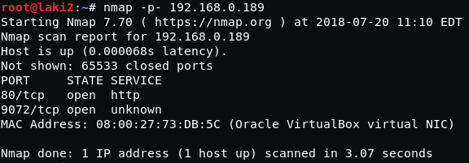
  **default 80**
 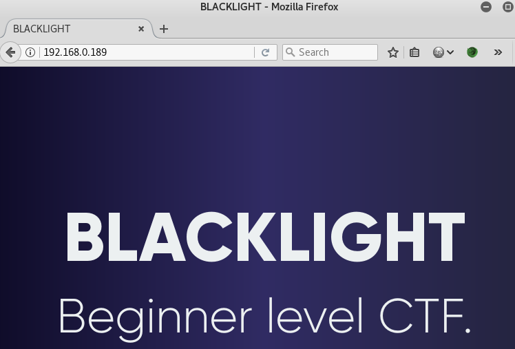
  **default 80 continued**
 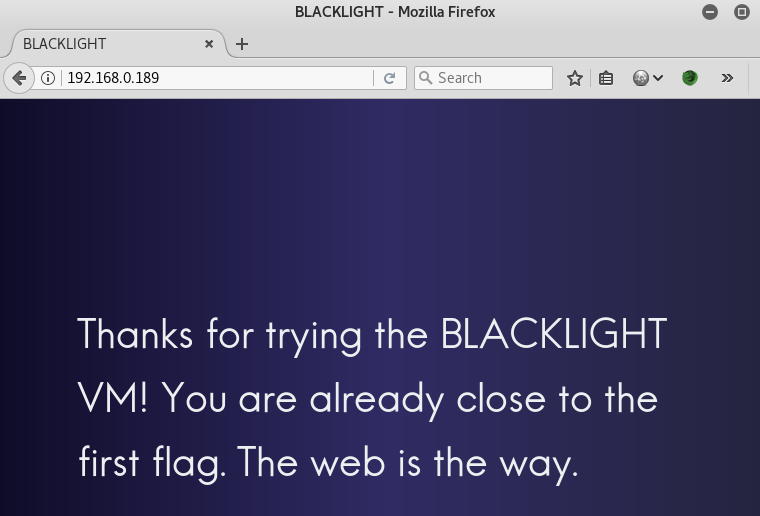
  **dirb**
 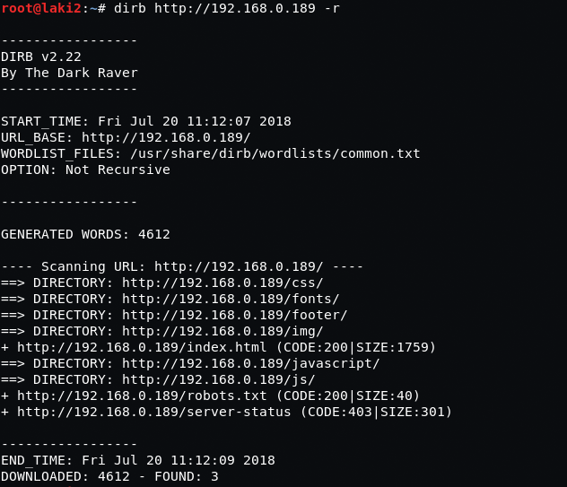
  **robots.txt**
 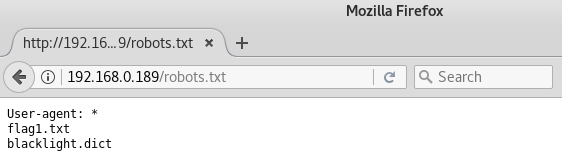
  **flag 1 and hint**
 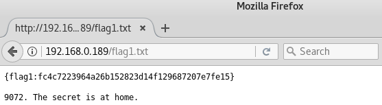
  **console on port 9072; allows 2 commands and shuts down**
 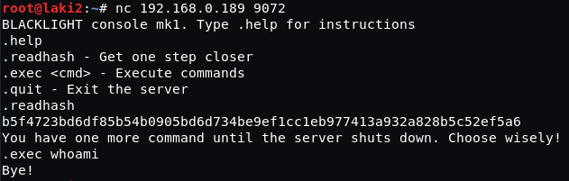
  ***annoying***, **let the reboots begin**
 
  **able to send command outputs to readable files from web**
 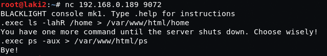
  **/home shows two interesting files, console.rb & flag2-inside.jpg**
 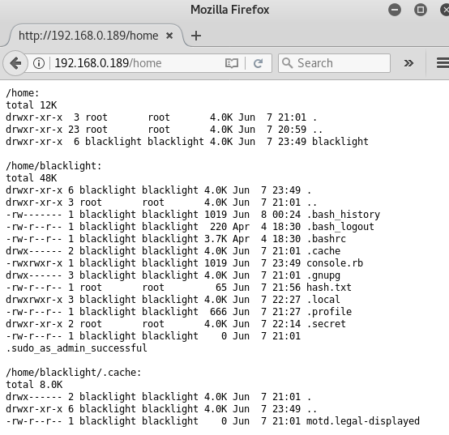
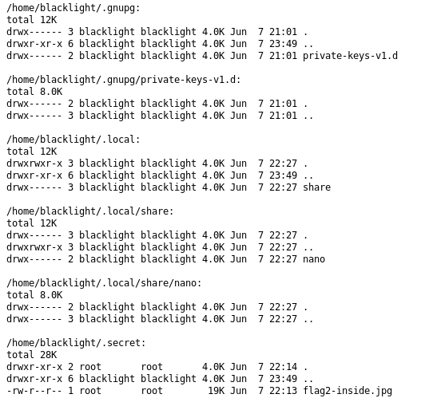
  **ps shows command to run ruby console**
 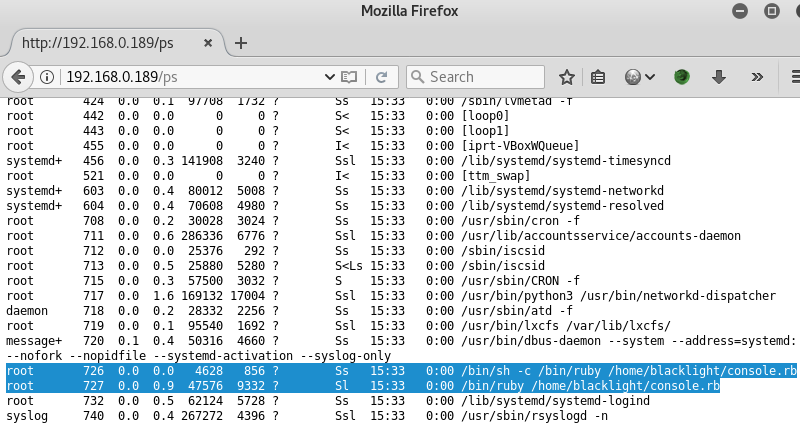
  **cp the flag2 image to be viewed via web**
 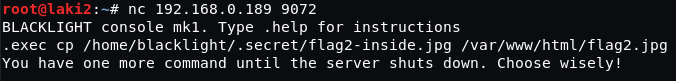
  **looks like we need to extract flag**
 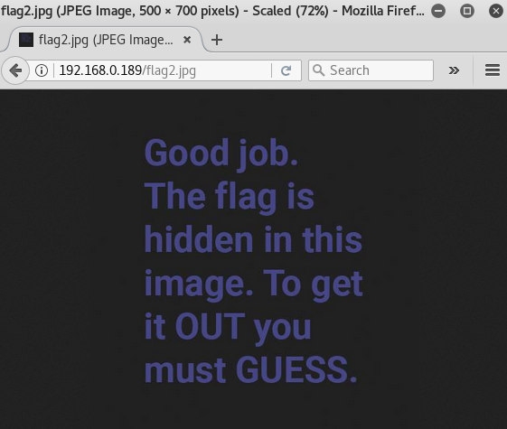
  **after strings, hexedit, steghide didn't work, the tool to use was hinted to us all along 'outguess'
 flag2 is revealed**
 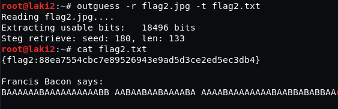
  **wasn't sure if root was necessary or possible so did it anyways
 using [this](https://github.com/secjohn/ruby-shells) ruby shell i got root**
 
