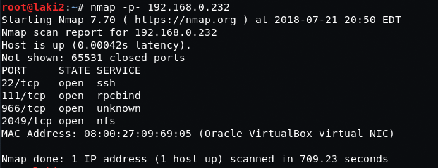
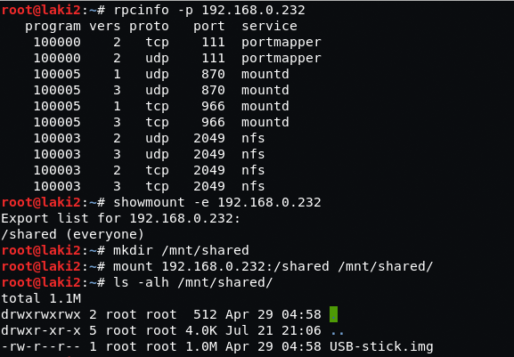
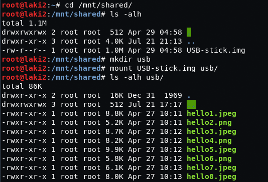
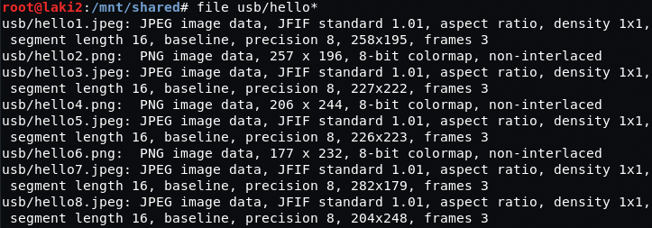
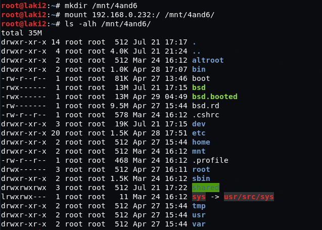
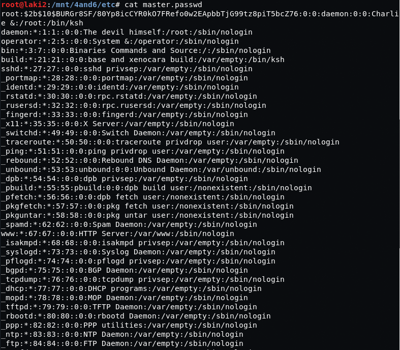
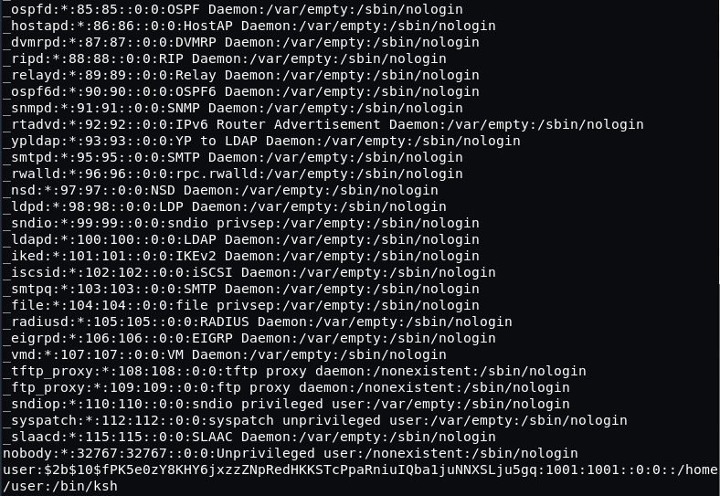
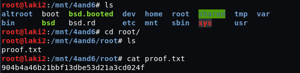

# FourAndSix: 1

## Goal 
proof.txt ?

## Download 
[https://www.vulnhub.com/entry/fourandsix-1,236/](https://www.vulnhub.com/entry/fourandsix-1,236/)

## Walkthrough 
**nmap**
 
  **seems an nfs share is available, can be mounted with a .img file inside**
 
  **mounting .img file, several .png and .jpeg images exist**
 
  **seem like all legit files, binwalk also found nothing**
 
  **after nothing else, tried mounting root of system...it was successful**
 
  **able to pull master.passwd file with root and user account hashes**
 

  **found proof.txt in root folder**
 
  
