## Goal
root flag

## Download
[https://www.vulnhub.com/entry/matrix-1,259/](https://www.vulnhub.com/entry/matrix-1,259/)

## Walkthrough
**nmap**
 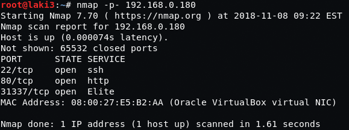
  
**default 80**
 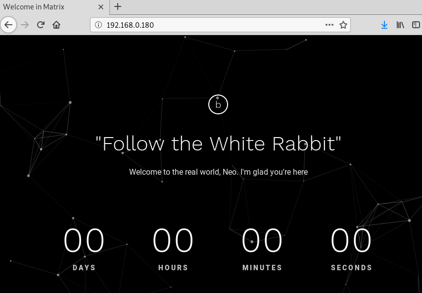
  
**default 31337**
 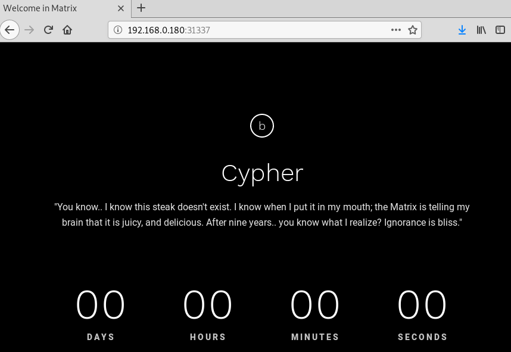
  
**source 31337**
 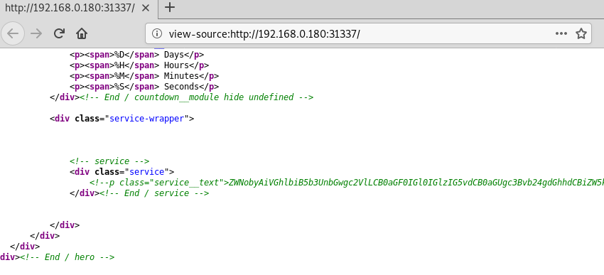
  
**decode string found in burp**
 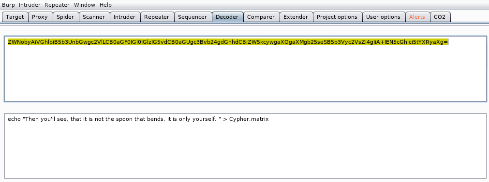
  
**guessed at using last part as a file name and it downloads**
 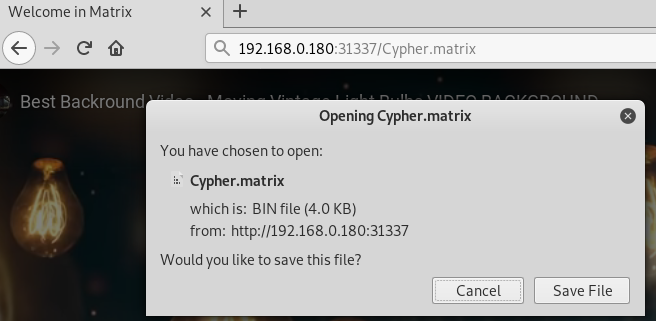
  
**checking file, looks like brainfuck**
 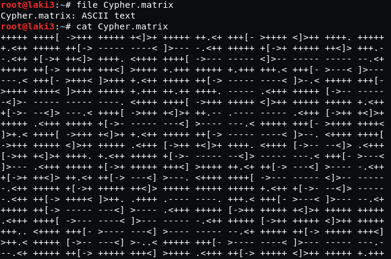
  
**decoded gives partial password for guest**
 
  
**wrote python script to generate random 2 characters and add to end of known password**
 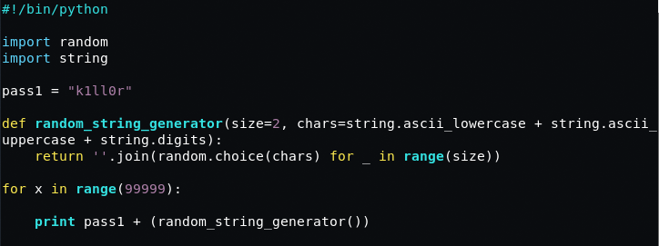
  
**generated a text file with lots of possibilities and ran with hydra**
 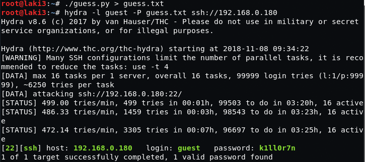
  
**ssh using found password; looks like a restricted shell**
 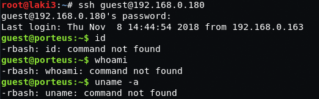
  
**tried the usual jail breaks, but failed**
 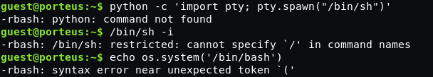
  
**seems that vi jail break works but with limited commands**
 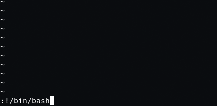
 
 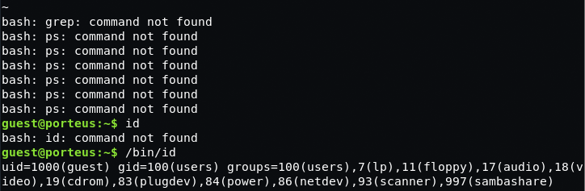
  
**updated with a regular path and commands now work normally**
 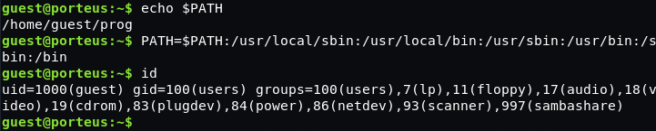
  
**see what sudo says; we can run all commands and get root lolz**
 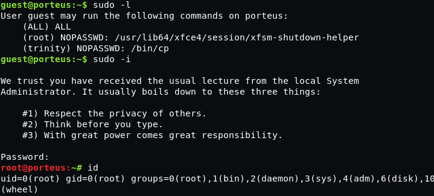
  
**root flag**
 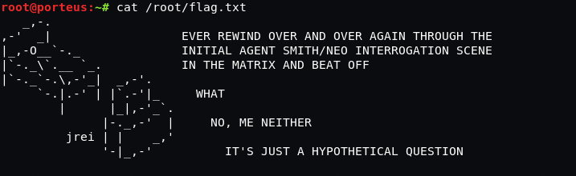
  
