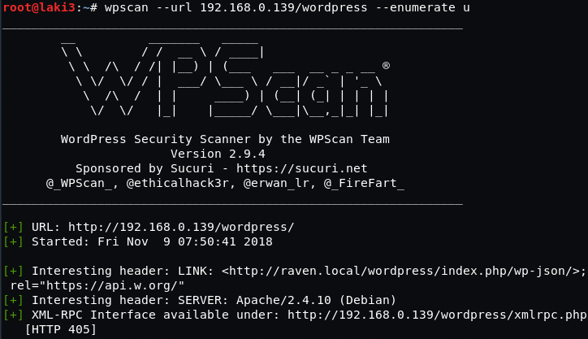
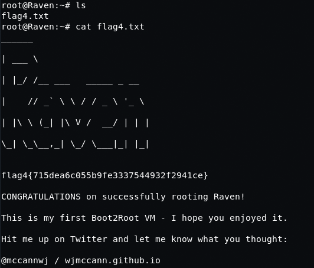

# Raven: 1

## Goal
4 flags / root

## Download
[https://www.vulnhub.com/entry/raven-1,256/](https://www.vulnhub.com/entry/raven-1,256/)

## Walkthrough
**nmap**
 
  
**detailed nmap**
 
  
**tested rpc but nothing there**
 
  
**dirb shows wordpress**
 
  
**found this out after the fact, had to add raven.local to hosts file for wp**
 
  
**default wp**
 
  
**wpscan enum finds two users**
 
 
 
**wpscan brute finds nothing; huge rabbit hole**
 
 
  
**only port left is ssh; tried hydra and creds found**
 
  
**ssh as michael**
 
  
**check etc/passwd; another user steven**
 
  
**check wp-config; find mysql root creds**
 
  
**grab hash for steven**
 
  
**run against john; find pass**
 
  
**elevate to steven; see that sudo python available; i am root**
 
  
**root errr flag 4; lolz forgot i was looking for flags :P**
 
  
**searched for remaining 3 flags and found**
 **flag 1 was in service.html**
 
  **flag 2 was in /var/www**
 
  **flag 3 was in mysql or maybe a post?**
 
 
