## Goal
3 flags / root

## Download
[https://www.vulnhub.com/entry/wakanda-1,251/](https://www.vulnhub.com/entry/wakanda-1,251/)

## Walkthrough
**nmap**
 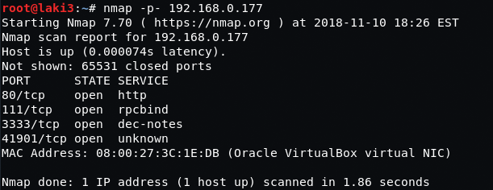
  
**nmap detailed; ssh on 3333**
 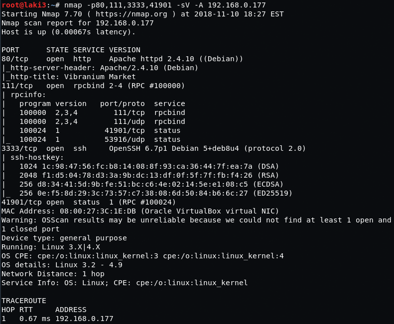
  
**showmount gives nothing**
 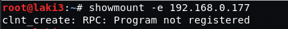
  
**dirb shows fake directories**
 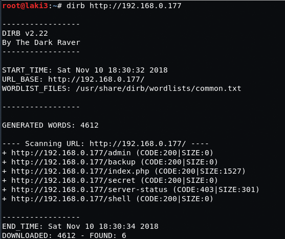
  
**also fake secret.txt :)**
 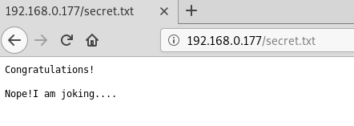
  
**default 80**
 
  
**source default 80 shows hidden code**
 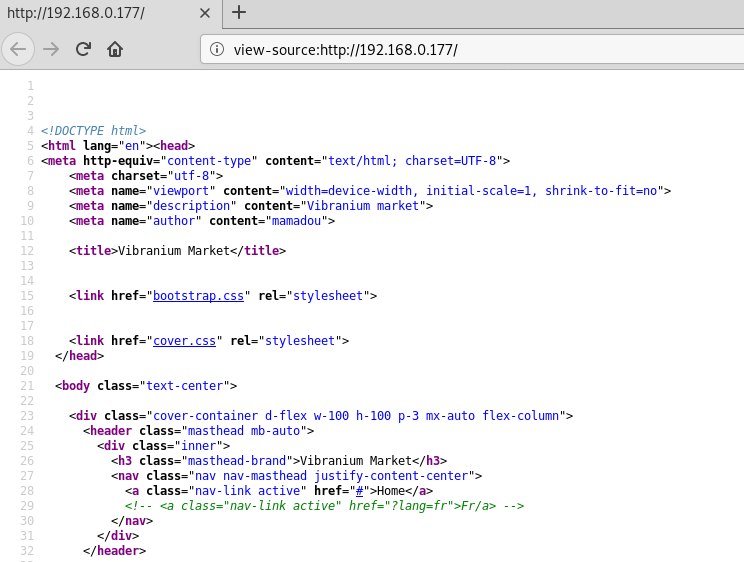
  
**hidden link is french version**
 
  
**knew there was an LFI, but it def took me some time to find** 
**found a great [writeup](https://www.idontplaydarts.com/2011/02/using-php-filter-for-local-file-inclusion/) on php://filter for local file inclusion which worked**
 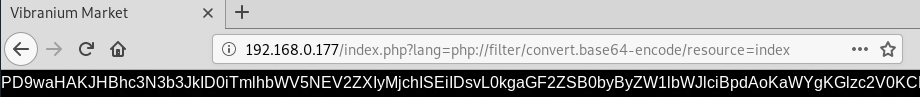
  
**putting that same request to curl gives us an easier string to copy**
 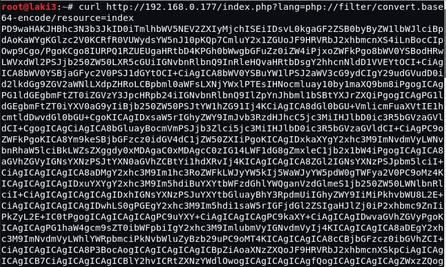
  
**decoded gives password :)**
 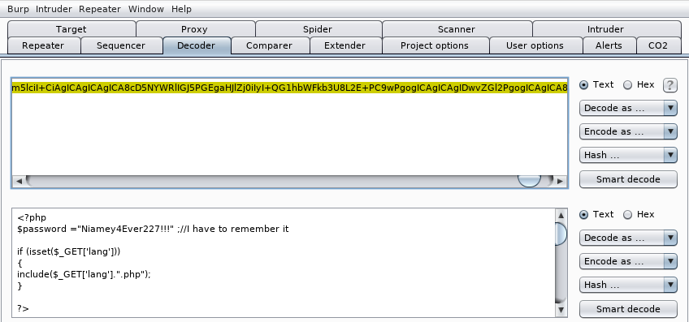
  
**with no username, trying the only one found on website works**
 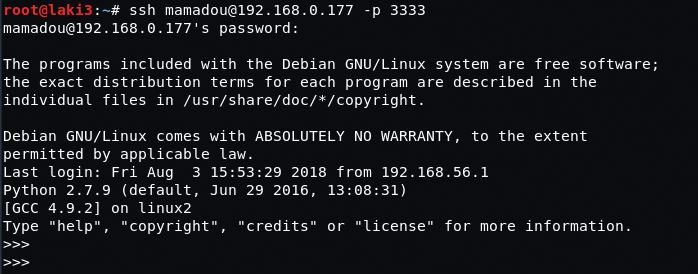
  
**ssh into python; break out to shell with some commands**
 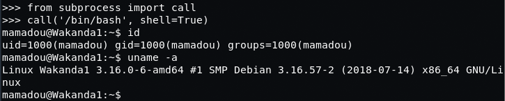
  
**flag 1 found**
 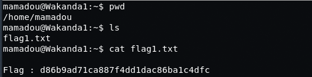
  
**etc/passwd shows other user devops**
 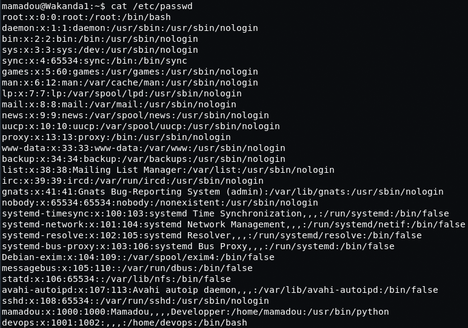
  
**per usual; move to /tmp and download python linux priv escalation script** 
**note the interesting test file found owned by devops with relatively current date/time**
 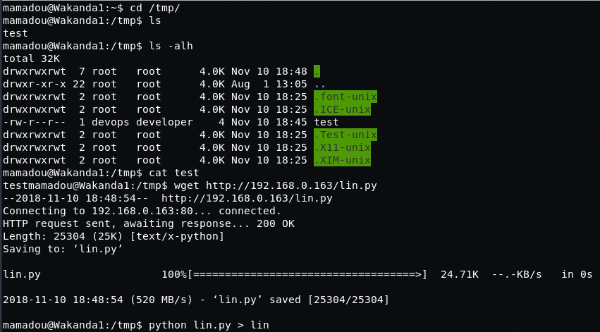
  
**searching the output for devops shows writeble file owned by devops in /srv**
 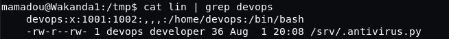
  
**viewing file it's a script that wrote the test file in /tmp** 
**assumption is this file is called every x minutes**
 
  
**update the script with a python reverse shell to our attacking machine**
 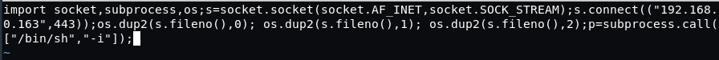
  
**nc listener on 443 is connected to after about 5 minutes as devops user**
 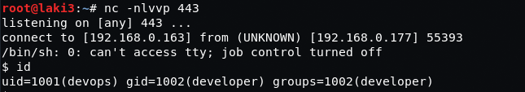
  
**flag 2 is found**
 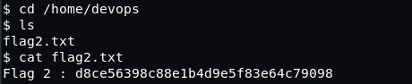
  
**looking at sudo, pip can be run with no password**
 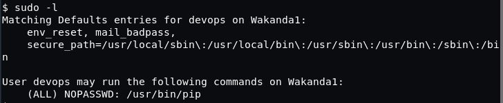
  
**familiar of this, looked up [fakepip code](https://github.com/0x00-0x00/FakePip), downloaded, and updated** 
**another listener was setup on attacking machine using port 444**
 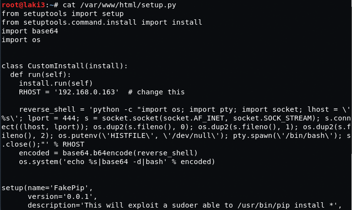
  
**on victim machine download updated python fakepip script and execute**
 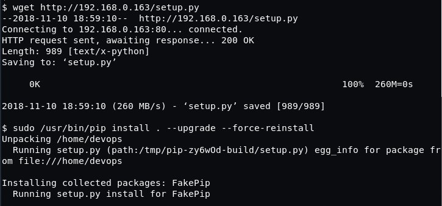
  
**with listener setup on attacking machine, reverse shell connects and root access acquired**
 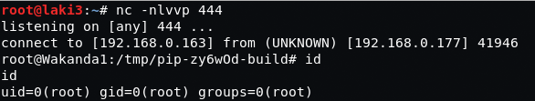
  
**root flag**
 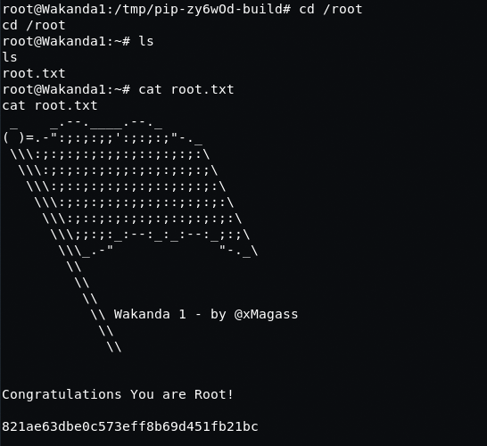
  
