While searching for buffer overflows in various software applications in an effort to better understand this type of vulnerability, I continued to come across overflows that were protected by the Structured Exception Handler (SEH) mechanism.  For many of these, I was able to find pointers that passed all criteria (no Rebase, no ASLR, etc) that could be used in order to bypass this protection.  However a large problem that caused me to stop developing an exploit and move on was due to the pointer’s address starting with a null byte "00" which is a bad character and not usable.

That was until I came across this [exploit database entry](https://www.exploit-db.com/exploits/40630) by [n30m1nd](https://twitter.com/NeomindMusic) where the null byte is used to their advantage.  The address used in this particular exploit started with a null byte, but was used to overwrite SEH with a pointer to a “POP POP RETN”.  The reason this works is simply explained by the author in that, "the null byte is added by default at the end because strings are null terminated when read from an input box".  From here nSEH is filled with a jump not forward, but rather back into the shellcode.  Nice. 

Intrigued by this, I managed to find a couple of applications where this method could be put into practice. There were varying degrees of difficulty amongst these. So to demonstrate this method I’m going to show an example with only two jumps and a couple of bad characters. 

Three space problems with this method that I have found that need to be considered.  First is the null byte essentially ends your payload, so you only have the length of the overflow (minus SEH and nSEH) for your shellcode.  Second is your shellcode space decreases as you have to take into account the length of the jump or jumps back to the start of your shellcode.  Third is that you can be limited on space for your jump code thus limiting how far you can jump.

**E-DB:** [46058](https://www.exploit-db.com/exploits/46058) 
**Vulnerable App:** [download](https://www.exploit-db.com/apps/6875ea0357dab3ea57d8af67cf67ad83-tsmanager_setup_3.1.0.238.exe) 
**Tested on:** Windows 7 SP1 x86 
**Assumptions:** familiar with regular SEH BoF and using [mona](https://github.com/corelan/mona)

## Offset / Bad chars
Skipping how to find offset @ 404
	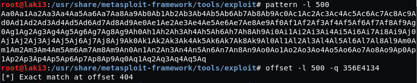

Skipping how to find bad chars, but they are:
	**\x00\x0d\x0e**

## PoC skeleton
Based on the known offset, we start with a PoC that will crash the app
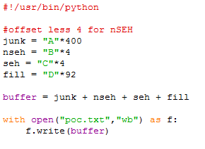

With the crash we’re able to see SEH fill with our C’s 
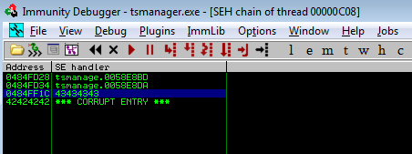

and finally overwrite EIP after taking the exception (Shift + F9)
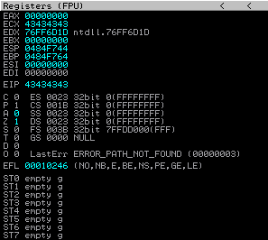

## Mona / SEH modules
Using mona, we look for pointers that are available to overcome SEH protection
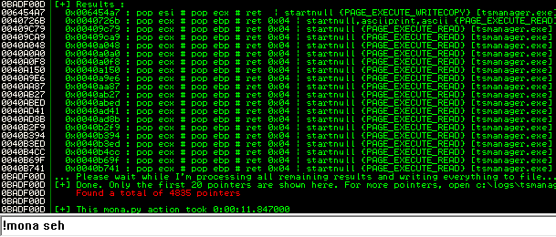

We find a bunch and the only module available to use starts with a null byte
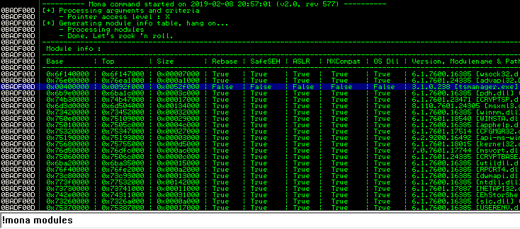

## POP-POP-RETN
Moving on we choose a PPR address to replace the C’s in our PoC and see if we can use it to return to our B’s (nSEH). We also need to remove the additional D’s and add a [:-1] to remove the null byte 
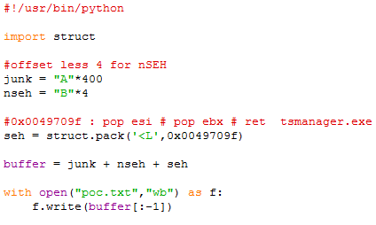

Before running the updated PoC, we add a breakpoint at our PPR address
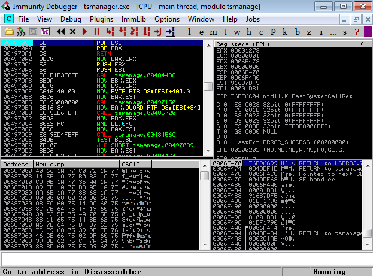

Sending our payload we hit our breakpoint after taking the exception 
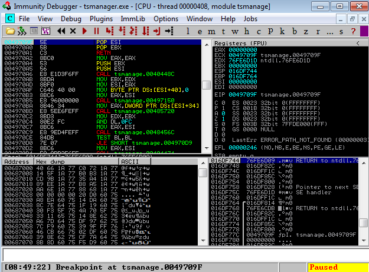

After stepping through (Shift + F7) the PPR we return to our B’s
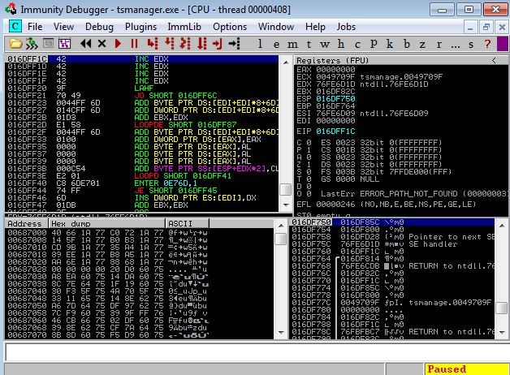

In a normal SEH BoF we would add a jump forward 6 and we’d land in our buffer to place our shellcode.  Since the PPR started with a null byte it ended our payload so we need to jump back into the 400 A’s available to place our shellcode.  Fun!

*Note, this method takes some patience, planning and math as you’ll need to account for size of jump(s) and shellcode.  Also for reference, this [post](https://thestarman.pcministry.com/asm/2bytejumps.htm) is my go to for forward and reverse jumps*

## First Jump
We now have 4 bytes to jump back and set the stage for our second jump back.  The first jump back should be short enough to save on space for our shellcode, but should be large enough to allow enough bytes to jump back a considerable amount.  A jump of 6 is a good amount.

After stepping through the PPR and landing in our B’s, we can manually edit the binary of our 4 bytes to test the jump back. 
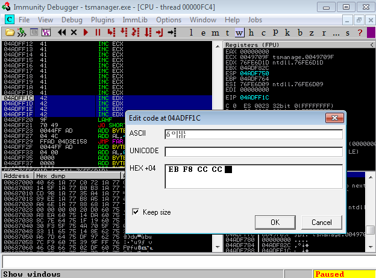

We also set a breakpoint 6 bytes back from our current breakpoint
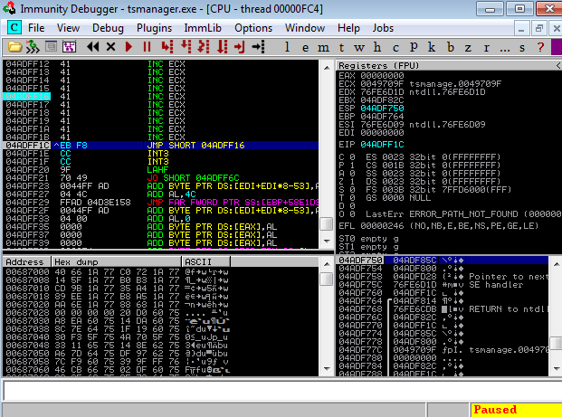

A quick step through we land 6 bytes back from our original B’s (nSEH)
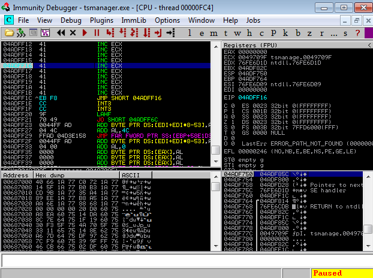

Before moving to the second jump, let’s update our PoC replacing our nSEH with our first jump 
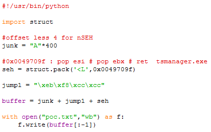

## Shellcode
So now we have 394 bytes for our shellcode and jump back into.  Prior to setting up the second jump we’ll need to figure out our shellcode size so we know where to jump. A simple calc shall do.

Generating our shellcode with msfvenom and remembering to account for bad characters, we find our shellcode size of 220 bytes
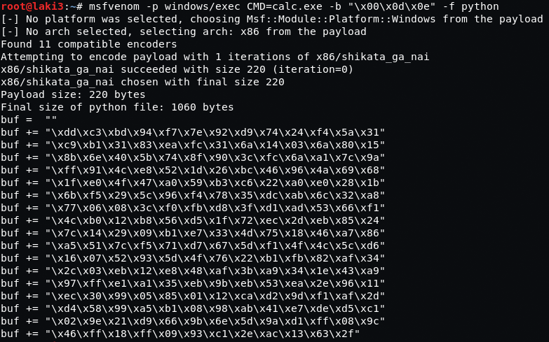

## Math
So here comes some math.  We know we have 394 bytes free and 220 bytes needed for shellcode.  Subtracting those two leaves 174 bytes.  This isn’t a very large jump back, but to conserve how much we have to jump we’ll sandwich our shellcode between the leftover bytes.

So what are we doing? 
- Our **junk(400)** will be split into **junk1(100)** and **junk2(74)** 
- Add our calc **shellcode(220)** between both junk1 and junk2 
- As a placeholder with C’s, we’ll add **jump2(6)**  

Let’s update our PoC with this information prior adding our second jump. 
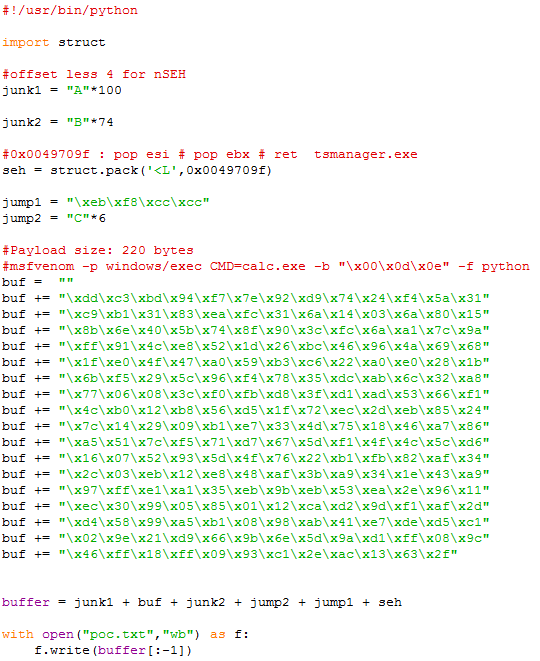

## Second Jump
After running our updated PoC and setting a breakpoint at 6 bytes back from nSEH.  These 6 bytes is where we’ll place our second jump, but before that we need to scroll back to view where our shellcode starts in order to know how far to jump.

*start of second jump*
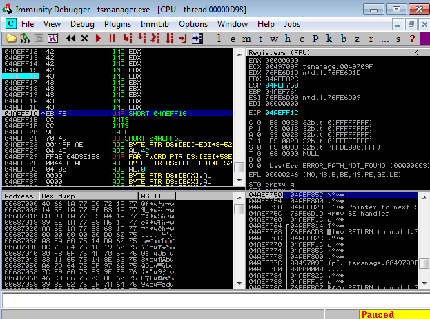

*start of shellcode*
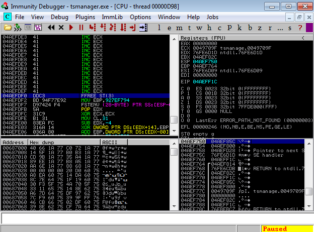

For this example, we are subtracting the start shellcode at **0x04aefdf0** from the start of our second jump at **0x04aeff16**.  Doing this math leaves us 294 bytes, which exactly how far we want to jump
	
*Addresses will change however the math should be the same. Important to note that we’re not using specific addresses for our PoC*

Now you’ll want to jump back a little further than the start of your shellcode, so we choose an arbitrary address of **0x04aefde6** or 10 bytes prior and set a breakpoint.  
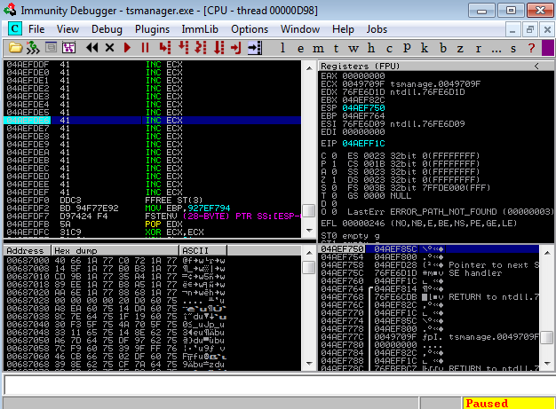

Going back to our second jump location, we manually edit the first byte in our 6 available to jmp to the address where we set our breakpoint 
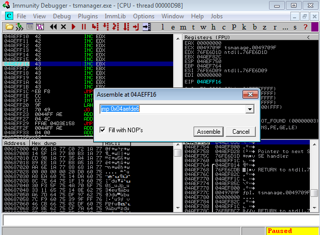

As you can see this uses up 5 of the 6 bytes and will jump back to the 10 bytes before our shellcode.  We make note of the binary added as we’ll need this to update our PoC also account for the 1 extra byte
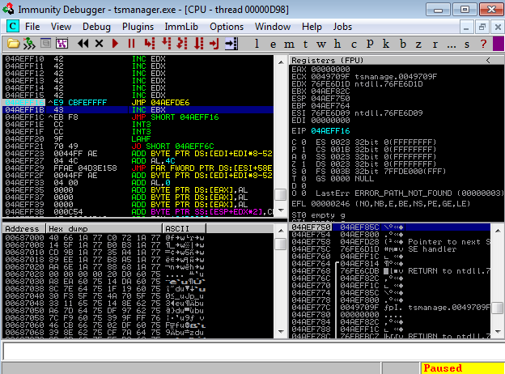

We step through and we land at our desired address 10 bytes before our shellcode
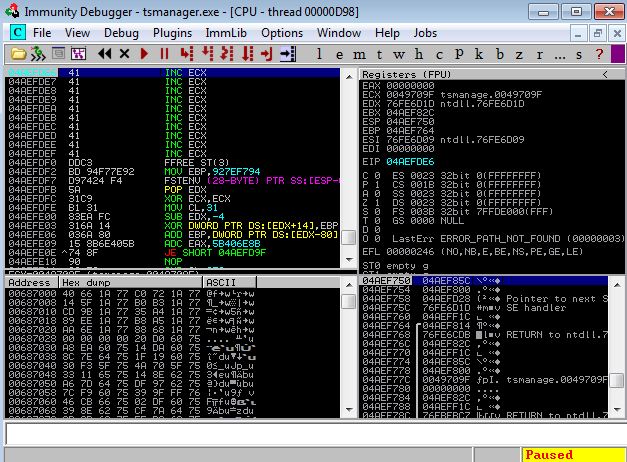

Let’s update our PoC with the second jump information
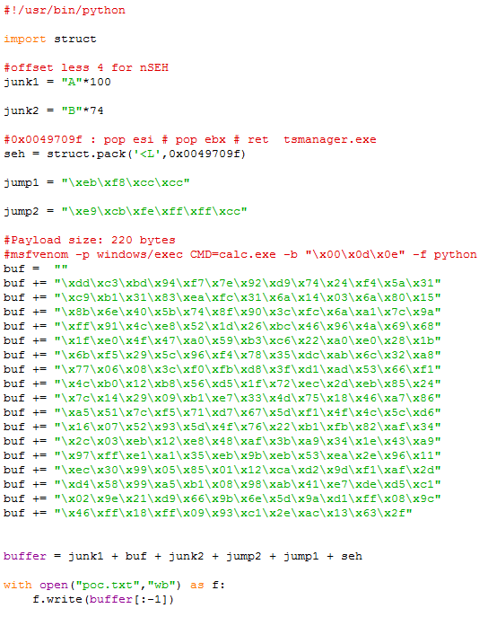

## Pop Calc
Running the newly updated PoC and after taking the exception and PPR we’re at our first jump, so we set a breakpoint at our second jump and the 10 bytes before our shellcode
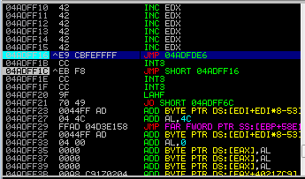 
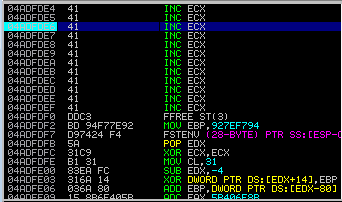

After stepping through twice we find ourselves 10 bytes before our shellcode
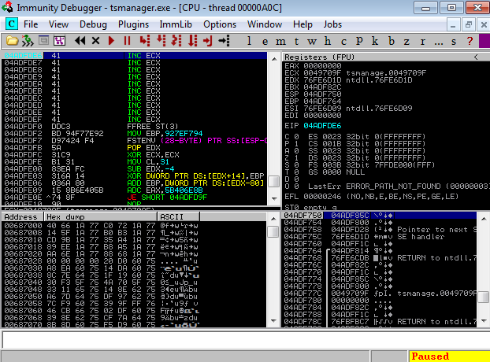

So now let’s see if we can pop calc. Hitting **Shift + F9** crashes the app and there it is
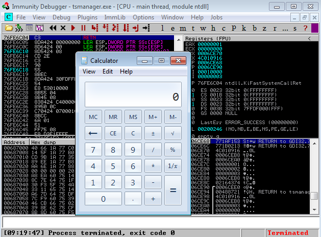

## Additional null byte finds
E-DB: [45071](https://www.exploit-db.com/exploits/45071) 
E-DB: [45151](https://www.exploit-db.com/exploits/45151) 
E-DB: [46021](https://www.exploit-db.com/exploits/46021)

## References
SEH: [Corelan](https://www.corelan.be/index.php/2009/07/25/writing-buffer-overflow-exploits-a-quick-and-basic-tutorial-part-3-seh/) and [FuzzySec](http://fuzzysecurity.com/tutorials/expDev/3.html) 
Concept: [n30m1nd](https://www.exploit-db.com/exploits/40630)  
Jumps: [Daniel Sedory](https://thestarman.pcministry.com/asm/2bytejumps.htm)

