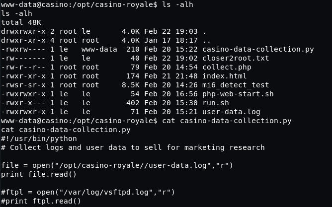

# Casino Royale: 1

## Goal #
root

## Download #
[https://www.vulnhub.com/entry/casino-royale-1,287/](https://www.vulnhub.com/entry/casino-royale-1,287/)

## Walkthrough #

**nmap**
 
  

**default 80**
 
  

**default 8081**
 
  

**nothing happens after post**
 
  

**dirb shows some interesting directors**
 
  

**cards...nothing**
 
  

**kboard...nothing**
 
  

**robots is cards and kboard...lol**
 
  

**trying index.php reveals a pokermax software**
 
  

**we find an admin page, but default checks don't work**
 
  

**we move to sqlmap**
 
  

**sqlmap success and we find the admin password**
 
  

**pokermax admin logged in**
 
  

**looking around, user valenka has some info in the profile**
 
  

**update /etc/hosts and browse to url, it's a cms**
 
  

**going through the posts, this one looks interesting seeing how port 25 is open**
 
   

**quick search on e-db reveals a csrf attack that looks like it could work**
[https://www.exploit-db.com/exploits/35301](https://www.exploit-db.com/exploits/35301)

**setup the crsf file and hosted on attacking machine through apache**
 
  

**setup for the email took some time trying to figure out the correct subject line, had to go one by one through the poker clients**
 
  

**final send email with a link to the crsf file**
 
  

**access log shows file is checked!**
 
  

**attempt to sign-in with creds provided in crsf file**
 
  

**success! in as admin**
 
  

**wasted a lot of time looking for places to add php code, ends up there were details in a user profile again**
 
  

**browsing to the new url, it's a file directoy**
 
  

**browring to main.php, nothing special**
 
  

**but we find interesting notes in the source**
 

**setup xml.txt and curl command**
 
  

**running reveals /etc/passwd**
 
  

**now we have users, know that ftp is open and from the comment in the ultra source that it's an easy password.  through hydra at it...success**
 
  

**ftp access is successful, however we cannot do much. cannot upload, but can make directories**
 
  

**after some playing around, we can upload just without extensions :)**
 
  

**however we cannot add .php extension, but .php5 worked**
 
  

**we setup our netcat listener and browse to the file, but nothing happens. looking we need to add permissions to the file, we just 777 it**
 
  

**we revisit the file in the browser and we have a reverse shell**
 
  

**quickly find valenka password for mysql**
 
  

**able to elevate to user valenka after breaking out of jail. after much searching, elevation didn't help though**
 
  

**back as www-data, searched and found an interesting suid file and directory**
 
  

**running the suid file it seems it's pulling network stats and processes, most likely using run.sh**
 
  

**from here we need to become user le, so we look at some of the servered by the webserver. it shows index.html calls collect.php**
 
  

**we see it's calling the python script and we see it's editable by www-data. it's currently reading a log file, but perhaps we can change that to a reverse shell?**
 
  

**we know we can access these files via that 8081 port. looking more closely we see that the web server at this port is run by user le**
 
  

**first let's create the new python script containing our reverse shell**
 
  

**next we download the file to /tmp**
 
  

**then we echo that file into the existing python script and overwrite the contents. we do a cat to verfiy as well**
 
  

**we setup a netcat listener on the new port, browse site and trigger the python script...we have a reverse shell as user le!!**
 
  

**so now back to the run.sh file, we take a look and we see it's just netstat and ps commands**
 
  

**well we own the file, let's chmod and append a /bin/sh**
 
  

**with that let's run mi6...and we root**
 
  

**moving to /root/flag folder we see a script flag.sh, which when run tells us to open to a url**
 
  

**nice**
 
  

