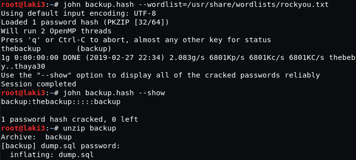
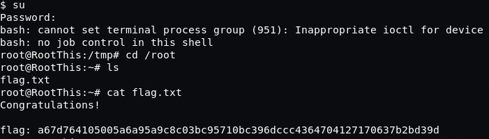

# RootThis: 1

## Goal #
root

## Download #
[https://www.vulnhub.com/entry/rootthis-1,272/](https://www.vulnhub.com/entry/rootthis-1,272/)

## Walkthrough #

**nmap**
 
  

**default 80**
 
  

**dirb, we find a backup file and drupal**
 
  

**backup file downloaded, it's a zip file and password protected** 
**throw it at zip2john for a hash to crack**
 
  

**we find the password and unzip the sql file**
 
  

**quick cat on the file reveals two usernames at the end of the file**
 
  

**search for webman in the file reveals a hash**
 
  

**throwing it at john we find a password**
 
  

**switching to drupal**
 
  

**login works**
 
  

**knowing drupal we need to enable php filter first**
 
  

**next create a basic page with our revshell code**
 
  

**ensure we change format to php**
 
  

**after setting up our listener and visiting the page, we have a reverse shell**
 
  

**quick search there is a user 'user' with a message in the home dir**
 
  

**searching around we're stuck, nothing works. no tty, python, ssh, and no way to escalate**
 
   

**after some googles i came across socat from this post**
[https://gtfobins.github.io/gtfobins/socat/](https://gtfobins.github.io/gtfobins/socat/)

**download socat to box using wget and make it executable**
 
  

**setup our socat listen on attacking machine**
 
  

**send our socat payload**
 
  

**and we connect as www-data, but we can su!**
 
  

**back to the message where it's state root password is within the first 300 of rockyou** 
**we put those to a file and...honestly i started from the bottom focusing on any with numbers**
 
  

**and...second guest worked :) root**
 
  
