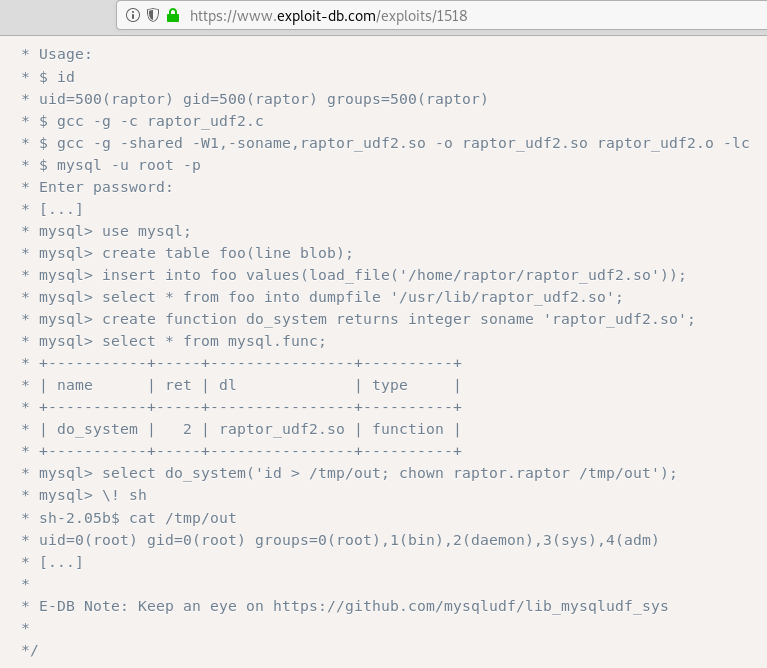

## Goal #
4 flags

## Download #
[https://www.vulnhub.com/entry/raven-2,269/](https://www.vulnhub.com/entry/raven-2,269/)

## Walkthrough #

**change etc/hosts and run nmap**
 
  

**default 80, same as raven 1**
 
  

**dirb shows a wordpress instance (same as raven 1) and a vendor directory**
 
  

**default wordpress instances with 1 post** 
 
  

**2 interesting notes from wpscan. shows a user michael (same as raven 1) and uploads folder is browsable **
 

  

**uploads folder shows flag 3, nicely done out of order on my part**
 

  

**checking vendor directory, PATH file stands out due to modified date**
 
  

**PATH file holds flag 1**
 
  

**i admittedly moved on from here and tried to brute ssh/wordpress, but with no luck** 
**and after much other enumeration couldn't find anything  

**i did however find a form page at contact.php but initially thought nothing off it**
 
  

**looking back at the vendor folder though, it dawned on me that the contact page was probably 
**related. so we know we're using PHPmailer and we have the version being used**
 
  

**went to google and found what i was looking for**
 
  

**2nd google result [40974](https://www.exploit-db.com/exploits/40974) looked promising, so we copy over to update**
 
  

**looking at the exploit we know we need to update the script, setup a listener, and run with python3**
 
  

**we update the target to be the contact.php url, needed to change the backdoor to a new name rather than the original** 
**then just update the attacker's ip, the path to the backdoor file, and the backdoor file name**
 
  

**with our listener setup for a connection on 4444 we run the exploit** 
**however we need to install 'requests_toolbelt' first**
 
  

**sending again, it works**
 
  

**we browse to the backdoor file and check out listener, reverse shell is working**
 
  

**looking around we find flag 2 just above the web directory like in raven 1**
 
  

**check the wordpress wp-config and we have mysql root password**
 
  

**we first escape the jailed shell so we can login to mysql properly** 
**checking the database, we find password hashes for the wordpress users**
 
  

**we're able to crack a hash with john**
 
  

**unfortunately it doesn't allow system access, but rather wordpress as steven** 
**we find flag 3 again**
 
  

**my normal enumeration includes running [this script](https://www.securitysift.com/download/linuxprivchecker.py) if possible to find ways for escalation** 
**download, run with saving to file for review**
 
  

**rare to see the exploit suggestions be used for vulnhub vms, but after lots and lots of enumeration nothing was found** 
**and i started to investigate the suggestions.  turns out the mysql exploit was a viable candidate**
 
  

**looking at [exploit-db exploit](https://www.exploit-db.com/exploits/1518), seems you can read a file as root**
 
  

**we copy the exploit to prepare to transfer to the victim machine** 
**slight error with copy and paste where a one should be a lowercase l**
 
  

**transfer the .so file to the victim machine**
 
  

**then we just follow the rest of the instructions with the goal of reading flag4.txt in root folder**
 

  

**exploit worked and we have flag 4**
 
  