## Goal #
4 flags + root flag

## Download #
[https://www.vulnhub.com/entry/dc-1-1,292/](https://www.vulnhub.com/entry/dc-1-1,292/)

## Walkthrough #

**nmap**
 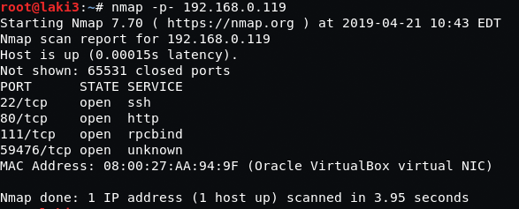
  

**default 80, drupal**
 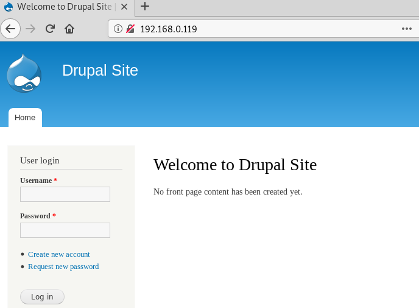
  

**nikto shows drupal 7...version file wasn't found, so drupageddon maybe?**
 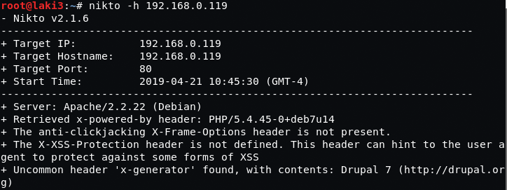
  

**setup metasploit for drupageddon**
 
  

**and we have a shell and flag 1**
 
  

**we check out drupal settings.php for db creds, we also get flag 2**
 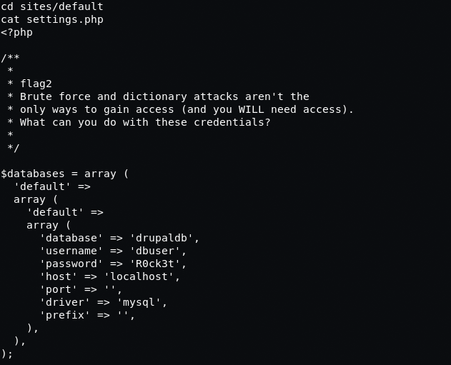
  

**use the creds to get drupal user hashes**
 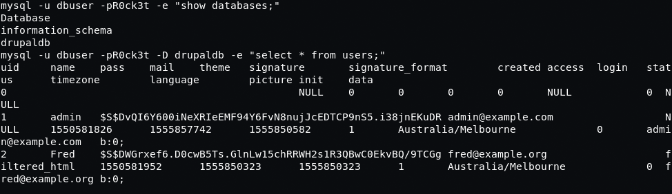
  

**throw hashes at hashcat and get passwords**
 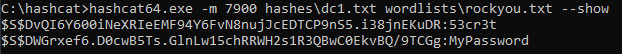
  

**flag 3 is found after logging in as admin**
 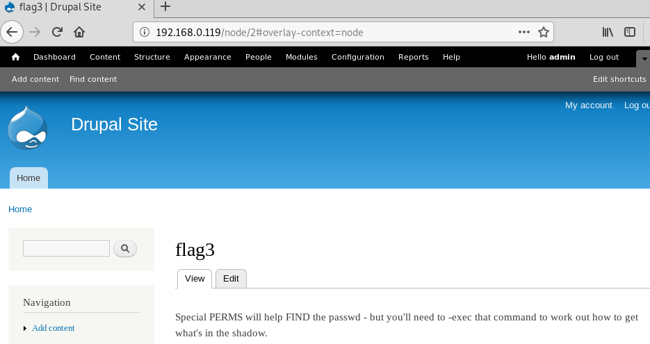
  

**with meterpreter shell there's a user flag4 and we find flag 4**
 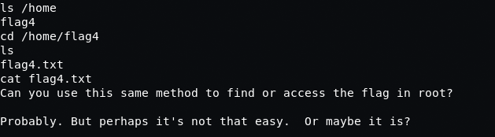
  

**with flag 3 hint we see find has suid set**
 
  

**we're able to use this to read shadow file**
 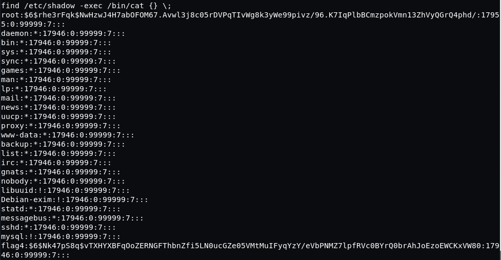
  

**throw that hash at hashcat and find password**
 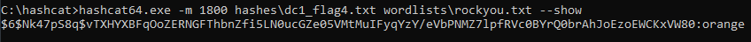
  

**ssh as flag4 user**
 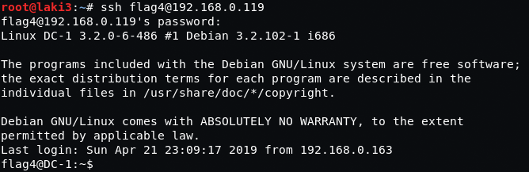
  

**use find to list root directory and get root flag name**
 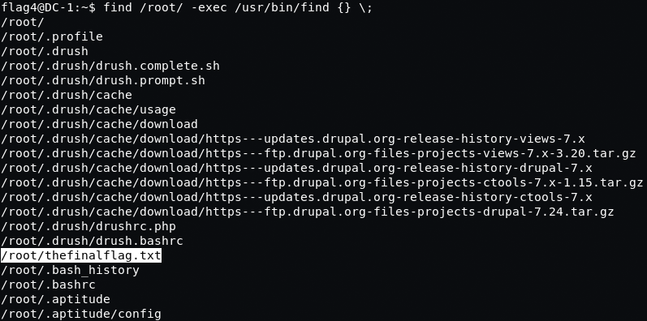
  

**final flag**
 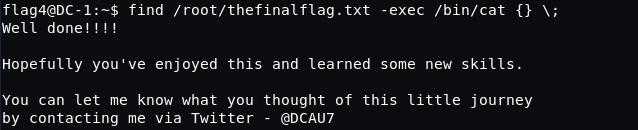
  