## Goal #
4 flags + root flag

## Download #
[http://www.five86.com/dc-2.html](http://www.five86.com/dc-2.html)

## Walkthrough #

**nmap**
 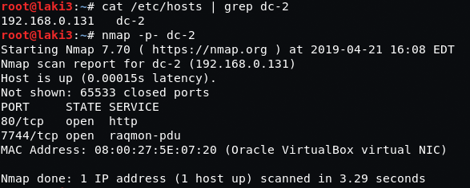
  

**default 80, wordpress with flag post**
 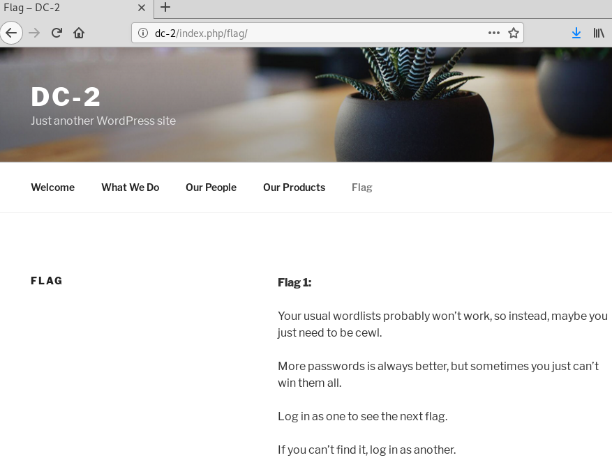
  

**quick wpscan enumeration for users**
 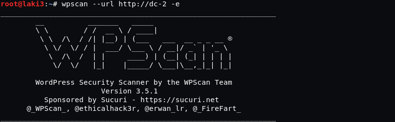
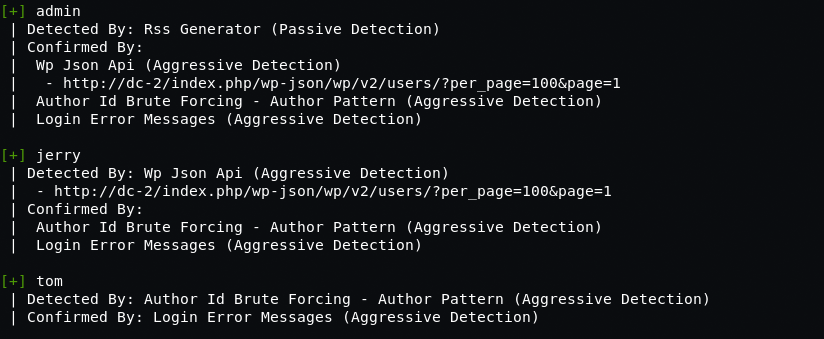
  

**using cewl to build a wordlist and create user list**
 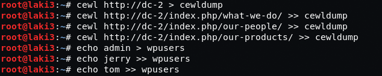
  

**we use wpscan password attack with our lists and find passwords for tom and jerry**
 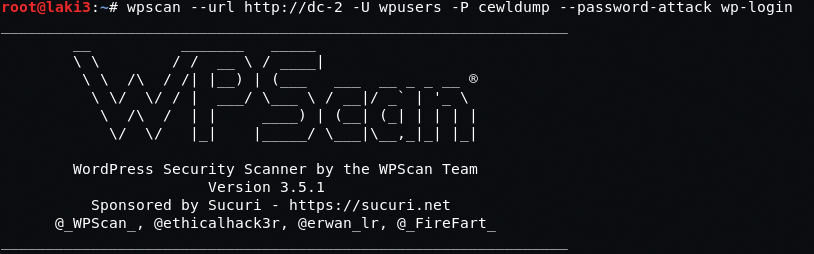
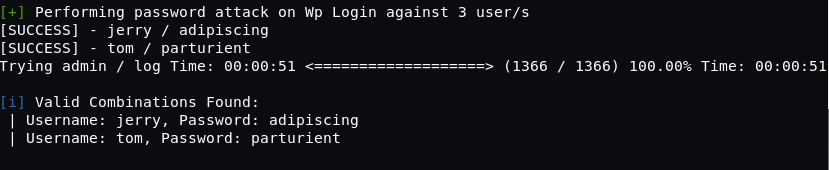
  

**both tom/jerry can login to wp, but jerry can see pages which has flag2**
 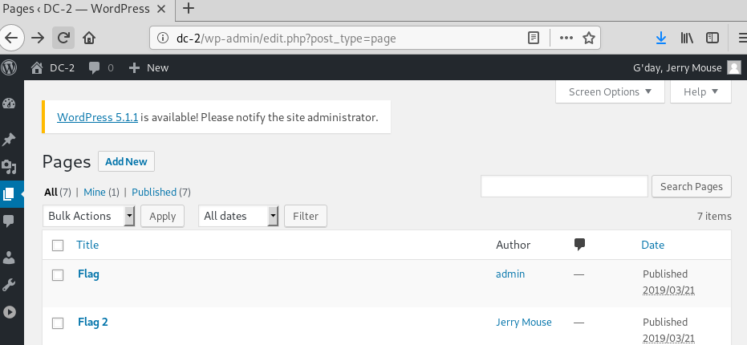
  

**neither users had admin rights to another route is needed as flag 2 suggests**
 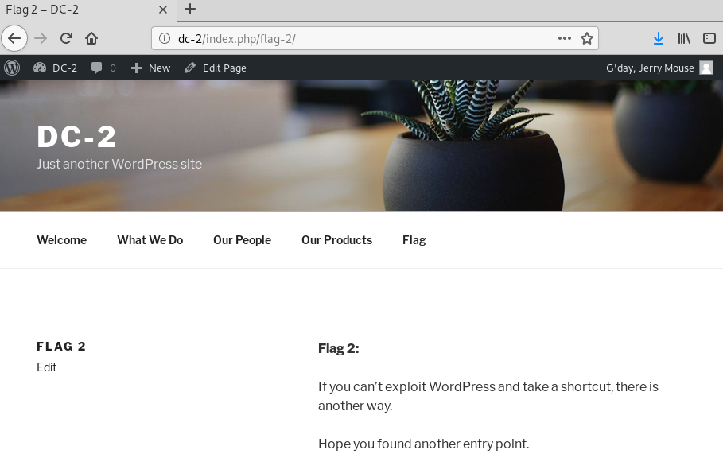
  

**we try ssh over alternate 7744 port as tom using found credentials, works**
 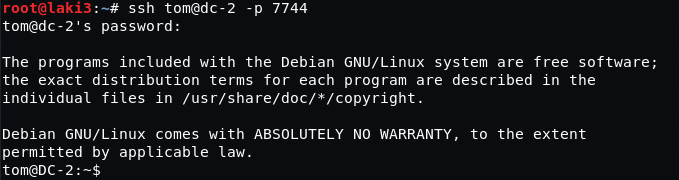
  

**we have a restricted shell, but some commands available. such as less to read flag3**
 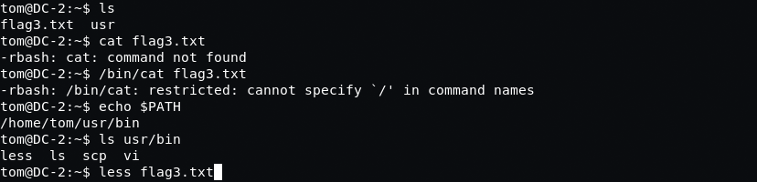
  

**flag 3 says we should su to jerry, but we need to break out of jail first**
 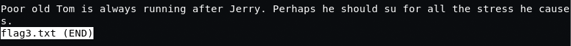
  

**vi is available so we use it to break free**
 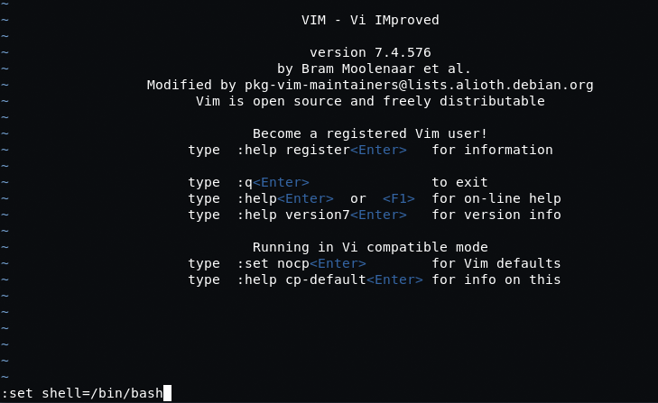

  

**we're now out of jail and can read files freely**
 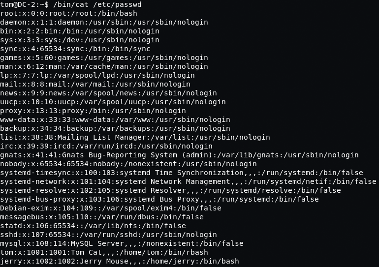
  

**so we do as flag 3 states and su to jerry using found password from wp. with that flag 4 is found**
 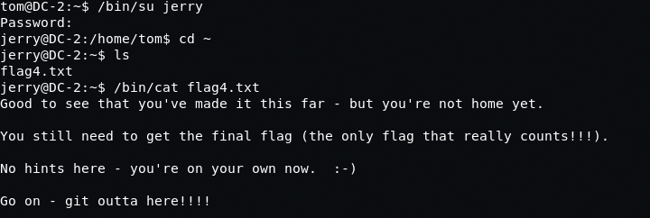
  

**we check sudo and the hint is correct and we can sudo git without a password**
 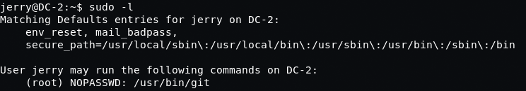
  

**we move to top level of file structure, git init, add /root folder and commit. after committing we see our final flag.  we then move back to home dir of jerry and clone the repo without sudo**
 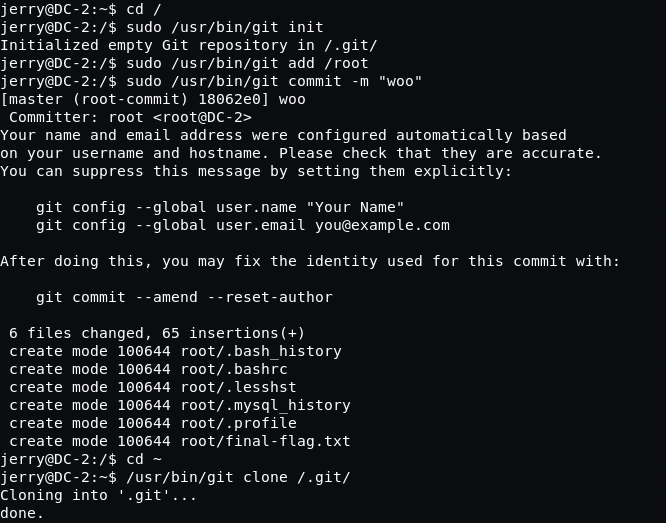
  

**final flag**
 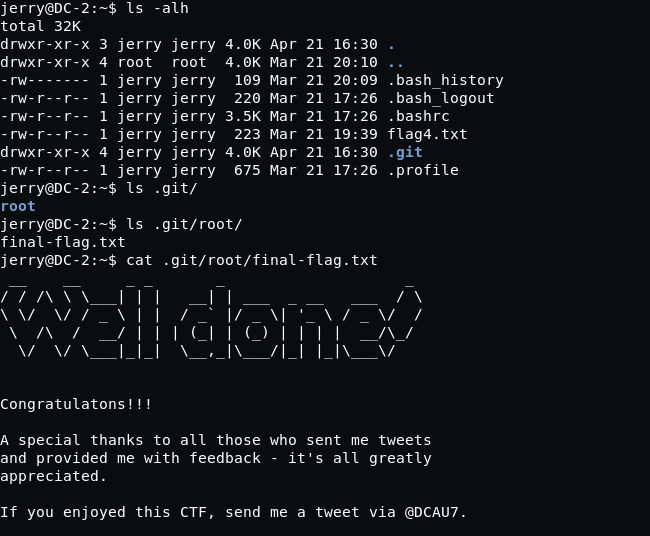
  
