## Goal #
root

## Download #
[http://www.five86.com/dc-3.html](http://www.five86.com/dc-3.html)

## Walkthrough #

**nmap**
 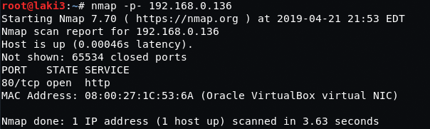
  

**default 80, favicon tells me joomla**
 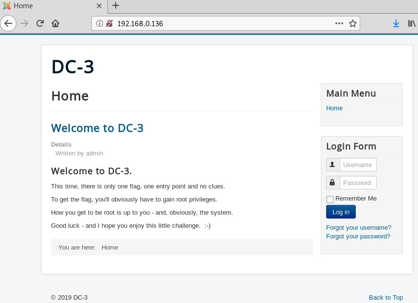
  

**readme confirms and version is 3.7**
 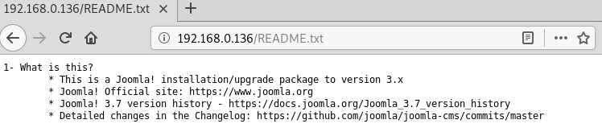
  

**quick google we find sqli for this version**
 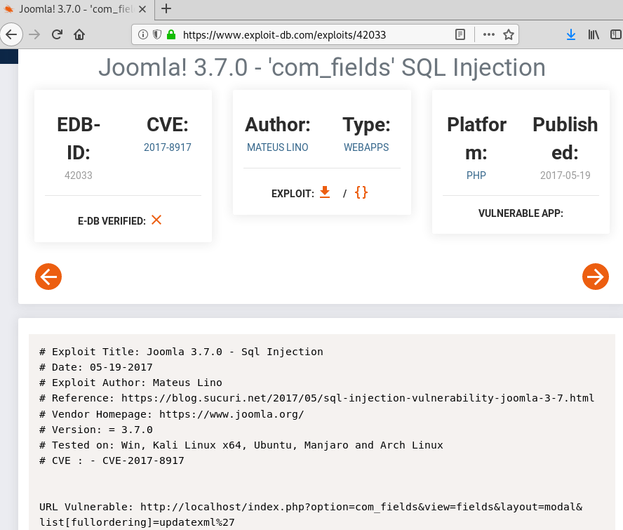
  

**run sqlmap and success, dbs found**
 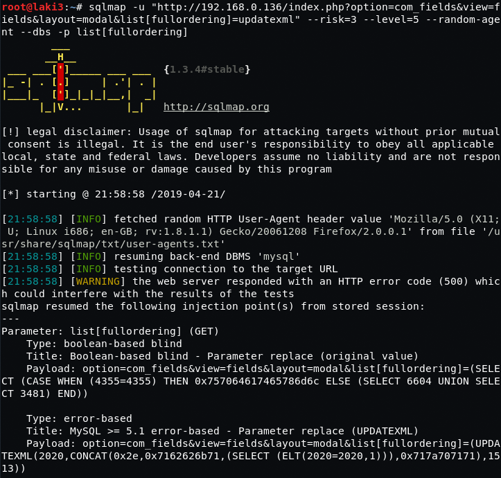
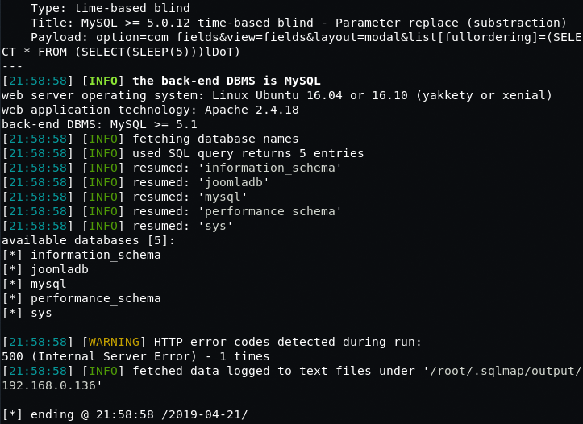
  

**did some other scans to determine user table name**

**adjust sqlmap to read the users table and we find the columns**
 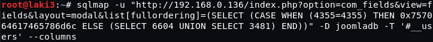
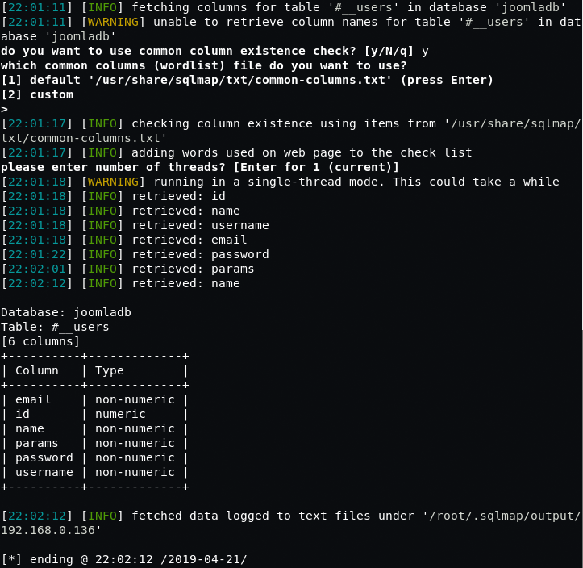
  

**adjust sqlmap again to dump the database table and we find admin hash**
 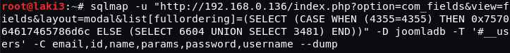
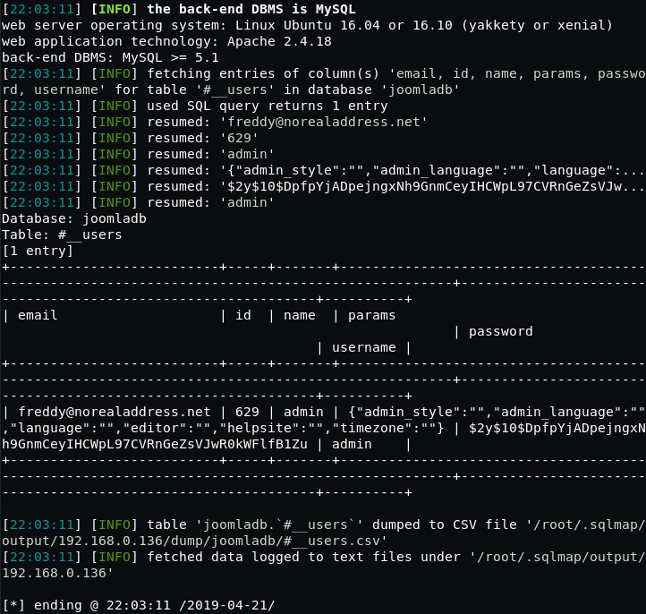
  

**throw hash at john and we find password**
 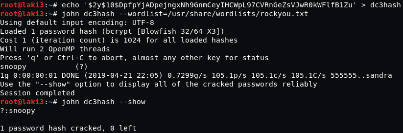
  

**login to joomla as admin**
 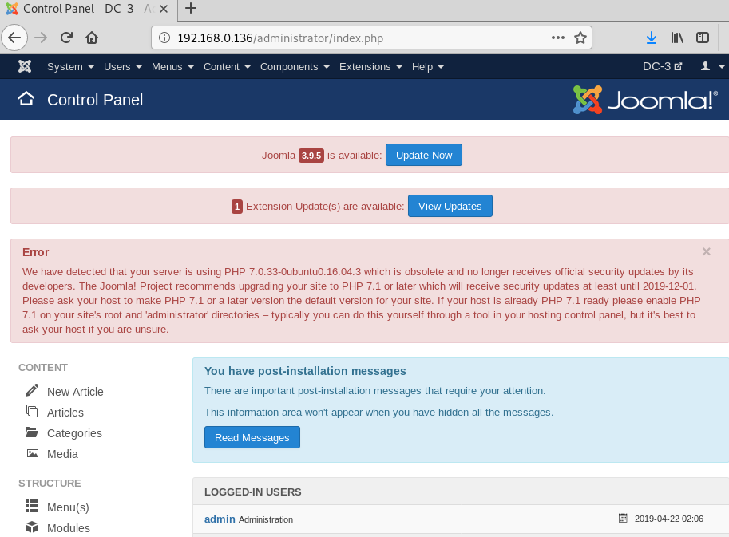
  

**update index.php of beez3 template with php reverse shell code**
 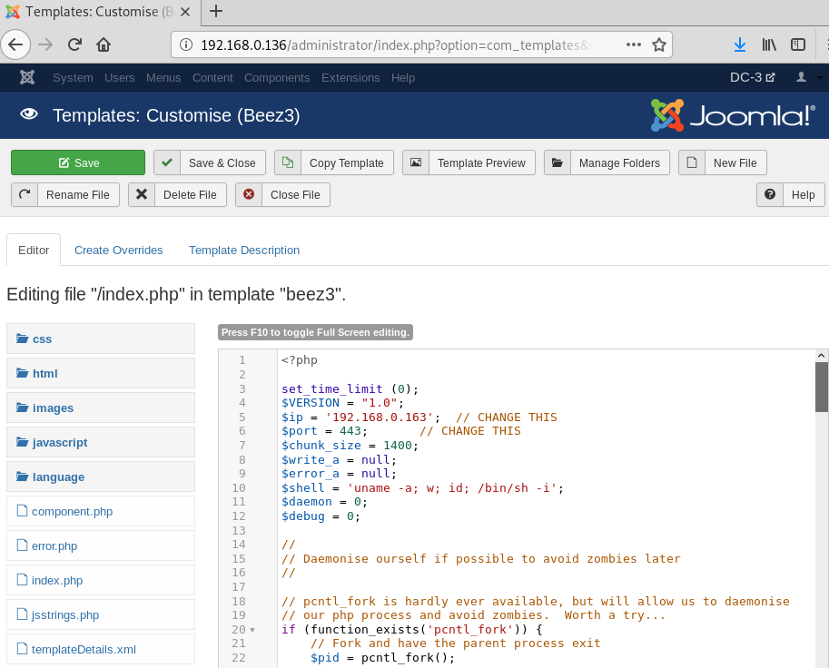
  

**setup our listener and browse to template page and we have reverse shell**
 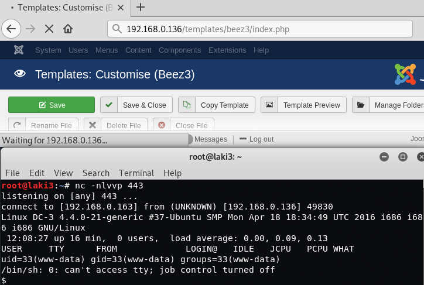
  

**break out of jail for ease**
 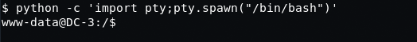
  

**after much enumeration, i figured kernel exploit was the only thing left. started to google on system info**
 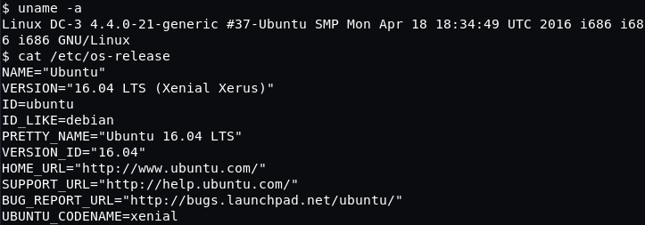
  

**after some trial and error, [edb 39772](https://www.exploit-db/exploits/39772) worked**
 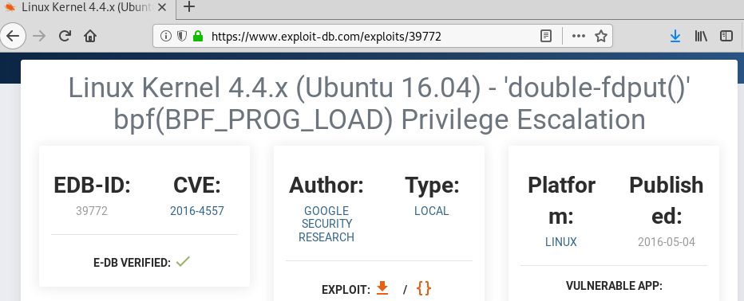
  

**download, unzip and copy exploit over to be downloaded to victim system**
 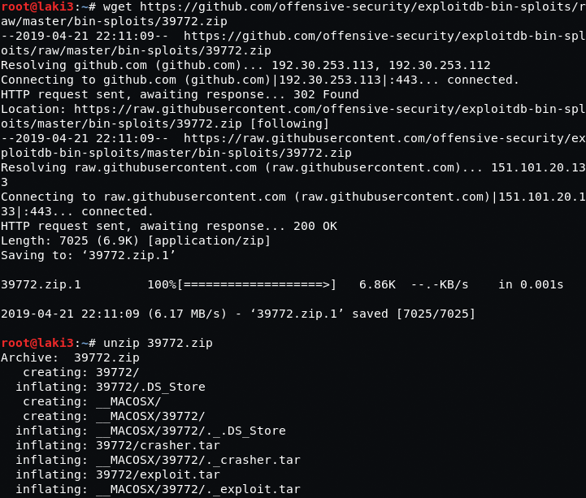
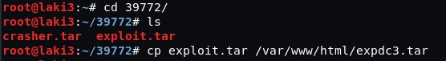
  

**on victim system we get exploit ready**
 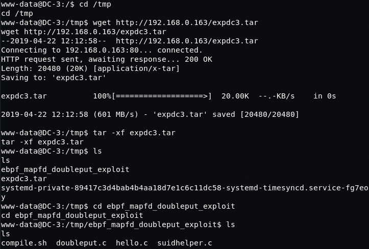
  

**run exploit and get root**
 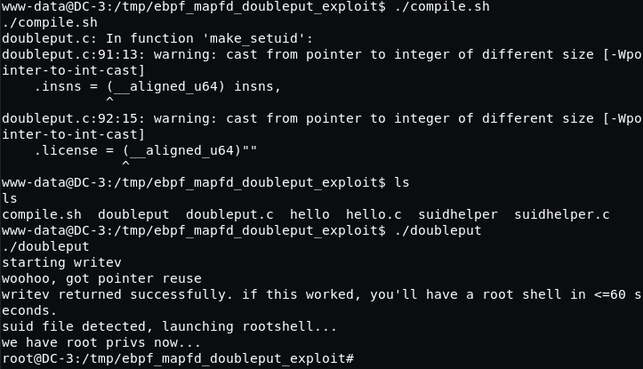
  

**root flag**
 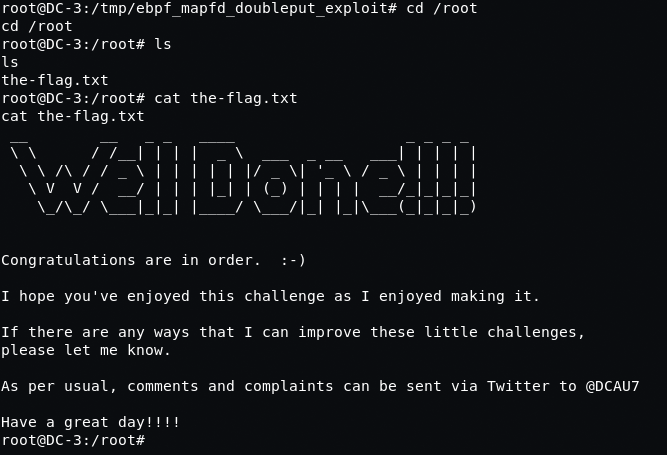
  