## Goal #
root

## Download #
[https://www.vulnhub.com/entry/w34kn3ss-1,270/](https://www.vulnhub.com/entry/w34kn3ss-1,270/)

## Walkthrough #

**nmap**
 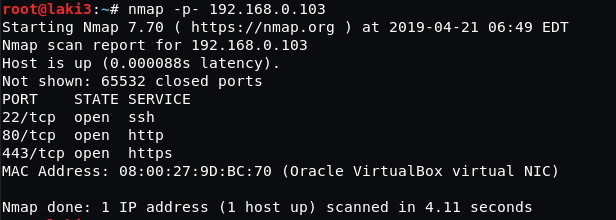
  

**default 80, nothing**
 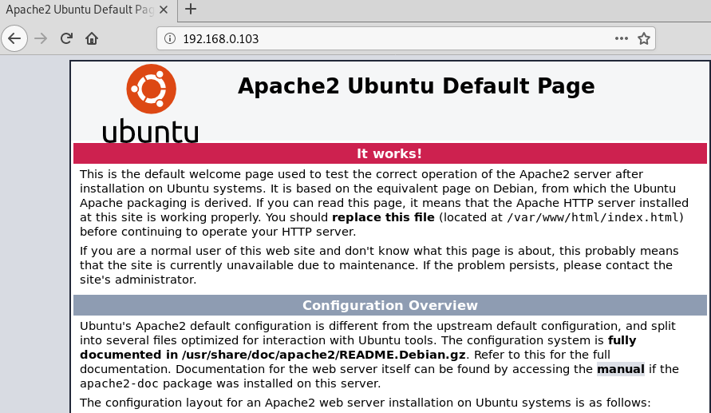
  

**default 443, nothing**
 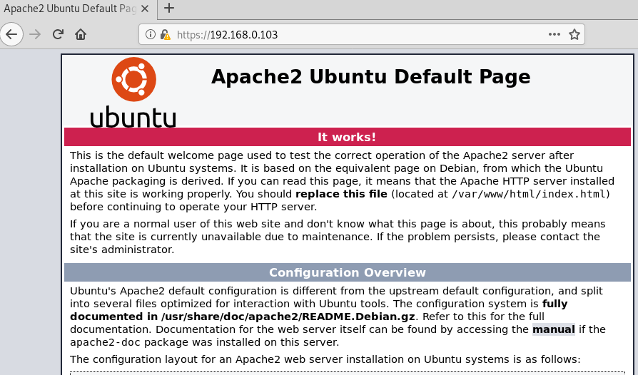
  

**dirb on 80 reveals some folders; blog, uploads and test**
 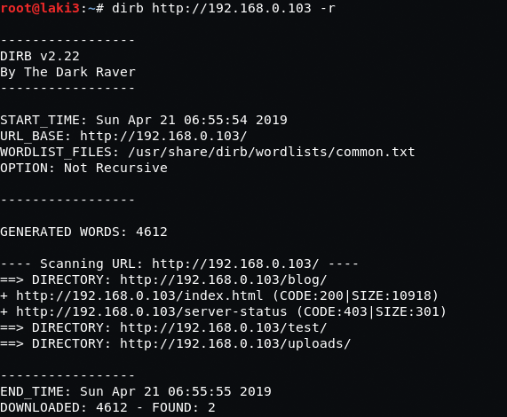
  

**test is the only one that has some info, we need keys**
 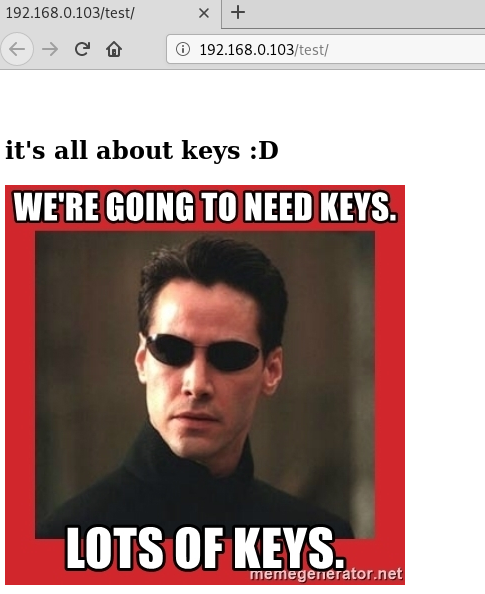
  

**looking at cert of 443, we get a username n30 and a hostname**
 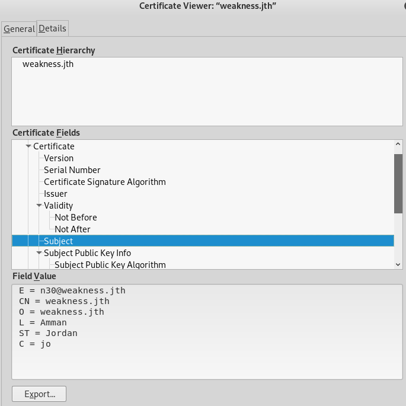
  

**update hosts file**
 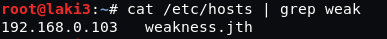
  

**browsing to 80 with hostname we know we're on the right path**
 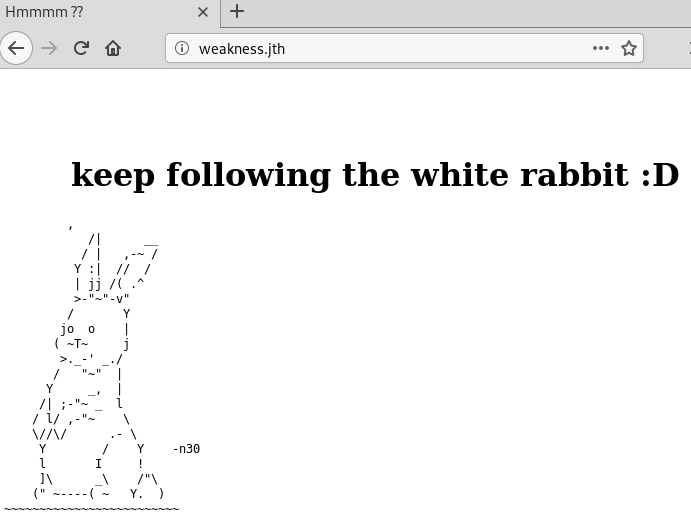
  

**dirb on hostname reveals a new directory, private**
 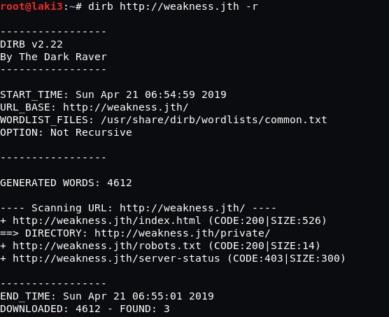
  

**browsing to directory we have two files**
 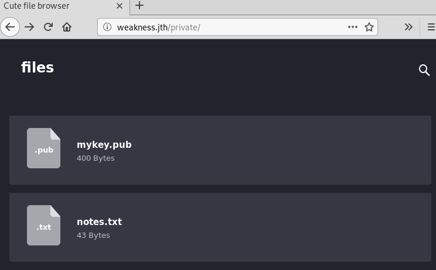
  

**first is a public key**
 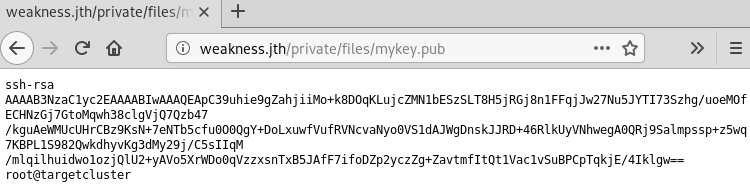
  

**second is a note stating keys were created on an earlier version of openssh**
 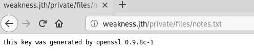
  

**quick google and we find [edb 5720](https://www.exploit-db.com/exploits/5720) and brute forcing predictable keys**
 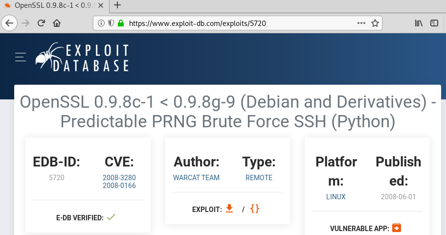
  

**copy the exploit over and download/uncompress keys**
 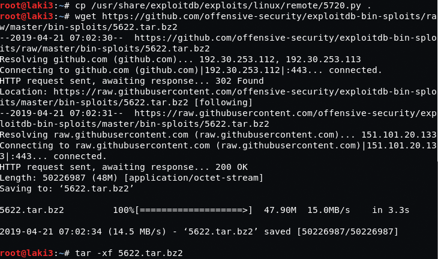
  

**running the exploit, after some time, we find a key**
 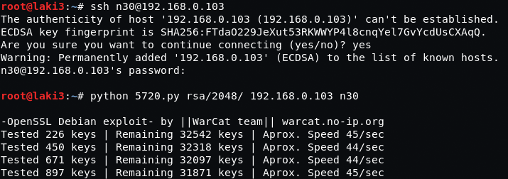
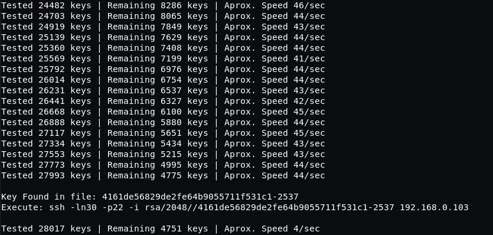
  

**get shell as n30**
 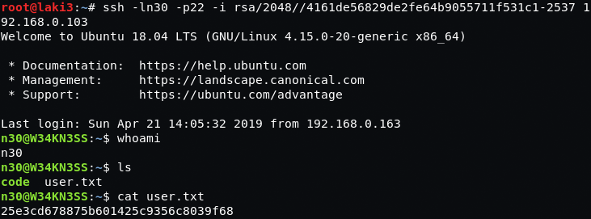
  

**compiled python code in the home dir states it has hardcoded creds**
 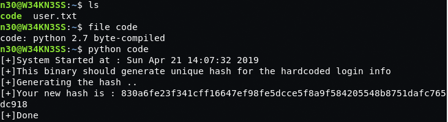
  

**copy to web dir and download**
 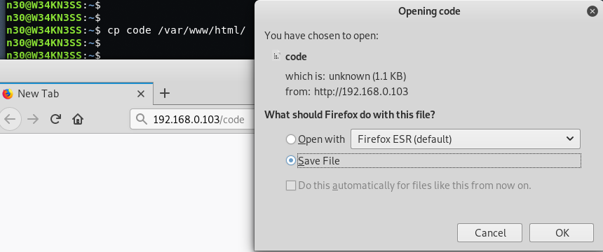
  

**using [uncompyle2](https://github.com/wibiti/uncompyle2) we find the creds**
 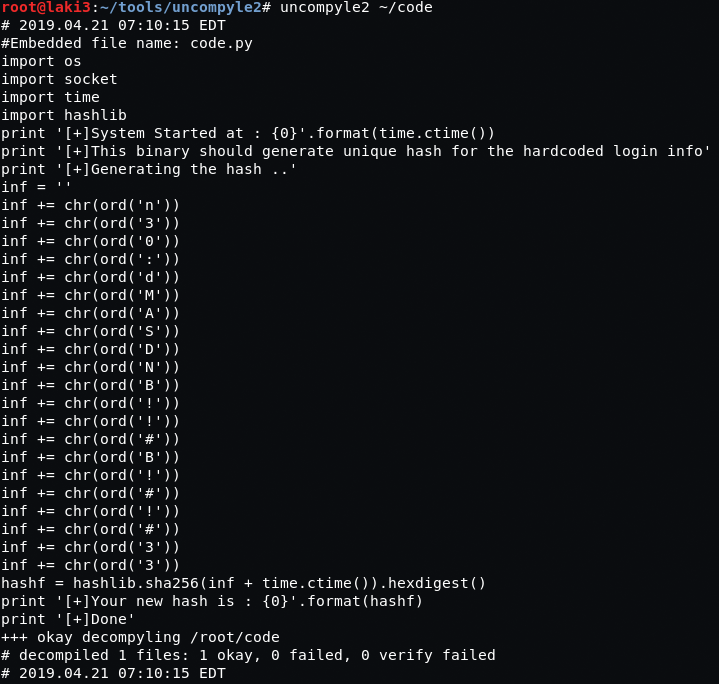
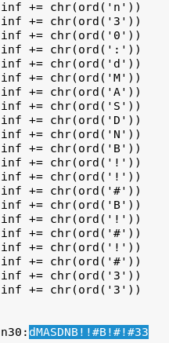
  

**with that it's a quick sudo to root**
 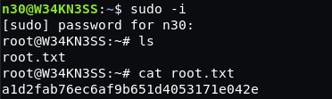
  
