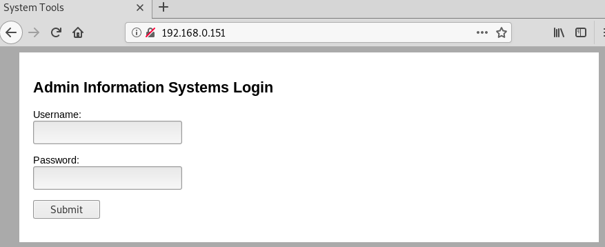
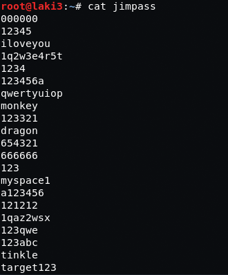

## Goal #
root

## Download #
[http://www.five86.com/dc-4.html](http://www.five86.com/dc-4.html)

## Walkthrough #

**nmap**
 
  

**default 80, seems like we need to login as admin :)**
 
  

**dirb doesn't reveal much**
 
  

**decide to specify file type and some more results show up**
 
  

**checking command.php in repeater with a post method, we see we can list files.  however we need to be logged in to do so.**
 
  

**insert a lot of time wasted on wfuzz, sql injections, gobuster, hydra, nmap, and more enumeration.  started some googling and didn't know you could use hydra to post to http forms. this [post](https://blog.dewhurstsecurity.com/2013/04/17/http-form-password-brute-forcing-the-need-for-speed.html) helped.**  

**lots of trial and error for the hydra commands/options, but found one that finally worked**
 
  

**login works and we tryout the command to list files**
 

  

**checking request in burp repeater we see where we need to update**
 
  

**with that /etc/passwd is readable and several usernames are found**
 
  

**checking all users home directories there is a backup passwords file**
 
  

**seems like the list can be used as a password list, so we build one**
 

  

**hydra used with jim, password is found and ssh is successful**
 

  

**find a suid bash script, but it's nothing.  mail file isn't much, however...**
 
  

**/var/mail holds a message with password for charles**
 
  

**su as charles and we can sudo program teehee with no password.  assumption teehee is really just tee, some testing **
 
  

**some googling and seems tee can be used to within vi, so we add charles to the sudo group using vi and sudo teehee.  good post on it [here](https://www.howtoforge.com/linux-tee-command/)**  
 
  

**checking the change it worked and logging out and back in as charles we see he's part of sudo**
 
  

**quick sudo gives root flag**
 
  
