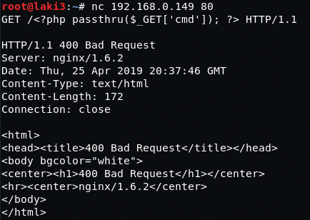

## Goal #
root

## Download #
[http://www.five86.com/dc-5.html](http://www.five86.com/dc-5.html)

## Walkthrough #

**nmap**
 
  

**default 80**
 
  

**contact page/form looks interesting, but given the hint on the download we should be looking elsewhere**
 
  

**after submitting we notice the copyright says 2020 being called on thankyou.php**
 
  

**on multiple refreshes we see it changes between 2017, 2018, 2019, 2020**
 

  

**looking at the source it doesn't have any code so most likely a php include**
 
  

**quick check for LFI and we have /etc/passwd**
 
  

**searching through various files/paths we find we can view the nginx access log.  **
 
  

**there a bunch of posts about this type of exploit, this [one](https://roguecod3r.wordpress.com/2014/03/17/lfi-to-shell-exploiting-apache-access-log/) is a good start.**  

**send the payload to write to the log so we can get cmd line access**
 
  

**with the netcat listener on the attacking system, tacking on the cmd to call back and we have a reverse shell**
 
  

**first thing first, jailbreak**
 
  

**searching around nothing obvious, check suid and find that screen-4.5.0 sticks out**
 
  

**quick search and [edb 41154]https://www.exploit-db.com/exploits/41154) looks promising**
 
  

**little trial and error as running the script doesn't as is.  searching the intrawebs htb haircut had this as a priv escalation.  good note on building on attacking machine first**
 
  

**build libhax.so**
 
  

**build rootshell script**
 
  

**build script to call is all together and setup a listener to download the files**
 
  

**wget files on victim machine**
 
  

**make executable and run it...root**
 
  

**root flag**
 
  