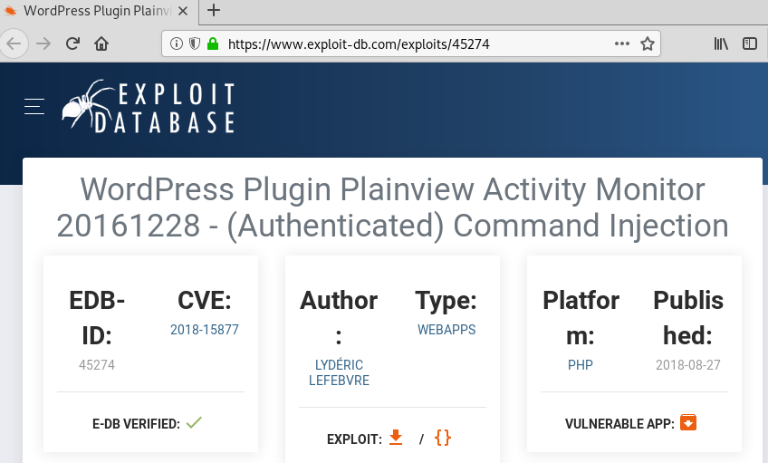

## Goal #
root

## Download #
[http://www.five86.com/dc-6.html](http://www.five86.com/dc-6.html)

## Walkthrough #

**nmap**
 
  

**default 80, wordpress**
 
  

**wpscan enumerate, users found**
 

  

**build users list and password list based on creator's note regarding**
 
  

**run wpscan password attack, password found for mark**
 

  

**login as non-admin.  plugin activity monitor stands out**
 
  

**after some light enumeration, switch to google and find [edb 45274]https://www.exploit-db.com/exploits/45274**
 
  

**download and edit poc**
 
  

**setup listener and open poc file**
 
  

**submit poc request and reverse shell**
 
  

**break out of jail and list user home directories**
 
  

**enumerating found txt file with password for graham**
 
  

**ssh as graham**
 
  

**enumerating...found that we can sudo as jens, no password for a script that we can edit due to group permissions**
 
  

**edit script**
 
  

**escalate to jens**
 
  

**sudo as root with no password for nmap**
 
  

**echo text to spawn shell into nmap script, sudo with nmap calling script, root and root flag**
 
  