## Goal #
root

## Download #
[https://www.vulnhub.com/entry/unknowndevice64-2,297/](https://www.vulnhub.com/entry/unknowndevice64-2,297/)

## Walkthrough #

**nmap**
 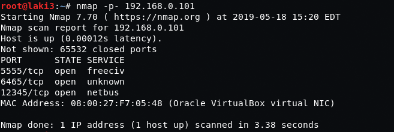
  

**ran detailed nmap for unknown ports**
 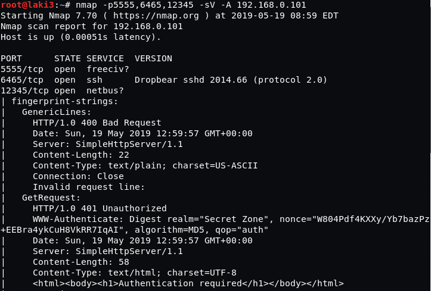
  

**knowing this is android with debug port 5555 open, we get root and flag quickly by using adb to connect and get shell**
 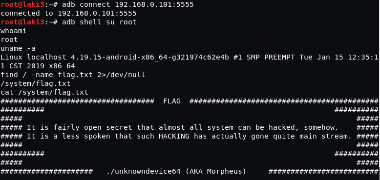
  

**second way to get root we try through web interface on port 12345**  

**authentication required and it was a lot of trial and error** 
 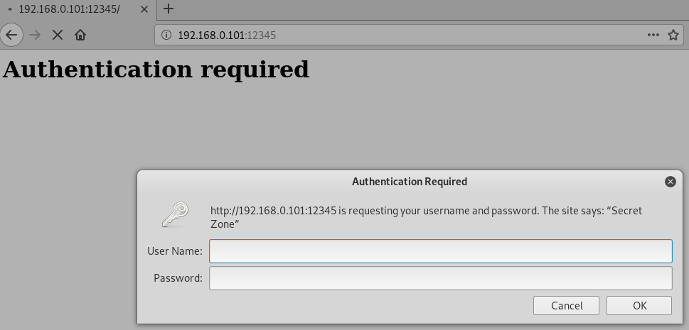
  

**not elegant, but manually tried some very default username/password combos.  turns out to be administrator/password**
 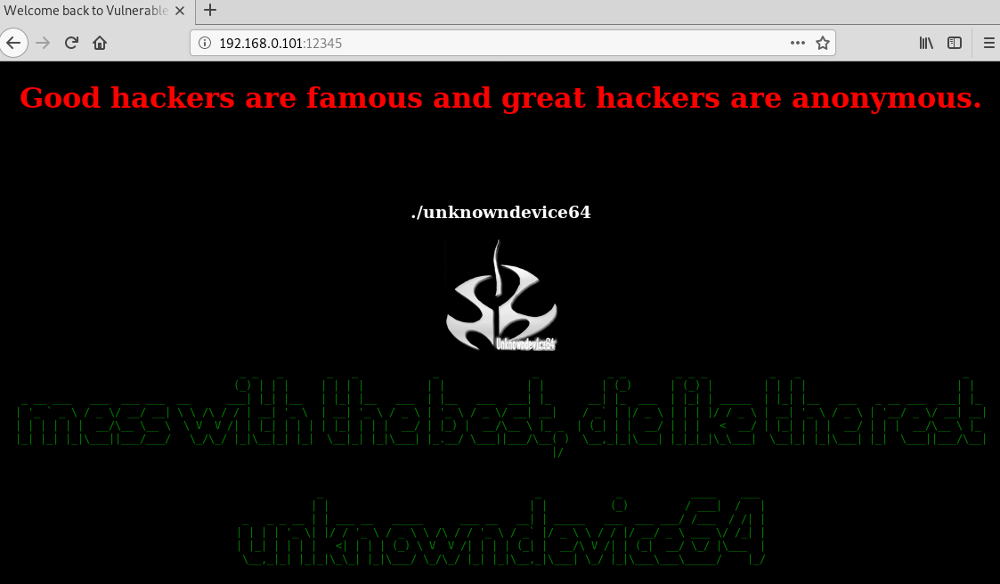
  

**before doing automated enumeration we try robots.txt and it's there**
 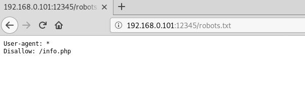
  

**going to info.php prompts a download**
 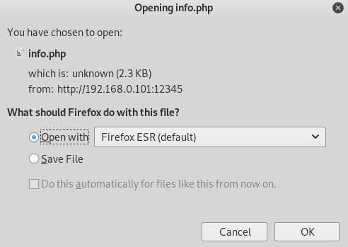
  

**turns out to be a private ssh key with a comment, most likley key password**
 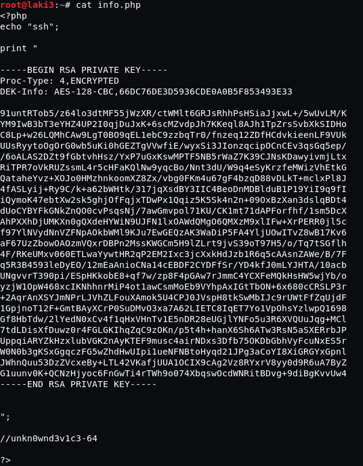
  

**echo the key into a file and change permissions**
 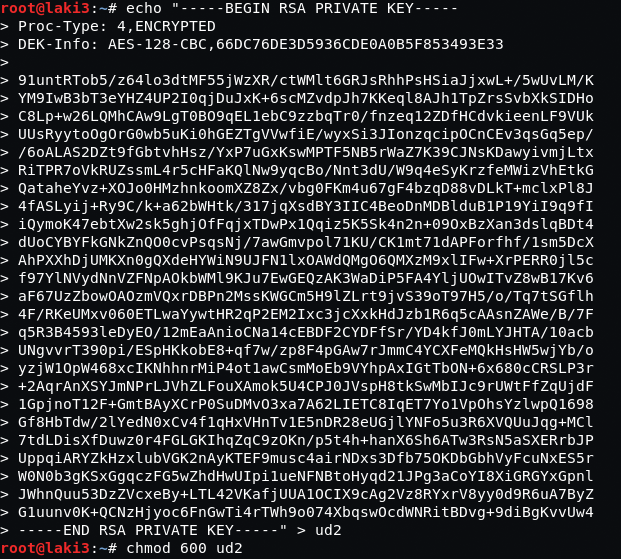
  

**ssh using key and password, success**
 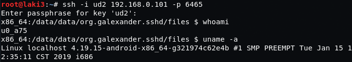
  

**we know root doesn't have a password and location of the flag, done**
 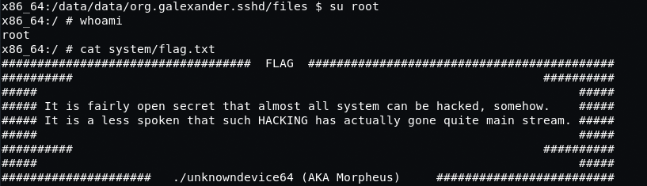
  
