## Goal #
root

## Download #
[https://www.vulnhub.com/entry/silky-ctf-0x01,306/](https://www.vulnhub.com/entry/silky-ctf-0x01,306/)

## Walkthrough #

**nmap**
 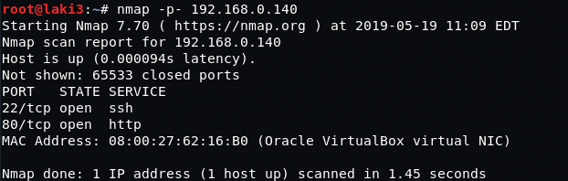
  

**default 80, gives administrator's username 'silky'**
 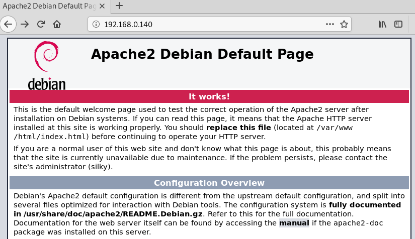
  

**robots reveals notes.txt**
 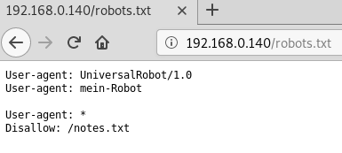
  

**notes is in german** 
 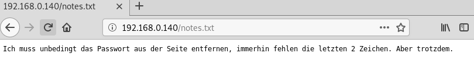
  

**translation reveals there is a password listed with the last two characters missing**
 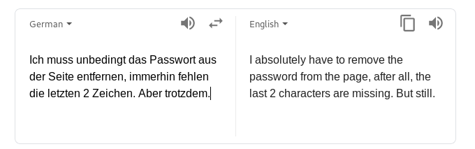
  

**checking burp there is a script.js file called that reveals the partial password**
 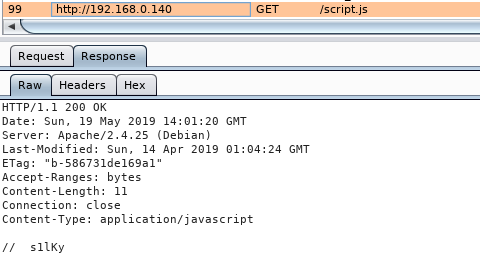
  

**build a password list using crunch. too lazy to figure out better method so i manually append all the combinations to a single file. this is a snippet of commands run**
 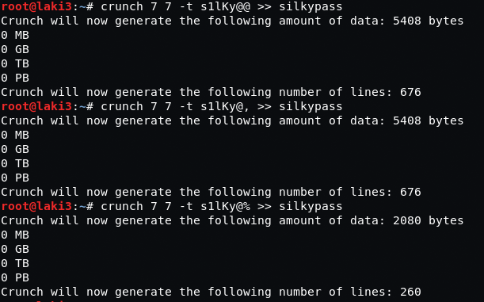
  

**hydra reveals password**
 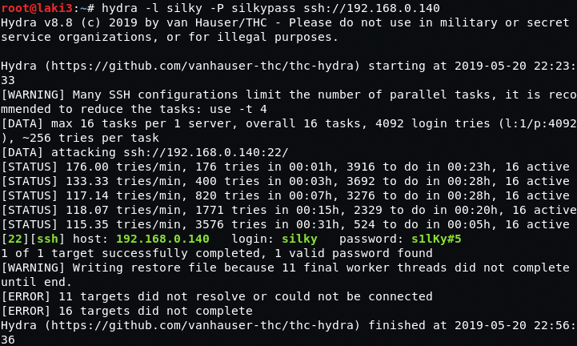
  

**ssh and we're in**
 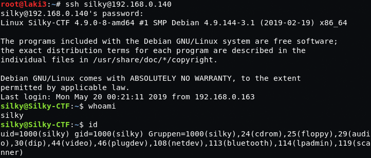
  

**bash history reveals 'sky' suid file**
 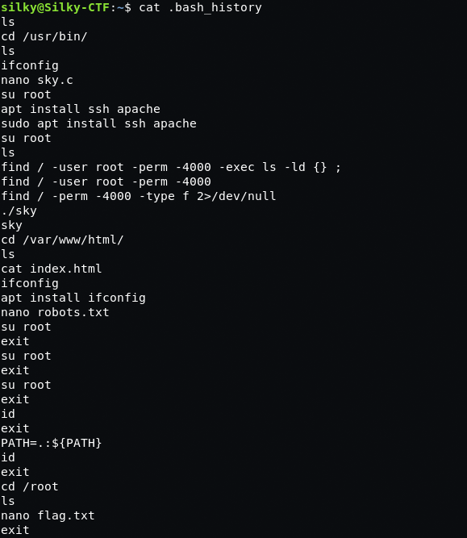
  

**checking translation , it's nothing special. what's the root part though?**
 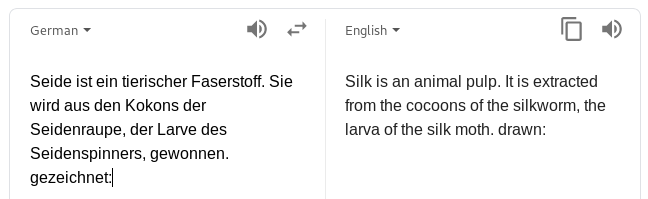
  

**strings reveals the program calls whoami**
 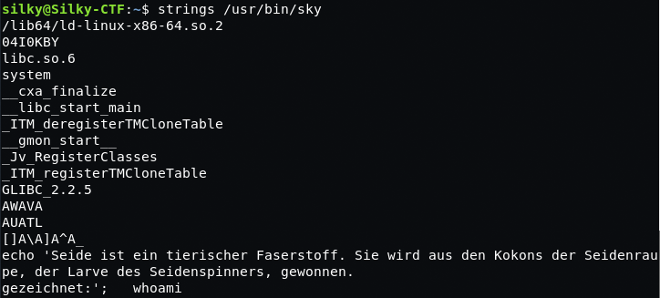
  

**bash history also had a line for PATH. using that we can create a symbolic link and get root**
 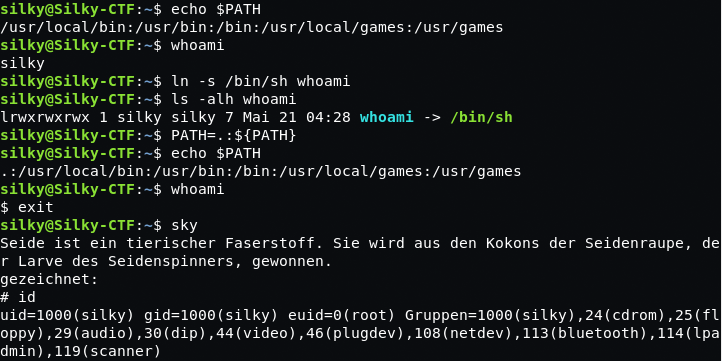
  

**root flag**
 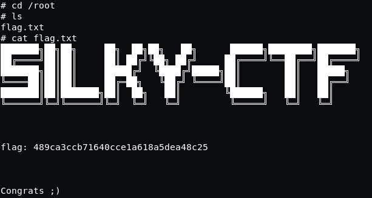
  

