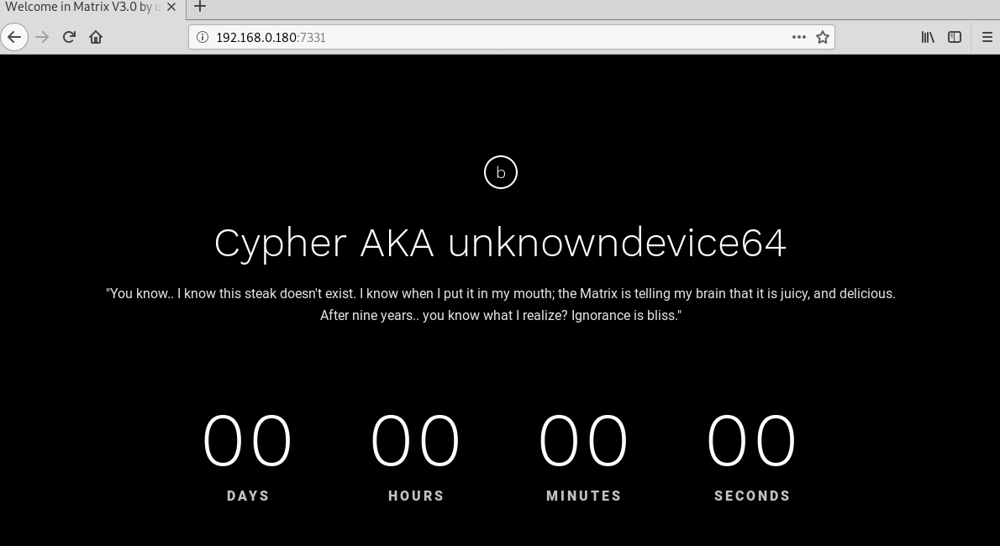

## Goal #
root

## Download #
[https://www.vulnhub.com/entry/matrix-3,326/](https://www.vulnhub.com/entry/matrix-3,326/)

## Walkthrough #

**nmap**
 
  

**default 80, follow the white rabbit**
 
  

**after some enumeration nothing found. pulled list of words using cewl**
 
  

**dirb using newly created list finds directory** 
 
  

**matrix directory**
 
  

**after some time it becomes clear of what the directory should spell (neo64) and find secret file**
 
  

**gz file turns out to be txt file with credentials**
 
  

**hash in file is easily found on md5online**
 
  

**additional 7331 port requires authentication**
 
  

**default 7331**
 
  

**dirb using credentials find dir**
 
  

**data file for download**
 
  

**data file is .net**
 
  

**using dotpeek, credentials found**
 
  

**guest ssh works but restricted**
 
  

**vi is available and we can break out of jail**
 
 
  

**searching, find xxx file that is /bin/bash**
 
  

**checking sudo, /bin/cp can be used by trinity no password**
 
  

**create ssh keys**
 
  

**create authorized_keys file and using sudo copy it to .ssh under trinity profile**
 
  

**ssh as trinity using private key works**
 
  

**check sudo, file oracle can be run as root and is not yet created**
 
  

**echo /bin/sh to oracle file, make it executable and run with sudo...root**
 
  

**root flag**
 
  
