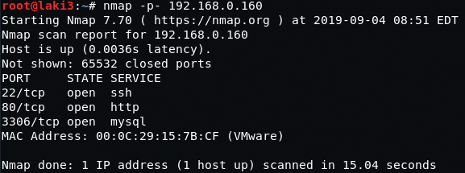
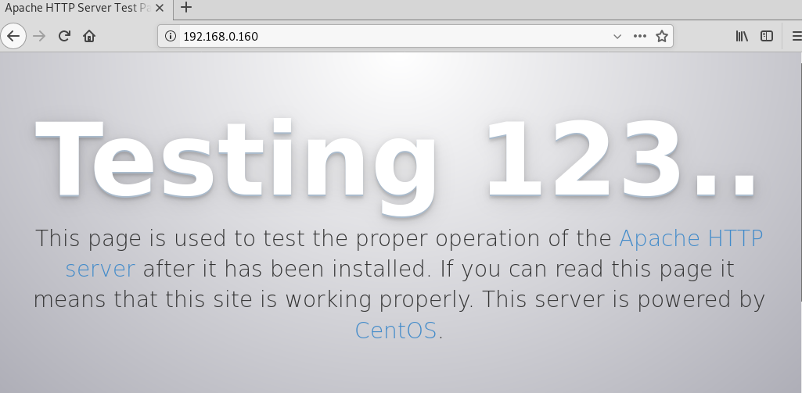
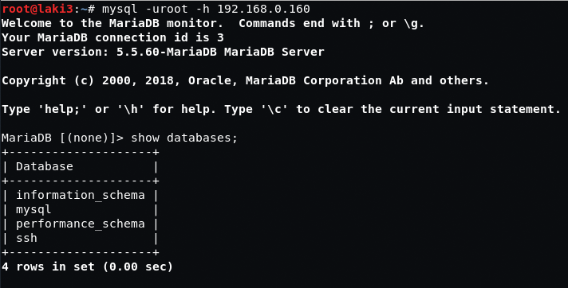
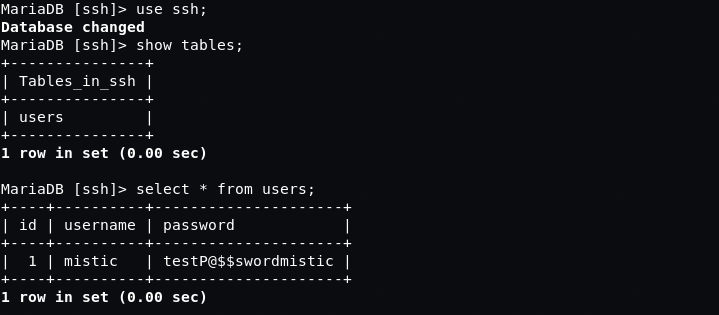
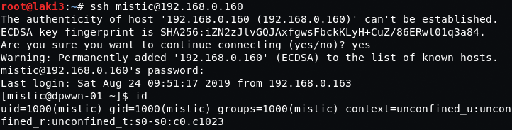
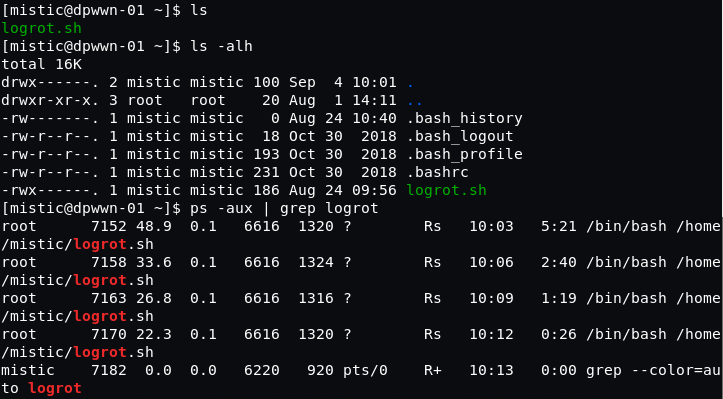
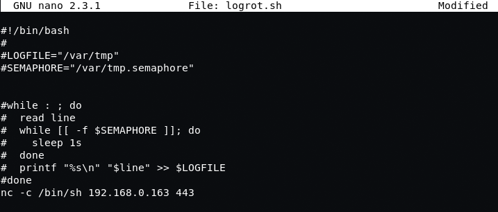
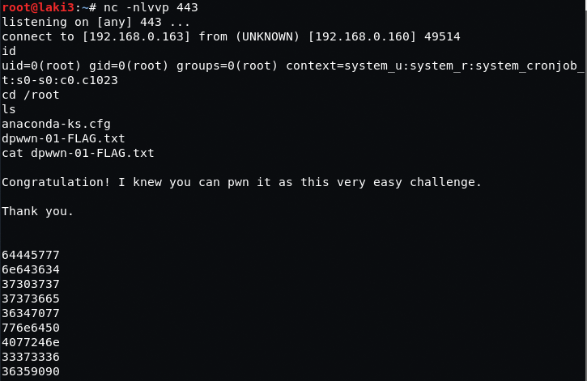

## Goal #
root

## Download #
[https://www.vulnhub.com/entry/dpwwn-1,342/](https://www.vulnhub.com/entry/dpwwn-1,342/)

## Walkthrough #

**nmap**
 
  

**default 80**
 
  

**after some web enumeration nothing found. looked at other open port mysql and found connectivety as root no password worked**
 
  

**database contained ssh creds**
 
  

**ssh worked**
 
  

**found script in home directory running as root and able to edit**
 
  

**updated with reverse shell**
 
  

**setup listener and waited...root**
 
  

