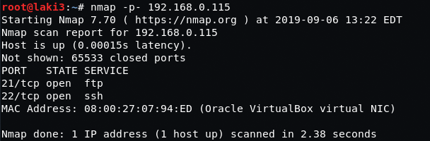
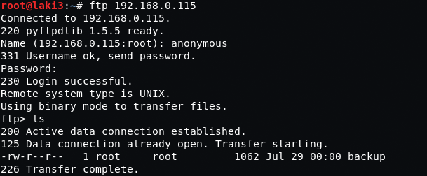
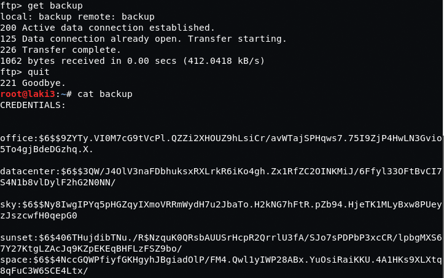
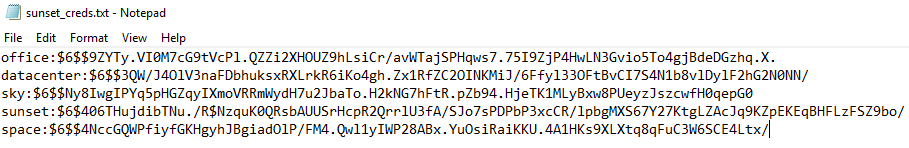
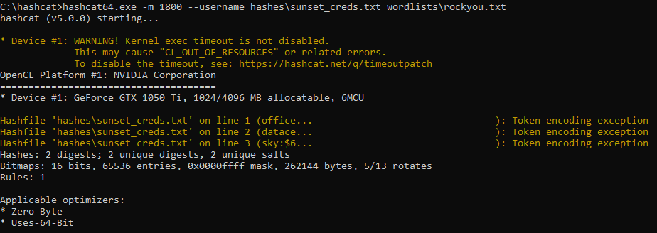
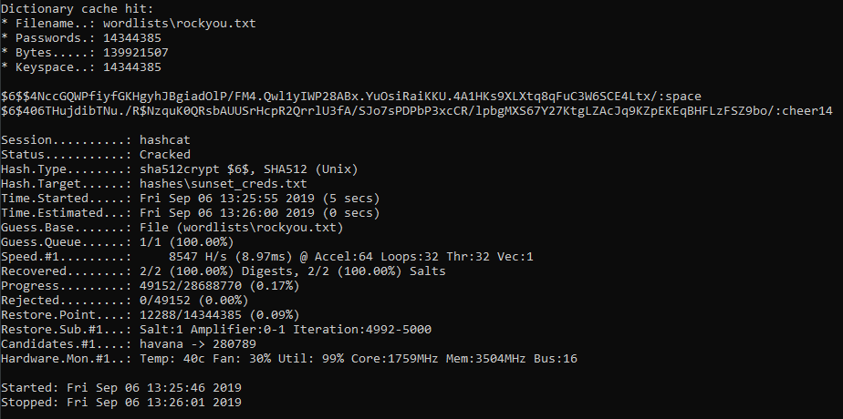
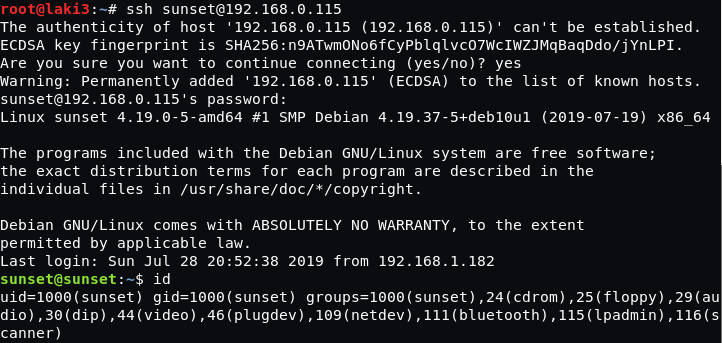
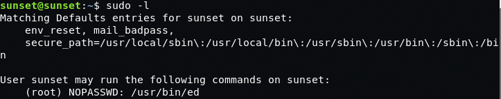
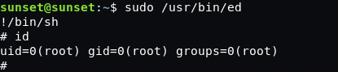
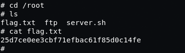

## Goal #
root

## Download #
[https://www.vulnhub.com/entry/sunset-1,339/](https://www.vulnhub.com/entry/sunset-1,339/)

## Walkthrough #

**nmap**
 
  

**ftp anonymous works**
 
  

**downloaded backup file contains hashed creds**
 
  

**clean up of the credentials file**
 
  

**run against hashcat and we have credentials**
 
 
  

**ssh as sunset works and user flag**
 
 
  

**sudo with no pass for /usr/bin/ed**
 
  

**able get root**
 
  

**and root flag**
 
  