## Goal #
root

## Download #
[https://www.vulnhub.com/entry/sunset-nightfall,355/](https://www.vulnhub.com/entry/sunset-nightfall,355/)

## Walkthrough #

**nmap**
 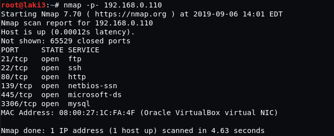
  

**default 80...nothing with dirb either so moved on to smb**
 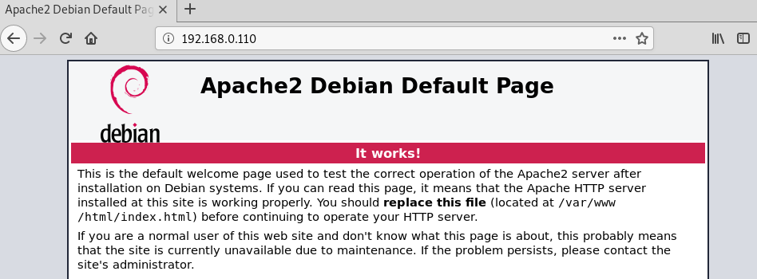
  

**enum4linux gives us usernames and nothing else**
 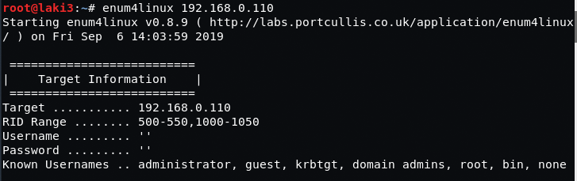
 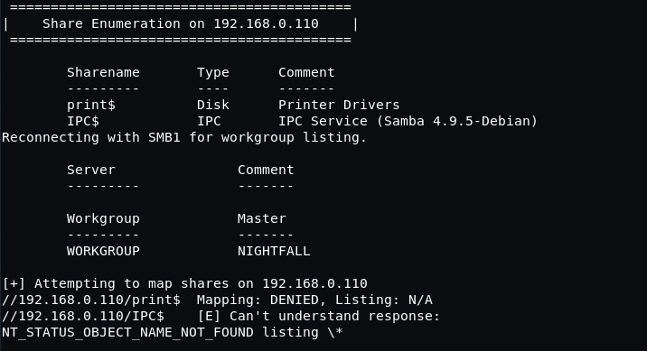
 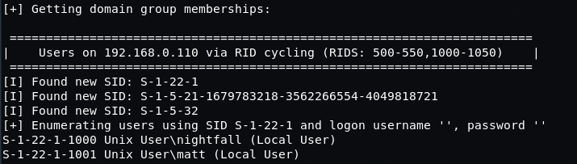
  

**ran hydra against ftp with more common user...creds**
 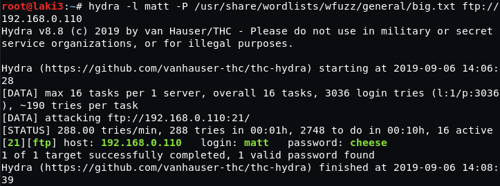
  

**ftp as user and we write files and create directories in the user's home folder...ssh**
 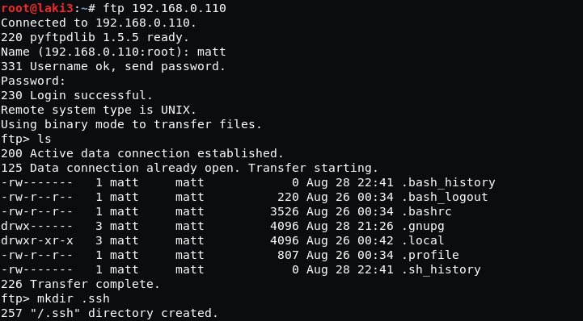
  

**create a pub/priv key and copy pub to authorized_keys file**
 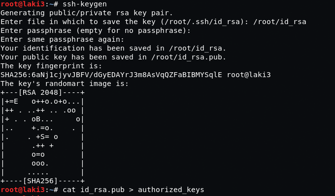
  

**upload new file to .ssh folder using ftp**
 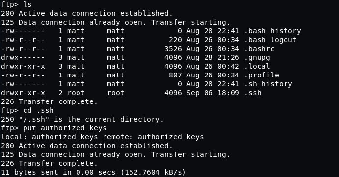
  

**ssh as matt works**
 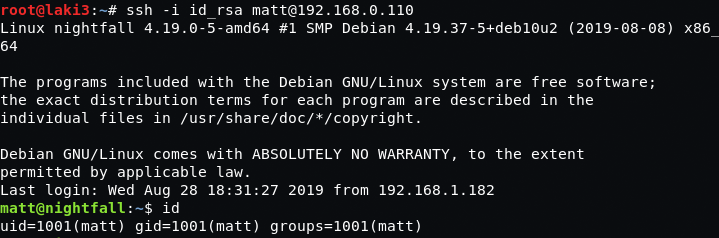
  

**found suid find file under top level scripts folder**
 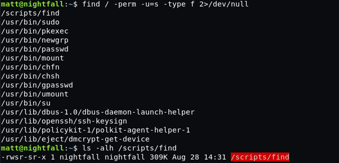
  

**able to reach user.txt file in other users home directory**
 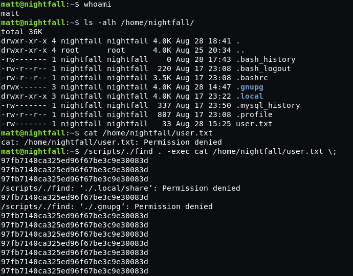
  

**we create .ssh file and cp authorized_keys file over to other users home directory using this method**
 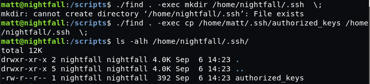
  

**ssh as other user**
 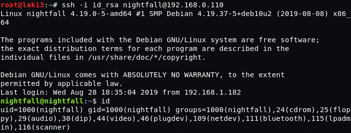
  

**grab root shadow hash**
 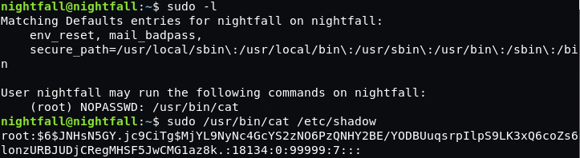
  

**run hash against hashcat**
 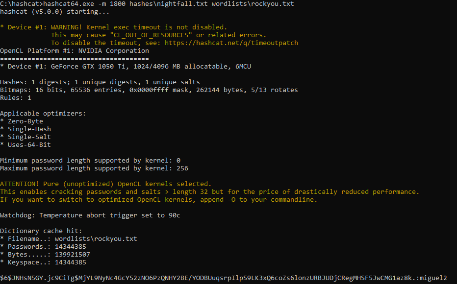
  

**we have root**
 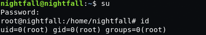
  

**and flag**
 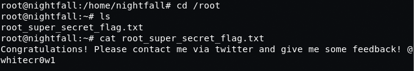
 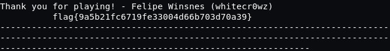
  