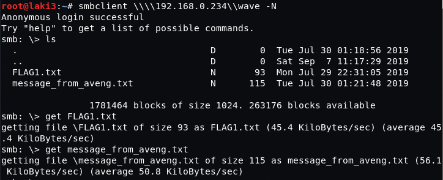

## Goal #
root

## Download #
[https://www.vulnhub.com/entry/westwild-11,338/](https://www.vulnhub.com/entry/westwild-11,338/)

## Walkthrough #

**nmap**
 
  

**default 80...hint to follow wave**
 
  

**enum4linux gives us share and usernames**
 
 
 
  

**find two files and download**
 
  

**flag 1 and message shown**
 
  

**flag 1 decoded are creds**
 
  

**ssh as wavex**
 
  

**enumerate using linux priv script and find interesting directory**
 
  

**directory contains script with other user creds**
 
  

**su as aveng and able to sudo all**
 
  

**root and flag**
 
  
