## Goal #
root

## Download #
[https://www.vulnhub.com/entry/grimtheripper-1,350/](https://www.vulnhub.com/entry/grimtheripper-1,350/)

## Walkthrough #

**nmap**
 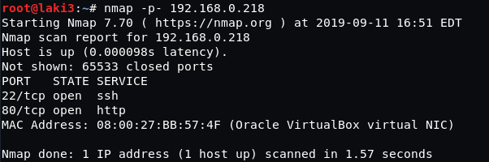
  

**default 80**
 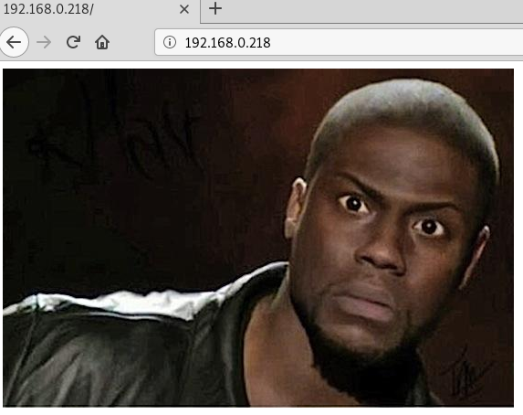
  

**dirb**
 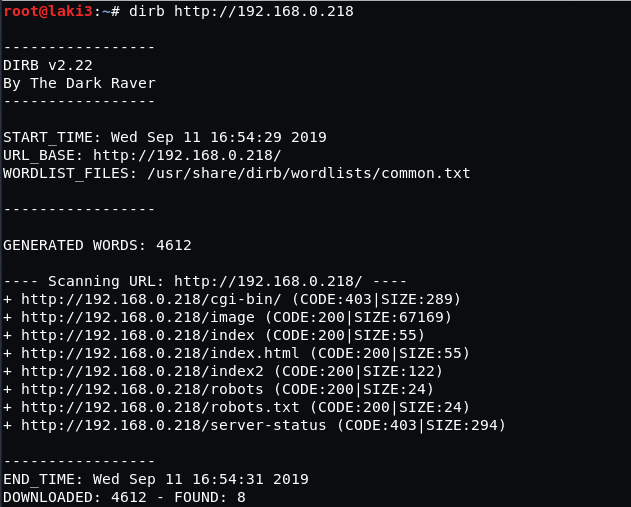
  

**robots shows index2**
 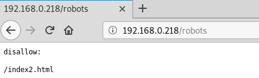
  

**index2**
 
  

**source of index2 reveals a base64 string**
 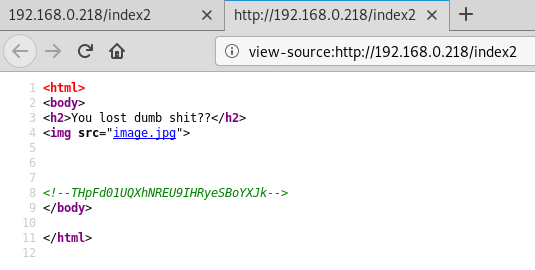
  

**decode twice to find new directory**
 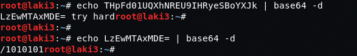
  

**new directory shows wordpress**
 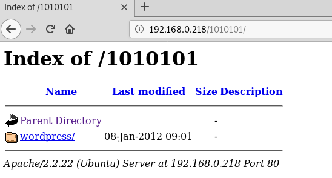
 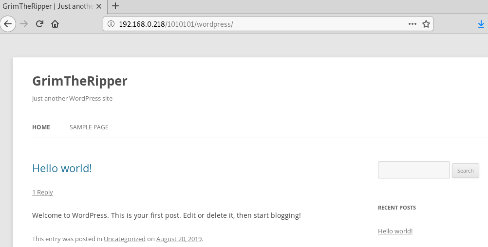
  

**wpscan finds a lot of vulns but nothing to get access and one user admin**
 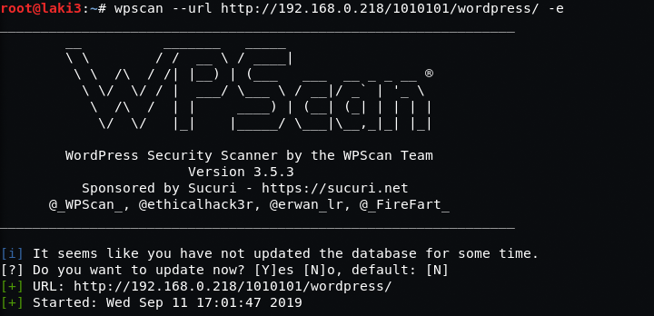
 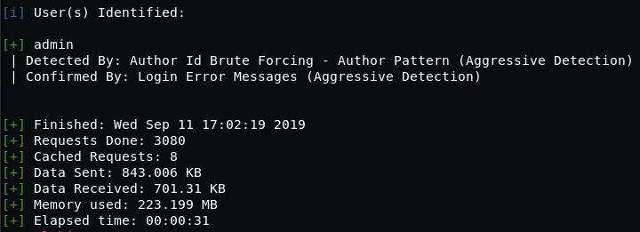
  

**run wpscan brute with rockyou (i split rockyou to multiple files) and password found**
 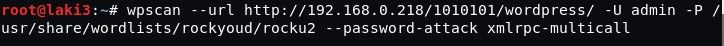
 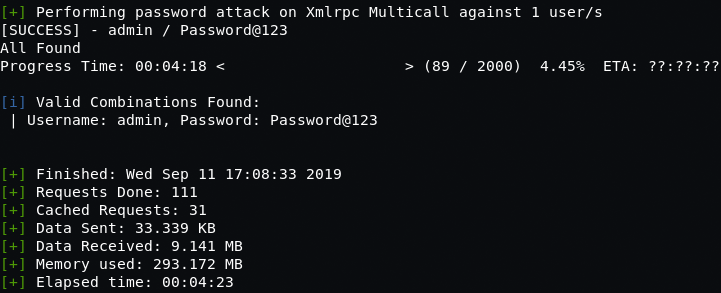
  

**all links on site direct to 127.0.0.1**
 
  

**using target redirector from burpe, able to login**
 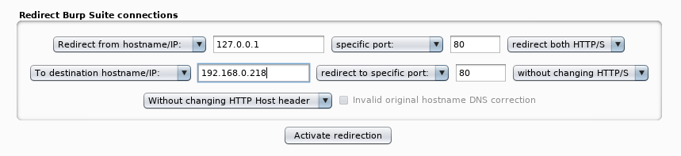
 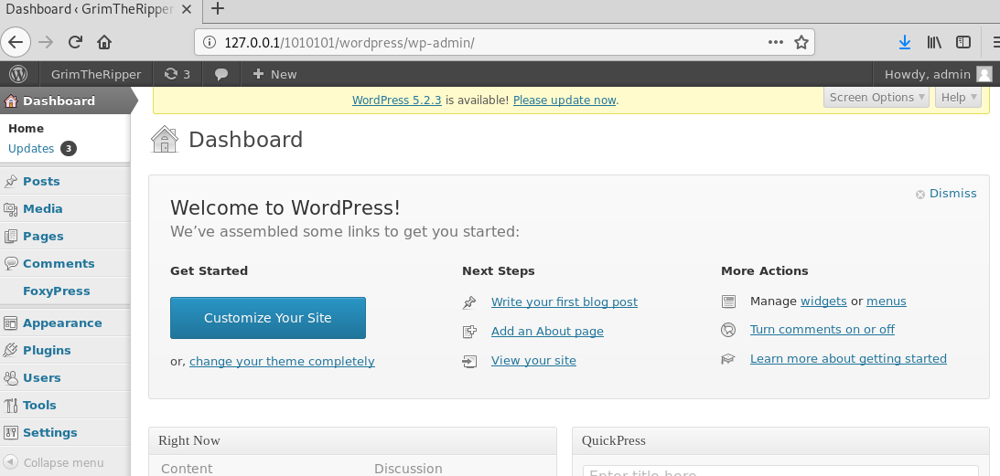
  

**adding php reverse shell to footer and calling site, reverse shell acquired**
 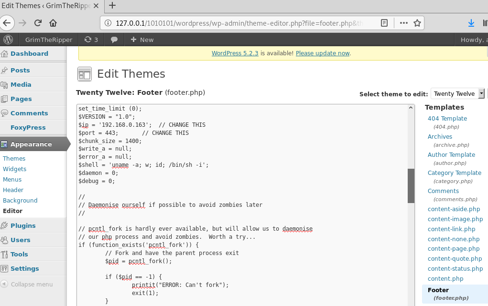
 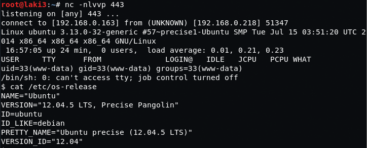
  

**wordpress is so old, so is the os. easily found kernel exploit**
 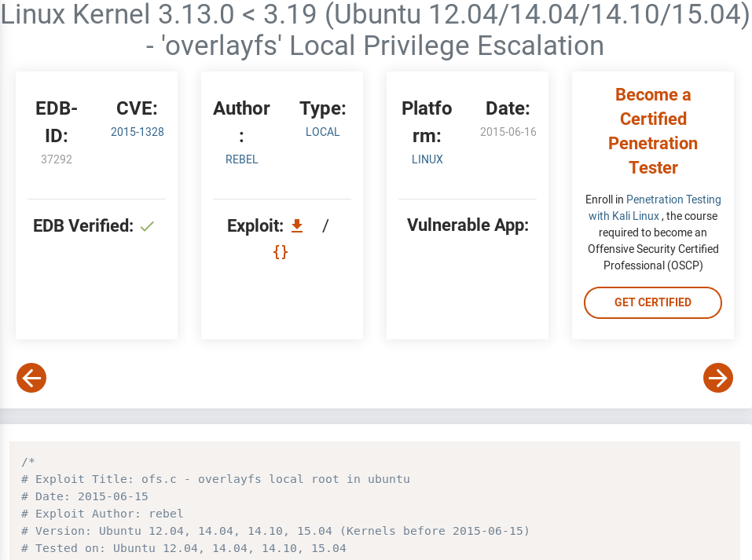
  

**sploit words, root.  no flag though :P**
 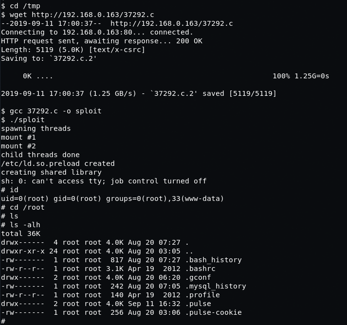
  
