## Goal #
root

## Download #
[https://www.vulnhub.com/entry/symfonos-1,322/](https://www.vulnhub.com/entry/symfonos-1,322/)

## Walkthrough #

**nmap**
 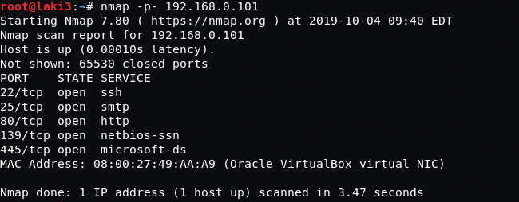
  

**default 80**
 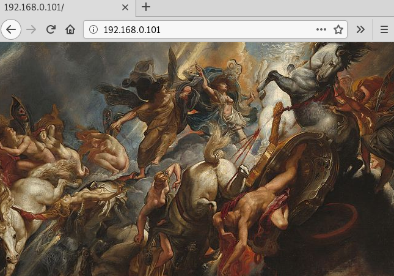
  

**dirb...nothing**
 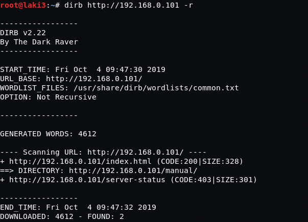
  

**enum4linux shows some shares and a user**
 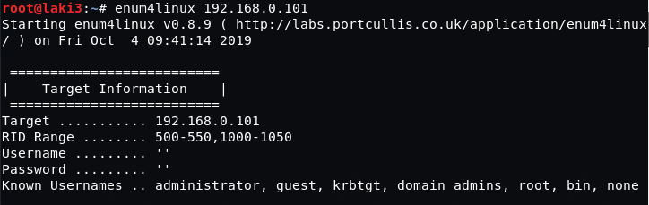
 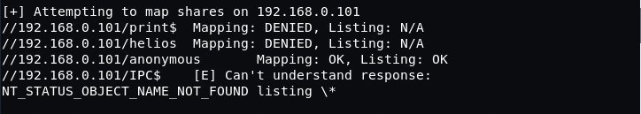
 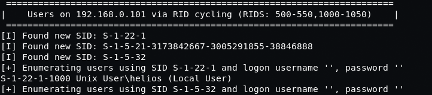
  

**smb to anonymous reveals password hint**
 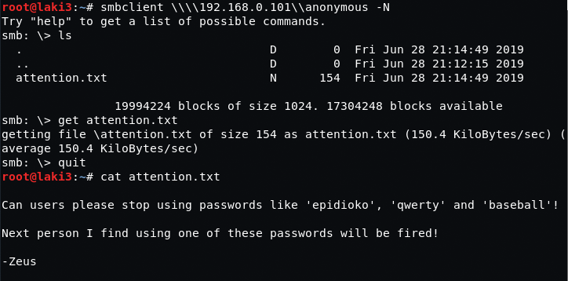
  

**smb to helios is accessible via one of the passwords revealed.  gives web directory**
 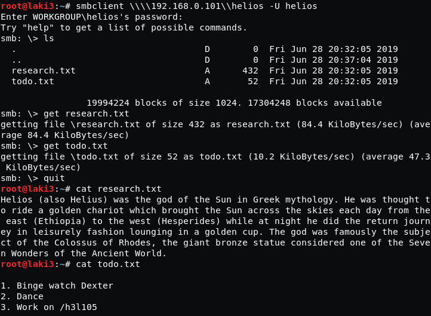
  

**wordpress revealed.  updated hosts file as all links were symfonos.local**
 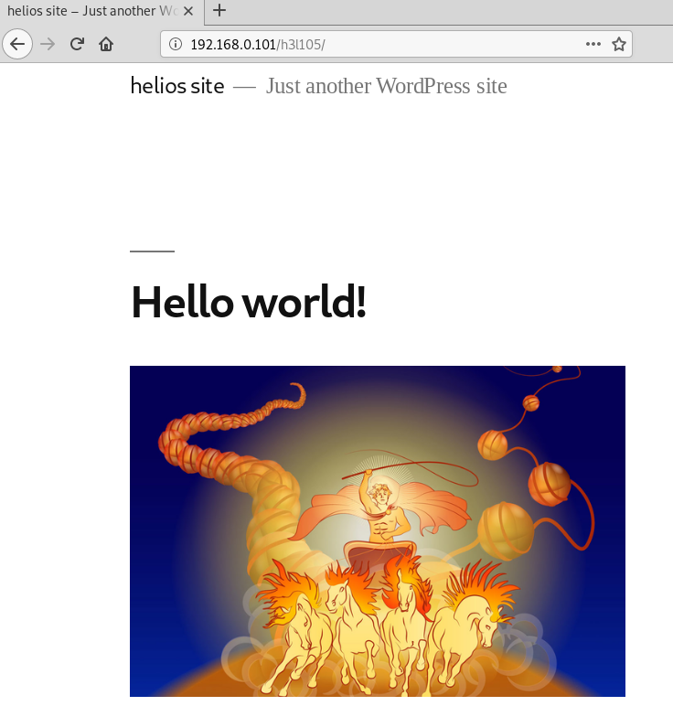
  

**wpscan reveals no security vulnerabilities, but a plugin mailmasta**
 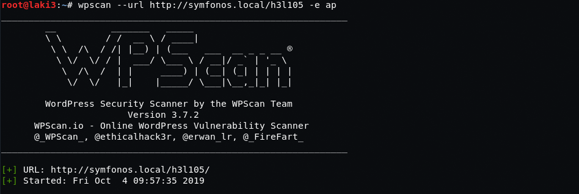
 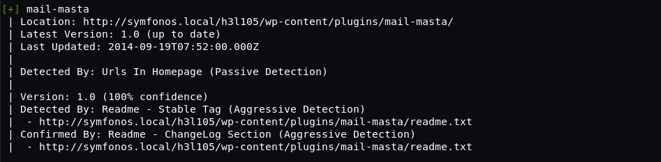
  

**quick google found local file inclusion exploit**
 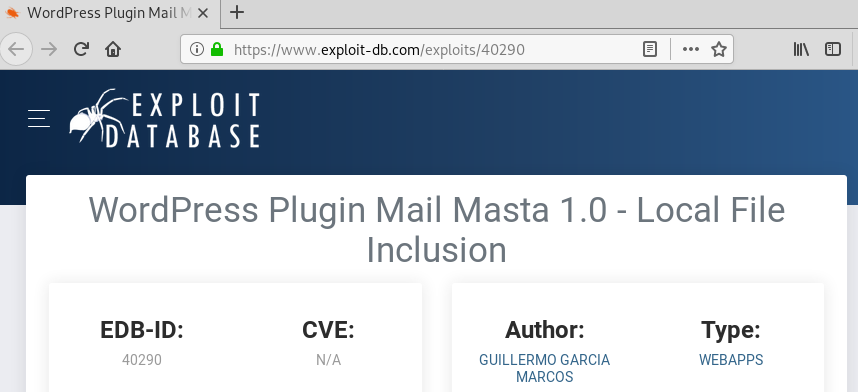
  

**with exploit, able to read /etc/passwd**
 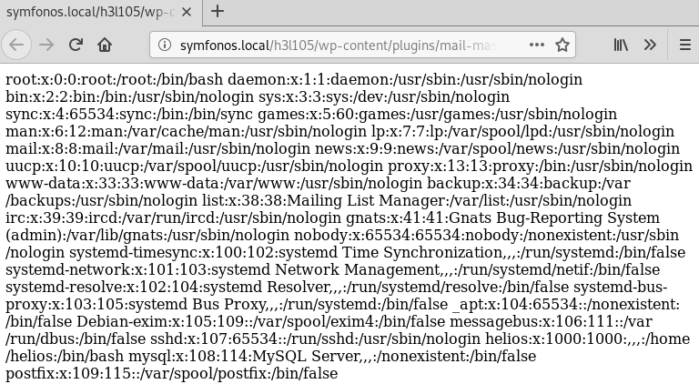
  

**able also read the mail log for helios**
 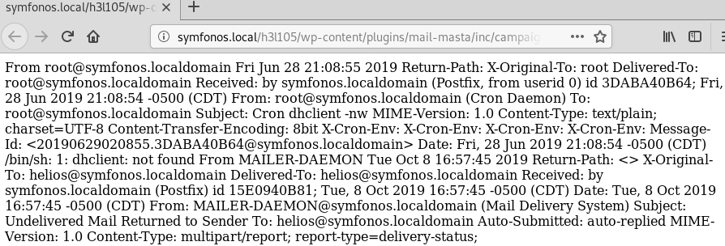
  

**with port 25 open, we send a php command one liner to get rce**
 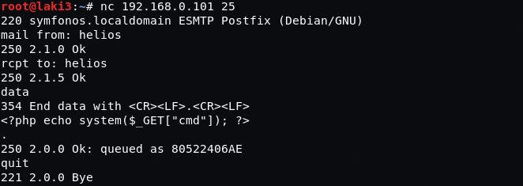
  

**rce working as /etc/passwd can be read using cat**
 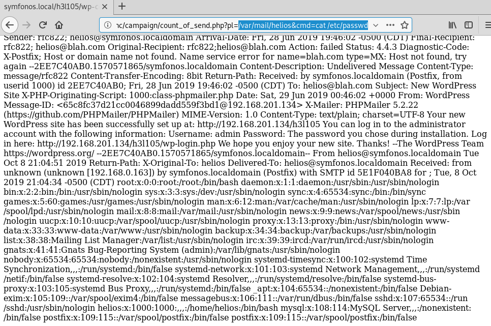
  

**setup listener and call invoke, we have a reverse shell**
 
 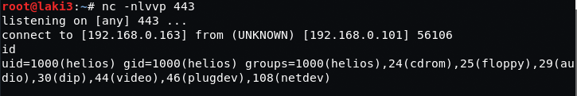
  

**looking at system, we find a suid file /opt/statuscheck**
 
  

**checking file it calls a web page and further with strings, it's a curl command**
 
 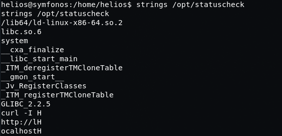
  

**creating a file named curl in /tmp to call /bin/bash and updating path, we get root**
 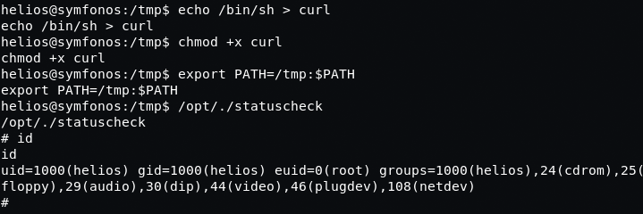
  

**root flag**
 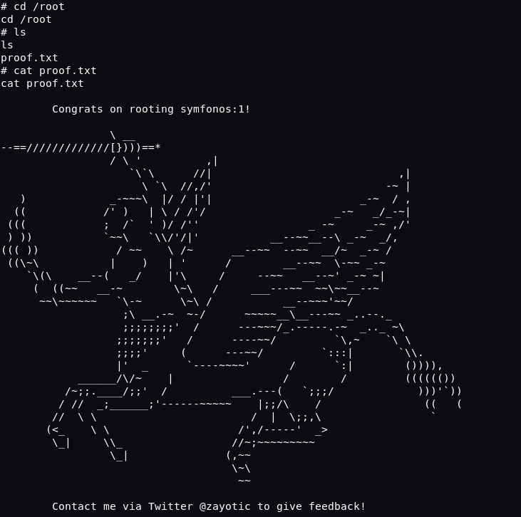
  
