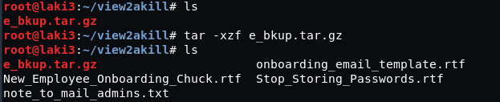
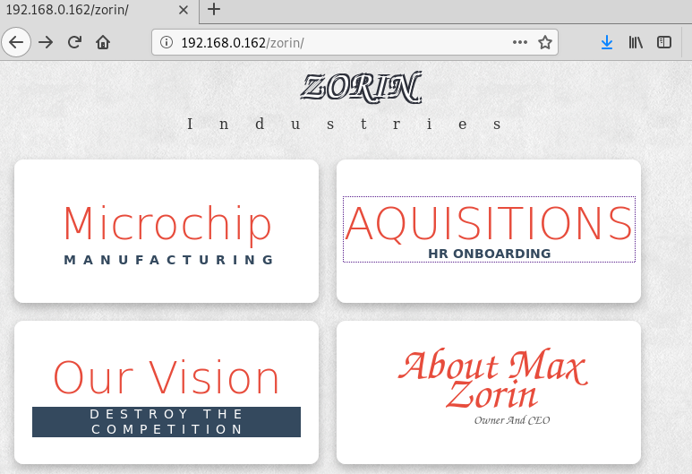
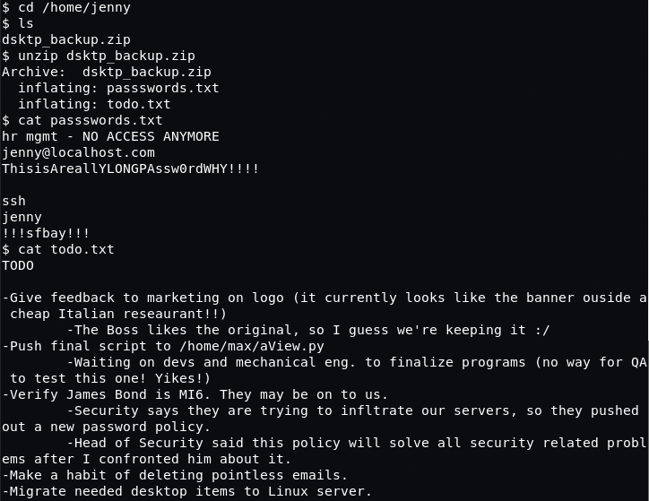
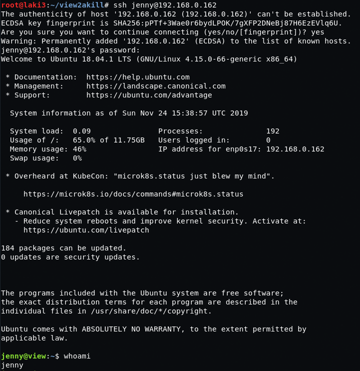
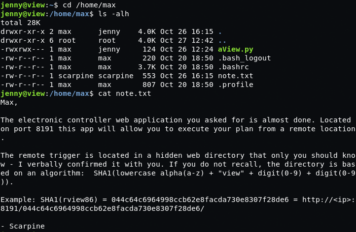

## Goal #
root

## Download #
[https://www.vulnhub.com/entry/view2akill-1,387/](https://www.vulnhub.com/entry/view2akill-1,387/)

## Walkthrough #

**nmap**
 
  

**default 80**
 
  

**robots.txt gives a bunch, joomla and defense hold nothing**
 
  

**dev holds backup files **
  
  

**extracted they give key information on logging in**
 
  
  

**looking at zorin we find an hr section pointing to new directory with a login**
  
  
 
  

**looking back at new employee onboarding file it tells how to login as chuck** 
**just need to find two pieces of information found from /dev directory**
  
 
  

**we can login as chuck**
 
  

**looking back new employee onboarding file again we know we have to update cissp details** 
**as they're checked...i smell beefxss.  setup and success**
  
 
  

**we grab the php session id and setup burp to replace**
 
  

**doing so we are now alice**
 
  

**easily find an upload exploit for this product**
 
  

**create the doc, set burp to intercept, upload, and change information to use php ext**
  
  
 
  

**reverse shell needs to be setup and quickly view the uploaded file before deleted**
  
 
  

**after revese shell we find zip file under jenny and her ssh password, successful ssh**
  
 
  

**ssh as jenny we find a python file under max profile that jenny can update** 
**also how to find a directory under port 8191**
 
  

**simple python script created to create directories test**
 
  

**running python script to output file and using wfuzz we find interesting directories**
 
  

**looking at directory it we can execute the app and gives an output**
  
 
  

**output on web app is same as python file in max's files**
 
  

**update python file to create bind shell**
 
  

**after running web app and connecting using netcat, we are root**
 
  

**running flag script we are directed to visit web page on 8007 port**
 
  

**root flag**
 
  

