### <u>Intro</u>
*Location: Train Station*<br>

#### Initial Dialog - Santa:
>
Welcome to the North Pole and KringleCon 2!
Last year, KringleCon hosted over 17,500 attendees and my castle got a little crowded.
We moved the event to Elf University (Elf U for short), the North Pole’s largest venue.
Please feel free to explore, watch talks, and enjoy the con!
>

<br>

### <u>Console - Escape Ed</u>
*Location: Train Station*

#### Initial Dialog - Bushy Evergreen:
>
Hi, I'm Bushy Evergreen. Welcome to Elf U!
I'm glad you're here. I'm the target of a terrible trick.
Pepper Minstix is at it again, sticking me in a text editor.
Pepper is forcing me to learn ed.
Even the hint is ugly. Why can't I just use Gedit?
Please help me just quit the grinchy thing.
>

<br>

#### Technical:
**Tried Ctrl-C and Ctrl-Z, but did not work**<br>
**Entering 'q' and select enter worked :)**<br>
<br>
	
#### Completed Dialog - Bushy Evergreen:
>
Wow, that was much easier than I'd thought.
Maybe I don't need a clunky GUI after all!
Have you taken a look at the password spray attack artifacts?
I'll bet that DeepBlueCLI tool is helpful.
You can check it out on GitHub.
It was written by that Eric Conrad.
He lives in Maine - not too far from here!
>

### <u>Objective 0 - Talk To Santa</u>
>
Enter the campus quad and talk to Santa
>

*Location: The Quad*

<br><br>
<br>

#### Completed Dialog - Santa:
>
This is a little embarrassing, but I need your help.
Our KringleCon turtle dove mascots are missing!
They probably just wandered off.
Can you please help find them?
To help you search for them and get acquainted with KringleCon, I’ve created some objectives for you. You can see them in your badge.
Where's your badge? Oh! It's that big, circle emblem on your chest - give it a tap!
We made them in two flavors - one for our new guests, and one for those who've attended both KringleCons.
After you find the Turtle Doves and complete objectives 2-5, please come back and let me know.
Not sure where to start? Try hopping around campus and talking to some elves.
If you help my elves with some quicker problems, they'll probably remember clues for the objectives.
>

### <u>Objective 1 - Find the Turtle Doves</u>
>
Find the missing turtle doves
>

*Location: Student Union*

<br>


#### Completed Dialog - Santa:
>
Thank you for finding Jane and Michael, our two turtle doves!
I’ve got an uneasy feeling about how they disappeared.
Turtle doves wouldn’t wander off like that.
Someone must have stolen them! Please help us find the thief!
It’s a moral imperative!
I think you should look for an entrance to the steam tunnels and solve Challenge 6 and 7 too!
Gosh, I can’t help but think:
Winds in the East, snow coming in…
Like something is brewing and about to begin!
Can’t put my finger on what lies in store,
But I fear what’s to happen all happened before!
>

<br>

### <u>Objective 2 - Unredact Threatening Document</u>
>
Someone sent a threatening letter to Elf University. What is the first word in ALL CAPS in the subject line of the letter? Please find the letter in the Quad.
>

*Location: The Quad*

#### Technical:
**Open the document in PDF viewer in Linux**<br>
**Select the redacted words and you are able to view**<br>
**All capitalized word is DEMAND**<br>

<br>

### <u>Console - Smart Braces</u>
*Location: Student Union*

#### Initial Dialog - Kent Tinseltooth:
>
OK, this is starting to freak me out!
Oh sorry, I'm Kent Tinseltooth. My Smart Braces are acting up.
Do... Do you ever get the feeling you can hear things? Like, voices?
I know, I sound crazy, but ever since I got these... Oh!
OK, this is starting to freak me out!
Oh sorry, I'm Kent Tinseltooth. My Smart Braces are acting up.
Do... Do you ever get the feeling you can hear things? Like, voices?
I know, I sound crazy, but ever since I got these... Oh!
Do you think you could take a look at my Smart Braces terminal?
I'll bet you can keep other students out of my head, so to speak.
It might just take a bit of Iptables work.
>

<br>

#### Technical:
**After letting the dialog play through we are told of a file to review**<br>
<br>
**Viewing the file we are told to enter a set amount of iptables rules**<br>
<br>
**As we know these are pvivileged commands, we check sudo and see we can enter the commands using sudo no password**<br>
<br>
**After entering the rules we wait until the rules are checked by Kent**<br>
<br>


#### Completed Dialog - Kent Tinseltooth:
>
Oh thank you! It's so nice to be back in my own head again. Er, alone.
By the way, have you tried to get into the crate in the Student Union? It has an interesting set of locks.
There are funny rhymes, references to perspective, and odd mentions of eggs!
And if you think the stuff in your browser looks strange, you should see the page source...
Special tools? No, I don't think you'll need any extra tooling for those locks.
BUT - I'm pretty sure you'll need to use Chrome's developer tools for that one.
Or sorry, you're a Firefox fan?
Yeah, Safari's fine too - I just have an ineffible hunger for a physical Esc key.
Edge? That's cool. Hm? No no, I was thinking of an unrelated thing.
Curl fan? Right on! Just remember: the Windows one doesn't like double quotes.
Old school, huh? Oh sure - I've got what you need right here...
>

<br>

### <u>Console - Linux Path</u>
*Location: Hermey Hall*

#### Initial Dialog - SugarPlum Mary
>
Oh me oh my - I need some help!
I need to review some files in my Linux terminal, but I can't get a file listing.
I know the command is ls, but it's really acting up.
Do you think you could help me out? As you work on this, think about these questions:
    Do the words in green have special significance?
    How can I find a file with a specific name?
    What happens if there are multiple executables with the same name in my $PATH?
...
Oh me oh my - I need some help!
I need to review some files in my Linux terminal, but I can't get a file listing.
>


#### Technical:
**There are lots of hints highlighted in green to find the correct ls**<br>
<br>
**Simply entering 'ls' doesn't work. We assume the usual location of the command and enter '/bin/ls' and we can print the directory**<br>
<br>
**We read the file 'rejected-elfu-logos.txt'**<br>
<br>
**Bonus: If we look at hidden files using '/bin/ls -alh' we find '.elfscream.txt'**<br>
<br>


#### Completed Dialog - SugarPlum Mary
>
Oh there they are! Now I can delete them. Thanks!
Have you tried the Sysmon and EQL challenge?
If you aren't familiar with Sysmon, Carlos Perez has some great info about it.
Haven't heard of the Event Query Language?
Check out some of Ross Wolf's work on EQL or that blog post by Josh Wright in your badge.
>

### <u>Console - Nyanshell</u>
*Location: Speaker UNpreparedness Room*

#### Initial Dialog - Alabaster Snowball
>
Welcome to the Speaker UNpreparedness Room!
My name's Alabaster Snowball and I could use a hand.
I'm trying to log into this terminal, but something's gone horribly wrong.
Every time I try to log in, I get accosted with ... a hatted cat and a toaster pastry?
I thought my shell was Bash, not flying feline.
When I try to overwrite it with something else, I get permission errors.
Have you heard any chatter about immutable files? And what is sudo -l telling me?
Who would do such a thing?? Well, it IS a good looking cat.
Have you heard about the Frido Sleigh contest?
There are some serious prizes up for grabs.
The content is strictly for elves. Only elves can pass the CAPTEHA challenge required to enter.
I heard there was a talk at KCII about using machine learning to defeat challenges like this.
I don't think anything could ever beat an elf though!
>

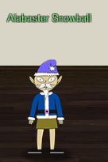


#### Technical:
**We know we can 'su' as alabaster_snowball as we have the password**<br>
<br>
**Doing so presents us with a forever running/flying magical nyan cat**<br>
<br>
**We check if we can do anything with a priviledges with 'sudo -l'**<br>
<br>
**We lookup what [chattr](https://linux.die.net/man/1/chattr) does and find we can change file attributes...hmmm**<br>
**Looking around we find an interesting file 'entrypoint.sh' at top of file system**<br>
<br>
**Inspection of the file shows '/bin/nsh' cannot be changed due to chattr made it immuntable '+i'**<br>
**We verify this using the command 'lsattr' on '/bin/nsh'**<br>
<br>
**So let's make it so we can make changes with '-i'**<br>
<br>
**chattr only allows to append to a file and that's not gonna work, but if we look at the permissions we see we can write to the file :)**<br>
<br>
**We simple cat out bash and overwrite the file and then su as alabaster_snowball**<br>


### <u>Objective 3 - Windows Log Analysis: Evaluate Attack Outcome</u>
>
We're seeing attacks against the Elf U domain! Using [the event log data](https://downloads.elfu.org/Security.evtx.zip), identify the user account that the attacker compromised using a password spray attack. Bushy Evergreen is hanging out in the train station and may be able to help you out.
>

[DeepBlueCLI Powershell Script](https://github.com/sans-blue-team/DeepBlueCLI/archive/master.zip)<br>

#### Technical:
**After downloading/extracting files we check out the post by Eric Conrad**<br>
**While there might have been another way of doing this objective, I simply used the tool to export to CSV**<br>
<br>
**Then opened the file in Notepad++ and we see towards the end a whole bunch of Total Logon Failures 77**<br>
**Since we know it's a Password Spray attack and an account was compromised it stands that that account would be one less than 77 :)**<br>
<br>
**With that 'supatree' account is the one that was compromised**<br>


### <u>Objective 4 - Windows Log Analysis: Determine Attacker Technique</u>
>
Using [these normalized Sysmon logs](https://downloads.elfu.org/sysmon-data.json.zip), identify the tool the attacker used to retrieve domain password hashes from the lsass.exe process. For hints on achieving this objective, please visit Hermey Hall and talk with SugarPlum Mary.
>

[EQL Post](https://pen-testing.sans.org/blog/2019/12/10/eql-threat-hunting/)

#### Technical:
**After downloading/extrating the file we look at the post on SANS blog**<br>
**If you actually read the post it tells you the tool used 'ntdsutil'**<br>
<br>
*shrugs*<br>
**Answer is 'ntdsutil'**<br>


### <u>Console - Xmas Cheer Laser</u>
*Location: Hermey Hall / Laboratory*

#### Initial Dialog - Sparkle Redberry
>
I'm Sparkle Redberry and Imma chargin' my laser!
Problem is: the settings are off.
Do you know any PowerShell?
It'd be GREAT if you could hop in and recalibrate this thing.
It spreads holiday cheer across the Earth ...
... when it's working!
...
I'm Sparkle Redberry and Imma chargin' my laser!
I'm Sparkle Redberry and Imma chargin' my laser!
Problem is: the settings are off.
>


#### Technical:
**We're given a PowerShell console and using the Web API we need to get the laser to output 5 Mega-Jollies per liter and the settings are hidden in various places**<br>
<br>
**We see how to work the laser by invoking the command shown on welcome screen**<br>
<br>
**The file listed in the welcome message hints to looking at the history so we invoke history using 'Get-History | fl'**<br>
<br>
**We find the angle value and another hint that suggests to look at system environment variables**<br>
<br>
**Viewing the variables with command below and then formated, we get another hint to recursively search on LastWriteTime in '/etc'**<br>
<br>
<br>
**Using 'Get-ChildItem -R | sort LastWriteTime' we find the file 'archive' located in '/etc/apt'**<br>
<br>
**We'll need to expand this so we'll do it in '/tmp', but we'll create a new directory using 'new-item -itemtype directory /tmp/bz' so the files aren't mixed with others**<br><br>
**Then we extract the file to this new directory using 'Expand-Archive -path /etc/apt/archive -DestinationPath /tmp/bz'**<br>
<br>
**Doing so we find a new directory called 'refraction' with two new files**<br>
<br>
**The 'runme.elf' file needs to be executable and then we can run giving us the refraction value**<br>
<br>
**If we view the 'riddle' file we we're given an MD5 hash that is a hash of a file in '/home/elf'**<br>
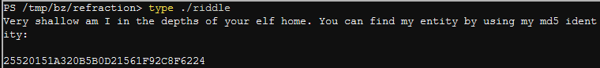<br>
**We find the new file and the contents reveals the temperature value**<br>
<br>
**Next hint is to recursievly search through '/home/elf/depths' and thousands of txt files.  We can do this using 'Get-ChildItem -Recurse ./depths/ -filter *.txt  | % { $_.FullName } | Sort-Object -Property length'**<br><br>
**This gives use a very long path to a randome txt file and viewing it gives us another hint**<br>
<br>
<br>
**We need to kill off specific process that are owned by different users in order listed.**<br>
**We first gather that information, kill them off one by one and then we can view contents of '/shall/see'**
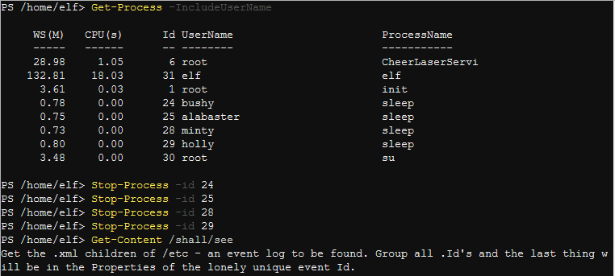<br>
**Next hint is to find an event log with xml extension in '/etc'**<br>
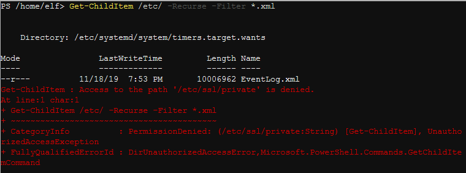<br>
**Then we need to find the unique ID.  This one took a little bit to figure out, but I found that ID 1800 is used twice out of all the other IDs**<br>
<br>
**We then look at the properties of the event and if we look closely, we find the values for the gases**<br>
<br>
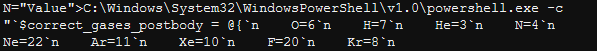<br>
**So now we put it all together**<br>
**1. Turn off Laser**<br>
<br>
**2. Update refraction, temperature, and angle values**<br>
<br>
**3. Update the gases**<br>
<br>
**4. Turn on Laser**<br>
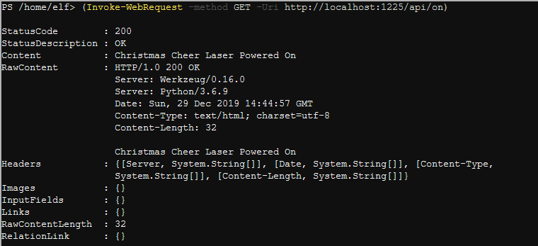<br>
**5. Check**<br>


#### Completed Dialog - Sparkle Redberry
>
You got it - three cheers for cheer!
For objective 5, have you taken a look at our Zeek logs?
Something's gone wrong. But I hear someone named Rita can help us.
Can you and she figure out what happened?
>

### <u>Objective 5 - Network Log Analysis: Determine Compromised System</u>
>
The attacks don't stop! Can you help identify the IP address of the malware-infected system using these [Zeek Logs](https://downloads.elfu.org/elfu-zeeklogs.zip)? For hints on achieving this objective, please visit the Laboratory and talk with Sparkle Redberry.
>

#### Technical
**After downloading/extracting files, we find a lot of logs however we see there is an interface using [RITA](https://github.com/activecm/rita)**<br>
<br>
**Looking at options available we see 'Long Connections' which is a good indication of malware**<br>
<br>
**Using first IP 192.168.134.130 from this list we complete the objective**<br>


### <u>Objective 6 - Splunk</u>
>
Access [https://splunk.elfu.org/](https://splunk.elfu.org/) as elf with password elfsocks. What was the message for Kent that the adversary embedded in this attack? The SOC folks at that link will help you along! For hints on achieving this objective, please visit the Laboratory in Hermey Hall and talk with Prof. Banas.
>

#### Intial Dialog - Professor Banas
>
Hi, I'm Dr. Banas, professor of Cheerology at Elf University.
This term, I'm teaching "HOL 404: The Search for Holiday Cheer in Popular Culture," and I've had quite a shock!
I was at home enjoying a nice cup of Gløgg when I had a call from Kent, one of my students who interns at the Elf U SOC.
Kent said that my computer has been hacking other computers on campus and that I needed to fix it ASAP!
If I don't, he will have to report the incident to the boss of the SOC.
Apparently, I can find out more information from this website https://splunk.elfu.org/ with the username: elf / Password: elfsocks.
I don't know anything about computer security. Can you please help me?
>


#### Technical:
**After logging in we are greeted with a welcome message with general guidance**<br>
<br>
<br>
**Question 1:** What is the short host name of Professor Banas' computer?<br><br>
**Answer 1:** sweetums<br><br>
**We do a quick query all and find their is only one field name 'ComputerName'**<br>
<br>

**Question 2:** What is the name of the sensitive file that was likely accessed and copied by the attacker? Please provide the fully qualified location of the file. (Example: C:\temp\report.pdf)<br><br>
**Answer 2:** 'C:\Users\cbanas\Documents\Naughty_and_Nice_2019_draft.txt'<br><br>
**The helpful chats indicate the professor was close with Santa.  So we do a query all plus 'santa' and find a file that could be of importance :)**<br>
<br>

**Question 3:** What is the fully-qualified domain name(FQDN) of the command and control(C2) server? (Example: badguy.baddies.com)<br><br>
**Answer 3:** '144.202.46.214.vultr.com'<br><br>
**The helpful chat suggests to look at the additional fields after the query.  Looking there is only one DestinationHostname**<br>
<br>

**Question 4:** What document is involved with launching the malicious PowerShell code? Please provide just the filename. (Example: results.txt)<br><br>
**Answer 4:** 19th Century Holiday Cheer Assignment.docm<br><br>
**Hint is in the questions of what "document" and so we do a wildcard search for known document extensions and find a suspicious macro one**<br>
<br>

**Question 5:** How many unique email addresses were used to send Holiday Cheer essays to Professor Banas? Please provide the numeric value. (Example: 1)<br><br>
**Answer 5:** 21<br><br>
**Informed how to search on stoQ and given the Subject, we're able to pull stats based on that information and various fields to get the number**<br>
<br>

**Question 6:** What was the password for the zip archive that contained the suspicious file?<br><br>
**Answer: 6:** 123456789<br><br>
**Since we know the file name we search for it and then look at the SMTP body for the answer**<br>
<br>
<br>

**Question 7:** What email address did the suspicious file come from?<br><br>
**Answer 7:** Bradly.Buttercups@eIfu.org<br><br>
**Using the same query we look at the SMTP From field**<br>
<br>

**Challenge Question:** What was the message for Kent that the adversary embedded in this attack?<br><br>
**Challenge Answer:** Kent you are so unfair. And we were going to make you the king of the Winter Carnival.<br><br>
**Getting some direction from the helpful chat there we start with what we already know, the email from Bradly Buttercups**<br>
<br>

**We then add to our search by the recommended hint.  We see the .docm file listed at '/home/ubuntu/archive/c/6/e/1/7/c6e175f5b8048c771b3a3fac5f3295d2032524af/19th Century Holiday Cheer Assignment.docm'**<br>
<br>

**Using the File Archive, we browse to this file and download.  Viewing the file we're told to look at core.xml.**
<br>
<br>

**We find this file at '/home/ubuntu/archive/f/f/1/e/a/ff1ea6f13be3faabd0da728f514deb7fe3577cc4/core.xml'**<br>
<br>

**And we complete the objective**<br>
<br>
<br>

#### Completed Dialog - Professor Banas
>
Oh, thanks so much for your help! Sorry I was freaking out.
I've got to talk to Kent about using my email again...
...and picking up my dry cleaning.
>

### <u>Console - Mongo Pilfer</u>
*Location: Hermey Hall / NetWars*

#### Initial Dialog - Holly Evergreen
>
Hey! It's me, Holly Evergreen! My teacher has been locked out of the quiz database and can't remember the right solution.
Without access to the answer, none of our quizzes will get graded.
Can we help get back in to find that solution?
I tried lsof -i, but that tool doesn't seem to be installed.
I think there's a tool like ps that'll help too. What are the flags I need?
Either way, you'll need to know a teensy bit of Mongo once you're in.
Pretty please find us the solution to the quiz!
>


#### Technical
**Trying to connect to the Mongo DB using 'mongo' gives us an error stating it's not running on default port**<br>
<br>
**Using netstat we find the port and connect**<br>
<br>
**Looking at the collections we see redherring and of course there's nothing there**<br>
<br>
**Let's look at the DBs, switch to elfu and then show the collections**<br>
<br>
**And 'solution' looks like the right one :)**<br>
<br>
**From there we just need to run the command between the asterisks**<br>
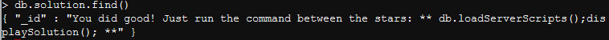<br>
**We get a congratultions**<br>


#### Completed Dialog - Holly Evergreen
>
Woohoo! Fantabulous! I'll be the coolest elf in class.
On a completely unrelated note, digital rights management can bring a hacking elf down.
That ElfScrow one can really be a hassle.
It's a good thing Ron Bowes is giving a talk on reverse engineering!
That guy knows how to rip a thing apart. It's like he breathes opcodes!
>

### Console - Frosty Keypad
*Location: The Quad*

#### Initial Dialog - Tangle Coalbox
>
Hey kid, it's me, Tangle Coalbox.
I'm sleuthing again, and I could use your help.
Ya see, this here number lock's been popped by someone.
I think I know who, but it'd sure be great if you could open this up for me.
I've got a few clues for you.
    One digit is repeated once.
    The code is a prime number.
    You can probably tell by looking at the keypad which buttons are used.
>


#### Technical
**Looking at the key pad we know 1, 3 and 7 are used**<br>
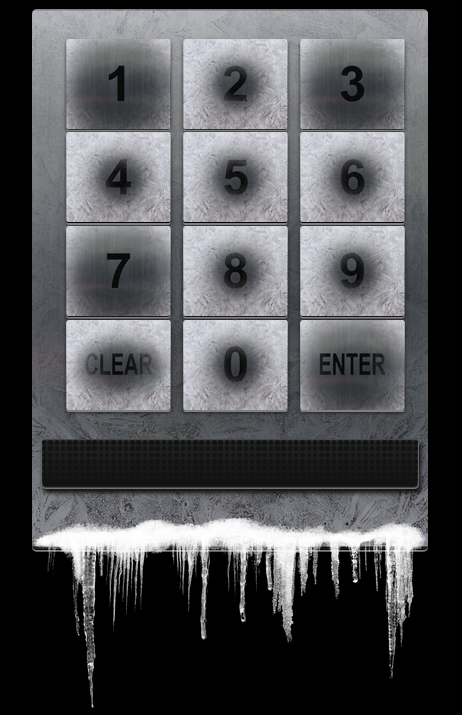<br>
**On a whim, we try 1337 and doesn't work**<br>
**Multiple ways of doing this including Python to check prime numbers, etc, etc. Tried reversing the code to 7331 and it worked :)**<br>
<br>
<br>
*shrugs*

#### Completed Dialog - Tangle Coalbox
>
Yep, that's it. Thanks for the assist, gumshoe.
Hey, if you think you can help with another problem, Prof. Banas could use a hand too.
Head west to the other side of the quad into Hermey Hall and find him in the Laboratory.
>

### <u>Console - Graylog</u>
*Location: Dorm*

#### Initial Dialog - Pepper Minstix
>
It's me - Pepper Minstix.
Normally I'm jollier, but this Graylog has me a bit mystified.
Have you used Graylog before? It is a log management system based on Elasticsearch, MongoDB, and Scala.
Some Elf U computers were hacked, and I've been tasked with performing incident response.
Can you help me fill out the incident response report using our instance of Graylog?
It's probably helpful if you know a few things about Graylog.
Event IDs and Sysmon are important too. Have you spent time with those?
Don't worry - I'm sure you can figure this all out for me!
Click on the All messages Link to access the Graylog search interface!
Make sure you are searching in all messages!
The Elf U Graylog server has an integrated incident response reporting system. Just mouse-over the box in the lower-right corner.
Login with the username elfustudent and password elfustudent.
>

<br>

#### Technical
**Credentials elfustudent:elfustudent**<br>
**[Link](http://docs.graylog.org/en/3.1/pages/queries.html) on how to query Graylog**<br>
**In the lower right-hand corner are 10 questions that need to be answered by searching through the logs**<br>

<br>
<br>
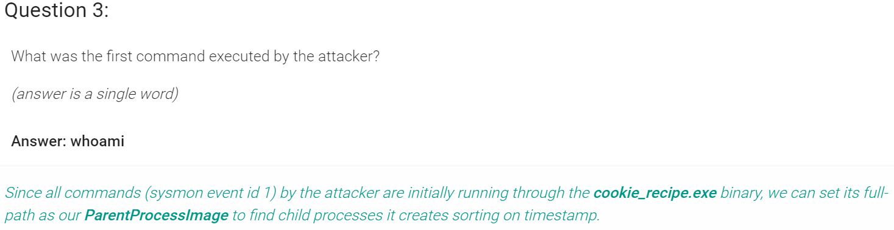<br>
<br>
<br>
<br>
<br>
<br>
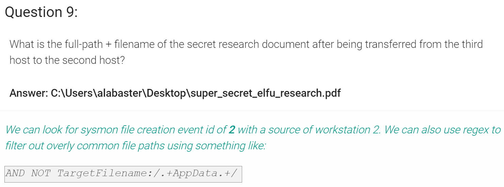<br>
<br>

**Completed**<br>
<br>

#### Completed Dialog - Pepper Minstix
>
That's it - hooray!
Have you had any luck retrieving scraps of paper from the Elf U server?
You might want to look into SQL injection techniques.
OWASP is always a good resource for web attacks.
For blind SQLi, I've heard Sqlmap is a great tool.
In certain circumstances though, you need custom tamper scripts to get things going!
>

### <u>Console - Holiday Hack Trail</u>
*Location: Dorm*

##### Initial Dialog - Minty Candycane
>
Hi! I'm Minty Candycane!
I just LOVE this old game!
I found it on a 5 1/4" floppy in the attic.
You should give it a go!
If you get stuck at all, check out this year's talks.
One is about web application penetration testing.
Good luck, and don't get dysentery!
>

<br>
<br>

#### Technical
**Easy:**<br>
**1. buy any amount and go 8000 distance without dying**<br>
<br>
**2. notice parameters are in url**<br>
<br>
**4. change to 8000 distance and select arrow**<br>
<br>
**5. distance now shows 0**<br>
<br>
**6. select go and win**<br>
<br>

**Medium:**<br>
**1. buy whatever and go 8000 distance without dying**<br>
**2. notice there are no parameters in url now**<br>
<br>
**3. select intercept on burp, select go on gam, switch to burp to see request**<br>
<br>
**4. on intercept change distance to 8000 and forward request**<br>
<br>
**5. win game**<br>
<br>

**Hard:**<br>
**1. buy any amount and go 8000 distance without dying**<br>
**2. so now there is nothing in url and simply changing parameter in burp fails and gives bad hash error**<br>
<br>
<br>
**3. looking closer we see that medium challenge had "HASH" as the param value, this challenge has an actual hash**<br>
<br>
**4. looking even closer this hash changes each time**<br>
**5. we throw the hash at crackstation and there is a find**<br>
<br>
**6. we go back and watch trailhead video https://www.youtube.com/watch?v=0T6-DQtzCgM**<br>
**7. so we try again and get hash 08d98638c6fcd194a4b1e6992063e944 which equals 682 and then d4c2e4a3297fe25a71d030b67eb83bfc which equals 728.  results keep going up...**<br>
<br>
**8. after some time i started subtracting numbers from all the values in the post request. turns out if you add up the parameters below, they equal the number given from the hash**<br>
<br>
**9. so starting over, we grab the new hash and value (585)**<br>
<br>
**10. just need update the distance to 7999 add to previous value and generate the new hash**<br>
<br>
**11. we update burp with the two new values**<br>
<br>
**12. select go and win**<br>
<br>

Some calculations from burp request:
>
money=450
distance=164
curmonth=9
curday=4
reindeer=3
runners=4
ammo=12
meds=4
food=78
total=728
hash=d4c2e4a3297fe25a71d030b67eb83bfc
>

#### Completed Dialog - Minty Candycane
>
You made it - congrats!
Have you played with the key grinder in my room? Check it out!
It turns out: if you have a good image of a key, you can physically copy it.
Maybe you'll see someone hopping around with a key here on campus.
Sometimes you can find it in the Network tab of the browser console.
Deviant has a great talk on it at this year's Con.
He even has a collection of key bitting templates for common vendors like Kwikset, Schlage, and Yale.
>

### <u>Objective 7 - Get Access To The Steam Tunnels</u>
>
Gain access to the steam tunnels. Who took the turtle doves? Please tell us their first and last name. For hints on achieving this objective, please visit Minty's dorm room and talk with Minty Candy Cane.
>

*Location: Dorm*

#### Technical:
**When entering the room an individual runs off to a room and behind a locked door. So the first part of objective 7 seems like we must create a key using the ginder that will fit the lock.**<br><br>
**Now to do this I left the room and returned.  The person appeared again, but before they left I quickly grabbed a screenshot.**<br><br>
**This provide helpful as this person is wearing a key.**<br>
<br>
**So my process was to enlarge that screenshot and rotate so that I could cut a key that would match.**<br>
<br>
**Turns out it worked and the magic number/cut is 122520 and door opens.**<br>
<br>
<br>
**Once we enter we are in the steam tunnels and there is the person that ran off, Krampus Hollyfeld.**<br>
**After talking with him, he states he is the person that borrowed the two turtle doves.**<br>
**Objective 7 completed.**<br>
<br>

### <u>Objective 8 - Bypassing the Frido Sleigh CAPTEHA</u>
>
Help Krampus beat the Frido Sleigh contest. For hints on achieving this objective, please talk with Alabaster Snowball in the Speaker Unpreparedness Room.
>

*Location: Steam Tunnels*

#### Initial Dialog - Krampus  Hollyfeld
>
Hello there! I’m Krampus Hollyfeld.
I maintain the steam tunnels underneath Elf U,
Keeping all the elves warm and jolly.
Though I spend my time in the tunnels and smoke,
In this whole wide world, there's no happier bloke!
Yes, I borrowed Santa’s turtle doves for just a bit.
Someone left some scraps of paper near that fireplace, which is a big fire hazard.
I sent the turtle doves to fetch the paper scraps.
But, before I can tell you more, I need to know that I can trust you.
Tell you what – if you can help me beat the [Frido Sleigh](https://fridosleigh.com/) contest (Objective 8), then I'll know I can trust you.
The contest is here on my screen and at [fridosleigh.com](https://fridosleigh.com/).
No purchase necessary, enter as often as you want, so I am!
They set up the rules, and lately, I have come to realize that I have certain materialistic, cookie needs.
Unfortunately, it's restricted to elves only, and I can't bypass the CAPTEHA.
(That's Completely Automated Public Turing test to tell Elves and Humans Apart.)
I've already cataloged [12,000 images](https://downloads.elfu.org/capteha_images.tar.gz) and decoded the [API interface](https://downloads.elfu.org/capteha_api.py).
Can you help me bypass the CAPTEHA and submit lots of entries?
>

<br><br>

#### Technical
**Watch talk by Chris Davis on [Machine Learning](http://www.youtube.com/watch?v=jmVPLwjm_zs)**<br>
**First Download images and use the 'retrain.py' script that can be found [here](https://raw.githubusercontent.com/chrisjd20/img_rec_tf_ml_demo/master/retrain.py)**<br>
**Once images are trained we update the 'predict_images_using_trained_model.py' script that can be found [here](https://raw.githubusercontent.com/chrisjd20/img_rec_tf_ml_demo/master/predict_images_using_trained_model.py)**<br>
**Once we have that working and it properly recognizes the images correct, we need to apply that same logic to the challenge**<br><br>

**The script is basically using an api call to download base64 encoded images and their UUIDs, 100 of them to be exact**<br>
**Without having to explain this too thoroughly, we basically need to do the following by updating our script:**<br>
**1. download those base64 images and decode them**<br>
**2. save them to file with the UUID names**<br>
**3. then use the predict images script to identify the images and beat the capteha**<br><br>
***updated code below***<br>

**After we get that working we update the script with our real email address and wait**<br>
**Running the script will submit a lot of entries**<br>
<br><br>

**From there we get an email confirmation that it worked :)**<br>
<br><br>


Updated Code:  [final_capteha_api.py](../ctfs/hh19/code/final_capteha_api.py)
```
#!/usr/bin/env python3
# Fridosleigh.com CAPTEHA API - Made by Krampus Hollyfeld
import requests
import json
import sys
import base64
import os
import shutil
import glob

def main():
    yourREALemailAddress = "YourRealEmail@SomeRealEmailDomain.RealTLD"

    # Creating a session to handle cookies
    s = requests.Session()
    url = "https://fridosleigh.com/"

    json_resp = json.loads(s.get("{}api/capteha/request".format(url)).text)
    b64_images = json_resp['images']                    # A list of dictionaries eaching containing the keys 'base64' and 'uuid'
    challenge_image_type = json_resp['select_type'].split(',')     # The Image types the CAPTEHA Challenge is looking for.
    challenge_image_types = [challenge_image_type[0].strip(), challenge_image_type[1].strip(), challenge_image_type[2].replace(' and ','').strip()] # cleaning and formatting

	# begin custom...err junk code;
    hhimgs = ([img['base64'] for img in b64_images])
    hhuuids = ([img['uuid'] for img in b64_images])
    for index, (item1, item2) in enumerate(zip(hhimgs, hhuuids)):
        filename = '{}.txt'.format(item2)
        with open(filename, 'w') as f_out:
            f_out.write('{}\n'.format(item1))

    for index, (item1, item2) in enumerate(zip(hhimgs, hhuuids)):
        filename = '{}.txt'.format(item2)
        filename2 = '{}.png'.format(item2)
        with open(filename, 'rb') as fr_out:
            with open(filename2, 'wb') as fw_out:
                fw_out.write(base64.b64decode(fr_out.read()))

    source = '/home/bz/'
    dest = '/home/bz/unknown_images'

    files = glob.iglob(os.path.join(source, "*.png"))
    txtfiles = glob.iglob(os.path.join(source, "*.txt"))

    for file in files:
        shutil.move(file, dest)

    os.system('/home/bz/predict_images_using_trained_model.py')
    var = []
    for i in challenge_image_types:
        if i == "Stockings":
            j = os.listdir(i)
            x1 = ','.join([x.split('.')[0] for x in j])
            var.append(x1)
        elif i == "Presents":
            k = os.listdir(i)
            x2 = ','.join([x.split('.')[0] for x in k])
            var.append(x2)
        elif i == "Ornaments":
            l = os.listdir(i)
            x3 = ','.join([x.split('.')[0] for x in l])
            var.append(x3)
        elif i == "Christmas Trees":
            m = os.listdir(i)
            x4 = ','.join([x.split('.')[0] for x in m])
            var.append(x4)
        elif i == "Candy Canes":
            n = os.listdir(i)
            x5 = ','.join([x.split('.')[0] for x in n])
            var.append(x5)
        elif i == "Santa Hats":
            o = os.listdir(i)
            x6 = ','.join([x.split('.')[0] for x in o])
            var.append(x6)
        else:
            break

    for file in txtfiles:
        os.remove(file)

    final_answer = ','.join(var)
	
	# end the horrible code already;
	
    # This should be JUST a csv list image uuids ML predicted to match the challenge_image_type .
    # final_answer = ','.join( [ img['uuid'] for img in b64_images ] )
    json_resp = json.loads(s.post("{}api/capteha/submit".format(url), data={'answer':final_answer}).text)
    if not json_resp['request']:
        # If it fails just run again. ML might get one wrong occasionally
        print('FAILED MACHINE LEARNING GUESS')
        print('--------------------\nOur ML Guess:\n--------------------\n{}'.format(final_answer))
        print('--------------------\nServer Response:\n--------------------\n{}'.format(json_resp['data']))
        sys.exit(1)

    print('CAPTEHA Solved!')
    # If we get to here, we are successful and can submit a bunch of entries till we win
    userinfo = {
        'name':'Krampus Hollyfeld',
		# replace this with real email
        'email':'real.email.here',
        'age':180,
        'about':"Cause they're so flippin yummy!",
        'favorites':'thickmints'
    }
    # If we win the once-per minute drawing, it will tell us we were emailed.
    # Should be no more than 200 times before we win. If more, somethings wrong.
    entry_response = ''
    entry_count = 1
    while yourREALemailAddress not in entry_response and entry_count < 200:
        print('Submitting lots of entries until we win the contest! Entry #{}'.format(entry_count))
        entry_response = s.post("{}api/entry".format(url), data=userinfo).text
        entry_count += 1
    print(entry_response)


if __name__ == "__main__":
    main()
```

#### Completed Dialog (Krampus Hollyfeld):
>
You did it! Thank you so much. I can trust you!
To help you, I have flashed the firmware in your badge to unlock a useful new feature: magical teleportation through the steam tunnels.
As for those scraps of paper, I scanned those and put the images on my server.
I then threw the paper away.
Unfortunately, I managed to lock out my account on the server.
Hey! You’ve got some great skills. Would you please hack into my system and retrieve the scans?
I give you permission to hack into it, solving Objective 9 in your badge.
And, as long as you're traveling around, be sure to solve any other challenges you happen across.
>

<br><br>

### <u>Objective 9 - Retrieve Scraps of Paper from Server</u>
>
Gain access to the data on the [Student Portal](https://studentportal.elfu.org/) server and retrieve the paper scraps hosted there. What is the name of Santa's cutting-edge sleigh guidance system? For hints on achieving this objective, please visit the dorm and talk with Pepper Minstix.
>

#### Initial Dialog
>
See dialog with Pepper Minstix after completing Graylog Console Challenge
>

#### Technical
**The portal is simply a way to register through a POST request against /application-request.php.  We can then check our status using the /application-check.php, but it's a GET request.  In this request we can see that we pass the email we used to registered with and a Token.  After further inspection we can see this token is coming from /validator.php**<br><br>

**We know we need to use sqlmap, but either through the GET or POST request.  So we need to figure out how to change the token each time.  This was easy by setting up a macro in Burp**<br>
<br>
<br>
<br>

**Then we use that macro in a session**<br>
<br>
<br>

**After that we run sqlmap through burp.  We also need to use a tamper script and against the GET request against /application-check.php (as POST didn't work)**<br>
<br>
<br>

**From there we get the scraps of paper**<br>
<br>
<br>
<br>
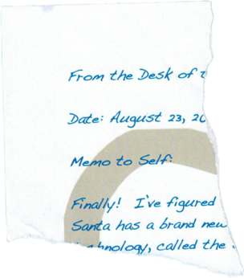<br>
<br>
<br>

**Going through these we make out the answer to be Super Sled-o-matic**<br>
<br>

### <u>Objective 10 - Recover Cleartext Document</u>
>
The [Elfscrow Crypto](https://downloads.elfu.org/elfscrow.exe) tool is a vital asset used at Elf University for encrypting SUPER SECRET documents. We can't send you the source, but we do have [debug symbols](https://downloads.elfu.org/elfscrow.pdb) that you can use.
Recover the plaintext content for this [encrypted document](https://downloads.elfu.org/ElfUResearchLabsSuperSledOMaticQuickStartGuideV1.2.pdf.enc). We know that it was encrypted on December 6, 2019, between 7pm and 9pm UTC.
What is the middle line on the cover page? (Hint: it's five words)
For hints on achieving this objective, please visit the NetWars room and talk with Holly Evergreen.
>

#### Initial Dialog - Holly Evergreen
>
See dialog from Mongo Pilfer
>

#### Additional Dialog - Kramus Hollyfeld
>
Wow! We’ve uncovered quite a nasty plot to destroy the holiday season.
We’ve gotta stop whomever is behind it!
I managed to find this protected document on one of the compromised machines in our environment.
I think our attacker was in the process of exfiltrating it.
I’m convinced that it is somehow associated with the plan to destroy the holidays. Can you decrypt it?
There are some smart people in the NetWars challenge room who may be able to help us.
>

#### Technical
**Watch video from Ron Bowes on [Reverse Crypto](http://www.youtube.com/watch?v=obJdpKDpFBA) and download all the files**<br>

**Running the .exe we see we can encrypt and decrypt files. Also our key is pushed to the elfscrow server.**<br>
<br><br>
<br><br>
<br>
**Looking the .exe combined with the symbols .pdb file in IDA, we first need to determine how the key is being generated.**<br>
**We determine that it's the [Microsoft formula for LCG](https://rosettacode.org/wiki/Linear_congruential_generator) based on the follow**<br>
<br>
**From there we see if we're able to generate the same key based on the provided seed and formula. Success!**<br>
<br>
**Next we determine the seed is based on (epoch](https://www.epochconverter.com/) and we know the range of date/time the encrypted file was created**<br><br>
**Knowing how to generate the key and a range of seed allows us to write a script to loop through and test decryption**<br><br>
**Now the below code will loop through 7200 times creating equal amount of files**<br>

**Decrypt code - [decrypt.rb](https://PATH_TO_FILE)**<br>
```
require 'openssl'

KEY_LENGTH = 8 

def generate_key(seed)
  key = ""
  1.upto(KEY_LENGTH) do
    key += (((seed = (214013 * seed + 2531011) & 0x7fff_ffff) >> 16) & 0x0FF).chr
    end
  return key
end


def decrypt(data, key)
  c = OpenSSL::Cipher::DES.new('CBC') 
  c.decrypt
  c.key = key
  return (c.update(data) + c.final())
end

j = 0
i = 1575666001
while i > 1575658800
   i -= 1
   key = generate_key(i)
   begin
      File.open("#{i}.pdf","wb") do |outf|
        data = File.read("ElfUResearchLabsSuperSledOMaticQuickStartGuideV1.2.pdf.enc")
        outf.write(decrypt(data, key))
   rescue; end
   end
end
```

**Upon sorting through the files, majority of them are zero bytes however there are a few with data**<br>
**After some looking we find [1575663650.pdf](https://PATH_TO_FILE) is our winner**<br>
<br>


**Answer is "Machine Learning Sleigh Route Finder"**<br>

<br>

### <u>Objective 11 - Open the Sleigh Shop Door</u>
>
Visit Shinny Upatree in the Student Union and help solve their problem. What is written on the paper you retrieve for Shinny?
For hints on achieving this objective, please visit the Student Union and talk with Kent Tinseltooth.
>

*Location: Student Union*

#### Initial Dialog - Shinny Upatree
>
Psst - hey!
I'm Shinny Upatree, and I know what's going on!
Yeah, that's right - guarding the sleigh shop has made me privvy to some serious, high-level intel.
In fact, I know WHO is causing all the trouble.
Cindy? Oh no no, not that who. And stop guessing - you'll never figure it out.
The only way you could would be if you could break into [my crate](https://crate.elfu.org/), here.
You see, I've written the villain's name down on a piece of paper and hidden it away securely!
>

<br>

#### Additional Dialog - Kent Tinseltooth
>
See dialog with Kent Tinseltooth after completing Smart Braces Console Challenge
>

#### Technical
**Using Google Chrome Inspect - Dev Tools**<br>
<br>
**found in console area**<br>
<br><br>
<br>
**found if print preview page**<br>
<br><br>
<br>
**found if refreshed network page and look at loaded files**<br>
<br>
<br><br>
<br>
**found in local storage**<br>
<br><br>
<br>
**found in title in dom tree**<br>
<br><br>
<br>
**find perspective value and decrease to nothing**<br>
<br><br>
<br>
**find font-family**<br>
<br><br>
<br>
**find in event listener eggs**<br>
<br><br>
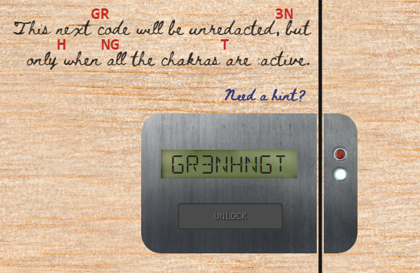<br>
**find chakra code and active each one**<br>
<br><br>
<br>
**find images loaded and you'll see an inside image that shows a circuit board and the code**<br>
<br>
**entering gives a macaroni error?!?**
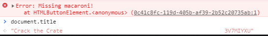<br>
**to complete the rest we need to find 3 elements; macaroni, swab and gnome using Ctrl-F to search**<br>
<br>
**then move them after the button switch**<br>
<br>
**after that, the lock works and you finish**<br><br>

**We get the villian's name**<br>
<br>

#### Completed Dialog - Shinny Upatree
>
Wha - what?? You got into my crate?!
Well that's embarrassing...
But you know what? Hmm... If you're good enough to crack MY security...
Do you think you could bring this all to a grand conclusion?
Please go into the sleigh shop and see if you can finish this off!
Stop the Tooth Fairy from ruining Santa's sleigh route!
>

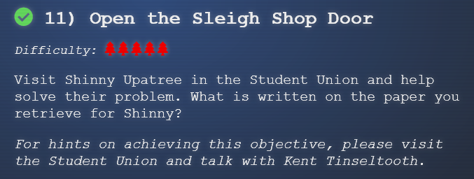<br>

### <u>Console - Zeek JSON Analysis</u>
*Location - Sleigh Shop*

#### Initial Dialog - Wunorse Openslae
>
Wunorse Openslae here, just looking at some Zeek logs.
I'm pretty sure one of these connections is a malicious C2 channel...
Do you think you could take a look?
I hear a lot of C2 channels have very long connection times.
Please use jq to find the longest connection in this data set.
We have to kick out any and all grinchy activity!
>

[Zeek Post](https://pen-testing.sans.org/blog/2019/12/03/parsing-zeek-json-logs-with-jq-2)<br>
<br>

#### Technical
**Read the post from above and looked to see what file was on console**<br>
<br>
**Run same command that was in post to find answer 13.107.21.200**<br>
<br>

#### Completed Dialog - Wunorse Openslae
>
That's got to be the one - thanks!
Hey, you know what? We've got a crisis here.
You see, Santa's flight route is planned by a complex set of machine learning algorithms which use available weather data.
All the weather stations are reporting severe weather to Santa's Sleigh. I think someone might be forging intentionally false weather data!
I'm so flummoxed I can't even remember how to login!
Hmm... Maybe the Zeek http.log could help us.
I worry about LFI, XSS, and SQLi in the Zeek log - oh my!
And I'd be shocked if there weren't some shell stuff in there too.
I'll bet if you pick through, you can find some naughty data from naughty hosts and block it in the firewall.
If you find a log entry that definitely looks bad, try pivoting off other unusual attributes in that entry to find more bad IPs.
The sleigh's machine learning device (SRF) needs most of the malicious IPs blocked in order to calculate a good route.
Try not to block many legitimate weather station IPs as that could also cause route calculation failure.
Remember, when looking at JSON data, jq is the tool for you!
>

### <u>Objective 12 - Filter Out Poisoned Sources of Weather Data</u>
>
Use the data supplied in the [Zeek JSON logs](https://downloads.elfu.org/http.log.gz) to identify the IP addresses of attackers poisoning Santa's flight mapping software. [Block the 100 offending sources of information to guide Santa's sleigh](https://srf.elfu.org/) through the attack. Submit the Route ID ("RID") success value that you're given. For hints on achieving this objective, please visit the Sleigh Shop and talk with Wunorse Openslae.
>

#### Initial Dialog - The Tooth Fairy
>
I’m the Tooth Fairy, the mastermind behind the plot to destroy the holiday season.
I hate how Santa is so beloved, but only works one day per year!
He has all of the resources of the North Pole and the elves to help him too.
I run a solo operation, toiling year-round collecting deciduous bicuspids and more from children.
But I get nowhere near the gratitude that Santa gets. He needs to share his holiday resources with the rest of us!
But, although you found me, you haven’t foiled my plot!
Santa’s sleigh will NOT be able to find its way.
I will get my revenge and respect!
I want my own holiday, National Tooth Fairy Day, to be the most popular holiday on the calendar!!!
>

<br>

#### Additional Dialog - Krampus Hollyfeld
>
But there’s still time! Solve the final challenge in your badge by blocking the bad IPs at srf.elfu.org and save the holiday season!
>

#### Technical
**Looking at the website we see we need to login.**<br>
<br>
**After a bit I look at the PDF we just decrypted and there was a hint**<br>
<br>
**Viewing the readme gives the credentials and we're in**<br>
<br>
**Poking around we see where we need to enter the bad IPs to block**<br>
<br>
**We apply the same jq command we learned in the console challenge, but need to find offending IPs that arre attacking via SQLi, XSS, LFI and some Shell Shock**<br>
**This part is pretty straight forward and we build out a script to find these types of attacks based on various field**<br>
```
#!/bin/bash
#SQLi
cat http.log | jq -r '.[] | select (.username | contains("'"'"'")) | .["id.orig_h"]' > bad_srf_ips
cat http.log | jq -r '.[] | select (.uri | contains("'"'"'")) | .["id.orig_h"]' >> bad_srf_ips
cat http.log | jq -r '.[] | select (.user_agent | contains("'"'"'")) | .["id.orig_h"]' >> bad_srf_ips
#XSS
cat http.log | jq -r '.[] | select (.uri | contains("<script>")) | .["id.orig_h"]' >> bad_srf_ips
cat http.log | jq -r '.[] | select (.host | contains("<script>")) | .["id.orig_h"]'>> bad_srf_ips
#LFI
cat http.log | jq -r '.[] | select (.uri | contains("pass")) | .["id.orig_h"]' >> bad_srf_ips
#SS
cat http.log | jq -r '.[] | select (.user_agent | contains(":;")) | .["id.orig_h"]' >> bad_srf_ips

sort -u bad_srf_ips  > bad_ips
```

**Running this script against the http.log and then doing a line count, we find 75 bad IPs.  Unfortunately this isn't enough (knew it could be that easy)**<br><br>
**After looking around we find that some of the offending IPs used legitimate UserAgents.  We'll need to do a search to find any requests from the bad IPs and capture the list of user_agents.  We tack on the following to our script**<br><br>
```
jq -r '.[] | select(.["id.orig_h"] == "0.216.249.31" or .["id.orig_h"] == "10.155.246.29" or .["id.orig_h"] == "102.143.16.184" or .["id.orig_h"] == "106.132.195.153" or .["id.orig_h"] == "106.93.213.219" or .["id.orig_h"] == "111.81.145.191" or .["id.orig_h"] == "116.116.98.205" or .["id.orig_h"] == "118.196.230.170" or .["id.orig_h"] == "1.185.21.112" or .["id.orig_h"] == "121.7.186.163" or .["id.orig_h"] == "123.127.233.97" or .["id.orig_h"] == "129.121.121.48" or .["id.orig_h"] == "131.186.145.73" or .["id.orig_h"] == "132.45.187.177" or .["id.orig_h"] == "13.39.153.254" or .["id.orig_h"] == "135.203.243.43" or .["id.orig_h"] == "135.32.99.116" or .["id.orig_h"] == "150.45.133.97" or .["id.orig_h"] == "150.50.77.238" or .["id.orig_h"] == "168.66.108.62" or .["id.orig_h"] == "169.242.54.5" or .["id.orig_h"] == "173.37.160.150" or .["id.orig_h"] == "180.57.20.247" or .["id.orig_h"] == "186.28.46.179" or .["id.orig_h"] == "187.178.169.123" or .["id.orig_h"] == "190.245.228.38" or .["id.orig_h"] == "19.235.69.221" or .["id.orig_h"] == "193.228.194.36" or .["id.orig_h"] == "194.143.151.224" or .["id.orig_h"] == "200.75.228.240" or .["id.orig_h"] == "211.229.3.254" or .["id.orig_h"] == "220.132.33.81" or .["id.orig_h"] == "2.230.60.70" or .["id.orig_h"] == "223.149.180.133" or .["id.orig_h"] == "2.240.116.254" or .["id.orig_h"] == "225.191.220.138" or .["id.orig_h"] == "227.110.45.126" or .["id.orig_h"] == "229.133.163.235" or .["id.orig_h"] == "229.229.189.246" or .["id.orig_h"] == "230.246.50.221" or .["id.orig_h"] == "233.74.78.199" or .["id.orig_h"] == "23.49.177.78" or .["id.orig_h"] == "238.143.78.114" or .["id.orig_h"] == "249.34.9.16" or .["id.orig_h"] == "250.51.219.47" or .["id.orig_h"] == "253.182.102.55" or .["id.orig_h"] == "254.140.181.172" or .["id.orig_h"] == "25.80.197.172" or .["id.orig_h"] == "27.88.56.114" or .["id.orig_h"] == "28.169.41.122" or .["id.orig_h"] == "31.254.228.4" or .["id.orig_h"] == "33.132.98.193" or .["id.orig_h"] == "34.129.179.28" or .["id.orig_h"] == "42.103.246.250" or .["id.orig_h"] == "42.191.112.181" or .["id.orig_h"] == "44.74.106.131" or .["id.orig_h"] == "45.239.232.245" or .["id.orig_h"] == "48.66.193.176" or .["id.orig_h"] == "49.161.8.58" or .["id.orig_h"] == "52.39.201.107" or .["id.orig_h"] == "56.5.47.137" or .["id.orig_h"] == "61.110.82.125" or .["id.orig_h"] == "65.153.114.120" or .["id.orig_h"] == "68.115.251.76" or .["id.orig_h"] == "69.221.145.150" or .["id.orig_h"] == "75.215.214.65" or .["id.orig_h"] == "75.73.228.192" or .["id.orig_h"] == "79.198.89.109" or .["id.orig_h"] == "80.244.147.207" or .["id.orig_h"] == "81.14.204.154" or .["id.orig_h"] == "83.0.8.119" or .["id.orig_h"] == "84.147.231.129" or .["id.orig_h"] == "84.185.44.166" or .["id.orig_h"] == "9.206.212.33" or .["id.orig_h"] == "95.166.116.45" ) | .user_agent' http.log > bad_user_agent
```

**Now my hope was to automate this through a script, but I just wanted to get done.  Didn't happen**<br><br>
**We get the requests and need to:**<br>
**1. put a double slash in front of all the single slashes in the malicious queries**<br>
**2. add quotes around each user-agent**<br>
**3. run a while loop on the http.log checking against the list of bad user-agents**<br>
```
while read ua; do cat http.log | jq '.[] | select (."user_agent" == '"$ua"')'; done < updated_bad_user_agent > pre_final
```
**4. then we need to output the IPs from that output to a new file**<br>
```
cat pre_final | jq '. | .["id_orig_h"]' > final_ips
```
**5. then we need to remove the double quotes**<br>
```
cat final_ips | tr -d '"' > final_final_ips

```
**6. running the line count we get 93 IPs**<br><br>

**Adding these IPs as Deny, the route recalculates and it's successful!**<br>
<br>

**Entering this RID number in completes the final objective**<br>
<br>

### <u>Ending</u>
*Location: Bell Tower*

#### Dialog - Tooth Fairy
>
You foiled my dastardly plan! I’m ruined!
And I would have gotten away with it too, if it weren't for you meddling kids!
>

#### Dialog - Krampus
>
Congratulations on a job well done!
Oh, by the way, I won the Frido Sleigh contest.
I got 31.8% of the prizes, though I'll have to figure that out.
>

#### Dialog - Santa
>
You did it! Thank you! You uncovered the sinister plot to destroy the holiday season!
Through your diligent efforts, we’ve brought the Tooth Fairy to justice and saved the holidays!
Ho Ho Ho!
The more I laugh, the more I fill with glee.
And the more the glee,
The more I'm a merrier me!
Merry Christmas and Happy Holidays.
>

<br>

**there is actually a letter in the upper left-hand corner as well**<br>

<br>