## Goal
/flag.txt

## Download
[https://www.vulnhub.com/entry/bob-101,226/](https://www.vulnhub.com/entry/bob-101,226/)

## Walkthrough
**nmap**
 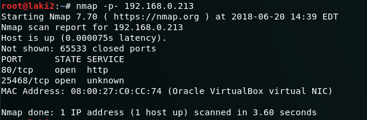
  **default 80 page under construction**
 
  **login page disabled**
 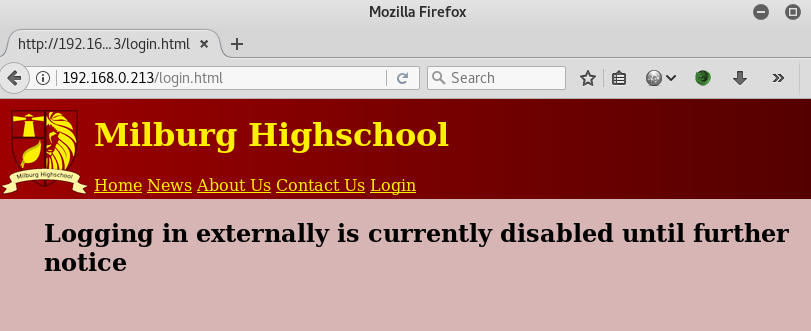
  **dirb reveals robots**
 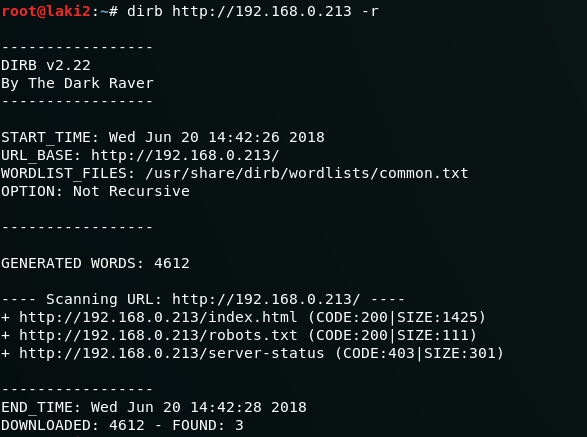
  **robots reveals more**
 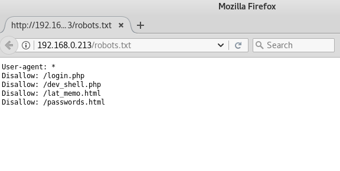
  **note about web shell**
 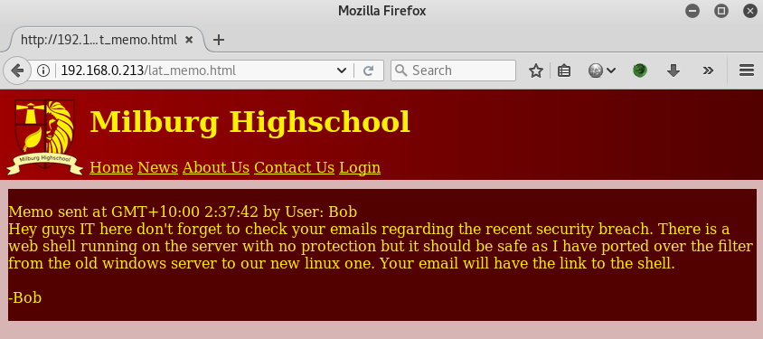
  **web shell doesn't accept basic command**
 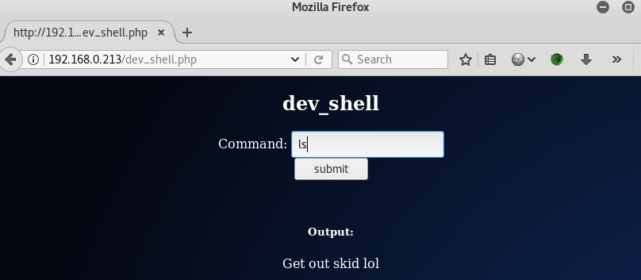
  **accepts full path to command; passwords page revealed**
 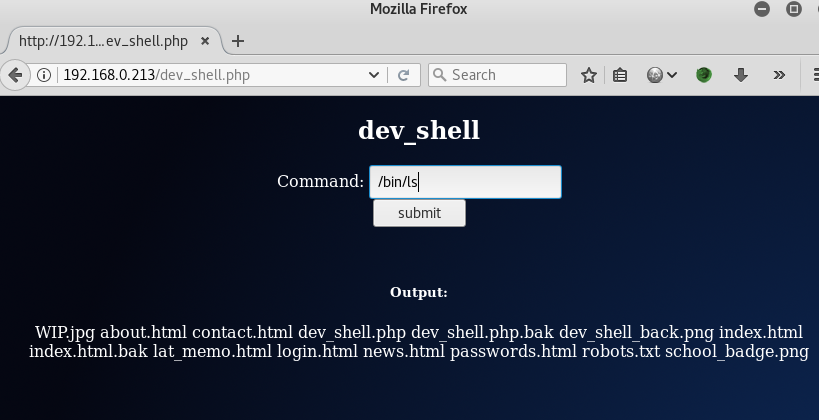
  **this page was removed by bob**
 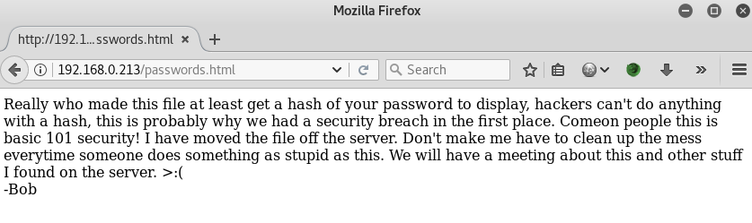
  **bob has old copy**
 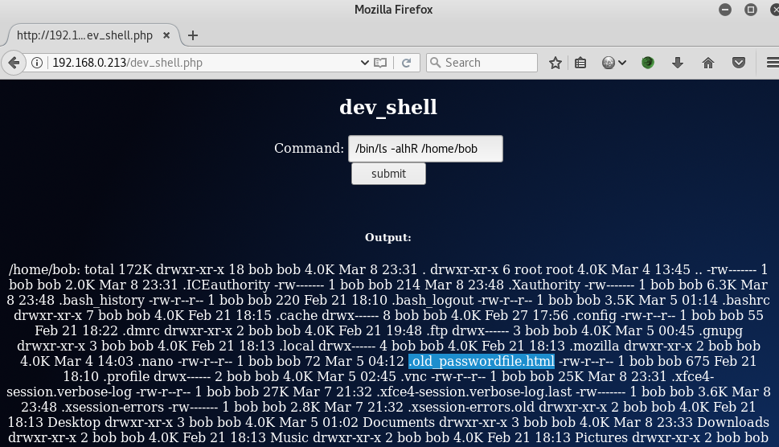
  **user creds revealed**
 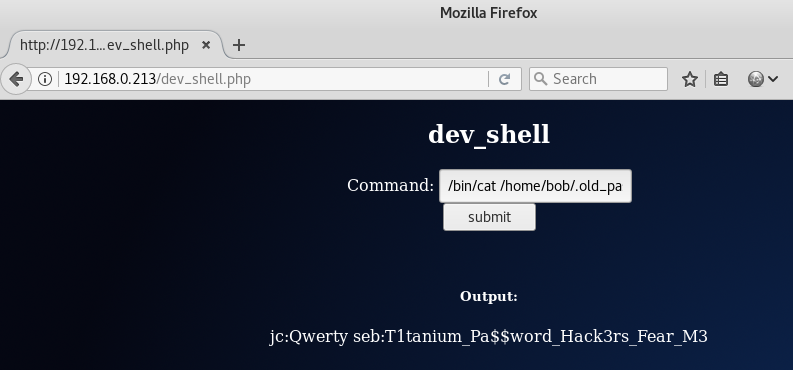
  **ssh as seb**
 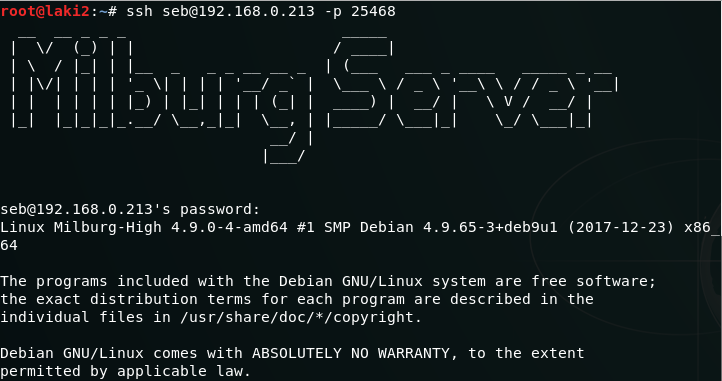
  **user elliot home directory with interesting file**
 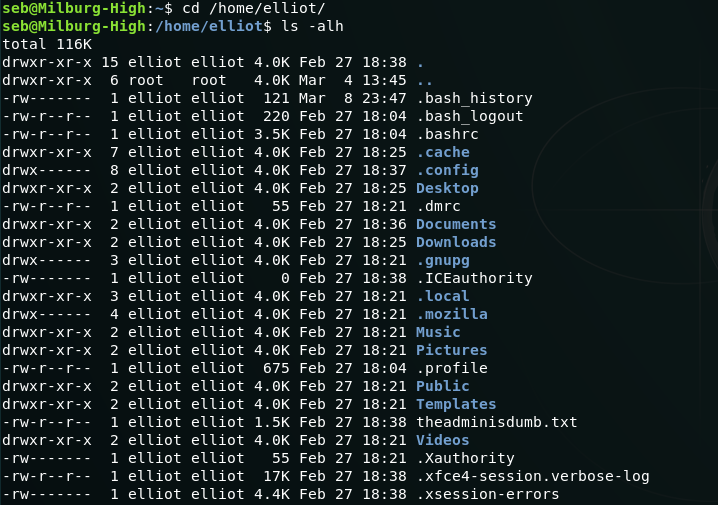
  **interesting file reveals elliot password**
 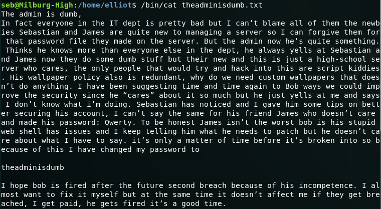
  **su elliot**
 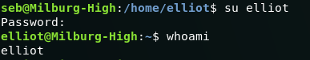
  **user bob home directory with gpg encrypted login file**
 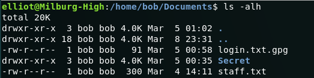
  **notes script buried in folders**
 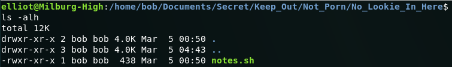
  **notes script is random, except all capital laters spells HARPOCRATES**
 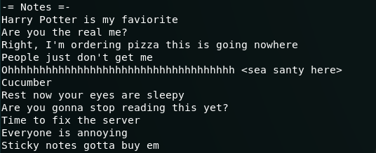
  **secret word used against gpg file; reveals bob password**
 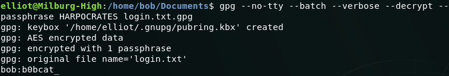
  **su bob**
 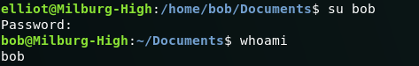
  **simple sudo gives root and flag revealed**
 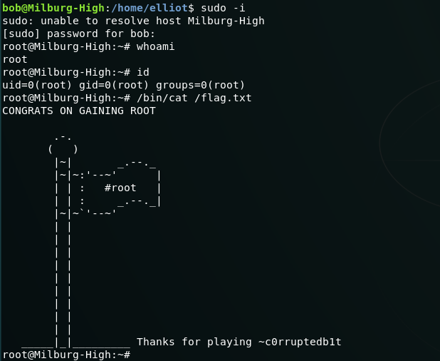

