## Goal
4 Flags / Root

## Download
[https://www.vulnhub.com/entry/derpnstink-1,221/](https://www.vulnhub.com/entry/derpnstink-1,221/)

## Walkthrough
**nmap**
 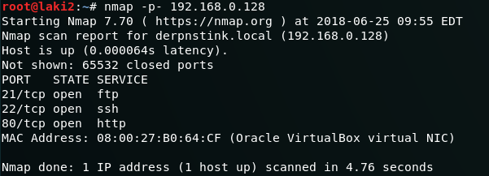
  **default 80**
 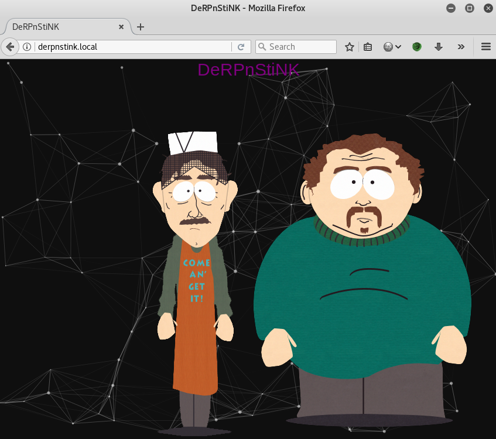
  **flag 1 found buried in source**
 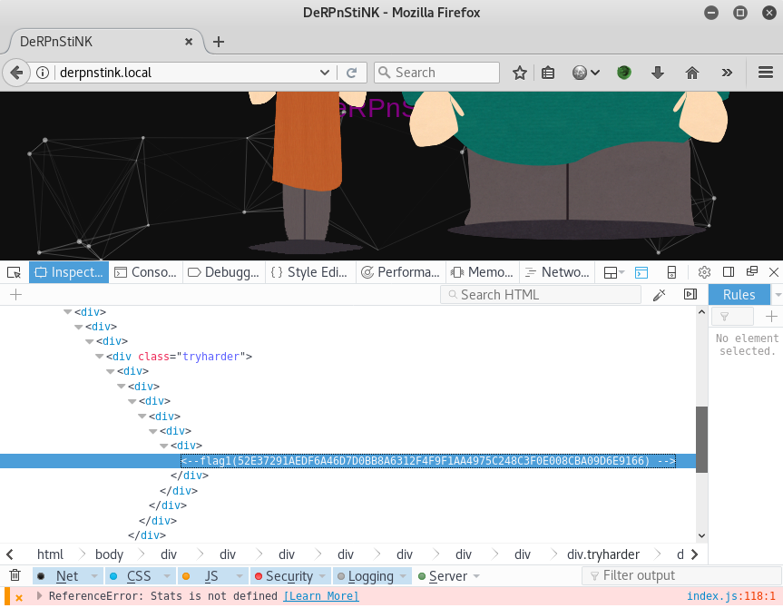
  **ran dirb**
 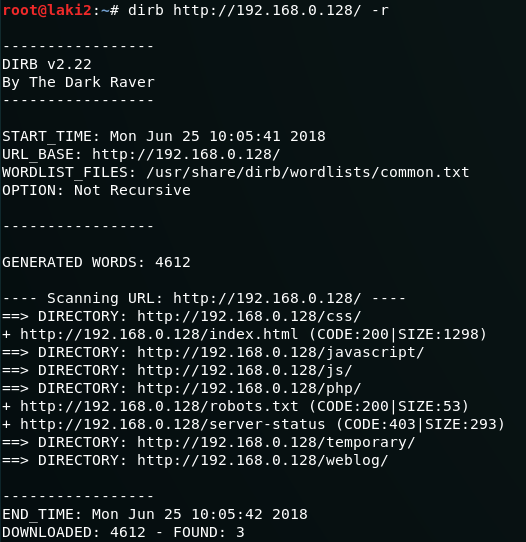
  **/temporary had nothing**
 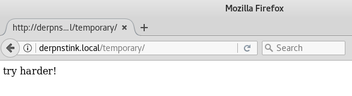
  **ran additional dirb against /php finding phpmyadmin**
 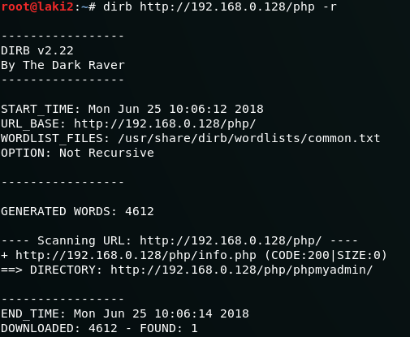
  **ran additional dirb against /weblog finding wordpress**
 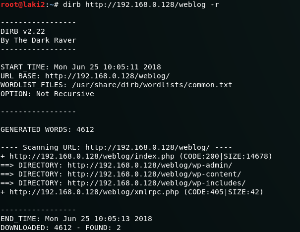
  **/etc/hosts file needs to have dns entry added for any resolve**
 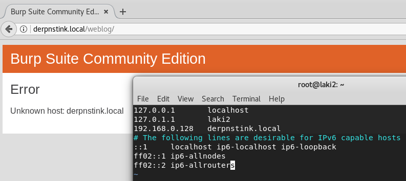
  **wordpress site exists**
 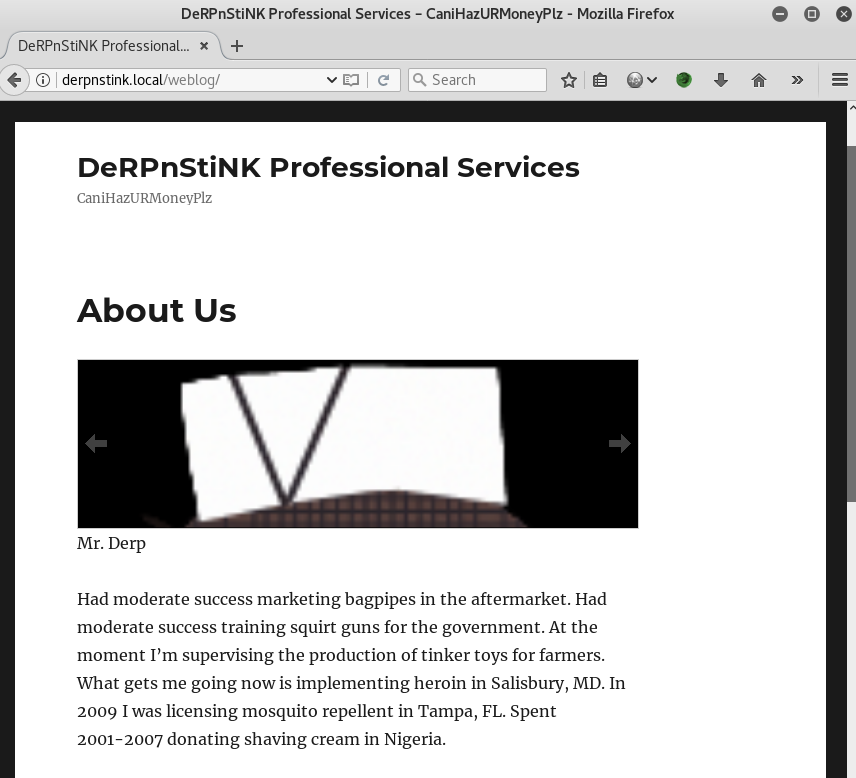
  **wordpress enumeration finds two users**
 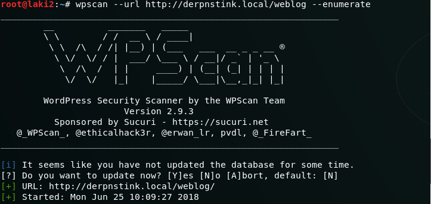
 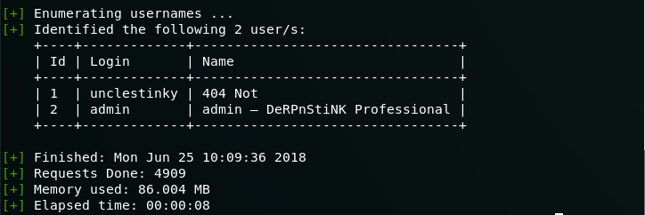
  **admin user on wordpress password is found**
 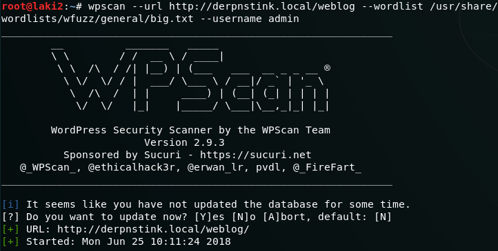
 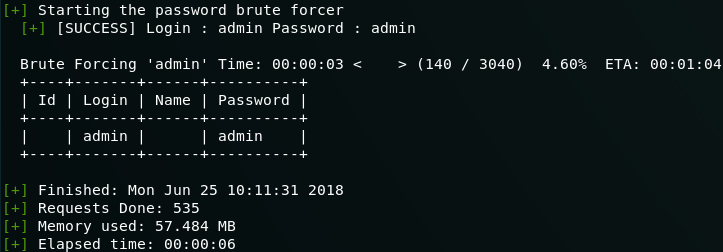
  **admin is not really an admin though**
 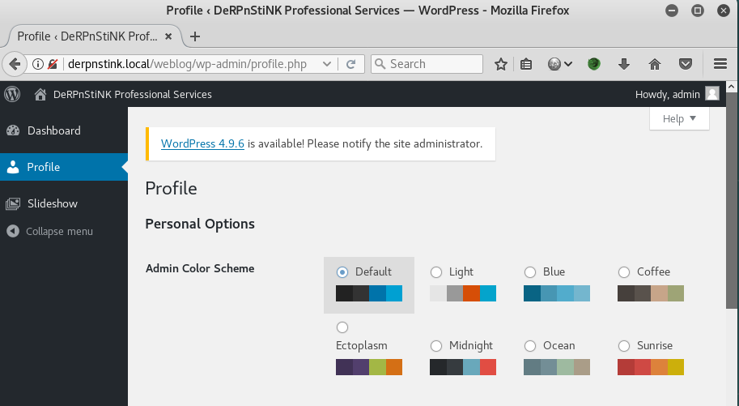
  **looking for a way to gain reverse shell, wpscan reveals slideshow upload plugin vuln**
 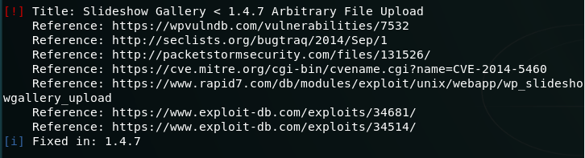
  **uploading reverse php gives low level reverse shell**
 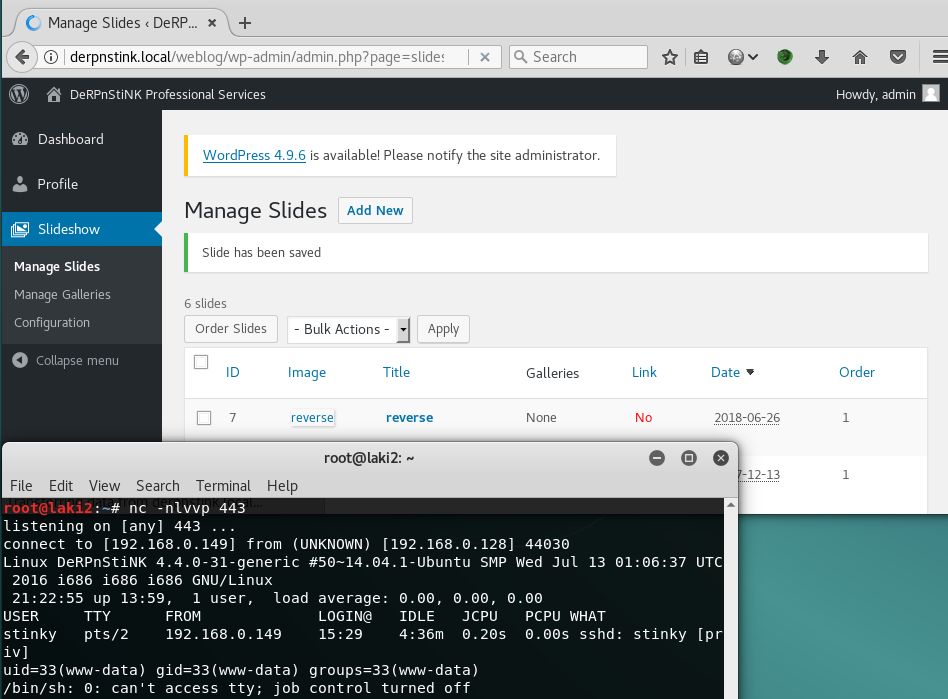
  **wp-config reveals root mysql**
 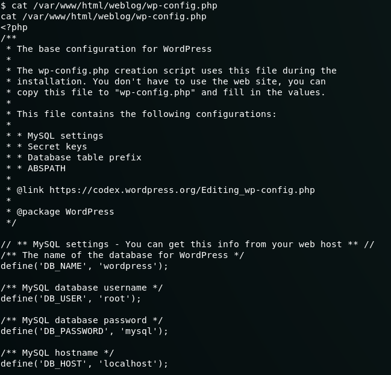
  **going back to phpmyadmin, 2nd wp account hash found**
 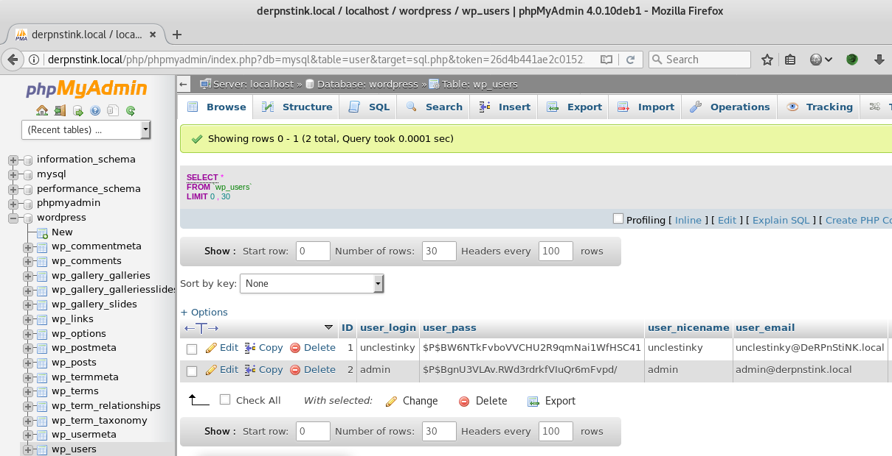
  **running against john reveals password**
 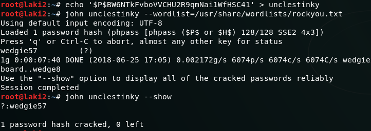
  **this gives admin level access to wp and flag 2**
 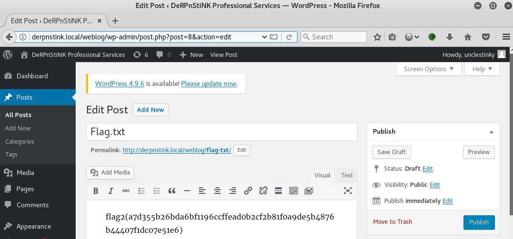
  **/home reveals two users**
 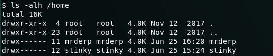
  **no other escalation options for these, trying same wp pass for stinky on ftp works**
 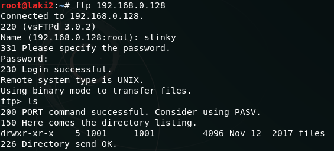
 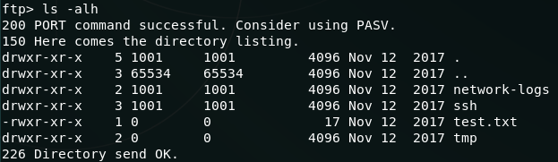
  **file name key.txt is found buried and is a private key**
 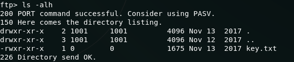
 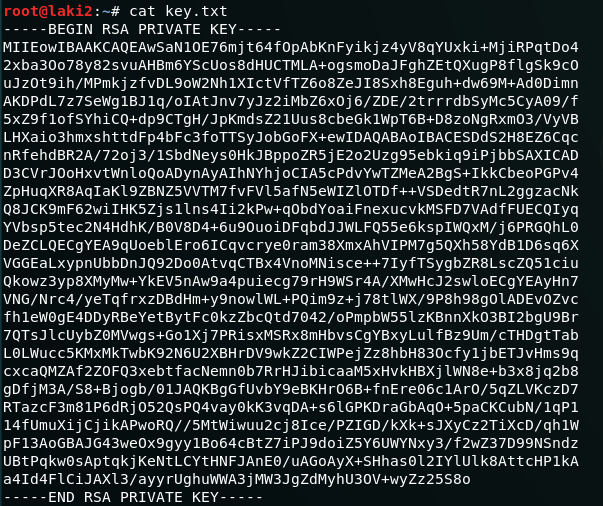
  **using downloaded key file gives ssh access as stinky**
 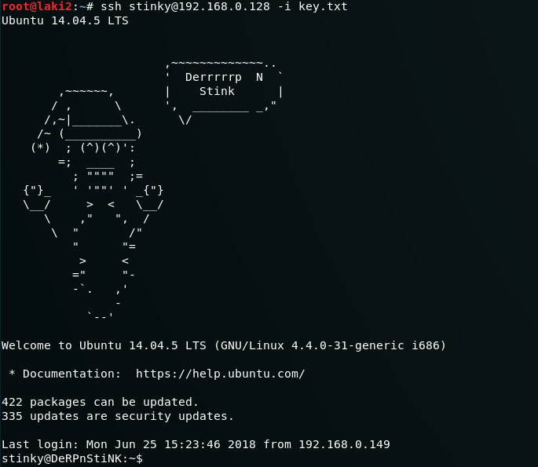
  **flag 3 is found**
 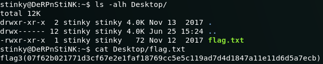
  **pcap file found reveals mrderp password**
 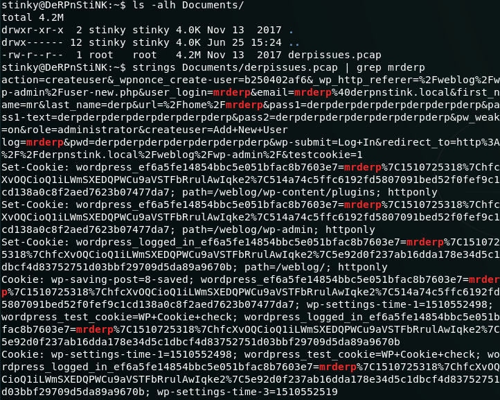
  **su to mrderp is successful**
 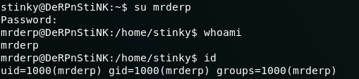
  **file found on root folder /support reveals pastebin link**
 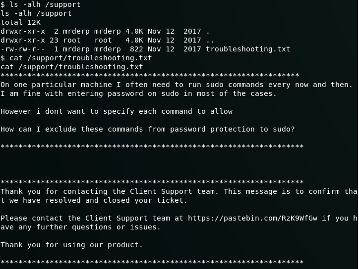
  **link shows what commands mrderp can run as sudo**
 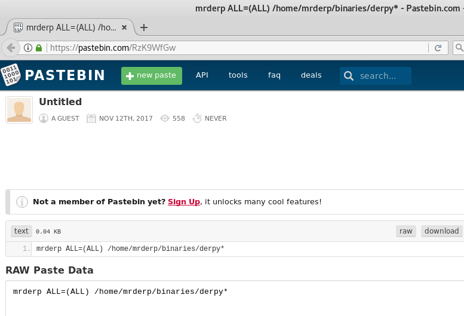
  **sudo commands are verified**
 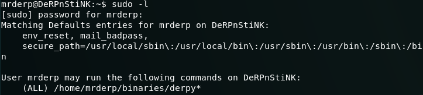
  **there is no binaries folder under mrderp home directory**
 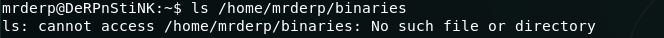
  **from here we setup for root access by creating folder and a file named derpy that will call a shell**
 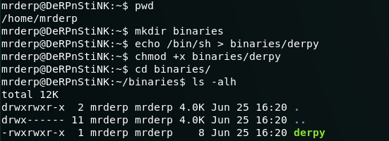
  **running derpy with sudo gives root access and last flag**
 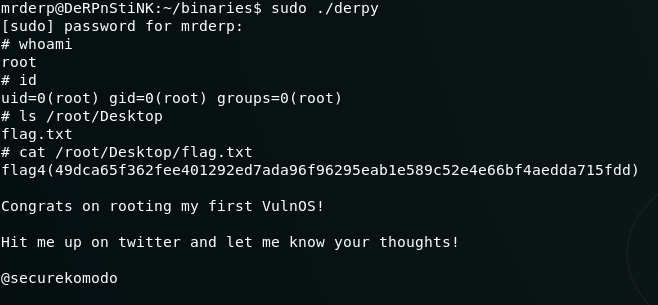
