## Goal
root

## Download 
[https://www.vulnhub.com/entry/toppo-1,245/](https://www.vulnhub.com/entry/toppo-1,245/)

## Walkthrough 
nmap
 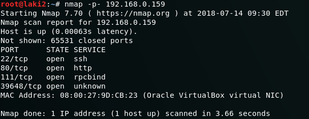
 
default 80 page
 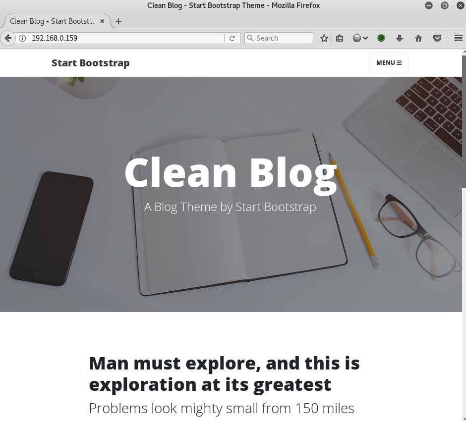
 
dirb
 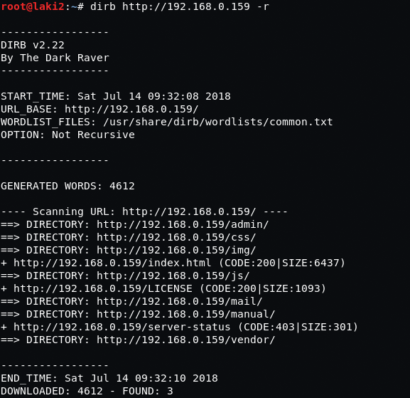
 
admin page/directory
 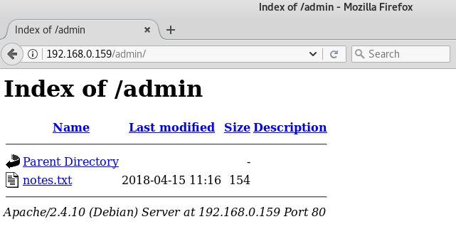
 
notes with password and assuming user is ted
 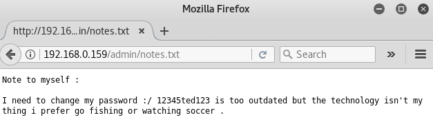
 
ssh as ted works
 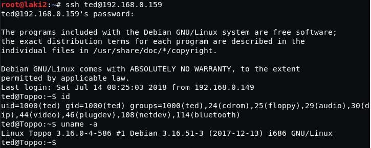
 
running linux privilege checker per usual
 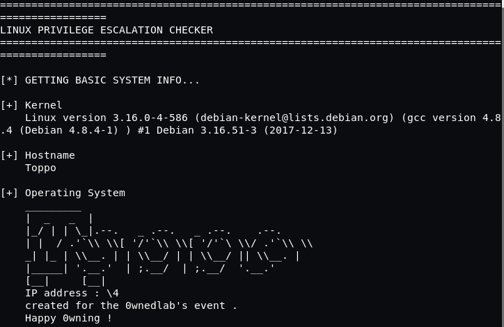
 
what's this? already root??
 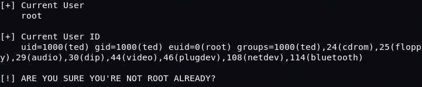
 
downloaded a modified script to read /etc/shadow
 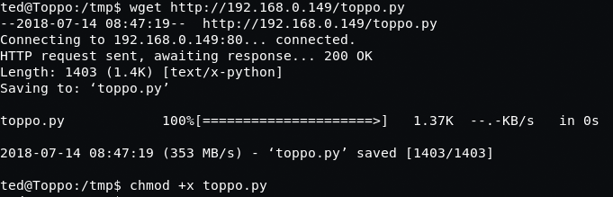
 
running yields contents of /etc/shadow
 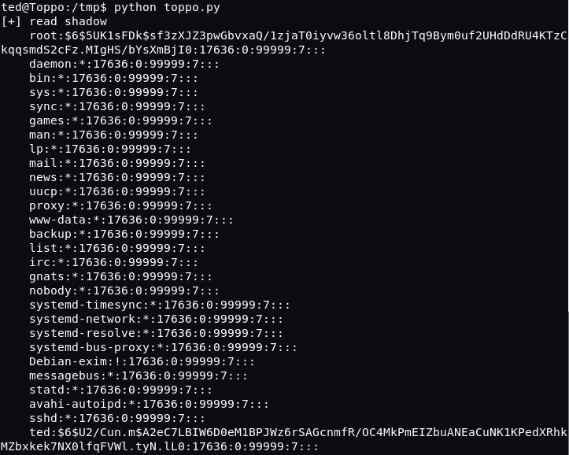
 
using john the password is revealed
 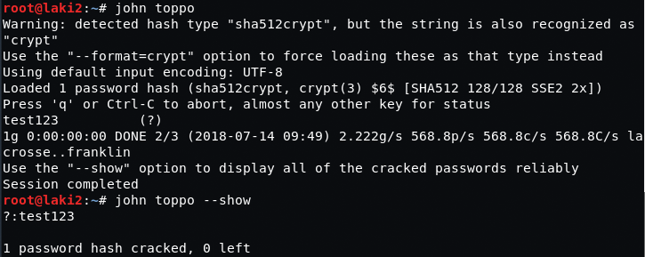
 
ssh as root works and flag revealed
 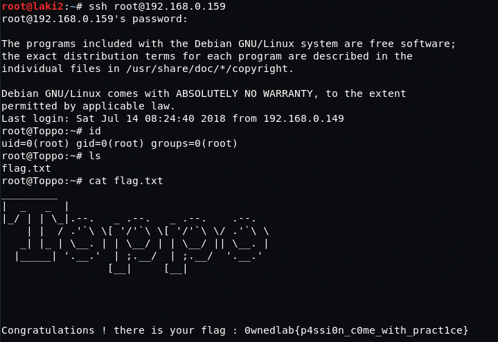
 
