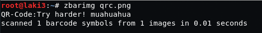
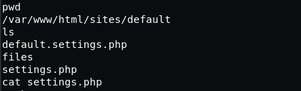

## Goal #
root

## Download #
[https://www.vulnhub.com/entry/lampiao-1,249/](https://www.vulnhub.com/entry/lampiao-1,249/)

## Walkthrough #
**nmap**
 
  
**default 80, doesn't work**
 
  
**default 80 via telnet**
 
  
**default 1898, looks like drupal**
 
  
**a post states node2 isn't working**
 
  
**node2 lists two files**
 
  
**audio.m4a spells out "user tiago"** 
**qrc.png is a qr code and tells us to try harder**
 
  
**robots.txt lists out a lot**
 
  
**after much searching, changelog.txt seems interesting...drupalgeddon**
 
  
**setup metasploit**
 
  
**reverse shell**
 
  
**etc passwd shows user tiago**
 
  
**quick lookup on drupal mysql settings location**
 
  
**checking default settings**
 
  
**mysql settings revealed**
 
  
**try ssh with found password; success**
 
  
**lots of enumeration and finally went back to os/kernel version...old**
 
  
**search for dirty cow sploits**
 
  
**chose this one for stabilitiy based on this [comment](https://github.com/dirtycow/dirtycow.github.io/issues/25#issuecomment-255852675) as it is added automatically**
 
  
**download and compile sploit**
 
  
**run sploit and get new root password**
 
  
**elevate to root and cat flag**
 
  

