## Goal #
3 flags / root

## Download #
[https://www.vulnhub.com/entry/kuya-1,283/](https://www.vulnhub.com/entry/kuya-1,283/)

## Walkthrough #
**nmap**
 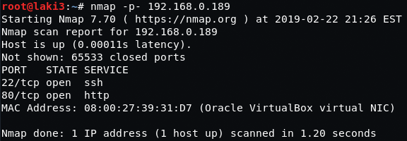
  
**default 80**
 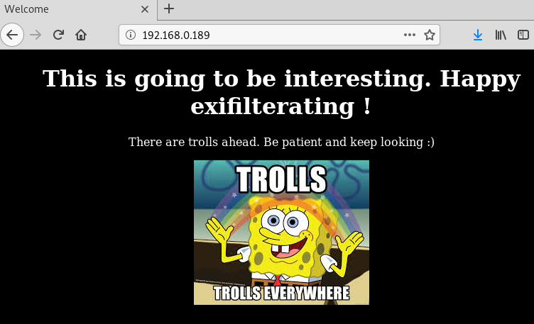
  
**default 80 sources...trolls**
 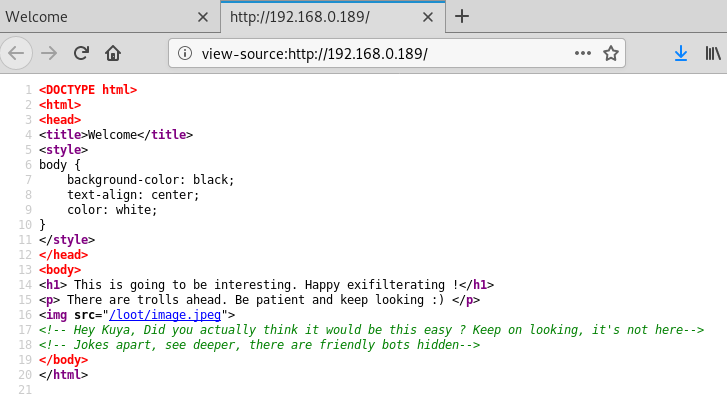
  
**gobuster reveals some directories**
 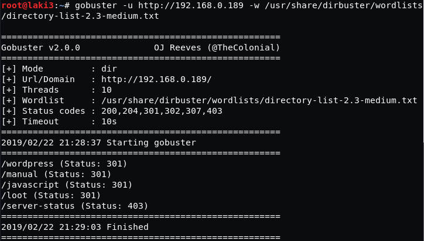
  
**wordpress is a wash**
 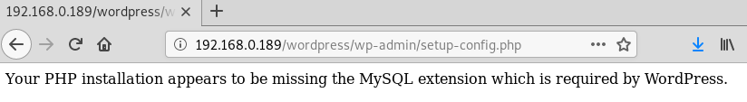
  
**loot gives some images to investigate**
 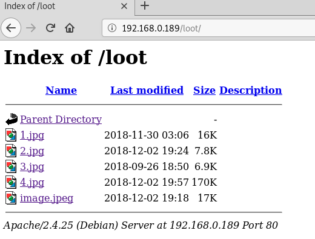
  
**steghide extract on the images gives some files, no password needed**
 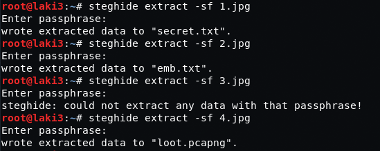
  
**secret.txt...troll**
 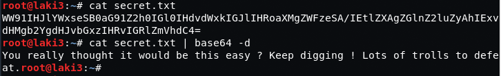
  
**emb.txt...brainfuck**
 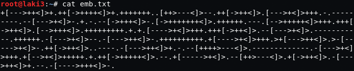
  
**flag 1 is revealed**
 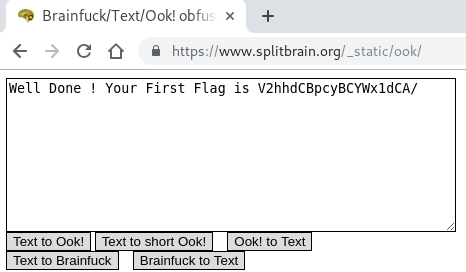
  
**flag 1 base64 decoded**
 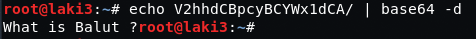
  
**loot.pcapng reveals 7z file**
 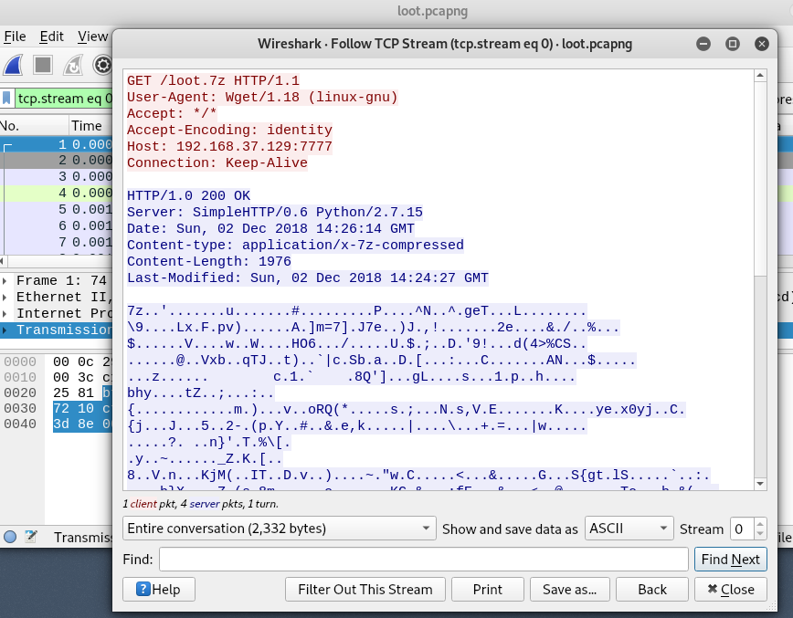
  
**export from pcap**
 
  
**7z file is password protected**
 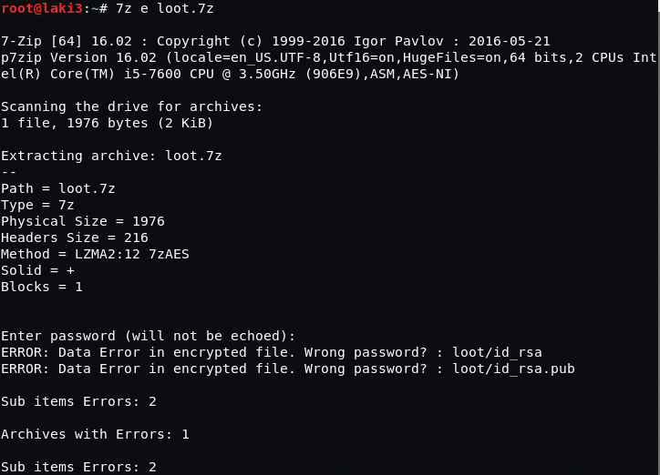
  
**let's look at the contents, private key. nice**
 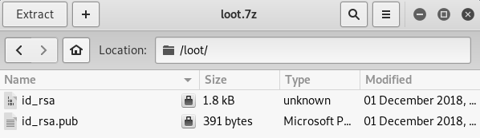
  
**let's brute force**
 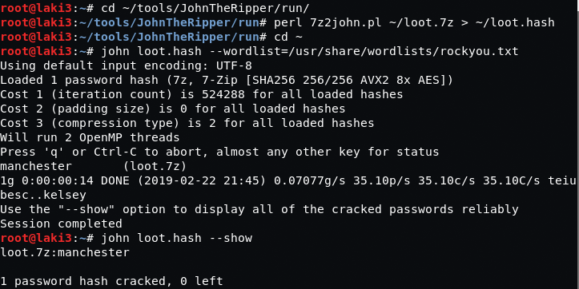
  
**using found password, it works**
 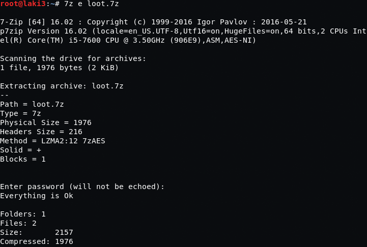
  
**using the priv key, it seems it's password protected**
 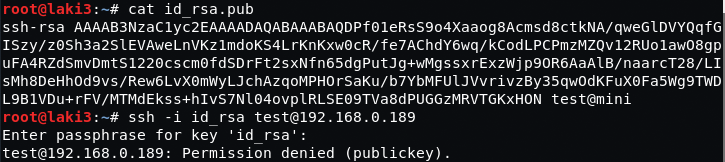
  
**we brute force and find the password**
 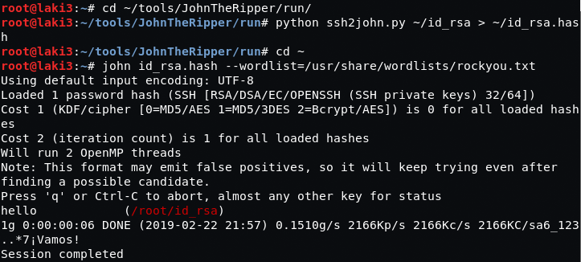
  
**with that we get a shell**
 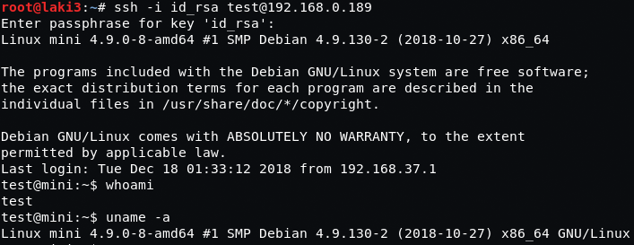
  
**flag 2 found**
 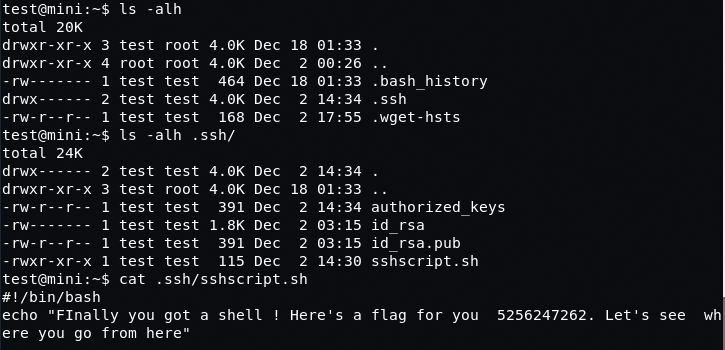
  
**searching around, file date stands out in wordpress directory**
 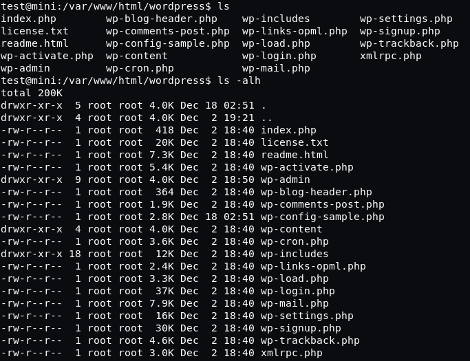
  
**wordpress config reveals db password**
 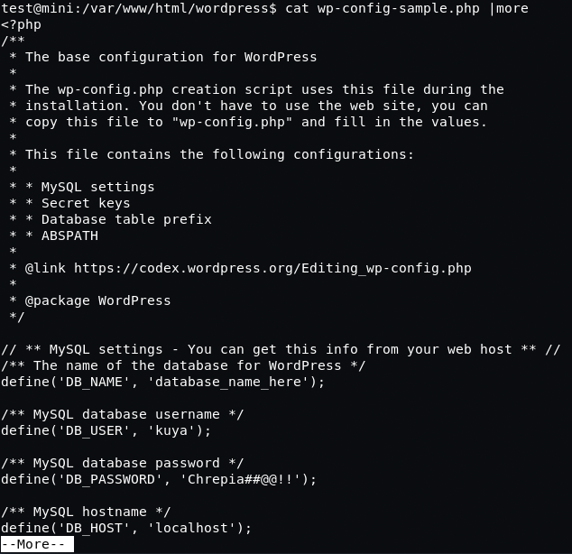
  
**trying same password for kuya works**
 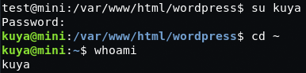
  
**flag 3 revealed**
 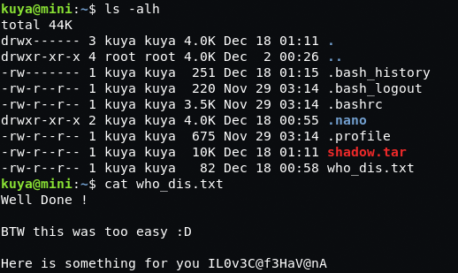
  
**checking .bash_history we find some special commands**
 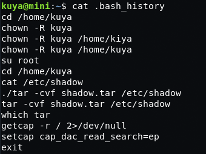
  
**after some googling, we verify what is found in .bash_history will work to read /etc/shadow** 
[https://nxnjz.net/08/an-interesting-privilege-escalation-vector-getcap/](https://nxnjz.net/08/an-interesting-privilege-escalation-vector-getcap/)
 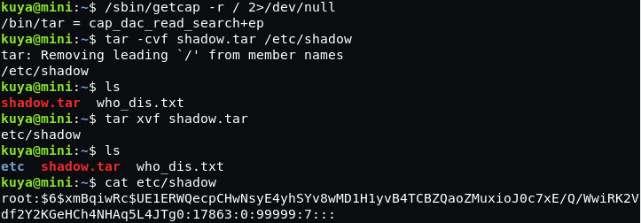
  
**so many different tries for root after recovering files**
 
  
**turns out you just do the entire folder...root flag**
 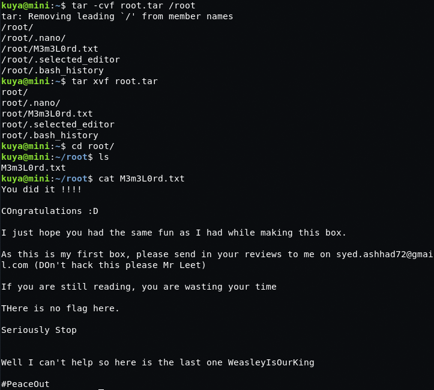
  

