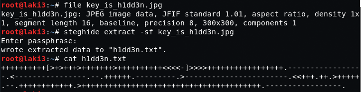

## Goal #
root

## Download #
[https://www.vulnhub.com/entry/unknowndevice64-1,293/](https://www.vulnhub.com/entry/unknowndevice64-1,293/)

## Walkthrough #

**nmap**
 
  

**default 80**
 
  

**default 80 source; commented out jpg**
 
  

**jpg is accessible** 
 
  

**download and try steghide; h1dd3n was password and reveals txt file with brainfuck**
 
  

**decoded brainfuck is user/pass**
 
  

**login worked, but to a restricted shell**
 
  

**able to get to vi; so we try escaping restriction**
 
  

**escape worked**
 
  

**commands work with full path**
 
  

**sudo shows that we can run a program ud64sys with no password**
 
  

**looking at program it's strace**
 
  

**quick google [here](https://bltsec.ninja/2017/12/23/penetration-testing-linux-local-privilege-escalation-dev-random-k2/) and we have root**
 
  

**and we have flag**
 

