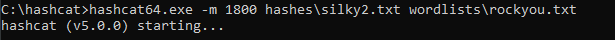

## Goal #
root

## Download #
[https://www.vulnhub.com/entry/silky-ctf-0x02,307/](https://www.vulnhub.com/entry/silky-ctf-0x02,307/)

## Walkthrough #

**nmap**
 
  

**default 80, nothing special**
 
  

**dirb reveals admin page**
 
  

**admin panel with login** 
  
 
  

**incorrect login gives error in german**
 
  

**after some time i notice that if you enter 'Admin' there is no error, even without a password**
 
  

**send to intruder for lfi check**
  
 
  

**after a bit, /etc/passwd is shown and we have lfi**
 
  

**checking lfi in browser works**
 
  

**find user flag in silky home directory**
 
  

**setup a listener and throw a python one liner at it and we have a reverse shell**
 
  

**break out of jail and notice a suid file 'cat_shadow'**
 
  

**seeing what the program does, it trys to read shadow file (duh) however we get a permission denied**
 
  

**at first i thought this was a bof, but quickly realized we just have to send the hex that is being displayed**
 
  

**some trial and error, but 64 char buffer and then the hex in little endian gets us shadow file**
 
  

**throw the hashes at hashcat**
 
  

**after some time we actually get root password**
 
  

**root flag**
 
  

