## Goal #
root

## Download #
[https://www.vulnhub.com/entry/goldeneye-1,240/](https://www.vulnhub.com/entry/goldeneye-1,240/)

## Walkthrough #

**nmap**
 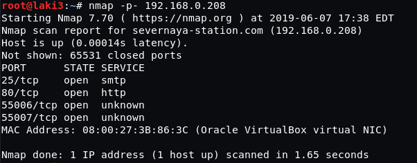
  

**default 80 points to login**
 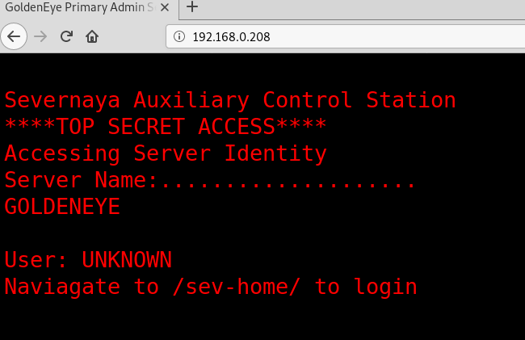
  

**login confirmed, need creds**
 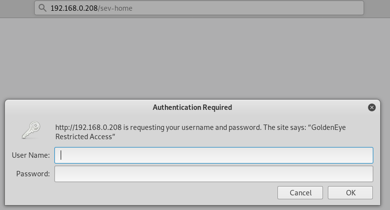
  

**default 80 shows js file** 
 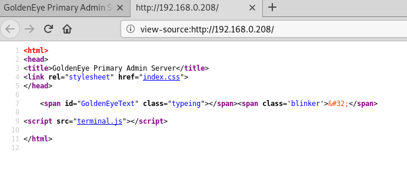
  

**js file gives encoded password for boris**
 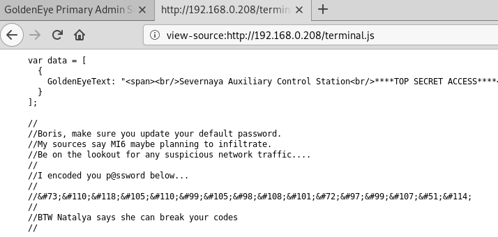
  

**password decoded**
 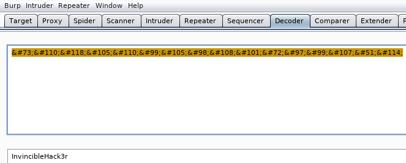
  

**login successful, points to pop3 service**
 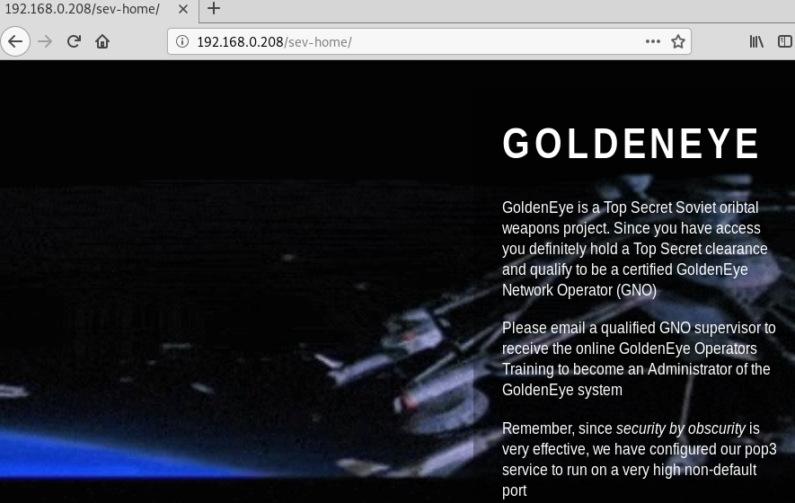
  

**source shows two usernames**
 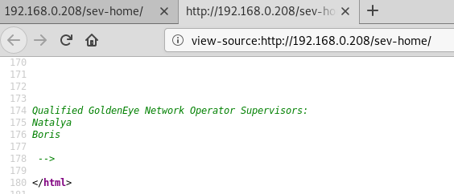
  

**pop3 port is 55007**
 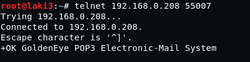
  

**start with natalya using hydra. had to bump tasks up to maximum as there were timeouts. password found**
 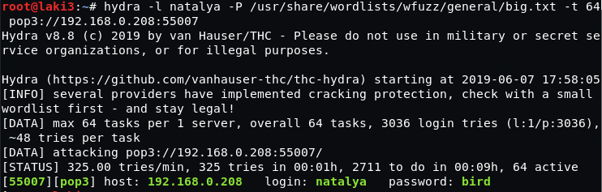
  

**pop3 login works**
 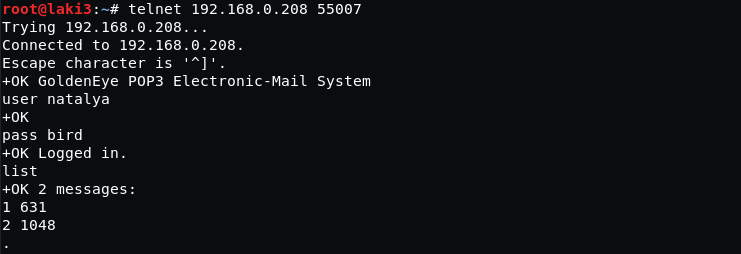
  

**message 1 nothing**
 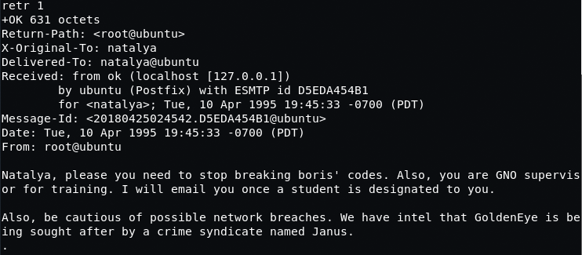
  

**message 2 gives creds, new web directory and instructions to update hosts file**
 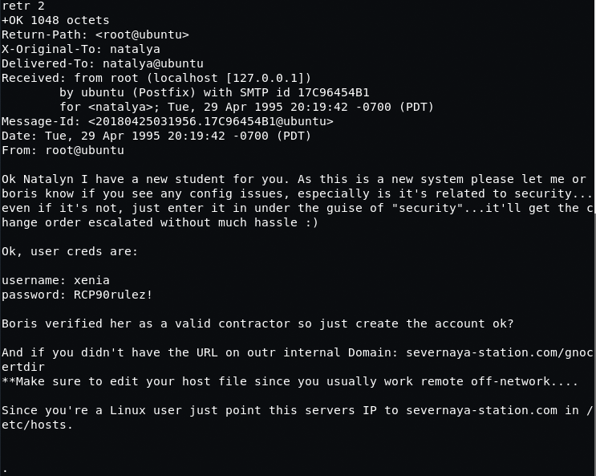
  

**directory is moodle**
 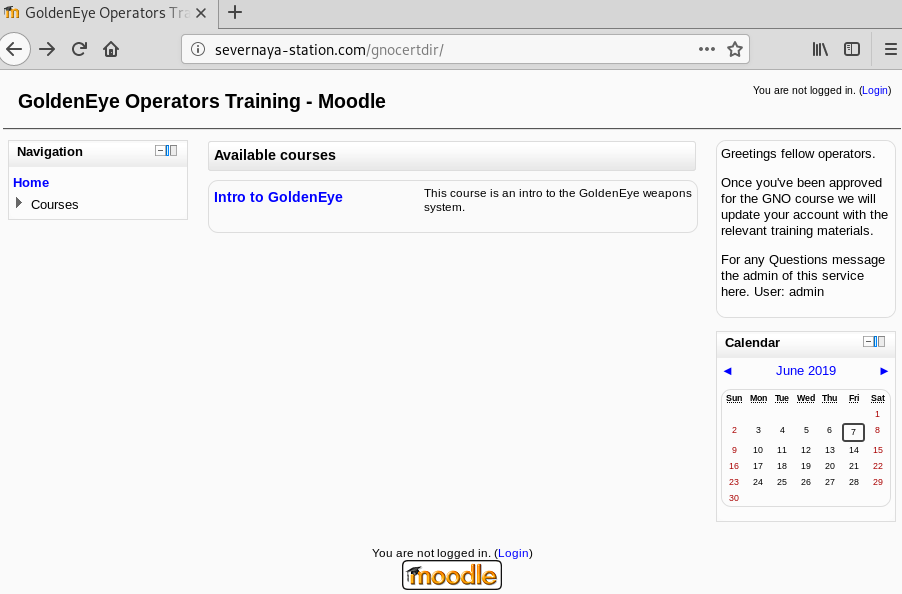
  

**moodle login as natalya successful**
 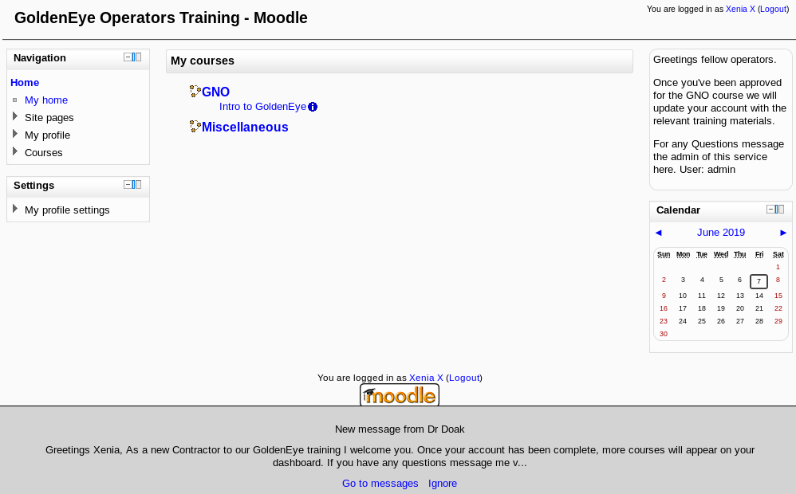
  

**message from doak. hints at pop3 service again**
 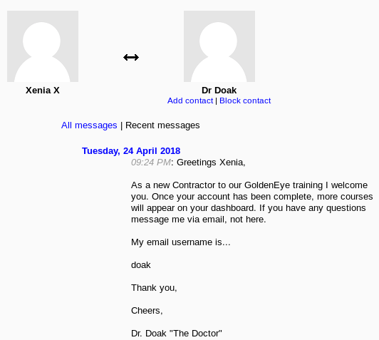
  

**had to go through multiple lists as every list timed out. finally found a short enough one**
 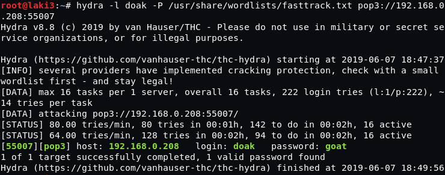
  

**pop3 login as doak with credentials**
 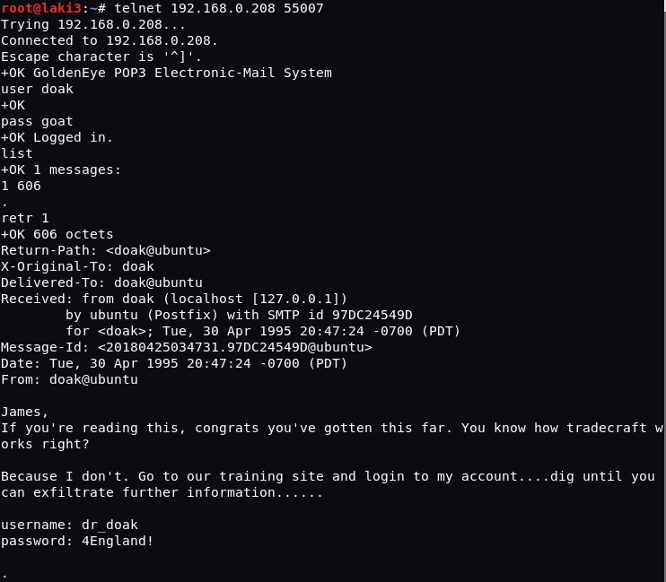
  

**moodle login as dr_doak successful and after some searching there was a private file**
 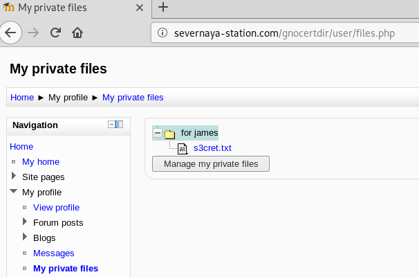
  

**s3cret file points to new web directory/image**
 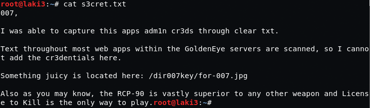
  

**browse to image and download**
 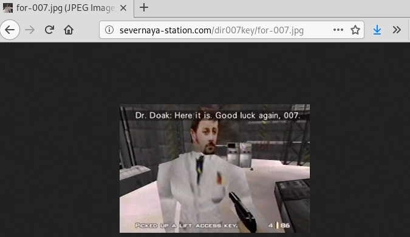
  

**exiftool reveals base64 string**
 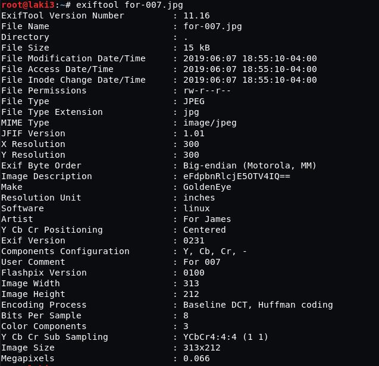
  

**string decoded, most likely admin creds for moodle**
 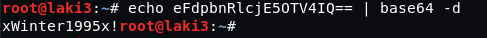
  

**moodle login admin successful and after some enumeration, system paths looks interesting**
 
  

**update the string to a python reverse shell oneliner**
 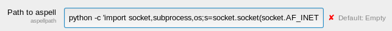
  

**several tries to trigger by using spellcheck went unsuccessful. found an interesting spell engine and switched**
 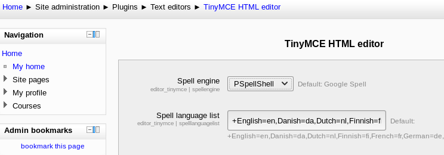
  

**reverse shell successful after triggering via spell check**
 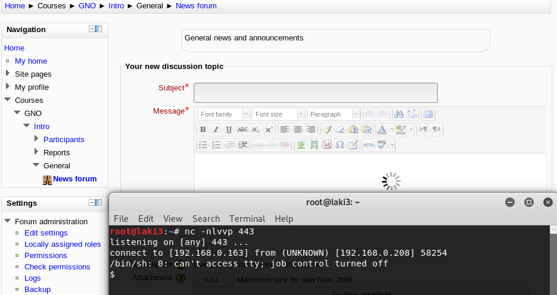
  

**lots of enumeration and could not find anything. none of the users could login as shown in the /etc/passwd.  no suid file either**
 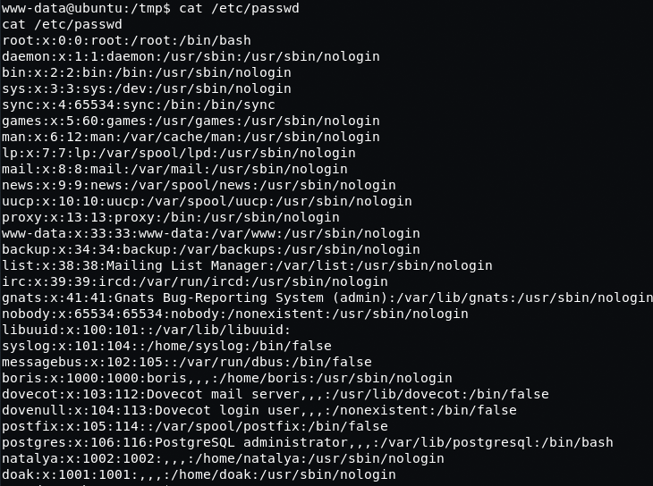
  

**checking system info and turn to google, found likely exploit**
 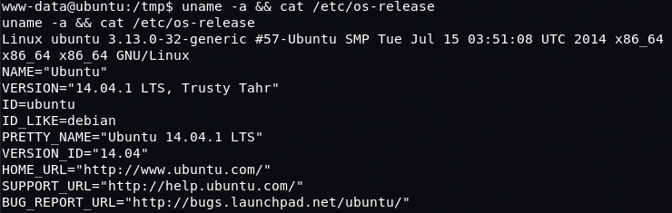 
 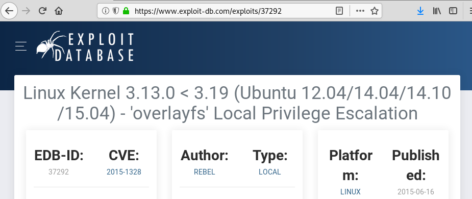
  

**downloading and compile fails as there is no gcc, but works with cc**
 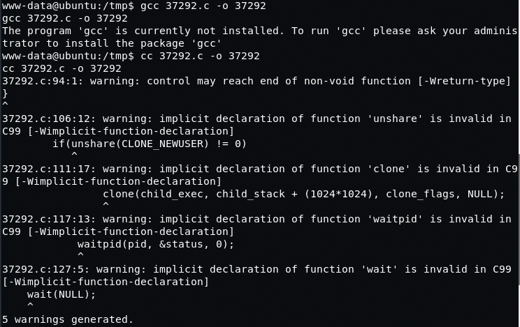
  

**however the exploit requires another compile after running so it fails**
 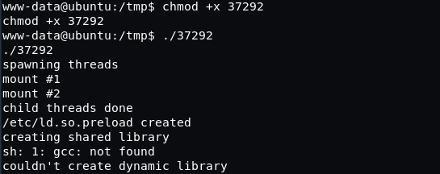
  

**we update the code to point to use cc rather than gcc**
 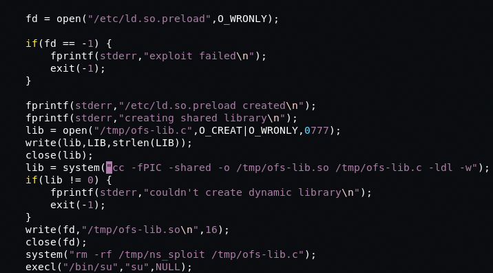
  

**download, compile, make executable and running the new sploit works. root**
 
  

**root flag. points to web flag**
 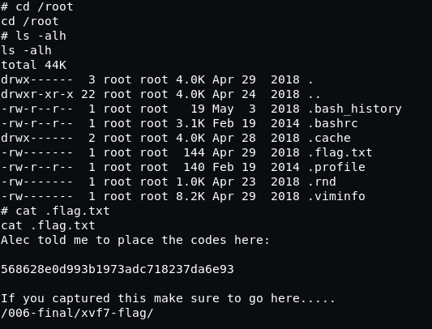
  

**flag captured**
 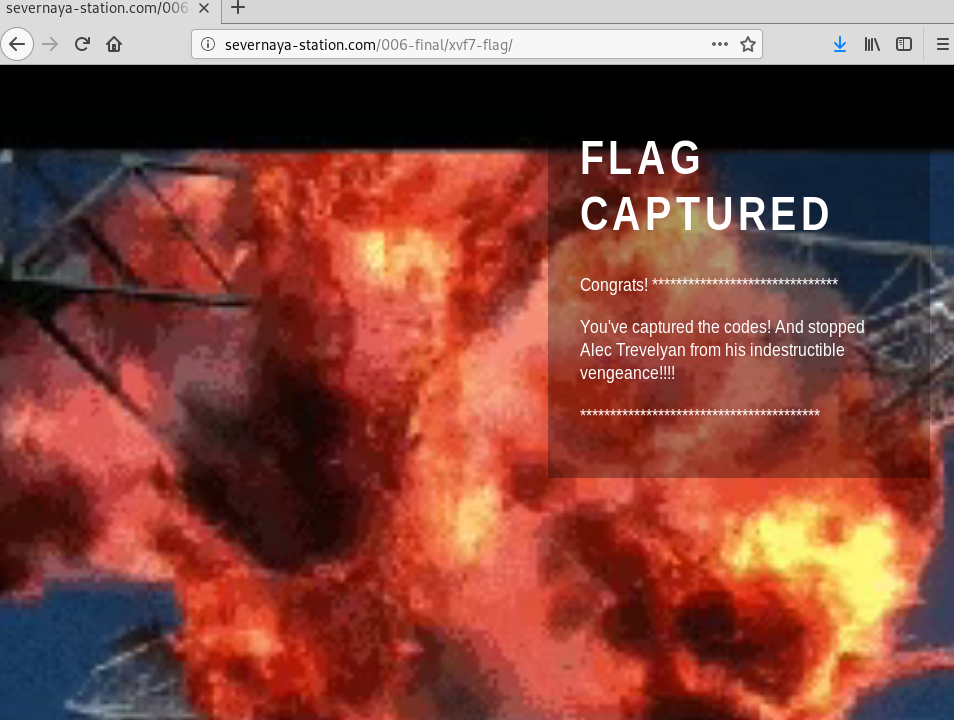
  