## Goal #
root

## Download #
[https://www.vulnhub.com/entry/dpwwn-2,343/](https://www.vulnhub.com/entry/dpwwn-2,343/)

## Walkthrough #

**nmap**
 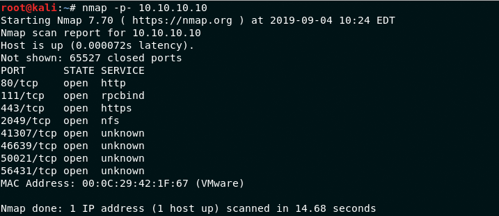
  

**default 80**
 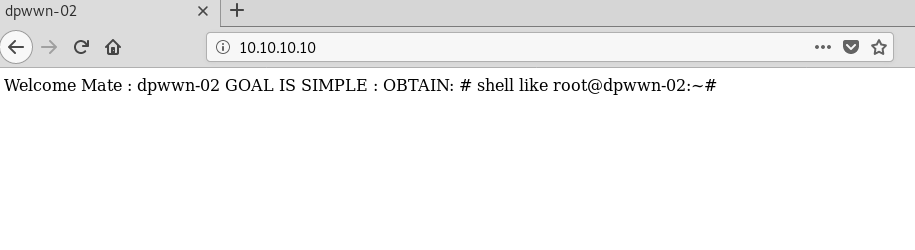
  

**dirb web enum found wordpress instance**
 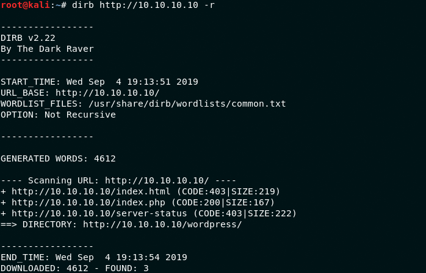
 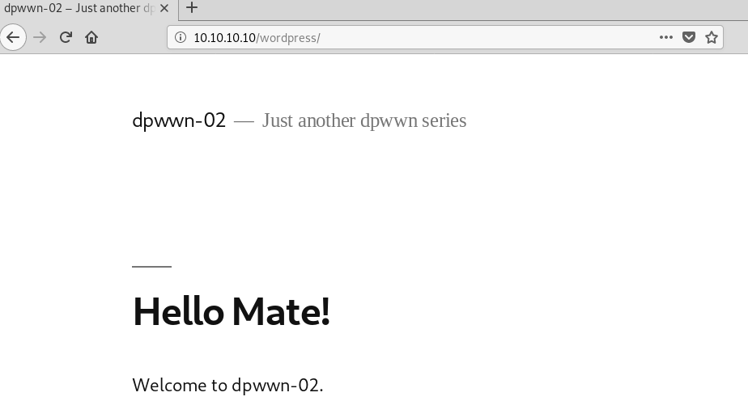
  

**wpscan found an lfi vuln**
 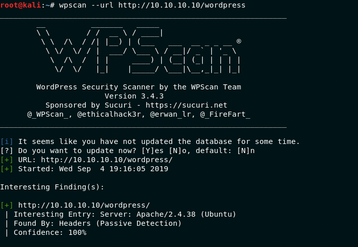
 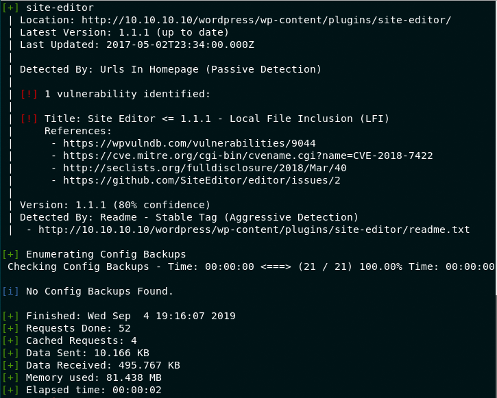
  

**testing lfi worked**
 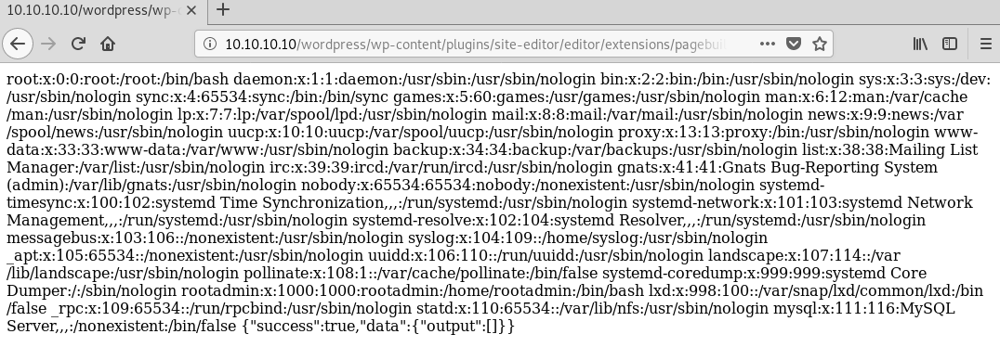
  

**with nothing else, looked to other ports. nfs was able to be mounted and written to**
 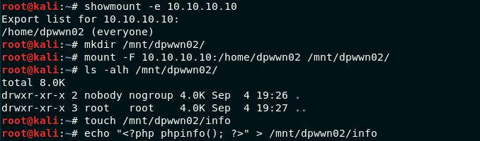
  

**with lfi vuln we're able to call newly created file**
 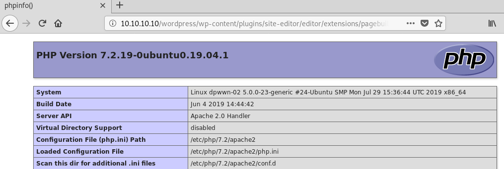
  

**created reverse shell file, setup listener and we have low priv access**
 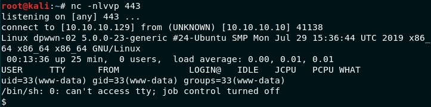
  

**using known priv esc technique for nfs we setup for root**
 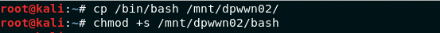
  

**technique fails though**
 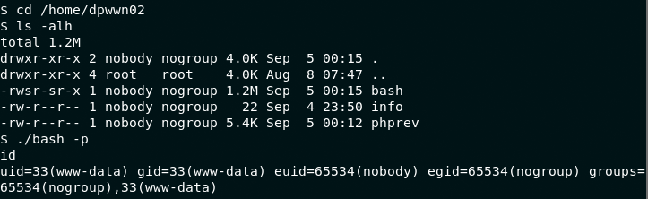
  

**looking at /etc/exports there is a root squash for unknown ip address, but a static has the ability**
 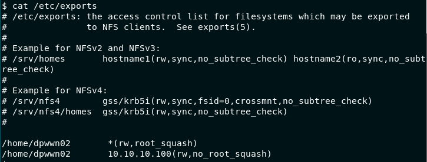
  

**set static on host**
 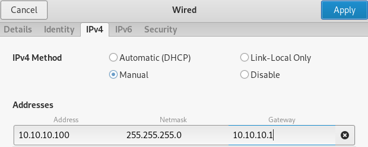
  

**update reverse shell and reconnect**
 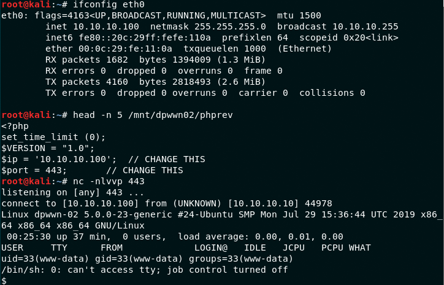
  

**setup nfs for priv esc again**
 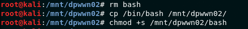
  

**we have root**
 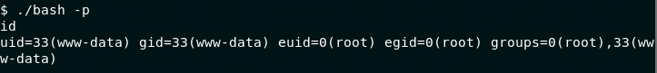
  

**and flag**
 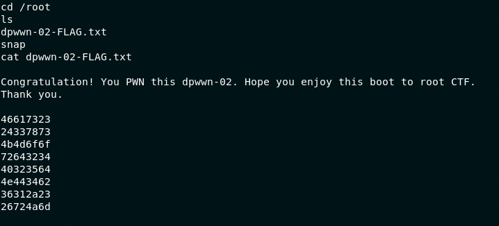
  